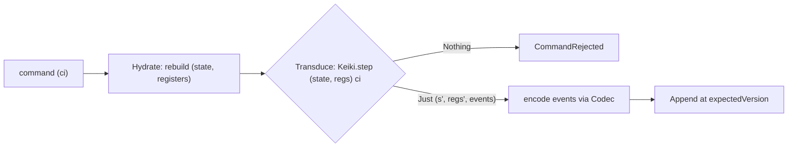

This is an **ordered source tour** of the foundation every keiro command passes through — the layer
beneath the command cycle. It reads the real Haskell in `keiro-core/src/Keiro/Stream.hs`,
`keiro-core/src/Keiro/EventStream.hs`, and `keiro-core/src/Keiro/Codec.hs`, then keiki's
`src/Keiki/Core.hs`, and explains *why* the code is shaped the way it is. Read the chapters in order.

If the word "transducer" is new, read
[What is a transducer?](/docs/keiro/explanation/the-keiro-stack#what-is-a-transducer) first — this tour
builds directly on it.

## The design in one picture

An **EventStream** marries a keiki **SymTransducer** (the pure decision machine) to a **Codec** and a
snapshot policy. A command runs the same three phases every write does — **Hydrate** (rebuild the
`(state, registers)` pair from stored events), **Transduce** (`Keiki.step` produces the next pair plus
events), **Append** (encode via the codec and write):



The `(state, registers)` **pair** is the thread running through every box: hydration rebuilds it,
`step` consumes and returns it, and a snapshot persists it.

## The chapters

<Cards>
  <Card title="01 — The typed Stream handle" href="/docs/keiro/walkthrough/foundation/01-the-stream-handle" description="Stream a: a phantom-typed newtype over kiroku's StreamName." />
  <Card title="02 — The EventStream" href="/docs/keiro/walkthrough/foundation/02-the-event-stream" description="Marrying a SymTransducer to a Codec, a SnapshotPolicy, and a StateCodec — field by field." />
  <Card title="03 — The Codec boundary" href="/docs/keiro/walkthrough/foundation/03-the-codec" description="encode/decode, event-type tags, and the schema-evolution surface." />
  <Card title="04 — The SymTransducer and step" href="/docs/keiro/walkthrough/foundation/04-the-symtransducer-and-step" description="The heart: registers (rs) vs state (s), and what Keiki.step returns." />
  <Card title="05 — Threading state and registers" href="/docs/keiro/walkthrough/foundation/05-threading-state-and-registers" description="The real call site, and why both halves of the pair are carried." />
</Cards>

The source files this tour reads:

```text
keiro-core/src/Keiro/Stream.hs        -- the typed Stream handle
keiro-core/src/Keiro/EventStream.hs   -- the EventStream marriage + SnapshotPolicy + StateCodec
keiro-core/src/Keiro/Codec.hs         -- the encode/decode/migrate boundary
src/Keiki/Core.hs   (keiki)           -- SymTransducer, RegFile, step
keiro/src/Keiro/Command.hs            -- the real Keiki.step call site
```

How the `(state, registers)` pair is *persisted* — so hydration need not replay the whole log — is the
job of the **read-side** tour's snapshot chapters, reachable from the
[snapshot codec chapter](/docs/keiro/walkthrough/read-side/01-the-snapshot-codec-and-the-register-pair).
