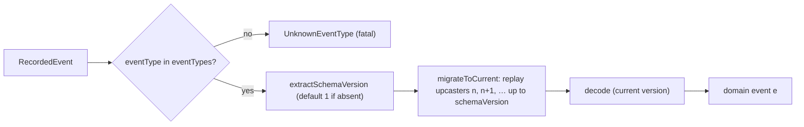

<Callout type="info">
  This is part of an ordered walkthrough. If you are new, start at
  [00 — Start here](/docs/keiro/walkthrough/foundation/00-start-here).
</Callout>

## What this part covers

`keiro-core/src/Keiro/Codec.hs` — the `eventCodec` field of the
[EventStream](/docs/keiro/walkthrough/foundation/02-the-event-stream), seen as a boundary. A `Codec` is
the single place a stream declares how its events are named, serialized, and migrated. This chapter
places the codec *within the foundation*; the deep schema-evolution walk lives elsewhere (linked at the
end).

The first thing to notice: a `Codec` is a **value-level record**, not a typeclass. You build a `Codec`
value and store it in the `EventStream`; there is no instance resolution.

## The Codec record

```haskell
-- keiro-core/src/Keiro/Codec.hs
data Codec e = Codec
  { eventTypes :: !(NonEmpty Text)
  , eventType :: !(e -> Text)
  , schemaVersion :: !Int
  , encode :: !(e -> Value)
  , decode :: !(Value -> Either Text e)
  , upcasters :: ![Upcaster]
  }
  deriving stock (Generic)
```

<TypeTable
  type={{
    eventTypes: { description: "The complete set of event-type tags this codec owns. Encoding and decoding reject any tag outside this set, so it doubles as the stream's event-type allow-list.", type: "!(NonEmpty Text)" },
    eventType: { description: "Projects a domain value to its wire tag (must land in eventTypes).", type: "!(e -> Text)" },
    schemaVersion: { description: "The current payload version; must be >= 1. Stamped into metadata on append and used as the migration target on read.", type: "!Int" },
    encode: { description: "Current-version JSON serialization.", type: "!(e -> Value)" },
    decode: { description: "Current-version JSON deserialization. Only ever sees payloads already migrated to schemaVersion.", type: "!(Value -> Either Text e)" },
    upcasters: { description: "Migrations keyed by source version. To read a version-n payload the codec applies the n, n+1, … rungs in sequence up to schemaVersion.", type: "![Upcaster]" },
  }}
/>

An `Upcaster` is one rung of the migration chain:

```haskell
-- keiro-core/src/Keiro/Codec.hs
-- | One rung of an upcaster chain: the source schema version it upgrades FROM,
-- paired with a pure migration that rewrites a version-n payload into the
-- version-(n+1) shape. A migration may reject malformed input with a Left.
type Upcaster = (Int, EventType -> Value -> Either Text Value)
```

## The error type

```haskell
-- keiro-core/src/Keiro/Codec.hs
data CodecError
  = UnknownEventType !EventType ![EventType]
  | InvalidSchemaVersion !Int
  | UnknownVersion !Int
  | VersionAhead !Int !Int
  | UpcasterError !Int !Text
  | DecodeFailed !Text
  | GapInUpcasterChain !Int !Int
  | IncompleteUpcasterChain !Int !Int
  | MalformedSchemaVersionStamp !Value
  | NonObjectCallerMetadata !Value
  deriving stock (Generic, Eq, Show)
```

Encoding can fail only two ways — `InvalidSchemaVersion` (a misconfigured codec) or `UnknownEventType`
(a value whose tag is not in `eventTypes`) — plus `NonObjectCallerMetadata` when caller metadata is
not a JSON object. Decoding adds migration and stored-metadata faults including `VersionAhead`,
`UnknownVersion`, `UpcasterError`, `DecodeFailed`, `GapInUpcasterChain`,
`IncompleteUpcasterChain`, and `MalformedSchemaVersionStamp`.

## The functions

```haskell
-- keiro-core/src/Keiro/Codec.hs
encodeForAppend             :: Codec e -> e -> Either CodecError EventData
encodeForAppendWithMetadata :: Codec e -> Maybe Value -> e -> Either CodecError EventData
decodeRecorded              :: Codec e -> RecordedEvent -> Either CodecError e
decodeRaw                   :: Codec e -> EventType -> Int -> Value -> Either CodecError e
migrateToCurrent            :: Codec e -> EventType -> Int -> Value -> Either CodecError Value
extractSchemaVersion        :: RecordedEvent -> Either CodecError Int
metadataFor                 :: Int -> Maybe Value -> Either CodecError Value
```

## The write stamp

Producers call `encodeForAppend` (or `encodeForAppendWithMetadata` to merge in caller metadata). Both
**stamp the codec's `schemaVersion` into the event's metadata** via `metadataFor`. The key detail, from
the Haddock: the schema-version key *always wins* over any clashing key in the caller's metadata, so
the stamp on disk is authoritative. Caller metadata must be an object. `encodeForAppend` is just
`encodeForAppendWithMetadata` with no caller metadata.

Encoding rejects a misconfigured codec with `InvalidSchemaVersion` (when `schemaVersion` is not `>= 1`)
and a value whose tag is outside `eventTypes` with `UnknownEventType`.

## The read path

Consumers call `decodeRecorded`. It does three things in order:

1. **Reject unknown tags first.** If the recorded event's type tag is not in `eventTypes`, decoding
   stops with `UnknownEventType`. **An unknown `eventType` on read is fatal** — the codec will not
   guess.
2. **Read the stamped version back** via `extractSchemaVersion`, which defaults to `1` only when
   metadata is absent or the object lacks `schemaVersion`; malformed present metadata is an error.
3. **Migrate then decode** via `decodeRaw`: it calls `migrateToCurrent` to replay the upcaster chain
   from the stored version up to the codec's `schemaVersion`, then runs the current `decode` on the
   migrated payload. A payload already at or beyond the current version passes through unchanged.



## The upcaster chain rule

The chain must be **ascending and contiguous**. `migrateToCurrent` walks from the source version,
applying the rung keyed by the current version and stepping to the next. If it reaches version `n` but
the next available rung starts *later* than `n`, it stops with `GapInUpcasterChain n nextVersion`. A
rung that rejects its input yields `UpcasterError`; a source version below `1` yields `UnknownVersion`.

## The jitsurei anchor

```haskell
-- jitsurei/src/Jitsurei/OrderStream.hs
orderCodec :: Codec OrderEvent
orderCodec = Codec
  { eventTypes = "OrderPlaced" :| ["PaymentApproved", "OrderPacked", "OrderShipped", "OrderCancelled"]
  , eventType = …
  , schemaVersion = 2
  , encode = …
  , decode = parseOrderEvent
  , upcasters = [(1, upcastOrderPlacedV1)]
  }
```

`schemaVersion = 2` means new events are written at version 2; the single rung `(1, upcastOrderPlacedV1)`
brings a stored version-1 payload up to version 2 before `parseOrderEvent` runs. The `eventTypes`
`NonEmpty` is the allow-list: a recorded event tagged with anything else is rejected on read.

<Callout type="info">
  EP-8 already ships the deep codec material. For the full upcaster walk and the schema-evolution
  how-to, read
  [The codec on the boundary](/docs/keiro/walkthrough/command-cycle/05-the-codec-on-the-boundary),
  [Codec and schema evolution](/docs/keiro/explanation/codec-and-schema-evolution), and the
  [Codec reference](/docs/keiro/reference/codec). This chapter's job is to place the codec *within the
  foundation* the `EventStream` owns.
</Callout>

## Next

[04 — The SymTransducer and step](/docs/keiro/walkthrough/foundation/04-the-symtransducer-and-step) —
the heart of the tour: keiki's decision machine, its registers, and exactly what `Keiki.step` returns.
