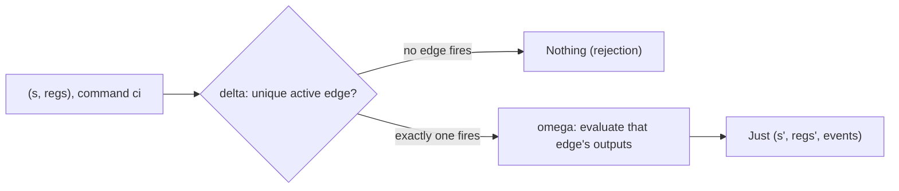

<Callout type="info">
  This is part of an ordered walkthrough. If you are new, start at
  [00 — Start here](/docs/keiro/walkthrough/foundation/00-start-here).
</Callout>

## What this part covers

`src/Keiki/Core.hs` in the keiki dependency — the pure decision machine the
[EventStream](/docs/keiro/walkthrough/foundation/02-the-event-stream) carries in its `transducer`
field. This is the chapter the whole tour exists for. `Keiro.EventStream` imports these types directly
(`import Keiki.Core (RegFile, SymTransducer)`), so they are the real keiki types, not keiro wrappers.

We define **transducer** and **symbolic register** in plain English, then read the three types that
matter — `RegFile`, `SymTransducer`, and `step` — and end on the single most important signature in the
tour.

## Two definitions in plain English

A **transducer** is a finite-state machine that, on each transition, *also emits output*. A plain
state machine only moves between states; a transducer additionally produces a value when it moves. Feed
keiki's machine the current state and a command and it returns the next state plus the events to emit —
or it rejects the command because no transition applies. For a gentle, diagram-led introduction read
[What is a transducer?](/docs/keiro/explanation/the-keiro-stack#what-is-a-transducer) — this chapter
assumes it.

A **symbolic register** is a named, typed cell of working memory the machine carries *alongside* its
control state. The control state says *where in the lifecycle* the machine is (a vertex like `Placed`);
a register holds *running data* the vertex alone does not encode — a quantity tally, an accumulated
payment reference, a deadline. The registers as a group form a typed **register file**. They are
"symbolic" because keiki's edges describe how to update them with a small term language rather than
arbitrary Haskell, which keeps the machine analyzable.

The crucial point this chapter drives home: **registers are not derived from the control state.** They
are a separate bank carried *next to* it. That is why both halves must be threaded together — the
subject of the [next chapter](/docs/keiro/walkthrough/foundation/05-threading-state-and-registers).

## The register file

The register file is a typed heterogeneous tuple indexed by a list of named **slots**. A slot is a
label paired with the type of its value:

```haskell
-- src/Keiki/Core.hs  (keiki)
-- | A register slot is a label paired with the type of its value.
type Slot = (Symbol, Type)

-- | A typed heterogeneous register tuple indexed by a list of 'Slot's.
data RegFile (rs :: [Slot]) where
  RNil  :: RegFile '[]
  RCons :: KnownSymbol s
        => Proxy s -> r -> RegFile rs -> RegFile ('(s, r) ': rs)
```

`RegFile '[]` — written `RNil` — is the **empty** register bank. `RCons` prepends one named, typed cell
to a smaller file. The type-level slot list `rs` records the names and types of every cell, so reading
a slot is type-checked against the schema.

## Empty registers versus populated registers

The two ends of the spectrum make the concept concrete.

The keiro **order aggregate** uses an *empty* register file
(`jitsurei/src/Jitsurei/OrderStream.hs`):

```haskell
-- jitsurei/src/Jitsurei/OrderStream.hs
type OrderRegs = '[]
```

That is the perfect place to see the *marriage mechanism* without register noise — its
`initialRegisters` is just `RNil`. But an empty bank cannot show *why* registers exist. For that, turn
to keiki's own **OrderCart** example (`jitsurei/src/Jitsurei/OrderCart.hs`), a *populated* bank:

```haskell
-- jitsurei/src/Jitsurei/OrderCart.hs
type OrderCartRegs =
  '[ '("itemCount",       ItemCount)
   , '("discountBp",      DiscountBp)
   , '("reservationId",   Text)
   , '("paymentRef",      Text)
   , '("amountPaid",      Money)
   , '("shippingCarrier", Text)
   , '("trackingId",      Text)
   -- … and more
   ]
```

Each slot is a named cell of typed working memory. `itemCount` is a running tally evolved as items are
added and removed; `paymentRef` and `amountPaid` accumulate as payment is confirmed.

Now look at OrderCart's **control state**, which is a completely separate enum of vertices:

```haskell
-- jitsurei/src/Jitsurei/OrderCart.hs
data OrderVertex
  = Empty
  | OpenWithItems
  | Reserved
  | Paid
  | Shipped
  | Delivered
  | Cancelled
  | Refunded
  deriving (Eq, Show, Enum, Bounded)
```

This is the canonical "registers vs state" contrast. The **vertex** (`OrderVertex`) says *where in the
lifecycle* the order is — `Paid`, `Shipped`, and so on. The **registers** (`OrderCartRegs`) hold
*running data* — a quantity tally, an accumulated payment reference — that the vertex alone does not
encode. Two orders both sitting at `Paid` can have entirely different `itemCount` and `amountPaid`
values. You cannot recompute the registers by inspecting the vertex; **registers are an auxiliary bank,
not derived from state.**

## The transducer

The transducer is a finite control graph plus a register file:

```haskell
-- src/Keiki/Core.hs  (keiki)
data SymTransducer phi rs s ci co = SymTransducer
  { edgesOut    :: s -> [Edge phi rs ci co s]   -- outgoing transitions from each control state
  , initial     :: s                            -- the start vertex
  , initialRegs :: RegFile rs                   -- the start register file
  , isFinal     :: s -> Bool                    -- which control states are terminal
  }
```

`edgesOut` gives the transitions leaving each vertex; `initial` and `initialRegs` are the start state
and start registers; `isFinal` marks terminal vertices (which is what the `OnTerminal` snapshot policy
keys on). An `Edge` carries a `guard :: phi`, an `update` to the registers, an `output :: [OutTerm …]`
(where `[]` is an ε-edge that emits nothing, `[o]` a single event, and `[o1, o2, …]` a multi-event
edge), and a `target` vertex. You do not need to walk `Edge` field by field here — name it and move on.

## The heart: step

This is the single most important signature in the tour:

```haskell
-- src/Keiki/Core.hs  (keiki)
-- | One full step of the transducer. Returns Nothing if no edge from the current
-- vertex has a satisfied guard. The inner [co] is [] for an ε-edge, [o] for a
-- letter edge, [o1, …] for a multi-event edge.
step
  :: BoolAlg phi (RegFile rs, ci)
  => SymTransducer phi rs s ci co
  -> (s, RegFile rs)
  -> ci
  -> Maybe (s, RegFile rs, [co])
step t (s, regs) ci = case delta t s regs ci of
  Nothing          -> Nothing
  Just (s', regs') -> Just (s', regs', omega t s regs ci)
```

Read the type aloud. Given:

- the transducer,
- the **pair** `(s, RegFile rs)` — the current control state *and* the current registers,
- and a command `ci`,

`step` returns one of two things:

- **`Nothing`** — no edge from the current vertex had a satisfied guard. This is a **rejection**.
- **`Just (s', regs', events)`** — the next control state `s'`, the **next register file** `regs'`, and
  the list of emitted events `[co]` (`[]` for an ε-edge, `[o]` for a single event, `[o1, …]` for a
  multi-event edge).

The `BoolAlg phi (RegFile rs, ci)` constraint is keiki's effective Boolean algebra over the guard
alphabet `phi`; its `models :: phi -> (RegFile rs, ci) -> Bool` method is how the machine decides which
edge fires. Internally, `delta` finds the unique active edge and returns its `(target,
updated-registers)`; `omega` returns that edge's evaluated outputs; `step` combines them. Note that both
`delta` and `omega` see the *old* `regs` — register updates apply on the transition, and the emitted
events are evaluated against the pre-update register snapshot.



The output type `Maybe (s, RegFile rs, [co])` is the crux. `step` does not return a bare next state —
it returns the next **pair** plus events. Both halves come back because both are part of the machine's
configuration.

## The event-replay inverse

`step` runs *forward* from a command. The runtime also needs to run *forward from events* when
rebuilding state from the log. keiki provides that inverse, and it threads the **same pair**:

```haskell
-- src/Keiki/Core.hs  (keiki)
applyEvents
  :: (BoolAlg phi (RegFile rs, ci), Eq co)
  => SymTransducer phi rs s ci co
  -> (s, RegFile rs)
  -> [co]
  -> Maybe (s, RegFile rs)
```

`applyEvents` replays a chunk of *events* (not commands) from a `(state, registers)` start and returns
the next pair. Its single-event, multi-event-edge-aware companion `applyEventStreaming` is what keiro's
hydration folds over the stored events. The point for this tour: forward (command) and inverse (event
replay) both thread the **same `(state, registers)` pair**. Hydration detail belongs to the
[command cycle](/docs/keiro/walkthrough/command-cycle/00-start-here).

## Where this pair gets persisted

The `(state, registers)` pair `step` returns is *exactly* what a snapshot serializes — both halves,
because the registers cannot be recovered from the control state. How that pair is persisted (the
snapshot codec, the `keiro_snapshots` schema, the policy evaluation) is the job of the **read-side**
tour's snapshot chapters, reachable from the [snapshot codec chapter](/docs/keiro/walkthrough/read-side/01-the-snapshot-codec-and-the-register-pair). This
chapter owns the *conceptual* register model; the read side owns its *persistence*.

## Next

[05 — Threading state and registers](/docs/keiro/walkthrough/foundation/05-threading-state-and-registers)
— the real keiro call site that passes both halves of the pair into `Keiki.step`.
