This is an **ordered source tour** of keiro's integration-event path — how a public event travels
from one bounded context to another. It reads the real Haskell in `keiro/src/Keiro/Inbox*.hs`,
`keiro/src/Keiro/Outbox*.hs`, and `keiro-core/src/Keiro/Integration/Event.hs` and explains *why*
the code is shaped the way it is. Read the chapters in order.

## The design in one picture

A producer writes an outbox row in its domain transaction; a worker publishes it to Kafka
at-least-once; the consumer's inbox dedupes on the stable `messageId` so the effect happens once:

```mermaid
flowchart LR
  Cmd["command -> private domain event (Postgres A)"] --> Prod["IntegrationProducer subscription"]
  Prod -- "writes ONE keiro_outbox row in the checkpoint txn" --> Outbox[("keiro_outbox")]
  Outbox --> Worker["publishClaimedOutbox (FOR UPDATE SKIP LOCKED + per-key head-of-line)"]
  Worker -- "produce, then mark sent after ack" --> Kafka["Kafka topic billing.orders.v1"]
  Kafka --> FromKafka["integrationEventFromKafka"]
  FromKafka --> Inbox["runInboxTransaction (dedupe on source, messageId)"]
  Inbox -- "handler + complete in one txn" --> DB[("local handler (Postgres B)")]
```



## The chapters

<Cards>
  <Card title="01 — The integration-event envelope" href="/docs/keiro/walkthrough/integration/01-the-integration-event-envelope" description="The IntegrationEvent record's sixteen fields, the identity rule, the JSON helpers, the header wire mapping, and the content-type round-trip." />
  <Card title="02 — The inbox" href="/docs/keiro/walkthrough/integration/02-the-inbox" description="dedupeKeyFor's four policies, the single-transaction tryInsert/handler/markCompleted, the reserved markFailedTx, GC, and the keiro_inbox schema." />
  <Card title="03 — The outbox: enqueue and claim" href="/docs/keiro/walkthrough/integration/03-the-outbox-enqueue-and-claim" description="The two enqueue surfaces, the prefixed-TypeID mint, ON CONFLICT, the claim CTE with SKIP LOCKED, all four ordering predicates, and the stale-publishing gap." />
  <Card title="04 — The outbox: drain and dead-letter" href="/docs/keiro/walkthrough/integration/04-the-outbox-drain-and-dead-letter" description="publishClaimedOutbox's one-pass drain, markOutboxFailedTx's dead-letter decision, the backoff curve, and the StopTheLine halt." />
  <Card title="05 — Kafka mapping" href="/docs/keiro/walkthrough/integration/05-kafka-mapping" description="The pure, broker-free header⇄record boundary: integrationEventToKafkaRecord out, integrationEventFromKafka and the decode helpers in." />
</Cards>

The source files this tour reads:

```text
keiro-core/src/Keiro/Integration/Event.hs   -- the IntegrationEvent envelope + wire mapping
keiro/src/Keiro/Inbox.hs           keiro/src/Keiro/Inbox/Types.hs
keiro/src/Keiro/Inbox/Schema.hs    keiro/src/Keiro/Inbox/Kafka.hs
keiro/src/Keiro/Outbox.hs          keiro/src/Keiro/Outbox/Types.hs
keiro/src/Keiro/Outbox/Schema.hs   keiro/src/Keiro/Outbox/Kafka.hs
keiro-migrations/sql-migrations/2026-05-17-01-00-00-keiro-outbox.sql
keiro-migrations/sql-migrations/2026-05-17-02-00-00-keiro-inbox.sql
```

For the conceptual version of this material, read [The inbox
pattern](/docs/keiro/explanation/the-inbox-pattern) and [The outbox
pattern](/docs/keiro/explanation/the-outbox-pattern) first.
