This is an **ordered source tour** of keiro's integration-event path — how a public event travels
from one bounded context to another. It reads the real Haskell in `keiro/src/Keiro/Inbox*.hs`,
`keiro/src/Keiro/Outbox*.hs`, and `keiro-core/src/Keiro/Integration/Event.hs` and explains *why*
the code is shaped the way it is. Read the chapters in order.

## The design in one picture

A producer writes an outbox row in its domain transaction; a worker publishes it to Kafka
at-least-once; the consumer's inbox dedupes on the stable `messageId` so the effect happens once:

```mermaid
flowchart LR
  Cmd["command -> private domain event (Postgres A)"] --> Prod["IntegrationProducer subscription"]
  Prod -- "writes ONE keiro_outbox row in the checkpoint txn" --> Outbox[("keiro_outbox")]
  Outbox --> Worker["publishClaimedOutbox (FOR UPDATE SKIP LOCKED + per-key head-of-line)"]
  Worker -- "produce, then mark sent after ack" --> Kafka["Kafka topic billing.orders.v1"]
  Kafka --> FromKafka["integrationEventFromKafka"]
  FromKafka --> Inbox["runInboxTransaction (dedupe on source, messageId)"]
  Inbox -- "handler + complete in one txn" --> DB[("local handler (Postgres B)")]
```



## The chapters

<Cards>
  <Card title="01 — The inbox" href="/docs/keiro/walkthrough/integration/01-the-inbox" description="dedupeKeyFor, the single-transaction tryInsert/handler/markCompleted, and the duplicate + rollback paths." />
  <Card title="02 — The outbox" href="/docs/keiro/walkthrough/integration/02-the-outbox" description="enqueueProducerEventTx, the claim CTE with SKIP LOCKED + ordering predicate, and drainBatch." />
  <Card title="03 — Kafka mapping" href="/docs/keiro/walkthrough/integration/03-kafka-mapping" description="The pure header⇄record boundary: integrationHeaders out, integrationEventFromKafka in." />
</Cards>

The source files this tour reads:

```text
keiro/src/Keiro/Inbox.hs           keiro/src/Keiro/Inbox/Types.hs
keiro/src/Keiro/Inbox/Schema.hs    keiro/src/Keiro/Inbox/Kafka.hs
keiro/src/Keiro/Outbox.hs          keiro/src/Keiro/Outbox/Types.hs
keiro/src/Keiro/Outbox/Schema.hs   keiro/src/Keiro/Outbox/Kafka.hs
keiro-core/src/Keiro/Integration/Event.hs
```

For the conceptual version of this material, read [The inbox
pattern](/docs/keiro/explanation/the-inbox-pattern) and [The outbox
pattern](/docs/keiro/explanation/the-outbox-pattern) first.
