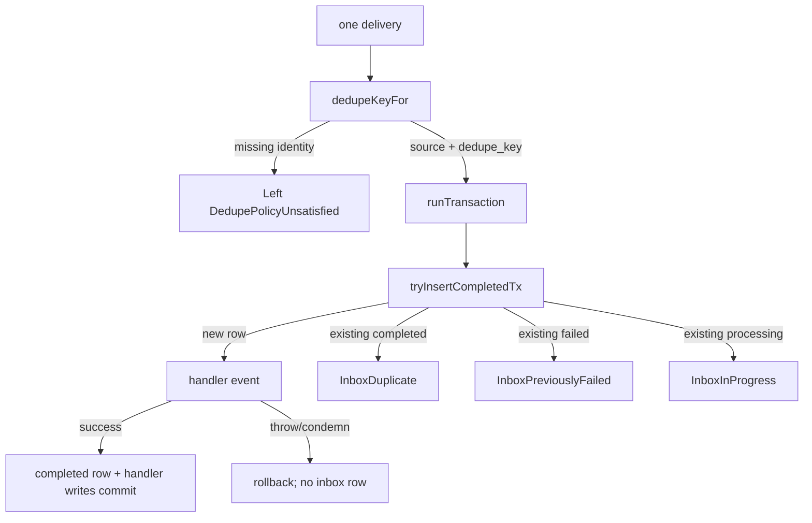
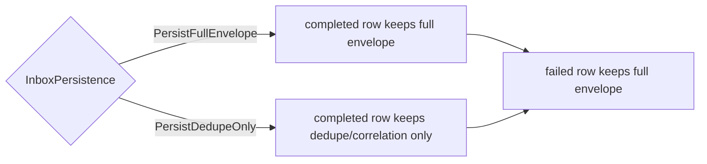
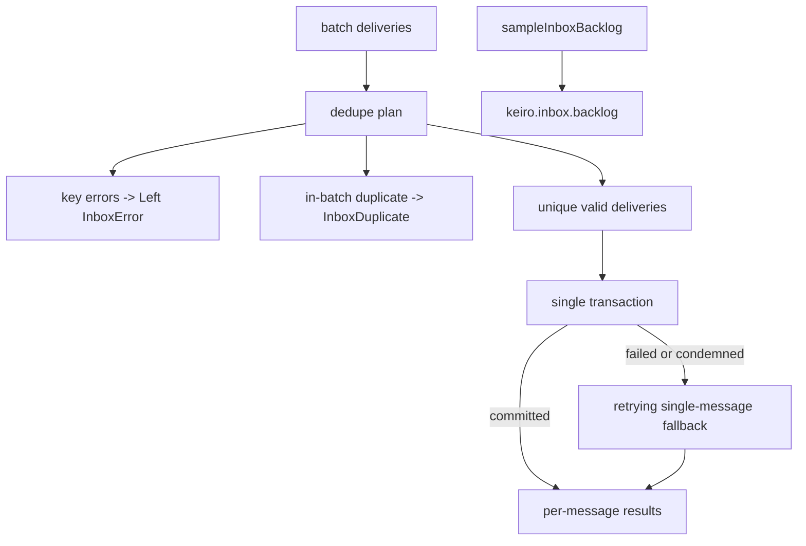

This chapter reads the inbox receive path in `keiro/src/Keiro/Inbox.hs`,
`keiro/src/Keiro/Inbox/Types.hs`, and `keiro/src/Keiro/Inbox/Schema.hs`. The **inbox** is the pattern
that makes *receiving* an integration event idempotent: the same delivery runs the handler at most
once. Read [01 — The integration-event envelope](/docs/keiro/walkthrough/integration/01-the-integration-event-envelope)
first.

## `dedupeKeyFor`: choosing the identity

```haskell
dedupeKeyFor :: InboxDedupePolicy -> IntegrationEvent -> Maybe KafkaDeliveryRef -> Either InboxError Text
```

The four `InboxDedupePolicy` constructors choose what makes a delivery a duplicate:

- `PreferIntegrationMessageId` (the default) dedupes on the envelope's `messageId` — the canonical
  choice for outbox-published events.
- `PreferSourceEventIdentity` dedupes on the producing private event's identity, using
  `sourceEventId` and then `sourceGlobalPosition`.
- `KafkaDeliveryIdentity` dedupes on `topic:partition:offset`; use it only when the envelope lacks a
  stable producer identity.
- `CustomDedupeKey` lets the caller supply a key directly.

Every branch returns `Left (DedupePolicyUnsatisfied policy)` when the chosen policy's field is
absent. The returned key, paired with `source`, is the inbox row's primary key.

## Single-message intake

```haskell
runInboxTransaction ::
  forall a es. (IOE :> es, Store :> es) =>
  Maybe KeiroMetrics -> InboxDedupePolicy -> IntegrationEvent -> Maybe KafkaDeliveryRef ->
  (IntegrationEvent -> Tx.Transaction a) ->
  Eff es (Either InboxError (InboxResult a))

runInboxTransactionWith ::
  forall a es. (IOE :> es, Store :> es) =>
  Maybe KeiroMetrics -> InboxPersistence -> InboxDedupePolicy ->
  IntegrationEvent -> Maybe KafkaDeliveryRef ->
  (IntegrationEvent -> Tx.Transaction a) ->
  Eff es (Either InboxError (InboxResult a))
```

`runInboxTransaction` is `runInboxTransactionWith PersistFullEnvelope`. The wrapper resolves the
dedupe key and runs one Postgres transaction:



The fresh successful path inserts the inbox row directly as `completed`, then runs the handler in the
same transaction. There is no visible `processing -> completed` update on that path. If the handler
throws or calls `Tx.condemn`, the transaction rolls back, including the inbox row, so the next
delivery starts fresh.

Metrics are recorded after the transaction commits. The hot path records classification counters
(`keiro.inbox.processed`, `keiro.inbox.duplicates`, `keiro.inbox.failed`); backlog gauging moved to
the explicit `sampleInboxBacklog` helper so a delivery does not pay a `COUNT(*)` on every message.

## Persistence mode

```haskell
data InboxPersistence = PersistFullEnvelope | PersistDedupeOnly
```

`PersistFullEnvelope` stores the full integration-event envelope on successful rows. `PersistDedupeOnly`
stores only the identity and operator-correlation fields for successful rows: payload bytes are empty,
and schema, trace, and attributes are omitted. Failed rows always keep the full envelope because a
failed inbox row is the operator's dead-letter record.



## Retrying and batch intake

```haskell
runInboxTransactionWithRetriesWith ::
  forall a es. (IOE :> es, Store :> es) =>
  Maybe KeiroMetrics -> Int -> InboxPersistence -> InboxDedupePolicy ->
  IntegrationEvent -> Maybe KafkaDeliveryRef ->
  (IntegrationEvent -> Tx.Transaction a) ->
  Eff es (Either InboxError (InboxResult a))

runInboxTransactionBatch ::
  forall a es. (IOE :> es, Store :> es) =>
  Maybe KeiroMetrics -> Int -> InboxDedupePolicy -> InboxPersistence ->
  [(IntegrationEvent, Maybe KafkaDeliveryRef)] ->
  (IntegrationEvent -> Tx.Transaction a) ->
  Eff es [Either InboxError (InboxResult a)]

sampleInboxBacklog :: (IOE :> es, Store :> es) => Maybe KeiroMetrics -> Eff es ()
```

The retrying wrapper records synchronous handler exceptions as failed attempts and returns
`InboxHandlerFailed err attempts`; at the ceiling it returns `InboxPreviouslyFailed` so the failed
row becomes the durable poison record. `Tx.condemn` keeps rollback semantics and is not counted as a
handler exception.

The batch wrapper plans all inputs first, treats repeated in-batch keys as `InboxDuplicate`, runs
unique valid deliveries in one transaction, and falls back to the retrying single-message wrapper if
the batch transaction throws or is condemned.



## GC and inspection

```haskell
garbageCollectCompleted :: (Store :> es) => NominalDiffTime -> UTCTime -> Eff es Int
lookupInbox :: (Store :> es) => Text -> Text -> Eff es (Maybe InboxRow)
listInbox  :: (Store :> es) => Text -> Eff es [InboxRow]
```

`garbageCollectCompleted keepFor now` deletes completed rows older than `keepFor` and returns the
count. The retention window **is** the duplicate-detection window: a redelivery after GC is processed
again, so choose a window longer than the maximum delivery delay you tolerate. Failed rows are never
GC'd. `lookupInbox` and `listInbox` are test and inspection helpers.

## The `keiro_inbox` table

```sql
CREATE TABLE IF NOT EXISTS keiro_inbox (
  source TEXT NOT NULL,
  dedupe_key TEXT NOT NULL,
  message_id TEXT,
  source_event_id UUID,
  source_global_position BIGINT,
  destination TEXT,
  event_type TEXT,
  schema_version BIGINT,
  content_type TEXT NOT NULL,
  schema_registry TEXT,
  schema_subject TEXT,
  schema_version_ref BIGINT,
  schema_id BIGINT,
  schema_fingerprint TEXT,
  causation_id UUID,
  correlation_id UUID,
  traceparent TEXT,
  tracestate TEXT,
  kafka_topic TEXT,
  kafka_partition BIGINT,
  kafka_offset BIGINT,
  payload_bytes BYTEA NOT NULL,
  attributes JSONB,
  occurred_at TIMESTAMPTZ,
  status TEXT NOT NULL DEFAULT 'processing',
  received_at TIMESTAMPTZ NOT NULL DEFAULT now(),
  completed_at TIMESTAMPTZ,
  failed_at TIMESTAMPTZ,
  last_error TEXT,
  attempt_count BIGINT NOT NULL DEFAULT 0,
  PRIMARY KEY (source, dedupe_key)
);

CREATE INDEX IF NOT EXISTS keiro_inbox_completed_idx
  ON keiro_inbox (completed_at) WHERE status = 'completed';

CREATE INDEX IF NOT EXISTS keiro_inbox_backlog_idx
  ON keiro_inbox (status) WHERE status IN ('processing', 'failed');
```

The primary key enforces dedupe atomically. `status` still defaults to `processing` for
compatibility, but fresh successful intake inserts rows directly as `completed`. The completed index
keeps GC cheap, and the backlog index supports `sampleInboxBacklog`. The older
`keiro_inbox_received_idx` was dropped because the hot path no longer reads by `received_at`.

Next: [03 — The outbox: enqueue and claim](/docs/keiro/walkthrough/integration/03-the-outbox-enqueue-and-claim).
