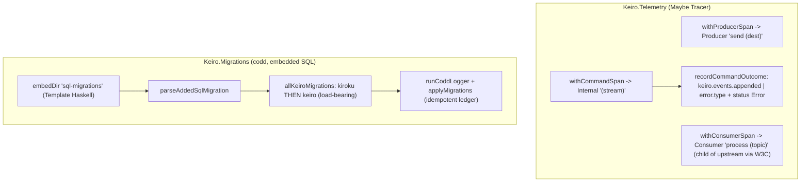

This is an **ordered source tour** of keiro's two cross-cutting **operations** internals: how
`Keiro.Telemetry` wraps work in OpenTelemetry spans, and how `Keiro.Migrations` embeds and applies
keiro's SQL schema. It reads the real Haskell in `keiro/src/Keiro/Telemetry.hs`,
`keiro/src/Keiro/Command.hs`, `keiro/src/Keiro/Outbox.hs`, and
`keiro-migrations/src/Keiro/Migrations.hs`, and explains *why* the code is shaped the way it is. Read
the chapters in order.

## The design in one picture

Telemetry is **opt-in** through a `Maybe Tracer` (spans) and a `Maybe KeiroMetrics` (worker metrics):
with `Nothing` every helper is a pass-through; with the handle set it records. Three sites open spans
today; the four background workers carry the metric instruments. The migration runner embeds four SQL
files at compile time and applies kiroku's then keiro's schema in one idempotent codd ledger.



## The chapters

<Cards>
  <Card title="01 — The tracer seam and span helpers" href="/docs/keiro/walkthrough/operations/01-the-tracer-seam-and-span-helpers" description="The Maybe Tracer opt-in, inSpan', and withProducerSpan / withConsumerSpan / withCommandSpan with their call sites." />
  <Card title="02 — Attribute keys and the command-outcome seam" href="/docs/keiro/walkthrough/operations/02-attribute-keys-and-the-command-outcome-seam" description="Imported vs. bespoke AttributeKeys, the W3C bridge, recordCommandOutcome / commandErrorClass, and the honest partial-coverage note." />
  <Card title="03 — The migration runner" href="/docs/keiro/walkthrough/operations/03-the-migration-runner" description="embedDir, parseAddedSqlMigration, the kiroku-then-keiro order, the four runners, the keiro-migrate CLI, and the five tables." />
</Cards>

The source files this tour reads:

```text
keiro/src/Keiro/Telemetry.hs              -- the three span helpers, the W3C bridge, the keys, the KeiroMetrics surface
keiro/src/Keiro/Command.hs                -- withCommandSpan + recordCommandOutcome / commandErrorClass
keiro/src/Keiro/Outbox.hs                 -- withProducerSpan call site (publish); keiro.outbox.* metrics
keiro-migrations/src/Keiro/Migrations.hs  -- the migration runner
keiro-migrations/app/Main.hs              -- the keiro-migrate CLI
keiro-migrations/sql-migrations/*.sql     -- the four embedded files (five tables)
```

<Callout type="warn">
**Span coverage is partial; metric coverage is broad.** Three sites emit **spans**: **outbox
publish**, **inbox consume**, and **command run**. Hydration and snapshot reads are still not traced.
The four background workers (outbox, inbox, timer, projection) instead carry the **metric** instruments
in [`KeiroMetrics`](/docs/keiro/reference/telemetry#metrics-surface), so their backlog, lag, and
outcome counts are observable without spans. (Same note as the
[Telemetry reference](/docs/keiro/reference/telemetry).)
</Callout>

For the look-up version of this material, read the
[Telemetry reference](/docs/keiro/reference/telemetry) and the
[Migrations and schema reference](/docs/keiro/reference/migrations-and-schema); for the wiring task,
the how-tos [Enable OpenTelemetry](/docs/keiro/how-to/enable-opentelemetry) and
[Run the migrations](/docs/keiro/how-to/run-migrations).
