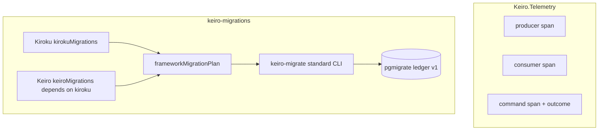

This operations tour reads two cross-cutting seams: `Keiro.Telemetry` and the `keiro-migrations`
package. The migration half now uses native pg-migrate components; Codd appears only in the optional
predecessor-history adapter.



## The chapters

<Cards>
  <Card title="01 — The tracer seam and span helpers" href="/docs/keiro/walkthrough/operations/01-the-tracer-seam-and-span-helpers" description="The Maybe Tracer opt-in and producer, consumer, and command span call sites." />
  <Card title="02 — Attribute keys and the command-outcome seam" href="/docs/keiro/walkthrough/operations/02-attribute-keys-and-the-command-outcome-seam" description="Semantic-convention keys, W3C propagation, and structured command outcomes." />
  <Card title="03 — The migration runner" href="/docs/keiro/walkthrough/operations/03-the-migration-runner" description="Manifest embedding, Kiroku-before-Keiro composition, the standard CLI, schema ownership, and one-time Codd import." />
</Cards>

The migration chapter reads:

```text
keiro-migrations/src/Keiro/Migrations.hs
keiro-migrations/src/Keiro/Migrations/Internal/Definition.hs
keiro-migrations/src/Keiro/Migrations/History/Codd.hs
keiro-migrations/app/Main.hs
keiro-migrations/migrations/manifest
```

The public application boundary is `Keiro.Migrations`; the `Internal.Definition` module appears only
because this is a source walkthrough of how the package constructs that public component.

<Callout type="warn">
  Migration execution is a deployment operation. Runtime Keiro/Kiroku initialization does not own
  DDL, and predecessor Codd history is imported once rather than replayed.
</Callout>
