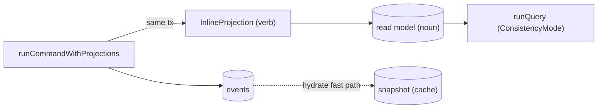

This is an **ordered source tour** of keiro's read side. It reads the real Haskell in
`keiro/src/Keiro/Command.hs`, `keiro/src/Keiro/ReadModel.hs`, and `keiro/src/Keiro/Projection.hs`
and explains *why* the code is shaped the way it is. Read the chapters in order.

## The three primitives

The read side has three things that are easy to conflate — a verb, a noun, and a cache:



## The chapters

<Cards>
  <Card title="01 — Snapshots in the command path" href="/docs/keiro/walkthrough/read-side/01-snapshots-in-the-command-path" description="hydrate, hydrateWithSnapshot, and the synchronous writeSnapshotIfNeeded." />
  <Card title="02 — The read-model query path" href="/docs/keiro/walkthrough/read-side/02-the-read-model-query-path" description="runQueryWith, schema validation, and the wait branches." />
  <Card title="03 — Projections: inline vs async" href="/docs/keiro/walkthrough/read-side/03-projections" description="The in-transaction inline path and the bare-Tx async boundary." />
</Cards>

The source files this tour reads:

```text
keiro/src/Keiro/Command.hs      -- hydrate + writeSnapshotIfNeeded (the snapshot fast path)
keiro/src/Keiro/ReadModel.hs    -- runQueryWith, validateMetadata, waitIfNeeded
keiro/src/Keiro/Projection.hs   -- runCommandWithProjections, applyAsyncProjection
```

For the conceptual version, read
[Projections, read models, and snapshots](/docs/keiro/explanation/projections-read-models-and-snapshots)
first.
