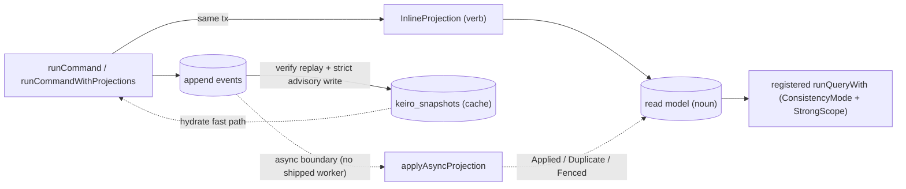

This is an **ordered source tour** of two deliberately separate subsystems: event-folded read
models, and the write-side snapshot cache used by command hydration. It reads the real Haskell in
`keiro/src/Keiro/Snapshot/Codec.hs`, `keiro/src/Keiro/Snapshot.hs`,
`keiro/src/Keiro/Snapshot/Schema.hs`, `keiro-core/src/Keiro/Snapshot/Policy.hs`,
`keiro/src/Keiro/Command.hs`, `keiro/src/Keiro/ReadModel.hs`,
`keiro/src/Keiro/ReadModel/Schema.hs`, `keiro/src/Keiro/ReadModel/Rebuild.hs`, and
`keiro/src/Keiro/Projection.hs`, and explains *why* the code is shaped the way it is.

<Callout type="warn">
  Do not connect the two subsystems. A projection/read model folds stored events. It never reads the
  Keiki `RegFile`, calls `deriveView`, or starts from `keiro_snapshots`. Chapters 01–02 explain an
  aggregate command-hydration optimization; chapters 03–04 explain the read side.
</Callout>

## Write-side cache: the `(state, registers)` pair

keiro's decision core is a **keiki `SymTransducer`** — a pure symbolic-register finite-state
transducer. As events apply, it threads **two** pieces of runtime, not one:

- the **control state** `s` — the vertex of the state machine (for an order: `Placed`, `Paid`,
  `Shipped`);
- the **register file** `RegFile rs` — an auxiliary, typed bank of named slots the machine reads
  and writes on its edges to remember *values* that the vertex alone does not encode (a running
  total, a captured id, a deadline).

The crucial fact: **the registers are not derived from the control state.** They are independent
runtime threaded alongside it. `Keiki.stepEither` takes the **pair** `(s, RegFile rs)` and a command and
returns the next pair plus emitted events; keiro's command path calls it as
`Keiki.stepEither (eventStream ^. #transducer) (state current, registers current) command`.

<Callout type="info">
A snapshot is the cache that serializes that whole pair at a known
stream version so hydration can resume there instead of replaying every event. Because the register
file is *independent* runtime, a snapshot that persisted only the folded control state `s` and
dropped the registers `rs` would silently **corrupt** hydration — the restored machine would resume
with empty or garbage registers and make wrong decisions. keiro's snapshot codec therefore encodes
**both** halves as JSON `{ "state": …, "registers": … }`, and the read-back path decodes both before
seeding aggregate replay. This state is never passed to a projection.
</Callout>

For the full model of what these registers are — the `SymTransducer` and how `Keiki.step` threads
the `(state, registers)` pair — see the foundation tour's
[The SymTransducer and step](/docs/keiro/walkthrough/foundation/04-the-symtransducer-and-step) and
[Threading state and registers](/docs/keiro/walkthrough/foundation/05-threading-state-and-registers).
The reminder above is just enough to make the snapshot story self-contained.

## Where snapshots, read models, and projections sit on the write → read flow



A **snapshot** is a cache on the *write* side that speeds command hydration. A **read model** is an
explicitly registered query over a schema-qualified application table. A **projection** is the
event fold that writes that table—inline in the append transaction, or asynchronously through the
dedup-and-fence transaction an application-owned worker drives.

## The chapters

<Cards>
  <Card title="01 — The snapshot codec and the register pair" href="/docs/keiro/walkthrough/read-side/01-the-snapshot-codec-and-the-register-pair" description="defaultStateCodec, initial and strict encoding, observable lookup outcomes, stable shape hashes, and why both state and registers are serialized." />
  <Card title="02 — Snapshots in the command and hydration path" href="/docs/keiro/walkthrough/read-side/02-snapshots-in-the-command-and-hydration-path" description="lookupSnapshotSeed, full-replay fallback, verifyAndSnapshot, policy spans, telemetry, and rollback-aware replacement." />
  <Card title="03 — The read-model query path" href="/docs/keiro/walkthrough/read-side/03-the-read-model-query-path" description="Explicit registration, qualified application data, runQueryWith gates, and category-scoped strong waits." />
  <Card title="04 — Projections and the rebuild path" href="/docs/keiro/walkthrough/read-side/04-projections-and-the-rebuild-path" description="Atomic inline writes, fenced async outcomes, and start/replay/guarded-finish rebuilds." />
</Cards>

The source files this tour reads:

```text
keiro/src/Keiro/Snapshot/Codec.hs        -- defaultStateCodec, decodeSnapshotValue (the centerpiece)
keiro/src/Keiro/Snapshot.hs              -- lookup outcomes, strict encode, hydration/write helpers
keiro/src/Keiro/Snapshot/Schema.hs       -- keiro_snapshots table + lookupSnapshot/writeSnapshotRow
keiro-core/src/Keiro/Snapshot/Policy.hs  -- shouldSnapshot / shouldSnapshotSpan
keiro-core/src/Keiro/EventStream.hs      -- StateCodec, SnapshotPolicy, EventStream
keiro/src/Keiro/Command.hs               -- hydrate + verifyAndSnapshot
keiro/src/Keiro/ReadModel.hs             -- explicit lookup, runQueryWith, StrongScope
keiro/src/Keiro/ReadModel/Schema.hs      -- the keiro_read_models registry
keiro/src/Keiro/ReadModel/Rebuild.hs     -- atomic start and guarded finish lifecycle
keiro/src/Keiro/Projection.hs            -- inline runner, async outcomes, rebuild replay
keiro/src/Keiro/Connection.hs            -- qualified application schemas
```

For the conceptual version, read
[Projections, read models, and snapshots](/docs/keiro/explanation/projections-read-models-and-snapshots)
and [Consistency and snapshots](/docs/keiro/explanation/consistency-and-snapshots) first.

Next: [01 — The snapshot codec and the register pair](/docs/keiro/walkthrough/read-side/01-the-snapshot-codec-and-the-register-pair).
