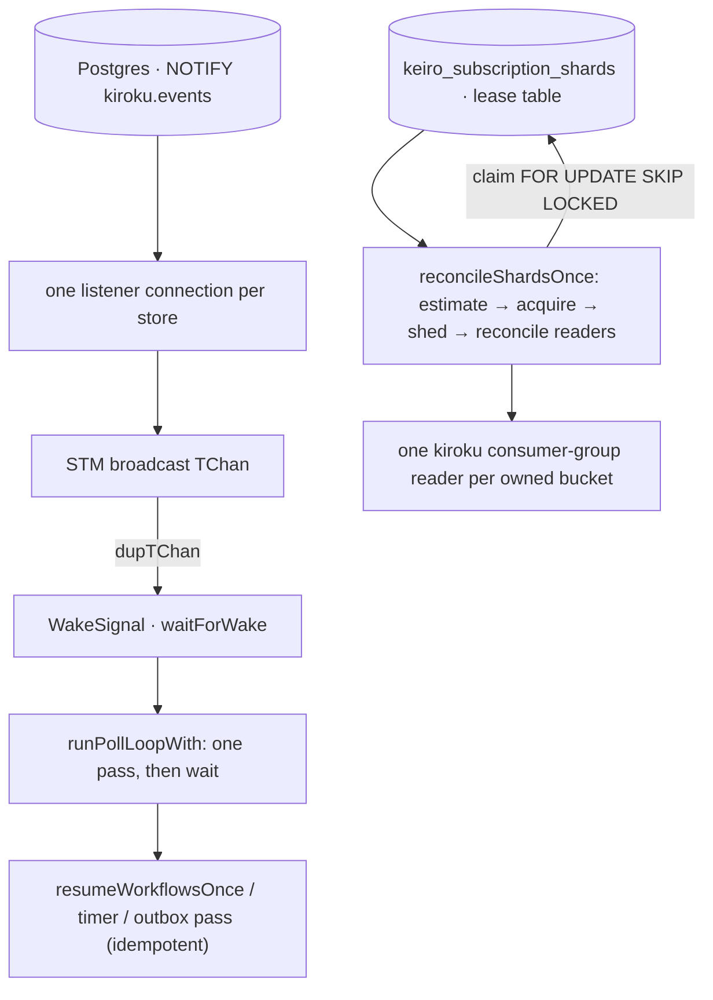

This is an **ordered source tour** of how keiro scales its background workers without changing what is
durable. Two MasterPlan-6 features sit on top of the existing poll/lease loops:

- **Push delivery** (`Keiro.Wake`) lets a poll-loop worker react within sub-second of an append instead
  of waiting out a fixed interval — riding kiroku's *existing* per-store `LISTEN/NOTIFY` listener, so it
  adds no new connection.
- **Consumer-group sharding** (`Keiro.Subscription.Shard`) lets a pool of identical workers share a busy
  category at-least-once, leasing Kiroku consumer-group buckets and coupling every delivery to an
  explicit acknowledgment.

If you have not met the concepts, read [Scaling the workers](/docs/keiro/explanation/scaling-the-workers)
first; for the dry signatures, the [push-delivery](/docs/keiro/reference/push-delivery) and
[subscription-sharding](/docs/keiro/reference/subscription-sharding) references.

## The one discipline: correctness stays in the durable layer

Both features are *optimizations*, and both keep the same invariant: the durable, idempotent unit of
work is unchanged, and the optimization only changes *when* (push) or *how many* (sharding) workers run.

- A `NOTIFY` is best-effort, so push correctness never depends on it arriving — a missed wake costs at
  most one fallback interval, exactly as the old fixed poll did.
- A shard lease governs *assignment only*; event positions stay in kiroku's per-bucket checkpoints, and
  disjointness rests on a `FOR UPDATE SKIP LOCKED` claim, not on any liveness estimate being exact.
- A stale reader can overlap its successor after lease expiry, so handlers remain idempotent. Success,
  retry, and atomic dead-letter advancement are the only delivery outcomes; shedding is not an ack.

So the worst case of either feature is the plain fixed-poll, single-worker behaviour the earlier tours
described.

## The design in one picture



## The modules this tour reads

```text
keiro/src/Keiro/Wake.hs                          -- the WakeSignal, wakeSignalFromStore, neverWake
keiro/src/Keiro/Workflow/Resume.hs               -- runPollLoopWith, runWorkflowResumeWorkerPush
keiro/src/Keiro/Subscription/Shard/Schema.hs     -- the keiro_subscription_shards table + lease statements
keiro/src/Keiro/Subscription/Shard.hs            -- the ShardLease and the Eff-level ownership operations
keiro/src/Keiro/Subscription/Shard/Worker.hs     -- reconcile, ShardDelivery/ShardAck, ack-coupled reader
keiro/src/Keiro/DeadLetter/Replay.hs             -- retained Kiroku source-event replay
```

## The chapters

<Cards>
  <Card title="01 — The wake signal" href="/docs/keiro/walkthrough/scaling/01-the-wake-signal" description="Keiro.Wake: why dupTChan adds no connection, the orElse-over-registerDelay wait that collapses a backlog to one wake, WakeReason, and neverWake as the 'all NOTIFYs dropped' control." />
  <Card title="02 — The push-aware resume loop" href="/docs/keiro/walkthrough/scaling/02-the-push-aware-resume-loop" description="runPollLoopWith as forever (pass >> waitForWake), runWorkflowResumeWorkerPush, why pollInterval is repurposed as the fallback, and the runStoreIO effect-row pin." />
  <Card title="03 — The shard lease" href="/docs/keiro/walkthrough/scaling/03-the-shard-lease" description="The keiro_subscription_shards table, claimShardsTx's FOR UPDATE SKIP LOCKED, renew/release, and the Eff-level ShardLease with one-bucket-per-pass acquireOwnedBuckets and fairShareTarget." />
  <Card title="04 — The sharded worker" href="/docs/keiro/walkthrough/scaling/04-the-sharded-worker" description="Ownership reconcile, ShardDelivery/ShardAck, bounded retry, atomic dead-letter advancement, and rebalance cancellation without premature checkpointing." />
</Cards>

## What this tour assumes

It assumes the [durable-execution tour](/docs/keiro/walkthrough/durable-execution/00-start-here) (the
resume worker `runPollLoopWith` accelerates) and the [read-side tour](/docs/keiro/walkthrough/read-side/00-start-here)
(category subscriptions, which sharding scales). It also leans on kiroku internals keiro reuses rather
than reimplements: the store's `Notifier` and its broadcast `tickChan`, and the consumer-group reader
(`subscriptionAckStream` with a `ConsumerGroup{member, size}`), including Kiroku's bounded retry and
atomic dead-letter/checkpoint behavior.
