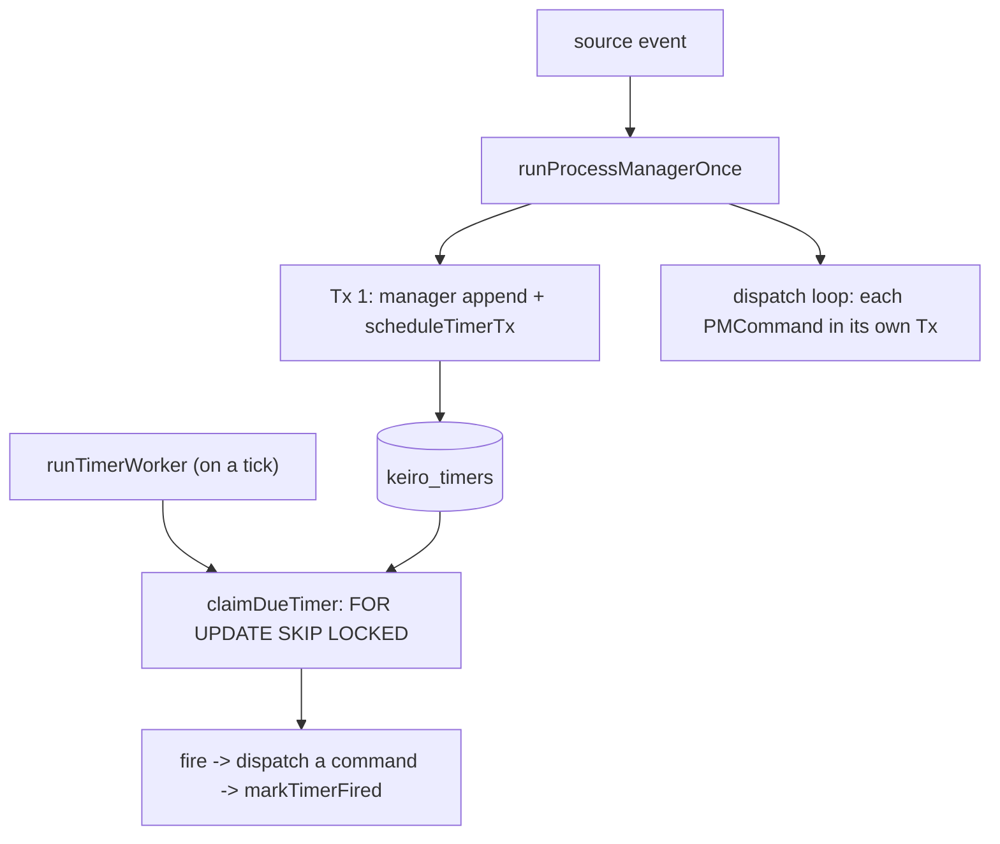

This is an **ordered source tour** of keiro's workflow engine — process managers and durable timers.
It reads the real Haskell in `keiro/src/Keiro/ProcessManager.hs`, `keiro/src/Keiro/Timer/Schema.hs`,
and `keiro/src/Keiro/Timer.hs` and explains *why* the code is shaped the way it is. Read the chapters
in order.

## The design in one picture

A process manager reacts to one source event by appending its own state (with timers) in one
transaction and dispatching each target command in its own — every write keyed by a deterministic
id so replay is a no-op. A separate, caller-driven worker later claims and fires the timers:



## The chapters

<Cards>
  <Card title="01 — The process manager" href="/docs/keiro/walkthrough/workflow/01-the-process-manager" description="runProcessManagerOnce: correlate/handle, the one-transaction manager append + timers, the dispatch loop, and the retarget coerce." />
  <Card title="02 — The timer schema" href="/docs/keiro/walkthrough/workflow/02-the-timer-schema" description="The claim CTE, the re-arm ON CONFLICT guard, and the row decoder's status fallback." />
  <Card title="03 — The timer worker" href="/docs/keiro/walkthrough/workflow/03-the-timer-worker" description="runTimerWorker and how its fire action composes with the command cycle." />
</Cards>

The source files this tour reads:

```text
keiro/src/Keiro/ProcessManager.hs    -- the process-manager runner and dispatch loop
keiro/src/Keiro/Timer/Schema.hs      -- the keiro_timers storage, claim CTE, and decoder
keiro/src/Keiro/Timer.hs             -- the bare timer worker
```

For the conceptual version of this material, read [Understanding process managers and
sagas](/docs/keiro/explanation/process-managers-and-sagas) and [Understanding durable
timers](/docs/keiro/explanation/durable-timers) first.
