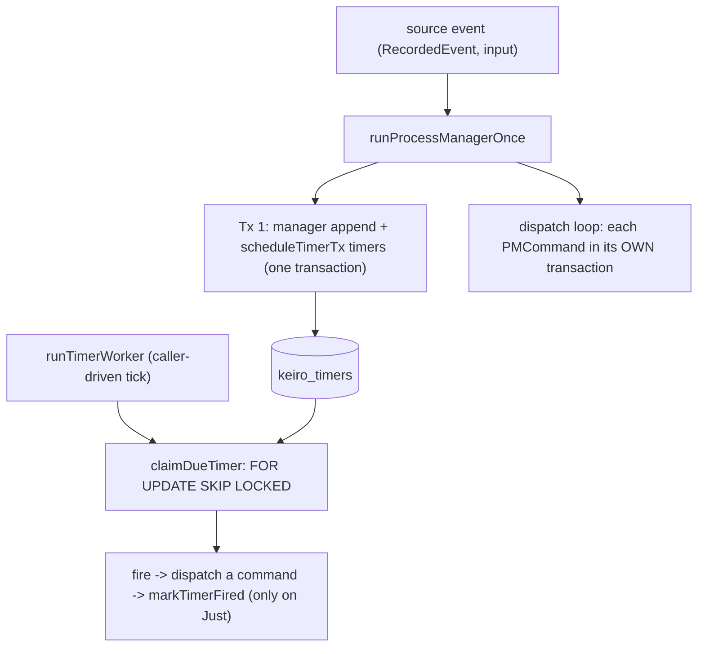

This is an **ordered source tour** of keiro's *workflow engine* — the two cooperating pieces
that let one recorded event drive work across many aggregates over time:

- A **process manager** (keiro's name for the stateful, event-driven coordinator other
  frameworks call a *saga*). Given one recorded event it (a) advances its own private,
  event-sourced *manager* state stream keyed by a **correlation id**, (b) **dispatches**
  commands to one or more *target* aggregates, and (c) schedules durable **timers**. The
  shipped code is `keiro/src/Keiro/ProcessManager.hs` and its single runner
  `runProcessManagerOnce`.
- A **durable timer**: a row in the PostgreSQL table `keiro_timers` scheduled to become *due*
  at a future `fire_at`; a worker claims due rows and fires them. The shipped code is
  `keiro/src/Keiro/Timer.hs`, `keiro/src/Keiro/Timer/Schema.hs`, and
  `keiro/src/Keiro/Timer/Types.hs`, over a table in the bootstrap migration.

Both are **libraries you import**, not servers you run. Read the chapters in order; each reads
the real source and explains *why* the code is shaped the way it is.

## The one fact to get right: separate transactions, not one atomic commit

The single most important — and most easily mis-stated — fact about this engine is its
**transaction model**. The shipped `runProcessManagerOnce` uses **separate transactions**:

- the manager-state append **and all of its timers** commit together in **one** transaction
  (`runCommandWithSql` with `scheduleTimerTx` composed into it);
- **each** dispatched target command then commits in **its own** separate transaction
  (`runCommandWithProjections`, once per command).

It is **not** one atomic multi-stream commit, even though keiro's own in-repo design notes
describe one. What makes replay crash-safe is **not** atomicity but **idempotency**: every
write is keyed by a `deterministicCommandId` (a v5 UUID over the manager name, correlation id,
source event id, and emit index) and pre-checked with `eventAlreadyIn`, so re-running the whole
reaction appends nothing new. [Chapter 02](/docs/keiro/walkthrough/workflow/02-the-transaction-model)
derives this in full; it is the headline of the tour.

## The design in one picture

A process manager reacts to one source event by appending its own state (with timers) in one
transaction and dispatching each target command in its own. A separate, caller-driven worker
later claims and fires the timers:



## Honest gaps, up front

This tour documents keiro **as shipped on the 0.1.0.0 development line**, including what is *not*
there. So you are not surprised later:

- **No backoff.** There is no `next_attempt_at` column and no exponential schedule; `attempts`
  is incremented but nothing delays a retry. A requeued `Firing` row is immediately re-claimable.
- **The timer worker is bare.** `runTimerWorker` has no loop, no clock, and no supervisor — the
  caller passes `now` and drives the tick. It now also records the `keiro.timer.*` metrics each
  pass and takes a leading `Maybe KeiroMetrics`. See
  [chapter 05](/docs/keiro/walkthrough/workflow/05-the-timer-worker).

What **has** since landed (and the chapters cover): a stuck-row **recovery API** —
`cancelTimer` / `requeueStuckTimer` / `deadLetterTimer` / `findStuckTimers` — and an optional
`maxAttempts` ceiling that auto-dead-letters a poison timer to the terminal `Dead` state instead of
retrying it forever. See [chapter 04](/docs/keiro/walkthrough/workflow/04-the-timer-schema).

## The chapters

<Cards>
  <Card title="01 — The process manager: the dispatch loop" href="/docs/keiro/walkthrough/workflow/01-the-process-manager-dispatch-loop" description="runProcessManagerOnce top to bottom: correlate/handle, deterministicCommandId, the eventAlreadyIn guard, dispatchCommand, retarget = coerce, and the worker's ack semantics." />
  <Card title="02 — The transaction model" href="/docs/keiro/walkthrough/workflow/02-the-transaction-model" description="The separate-transaction reality vs. the atomic myth: what is atomic, what is not, why deterministic ids make replay a no-op, and the PMCommandFailed hazard." />
  <Card title="03 — The ProcessManager types and config" href="/docs/keiro/walkthrough/workflow/03-the-types-and-config" description="Every field of every type — ProcessManager, the action, the results, and the timer types — tied to how the jitsurei managers wire them." />
  <Card title="04 — The timer schema and claim SQL" href="/docs/keiro/walkthrough/workflow/04-the-timer-schema" description="The keiro_timers columns, the claim CTE with FOR UPDATE SKIP LOCKED, the re-arm ON CONFLICT guard, the decoder, the requeue/cancel/dead-letter recovery statements, and the no-backoff gap." />
  <Card title="05 — The timer worker" href="/docs/keiro/walkthrough/workflow/05-the-timer-worker" description="runTimerWorker line by line, at-least-once firing, and how fire rejoins the command cycle via jitsurei's escalation and payment-timeout workers." />
</Cards>

The source files this tour reads:

```text
keiro/src/Keiro/ProcessManager.hs    -- the process-manager runner and dispatch loop
keiro/src/Keiro/Timer/Types.hs       -- TimerId, TimerRequest
keiro/src/Keiro/Timer/Schema.hs      -- the keiro_timers storage, claim CTE, decoder
keiro/src/Keiro/Timer.hs             -- the bare timer worker
```

## What this tour assumes

This tour walks *source*. For the conceptual version first, read
[Understanding process managers and sagas](/docs/keiro/explanation/process-managers-and-sagas)
and [Understanding durable timers](/docs/keiro/explanation/durable-timers); for the shipped-vs-
roadmap split see [the workflow roadmap](/docs/keiro/explanation/workflow-roadmap). For the dry
signatures, see the reference pages for the
[process manager](/docs/keiro/reference/process-manager) and the
[timers](/docs/keiro/reference/timers).

A process manager does not append target events itself — it **dispatches through the command
cycle** (the **Hydrate → Transduce → Append** loop). If you have not seen that loop, read the
[command-cycle tour](/docs/keiro/walkthrough/command-cycle/00-start-here) first; this tour
assumes it. A stateful saga is the contrast to the *stateless*
[router](/docs/keiro/walkthrough/command-cycle/07-the-router). And because a saga can query a
read model to pick targets — and inline projections run in the dispatch transaction — the
[read-side tour](/docs/keiro/walkthrough/read-side/03-the-read-model-query-path) is a useful
companion.

Throughout, the runnable worked example is **jitsurei** — `fulfillmentProcessManager`
(`just jitsurei-fulfillment`) and `escalationProcessManager` (`just jitsurei-escalation`) — so
the tour reads as one story.
