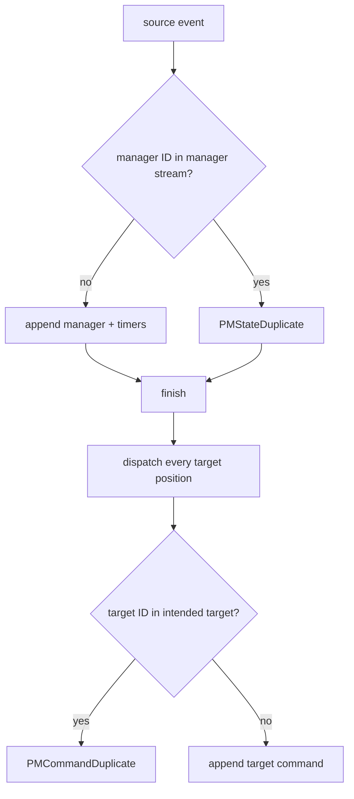

This chapter follows `runProcessManagerOnce` in `keiro/src/Keiro/ProcessManager.hs`. The next chapter
focuses on transaction and acknowledgement consequences.

## Derive the reaction and manager ID

```haskell
let correlationId = (manager ^. #correlate) input
    action = (manager ^. #handle) input
    managerStream = (manager ^. #streamFor) correlationId
    managerEventId =
      deterministicCommandId
        (manager ^. #name) correlationId (sourceEvent ^. #eventId) (-1)
```

`handle` is pure, so the same input returns the same manager command, target command order, and
timers. The manager-state ID uses emit index `-1`; target commands begin at `0`.

`eventAlreadyIn` now delegates to Kiroku's `eventExistsInStream` point lookup. It is not the old
forward scan. If `managerEventId` already exists in the manager stream, the runner reports
`PMStateDuplicate` and still enters the target dispatch loop, filling any writes missed by a crash.

## Manager append and timers

For a fresh manager reaction, `runCommandWithSql` appends manager events and schedules timers in its
SQL callback. The resource-aware runner requires `KirokuStoreResource` and applies Kiroku event
enrichment.

```haskell
managerOutcome <-
  runCommandWithSql managerOptions managerEventStream managerStream managerCommand
    (\_ -> traverse_ scheduleTimerTx timers)
```

If the manager command appends events, its timers share that transaction. A fresh no-op command does
not execute the SQL callback, so the runner schedules its timers in a follow-up transaction.

An append-time `DuplicateEvent` is not accepted from error detail alone. The runner calls
`confirmBenignDuplicate managerStreamName managerEventId err`; only a point lookup proving the ID is
in this manager stream becomes `PMStateDuplicate`. Any other manager failure is the outer
`Left CommandError`.

## Dispatch every pure command position

`finish` zips the pure target-command list with `[0..]`. For each item it derives the positional
process-manager ID, resolves the target stream name, and point-checks that ID in that target.

```haskell
data PMCommandResult target
  = PMCommandAppended (CommandResult target)
  | PMCommandDuplicate EventId
  | PMCommandFailed StreamName CommandError
```

On a precheck miss, `runCommandWithProjections` appends one target command and its inline projections
in one target-specific transaction. If a race returns `DuplicateEvent`,
`confirmBenignDuplicate targetStreamName commandId err` again requires the attempted ID in the
intended target. A cross-stream collision therefore becomes `PMCommandFailed target err`, preserving
the target needed by policy and diagnosis.

`retarget = coerce` changes only the phantom tag from `Stream targetCi` to the full target event
stream type; the underlying validated stream name is unchanged.

## Why a duplicate manager still dispatches



A crash can commit manager state and some targets. Redelivery recognizes the manager duplicate but
still traverses all targets: completed writes deduplicate, missing writes append.

## Cross-stream correlation remains unordered

One source stream preserves its own order. Different source streams can correlate to the same
manager and race, especially under sharding. The manager transducer must accept both orders; the
global position is persistence order, not a business sequencing guarantee.

Next: [02 — The transaction model](/docs/keiro/walkthrough/workflow/02-the-transaction-model).
