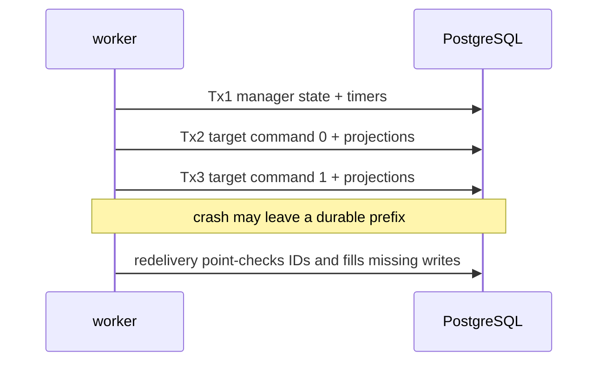

`runProcessManagerOnce` is convergent across separate transactions, not one atomic multi-stream
commit.

## Commit boundaries

1. A manager-state append and its timers commit together through `runCommandWithSql`.
2. A fresh manager no-op schedules timers in a separate transaction because the SQL callback did not
   run.
3. Each target command and that target's inline projections commit in its own
   `runCommandWithProjections` transaction.

Deterministic IDs plus point lookup and the global uniqueness constraint make redelivery converge.
The final race check is target-scoped: a global duplicate becomes benign only when the attempted ID
is found in the intended stream.

## Failure classification happens after partial commits

Target failures live inside `Right ProcessManagerResult`; the worker converts them to
`DispatchFailure emitIndex targetStreamName commandError` and decides for the complete group:

- any systemic deterministic error => halt;
- otherwise any transient error => retry the whole source event;
- otherwise no failures => acknowledge;
- otherwise all failures are `CommandRejected`/`CommandAmbiguous` and follow
  `RejectedCommandPolicy`.

Retry is safe: already completed writes become duplicates, while the failed target is attempted
again. Kiroku bounds repeated retry and eventually parks the *source event* in
`kiroku.dead_letters` with checkpoint advancement.

## Rejection policy can make the split permanent

`RejectedHalt` is default and preserves the source position. `RejectedDeadLetter` records every
rejected target in `keiro.keiro_dead_letters` and returns `AckOk`; `RejectedSkip` returns `AckOk`
with no durable row.

For a process manager, the latter two can make a history split permanent: manager state already
records the reaction, while one or more targets did not change. That is an intentional policy, not
an atomicity illusion. If saga history must reflect it, model a domain failure command/event and
drive that correction from the operator path.

`CommandAmbiguous` participates in the rejection-policy branch but remains a model defect. Default
halt allows code repair before the source moves.

## Two dead-letter meanings

| Table | Record | Why checkpoint moves |
| --- | --- | --- |
| `keiro.keiro_dead_letters` | One rejected target dispatch | Policy chose `AckOk` after writing evidence. |
| `kiroku.dead_letters` | One source event after retry exhaustion | Kiroku atomically parks it and advances. |

The Keiro table is inspected with `listDispatchDeadLetters`; it has no generic replay/delete API.
Kiroku source rows can be re-run with `replaySubscriptionDeadLetters`, which retains them and relies
on deterministic handler idempotency.

Next: [03 — The ProcessManager types and config](/docs/keiro/walkthrough/workflow/03-the-types-and-config).
