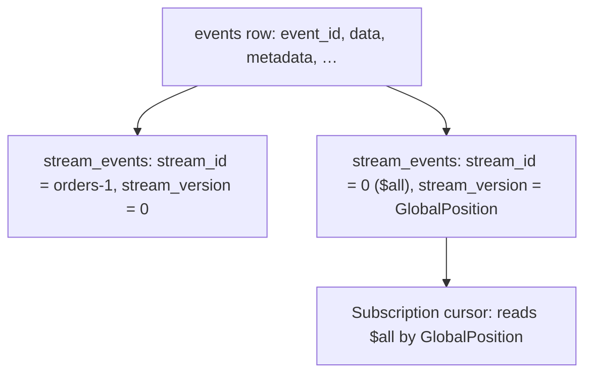

Every event kiroku stores lands in two places at once: its **source stream** and the global
**`$all` log**. That second placement is what gives the whole store a single, gap-free order —
and it is done without copying a single byte of payload.

## One event, several stream rows

The schema separates the event _body_ from its _placement_:

- The `events` table holds the immutable body once: `event_id`, `event_type`, `data` (JSONB),
  `metadata`, causation/correlation ids, `created_at`.
- The `stream_events` junction places that one event into streams. Each row is
  `(event_id, stream_id)` with a `stream_version`. **Every event gets at least two junction
  rows**: one for its source stream and one for the `$all` stream, which is seeded at
  `stream_id = 0`. Links (see [linking](/docs/kiroku/explanation/streams-and-categories)) add
  further rows — still with no payload copy.

## The $all row's version _is_ the GlobalPosition

Here is the key identity: **the `stream_version` of an event's `$all` (stream_id 0) junction row
is its `GlobalPosition`.** Because both junction rows are written in the **same transaction** as
the append, and because that transaction allocates the next `$all` version atomically, the
global order is **gap-free**: positions are `1, 2, 3, …` with no holes, under all four
`ExpectedVersion` paths.

Gap-freeness is not cosmetic. A subscription resumes by remembering "I have processed up to
`GlobalPosition` _N_" and asking for everything after _N_. If the global counter could skip
values, a subscriber could never be sure whether a missing position was a gap or an event it had
not yet seen. Contiguity makes the cursor unambiguous.

<Callout type="info">
  This is also why `$all`, categories, and links cost almost nothing: they are extra `stream_events`
  rows pointing at the *same* `events` row, not extra copies of the payload. One body, many
  placements.
</Callout>

## Reading the global log

`readAllForward` / `readAllBackward` page over `$all` by `GlobalPosition`; the seed row at
position `0` is never returned, and the cursor is exclusive (`GlobalPosition 0` reads from the
start). A subscription with target `AllStreams` is, in effect, a managed, resumable
`readAllForward` that also receives new events live.

## Trade-offs

Writing two-plus junction rows per event is slightly more write work than a single insert, and
the `$all` log serialises global ordering through one counter. In exchange you get a totally
ordered, gap-free, replayable history of the entire store — the property every projection and
subscription depends on.
