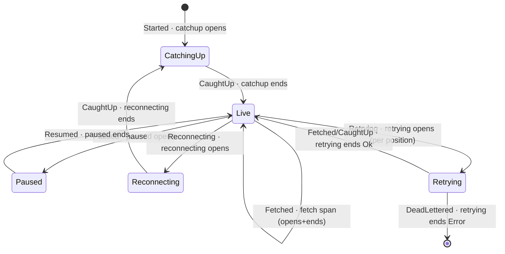

A kiroku **subscription** is a long-lived worker that reads events in order, feeds them to a
handler, and remembers progress in a durable checkpoint. Internally it is an explicit finite state
machine: at any instant it is in exactly one of `CatchingUp`, `Live`, `Paused`, `Reconnecting`,
`Retrying`, or `Stopped`, and it announces **every transition** as a structured `KirokuEvent`
delivered synchronously to the optional `eventHandler` on the connection settings.

`kiroku-otel`'s `subscriptionTraceHandler` is a pure read-side consumer of that event stream: it
adds no behaviour to the worker, changes no core type, and adds no `hs-opentelemetry` dependency to
`kiroku-store`. It only turns transitions into spans. The interesting question is _which_ spans —
and the answer is shaped almost entirely by one constraint.

## Why not one lifetime span

The natural first instinct is one span per worker, opened when it starts and closed when it stops.
That fails, because of how OpenTelemetry exports work.

<Callout type="warn">
  A span is exported to the backend **only when it ends**. The SDK's span processors fire `onEnd` —
  never on a snapshot of an in-flight span. A single span held open for the worker's whole lifetime
  would be invisible while the worker runs, and lost entirely if the worker crashes.
</Callout>

So a lifetime span gives you the worst of both worlds: nothing during normal operation (when you
most want visibility) and nothing after a crash (when you most need the post-mortem). The handler
therefore uses **short, promptly-ending spans**, in three shapes.

## Episode, work, and standalone spans

**Episode spans** open on a state-_entry_ event and end on the matching _exit_ event, so a
completed episode shows its real duration on the timeline:

- `kiroku.subscription.catchup` — `Started` → `CaughtUp`.
- `kiroku.subscription.paused` — `Paused` → `Resumed` (backpressure).
- `kiroku.subscription.reconnecting` — first `Reconnecting` → next `CaughtUp`; subsequent reconnect
  attempts within the same outage are recorded as `reconnect.attempt` span events on the open span
  rather than new spans.
- `kiroku.subscription.retrying` — keyed _per poison event_ by its global position. Opens on the
  first `Retrying` for that position and ends either when a `DeadLettered` for the same position
  arrives (status `Error`) or when the worker moves on — a later `Fetched`/`CaughtUp` — meaning the
  retry succeeded (status `Ok`).

**Per-batch work spans** open and end immediately during `Live`:

- `kiroku.subscription.fetch` — one per live fetch, carrying `kiroku.batch.rows`. Because these end
  at once they export continuously, giving live visibility without any long-lived `Live` span.

**Standalone spans** cover point events with no open episode to attach to:

- `kiroku.subscription.dead_letter` — an immediate dead-letter with no preceding retry.
- `kiroku.subscription.db_error` — a DB error when no episode span is open. When one _is_ open, the
  error is recorded as a `kiroku.db_error` span _event_ on that episode instead of spawning a
  competing span.

### The honest limitation

An _in-progress_ (unresolved) episode does not appear in the backend until it ends — that is the
direct cost of the export-on-end rule. "What state is this worker in _right now_" is answered
instead by the `currentState` subscription-handle accessor and by the `KirokuEvent` log stream
itself (and, eventually, a deferred state-gauge metric). Tracing is for the timeline of _completed_
episodes; the live state has its own channels.

## Threading and the batch processor

The `eventHandler` callback runs **synchronously on the worker's emit-site thread**, and a consumer
group runs one worker per member on separate threads. Two facts follow:

1. The open-span bookkeeping lives in one thread-safe `MVar` holding a `Map` keyed by
   `(subscription name, member)`, so two members never collide. Each key is single-writer — only its
   own worker thread touches it — so the lock is held just for two short map operations and the span
   work runs outside it; workers do not serialize on tracing syscalls.
2. Opening and ending a span is cheap and in-memory — but the _export_ may block on network I/O.

This is why the [reference](/docs/kiroku/reference/opentelemetry) insists on a **batch** span
processor: it moves export to a background thread so the synchronous callback never stalls the
worker loop. A simple/synchronous processor would couple your event-processing throughput to your
tracing backend's latency. The [code walkthrough](/docs/kiroku/walkthrough/06-tracing-the-subscription#the-critical-section-is-narrow)
covers the locking in detail.

## The append side, for contrast

Subscription spans trace the _consumer_. The other half of `kiroku-otel` —
`injectTraceContext` / `extractTraceContext` — propagates W3C trace context through event
`metadata` so a single distributed trace can span the **producer** that appended an event and every
**consumer** that later processes it. That mechanism rides alongside the
[causation and correlation](/docs/kiroku/explanation/causation-and-correlation) ids and is the same
seam the [shibuya adapter](/docs/integrations/shibuya-kiroku-adapter) reads. The subscription spans
here are about the worker's own lifecycle, not the per-event causal chain.

## Related

- [OpenTelemetry reference](/docs/kiroku/reference/opentelemetry) — the full span and attribute catalog.
- [Enable OpenTelemetry](/docs/kiroku/how-to/enable-opentelemetry) — how to wire it up.
- [Tracing the subscription FSM](/docs/kiroku/walkthrough/06-tracing-the-subscription) — a line-by-line read of the handler that implements this model.
- [Subscriptions and consumer groups](/docs/kiroku/explanation/subscriptions-and-consumer-groups) — the FSM these spans observe.
