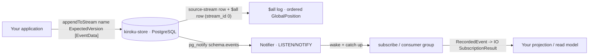

**kiroku** (記録, "record / chronicle") is a high-performance, append-only **PostgreSQL
event store**, written in Haskell on top of `hasql` and `effectful-core`. An event store
keeps an immutable, ordered log of the things that happened — _events_ — instead of
overwriting current state; you rebuild state by replaying the log. kiroku is the
**persistence foundation** the rest of the keiro runtime writes through.

<Callout type="info">
  kiroku is an event **store**, not a decider or aggregate framework. It gives you durable, ordered,
  immutable events plus optimistic concurrency and subscriptions. Patterns such as `decide` /
  `evolve` / projections are application code you write *on top* — see the [decider &amp; evolve
  tutorial](/docs/kiroku/tutorials/decider-and-evolve). The library ships no such typeclass
  anywhere; mislabeling it would make every downstream example wrong.
</Callout>

<Callout type="warn">
  kiroku is in **active development** and its APIs may change. Pin a version and review release
  notes before depending on it in production.
</Callout>

<Callout type="info">
  These docs target `kiroku-store 0.3.0.1`. The July 2026 release adds corrected backward
  pagination, eager stream/batch validation, typed link and transaction failures, explicit
  subscription live sources, and a reversible `truncateBefore` marker. Existing users should follow
  [Upgrade to Kiroku 0.3](/docs/kiroku/how-to/upgrade-to-0-3).
</Callout>

## How it fits together

A write appends events to a named stream; the same transaction also writes each event to the
global `$all` log, which gives a strictly increasing `GlobalPosition`. A `NOTIFY` wakes the
in-process publisher. Plain `$all` subscribers can receive live fan-out; category subscriptions and
consumer groups use the wake-up as a catch-up boundary and read ordered batches from PostgreSQL and
their checkpoints.

## Sister packages

`kiroku-store` is the core; optional sister packages add observability and operations without
changing it:

- **`kiroku-otel`** — OpenTelemetry trace-context propagation and subscription-lifecycle spans. See
  the [OpenTelemetry reference](/docs/kiroku/reference/opentelemetry).
- **`kiroku-metrics`** — an HTTP server exposing JSON/Prometheus metrics, Kubernetes health probes, a
  live `/subscriptions` endpoint, and a WebSocket metrics/event stream. See the
  [Metrics reference](/docs/kiroku/reference/metrics).
- **`kiroku-cli`** — an embeddable + standalone operator CLI for inspecting a worker's live
  subscriptions. See the [Operator CLI reference](/docs/kiroku/reference/operator-cli).

## Where to go next

<Cards>
  <Card
    title="Tutorials"
    href="/docs/kiroku/tutorials"
    description="Learn kiroku step by step, from an empty database to a working event stream."
  />
  <Card
    title="How-To Guides"
    href="/docs/kiroku/how-to"
    description="Task-oriented recipes: install or upgrade Kiroku, operate subscriptions and telemetry, build a projection, and integrate with shibuya."
  />
  <Card
    title="Reference"
    href="/docs/kiroku/reference"
    description="The Store effect operations and core domain types, stated plainly and completely."
  />
  <Card
    title="Explanation"
    href="/docs/kiroku/explanation"
    description="Why kiroku works the way it does — streams, the $all log, optimistic concurrency, subscriptions."
  />
  <Card
    title="Cookbook"
    href="/docs/kiroku/cookbook"
    description="Short, copy-paste recipes for common problems."
  />
  <Card
    title="Code Walkthrough"
    href="/docs/kiroku/walkthrough"
    description="An ordered tour through kiroku's real subscription source."
  />
</Cards>
