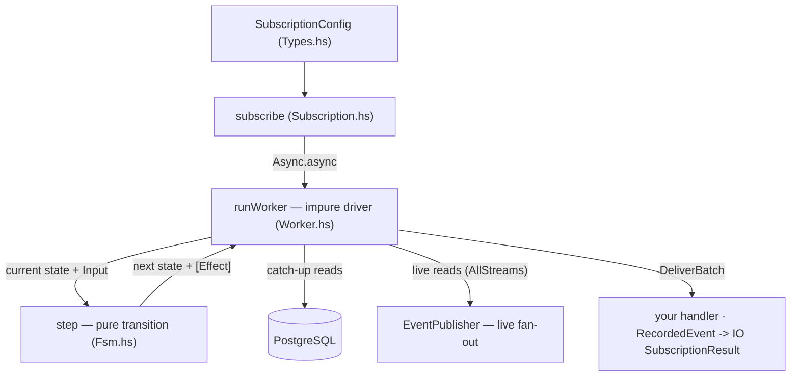

This walkthrough reads kiroku's **real subscription source** to teach how a running subscription
actually works inside. We follow one idea the whole way: a subscription is a **pure state
machine** interpreted by an **impure driver**. Separating the two is what makes the worker both
testable and easy to reason about.

<Callout type="info">
  This is an ordered walkthrough. Read the parts in sequence. It assumes you have met subscriptions
  from the user's point of view in [Subscriptions and consumer
  groups](/docs/kiroku/explanation/subscriptions-and-consumer-groups); here we go under the hood.
</Callout>

## The modules we will read

All paths are under `kiroku-store/src/Kiroku/Store/Subscription/`:

```text
Subscription.hs            -- subscribe / withSubscription: spawn the worker, hand back a handle
Subscription/Fsm.hs        -- the PURE state machine: SubscriptionState, Input, Effect, step
Subscription/Worker.hs     -- the IMPURE driver: runWorker interprets the FSM against PostgreSQL
Subscription/Types.hs      -- the config/result surface (SubscriptionConfig, SubscriptionResult)
Subscription/EventPublisher.hs  -- the in-process fan-out the live phase reads from
```

## The shape of the design



The driver never decides _what_ the next state is — it asks `step`. `step` never performs I/O —
it returns a list of `Effect`s for the driver to carry out. Hold that division in mind; the next
three parts each take one box of this diagram.

## Where to go

- [01 — The state machine](/docs/kiroku/walkthrough/01-the-state-machine): the pure `step` function and its alphabet.
- [02 — The worker driver](/docs/kiroku/walkthrough/02-the-worker-driver): how `runWorker` interprets it, catch-up vs live.
- [03 — subscribe & lifecycle](/docs/kiroku/walkthrough/03-subscribe-and-lifecycle): spawning the worker and the handle.
