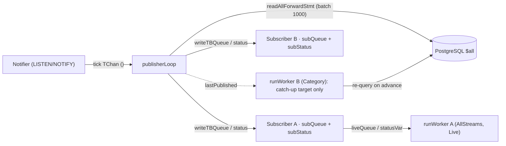

<Callout type="info">
  Part of an ordered walkthrough. Previous: [02 — The worker
  driver](/docs/kiroku/walkthrough/02-the-worker-driver).
</Callout>

## What this part covers

`kiroku-store/src/Kiroku/Store/Subscription/EventPublisher.hs` — the **centralized `$all`
broadcaster**. The [worker driver](/docs/kiroku/walkthrough/02-the-worker-driver) reads a non-group
`AllStreams` subscription's live events from "the publisher's bounded queue" and every subscription
treats `lastPublished` as its catch-up target; this part is the other side of that seam — the single
thread that fills `$all` queues and tracks the store head for DB-driven workers.

The core idea is **read once, fan out where it helps**. Rather than have every non-group
`AllStreams` subscription poll the database for new events independently, one `EventPublisher` thread
reads each new batch of the global stream **once** and hands it to every registered `$all` subscriber
through that subscriber's own bounded queue. Category subscriptions and consumer-group members do
not register for fan-out; they use the publisher's position as a wake-up/catch-up boundary and fetch
their own filtered batches from the database.

## Why bounded per-subscriber queues

An earlier design fanned out through a single unbounded broadcast `TChan`. The problem: one slow
subscriber would let the channel's backlog grow without limit, so a single stuck consumer could
exhaust the publisher's memory. The current design replaces that with a **registry of bounded
queues** — each subscriber gets its own `TBQueue` with a fixed capacity, and when one fills, the
publisher applies _that subscriber's_ overflow policy instead of growing memory or blocking the
broadcast. **The publisher never blocks on a slow consumer.**

```haskell
-- src/Kiroku/Store/Subscription/EventPublisher.hs
data EventPublisher = EventPublisher
  { subscribers      :: !(TVar (IntMap Subscriber))  -- the active subscriber registry, keyed by an internal id
  , nextSubscriberId :: !(TVar Int)                  -- monotonic id source for registry keys
  , publisherThread  :: !(Async ())                  -- the broadcast loop
  , lastPublished    :: !(TVar GlobalPosition)       -- last-broadcast cursor; workers read this to know catch-up is done
  }

data Subscriber = Subscriber
  { subQueue  :: !(TBQueue (Vector RecordedEvent))   -- this subscriber's bounded live queue
  , subStatus :: !(TVar SubscriberStatus)            -- Active | Paused | Overflowed, observed by the worker
  , subPolicy :: !OverflowPolicy                     -- what to do when subQueue fills
  }

data SubscriberStatus = Active | Paused | Overflowed
```

Each `Subscriber` is exactly the trio the worker was handed in
[part 02](/docs/kiroku/walkthrough/02-the-worker-driver#how-runworker-is-wired): `subQueue` is the
worker's `liveQueue`, `subStatus` is its `statusVar`, and `subPolicy` is the configured
`OverflowPolicy`.

## The lifecycle API

Four functions bound the publisher's life. Only non-group `AllStreams` subscriptions call the
registration function; every worker reads the position function:

```haskell
startPublisher       :: Pool -> TChan () -> Maybe (KirokuEvent -> IO ()) -> StoreSettings -> m EventPublisher
subscribePublisher   :: EventPublisher -> Natural -> OverflowPolicy
                     -> STM (TBQueue (Vector RecordedEvent), TVar SubscriberStatus, IO ())
publisherPosition    :: EventPublisher -> STM GlobalPosition
stopPublisher        :: EventPublisher -> m ()
```

- **`startPublisher`** runs once when the store opens. It seeds `lastPublished` from the current
  global position (so a fresh subscriber's catch-up has a target immediately), takes a **personal
  copy** of the Notifier's broadcast channel with `dupTChan`, and forks the broadcast loop.
- **`subscribePublisher`** is the registration used only by non-group `AllStreams` subscriptions. It
  is a single STM transaction: allocate a bounded `TBQueue` of `cap` batches, a fresh `Active`
  status, insert the `Subscriber` into the registry under a new id, and return the queue, the status
  `TVar`, and an `unsubscribe` action that deletes the entry. **Forgetting to `unsubscribe` is a
  leak** — the publisher would keep pushing to a queue with no reader, which fills and trips the
  overflow policy needlessly. (That is exactly why the worker's `finally` cleanup runs it on every
  exit — see [part 04](/docs/kiroku/walkthrough/04-subscribe-and-lifecycle).)
- **`publisherPosition`** / **`lastPublished`** is the shared catch-up target. Every worker reads it
  as `pubPosVar`: while its cursor is behind, it stays in `CatchingUp` reading history from the DB;
  once it reaches `lastPublished`, it goes `Live`.
- **`stopPublisher`** cancels the loop and waits for it, when the store closes.

## The broadcast loop

The forked thread is one tight loop: wait for a reason to act, debounce, fetch-and-broadcast,
repeat.

```haskell
publisherLoop ... = loop where
  loop = do
    waitForWakeup tickChan   -- block until a NOTIFY tick OR the 30s safety poll fires
    drainTicks tickChan      -- coalesce every queued tick into this one pass (debounce)
    fetchAndBroadcast        -- read new events once, fan out to all subscribers
    loop
```

The wakeup is the interesting part: it blocks on **either** a tick from the Notifier **or** a
30-second timeout, whichever comes first.

```haskell
waitForWakeup tickChan = do
  timerVar <- registerDelay safetyPollMicros           -- 30s
  atomically $ readTChan tickChan
       `STM.orElse` (readTVar timerVar >>= STM.check)   -- fire when the timer flips
```

The `TChan ()` ticks come from the [Notifier](/docs/kiroku/explanation/subscriptions-and-consumer-groups),
which emits one on every `LISTEN/NOTIFY` wake-up — so an idle store does no polling at all. The
30-second `registerDelay` **safety poll** is the backstop: if a notification is ever lost (e.g. while
the listener connection is reconnecting), the loop still reconciles within 30s, preserving
at-least-once delivery with bounded latency. After waking, `drainTicks` non-blockingly pulls every
other queued tick so a burst of appends collapses into a single fetch rather than one pass per
notification.

### Fetch once, deliver per subscriber

```haskell
fetchAndBroadcast = do
  GlobalPosition pos <- readTVarIO posVar
  subs <- readTVarIO subsVar
  if IntMap.null subs
    then cheapAdvance
    else do
      result <- Pool.use pool (Session.statement (pos, publisherBatchSize) SQL.readAllForwardStmt)  -- batch of 1000
      ...
```

If the subscriber registry is empty, `cheapAdvance` reads only the current global position and
updates `lastPublished`. It decodes no event rows and fans out to no queues, but DB-driven category
and consumer-group workers still see the publisher position advance and can leave catch-up/live waits
without requiring an otherwise-unused queue.

When there are registered `$all` subscribers, the loop reads and broadcasts:

```haskell
fetchAndBroadcast = do
  GlobalPosition pos <- readTVarIO posVar
  result <- Pool.use pool (Session.statement (pos, publisherBatchSize) SQL.readAllForwardStmt)  -- batch of 1000
  case result of
    Left err -> for_ mHandler ($ KirokuEventPublisherPoolError err)   -- surface the stall, keep running
    Right rawEvents
      | V.null rawEvents -> pure ()
      | otherwise -> do
          events <- decodeEvents stSettings rawEvents   -- decodeHook ONCE per batch, shared by all subscribers
          let newPos = globalPosition (V.last events)
          subs <- readTVarIO subsVar                    -- snapshot the registry...
          for_ (IntMap.elems subs) (deliverBatch events) -- ...then deliver, each its own atomic step
          atomically (writeTVar posVar newPos)          -- advance the cursor after attempting all deliveries
          when (V.length events >= fromIntegral publisherBatchSize) fetchAndBroadcast  -- full batch ⇒ maybe more
```

Three deliberate choices here:

1. **The `decodeHook` is applied once**, not once per subscriber. Every subscriber observes the same
   transformed view, and the cost is paid in one place. This mirrors the worker's catch-up
   `fetchBatch`, which applies the same hook — so a catch-up batch and a live batch are transformed
   identically.
2. **Delivery happens outside the snapshot transaction.** The loop snapshots the subscriber set with
   `readTVarIO`, then delivers to each in its **own** atomic step. A slow subscriber under
   `DropSubscription` cannot roll back another subscriber's enqueue, and a registration/unsubscribe
   racing the broadcast just misses or catches this batch cleanly.
3. **The publisher batch size is 1000** (vs. the worker's default 100) because it serves every
   subscriber at once; a full batch immediately re-runs `fetchAndBroadcast` so a large backlog drains
   without waiting for the next tick.

## Overflow: the policy lives here

`deliverBatch` is where each subscriber's `OverflowPolicy` is enforced. It is one atomic step per
subscriber:

```haskell
deliverBatch events sub = atomically $ do
  full <- isFullTBQueue (subQueue sub)
  if not full
    then do
      status <- readTVar (subStatus sub)
      case status of
        Paused     -> writeTVar (subStatus sub) Active  -- space again: clear a prior PauseAndResume pause
        Active     -> pure ()
        Overflowed -> pure ()                            -- never un-stick a terminal DropSubscription overflow
      writeTBQueue (subQueue sub) events
    else case subPolicy sub of
      PauseAndResume   -> writeTVar (subStatus sub) Paused      -- stop pushing; do NOT drop
      DropSubscription -> writeTVar (subStatus sub) Overflowed  -- terminal: worker will error out
      DropOldest       -> tryReadTBQueue (subQueue sub) *> writeTBQueue (subQueue sub) events  -- evict oldest, enqueue
```

Read it against the three policies the [explanation](/docs/kiroku/explanation/subscriptions-and-consumer-groups#backpressure-without-loss)
names:

- **`PauseAndResume`** (default, lossless). On a full queue the publisher sets `Paused` and **stops
  pushing** — it does not drop. The worker observes `Paused`, drains its stale queue, clears the flag
  back to `Active`, and **re-catches-up from its checkpoint**, so the events the publisher stopped
  pushing are recovered from the database. When the queue has space again, `deliverBatch` proactively
  clears a lingering `Paused` back to `Active` so the worker is never left waiting.
- **`DropSubscription`** (fail fast). The publisher sets `Overflowed`, a **terminal** status it never
  clears; the worker observes it and raises `SubscriptionOverflowed`.
- **`DropOldest`** (lossy best-effort). The publisher evicts the oldest batch and enqueues the new
  one, so the queue never blocks and the slowest data is the data lost.

In every case the publisher takes a bounded, non-blocking action and moves on to the next
subscriber — the broadcast never stalls on one slow consumer.

## How it connects to the worker

Putting the two halves together:



- An **`AllStreams`** worker is the direct consumer: `subQueue` is its live source and `subStatus`
  drives its `QueueBackpressured` / `QueueOverflowed` inputs.
- Every worker — `AllStreams`, `Category`, or group member — uses **`lastPublished`** as its catch-up
  target.
- A **`Category` or consumer-group** worker does **not** register a publisher queue. It reads its
  live events from the database via the NOTIFY-driven category loop or the group polling loop, and
  uses `lastPublished` only as the shared catch-up/live boundary and wake-up gate.

## The publisher, in one sentence

`EventPublisher` is the one thread that turns each `LISTEN/NOTIFY` tick (or a 30-second safety poll)
into either a cheap head-position advance or a single `$all` read, fans batches out to every
registered non-group `$all` subscriber's **bounded** queue with its own overflow policy applied
in-place, and advances `lastPublished` — so `$all` subscribers share one database reader, category
and group workers avoid unused queues, and no slow consumer can block the broadcast or grow its
memory without bound.

## Next

[04 — subscribe & lifecycle](/docs/kiroku/walkthrough/04-subscribe-and-lifecycle): how `subscribe`
allocates the worker's live source, spawns the worker, and hands back a cleanup-guaranteeing handle.
