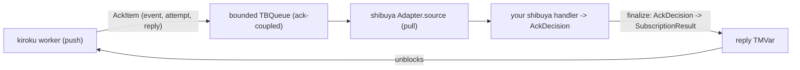

<Callout type="info">
  Part of an ordered walkthrough. The previous parts traced kiroku's own subscription worker
  ([01](/docs/kiroku/walkthrough/01-the-state-machine)–[03](/docs/kiroku/walkthrough/03-subscribe-and-lifecycle)).
  This part reads a *different* package — `shibuya-kiroku-adapter` — which sits on top of that
  worker.
</Callout>

## What this part covers

`shibuya-kiroku-adapter/src/Shibuya/Adapter/Kiroku.hs` and its companion
`Shibuya/Adapter/Kiroku/Convert.hs`. The job of this package is one sentence: turn kiroku's
**push-based** subscription (the worker calls _your_ handler) into shibuya's **pull-based**
`Adapter` (shibuya pulls a stream of messages). The interesting part is how it does that without
losing kiroku's per-event checkpointing — the answer is an **ack-coupled** bridge.

## The impedance mismatch

kiroku and shibuya have opposite control flow:

- **kiroku subscription** — _push_. The worker owns the loop; it calls your
  `RecordedEvent -> IO SubscriptionResult` handler and acts on the result (see
  [part 02](/docs/kiroku/walkthrough/02-the-worker-driver)).
- **shibuya `Adapter`** — _pull_. Shibuya owns the loop; it consumes a `Stream (Eff es)` of
  `Ingested` messages and calls your handler, expecting an `AckDecision` back.

Bridging them naively would break checkpointing: if you just pushed events into a queue and let
the kiroku worker run ahead, the worker would checkpoint past events shibuya had not yet
processed — losing at-least-once on a crash. The adapter avoids this with the **ack-coupled
stream** (`subscriptionAckStream`): for each event the kiroku worker **blocks** until shibuya's
handler finalizes its decision, then acts on it.



## Building the adapter

`kirokuAdapter` is small — its whole job is to wire the ack-coupled stream into a shibuya
`Adapter`:

```haskell
-- src/Shibuya/Adapter/Kiroku.hs (trimmed)
kirokuAdapter :: (IOE :> es) => KirokuStore -> KirokuAdapterConfig -> Eff es (Adapter es RecordedEvent)
kirokuAdapter store (KirokuAdapterConfig subName subTarget bs buf cg etf sel) = do
  -- 1. Translate the adapter config into a kiroku SubscriptionConfig. Built from the smart
  --    constructor so any future SubscriptionConfig field is inherited at its default.
  let subConfig =
        (defaultSubscriptionConfig subName subTarget (\_ -> pure Continue))
          { batchSize      = bs
          , queueCapacity  = 16
          , overflowPolicy = DropSubscription
          , consumerGroup  = cg
          , eventTypeFilter = etf
          , selector       = sel
          }

  -- 2. Start the ack-coupled stream: an IO stream of AckItems + a cancel action.
  (ioStream, cancelAction) <- liftIO $ subscriptionAckStream store subConfig buf

  -- 3. Lift IO -> Eff and wrap each AckItem into a shibuya Ingested value.
  let envAttrs = KirokuEnvelopeAttrs { subscriptionName = subNameText, member = ... }
      ingestedStream = fmap (toIngestedAck envAttrs cancelAction) (Stream.morphInner liftIO ioStream)

  pure Adapter
    { adapterName = "kiroku"
    , source      = ingestedStream
    , shutdown    = liftIO cancelAction
    }
```

Read the three steps:

1. The handler passed to kiroku is `\_ -> pure Continue` — a **placeholder**. The real decision
   does not come from here; it comes from shibuya, through the ack reply (step 3). The adapter only
   uses kiroku's subscription machinery for catch-up, live delivery, partitioning, and
   checkpointing — not for the per-event verdict.
2. `subscriptionAckStream store subConfig buf` returns an `IO` stream of `AckItem`s and a
   `cancelAction`. `buf` is the `bufferSize` — the `TBQueue` capacity, and therefore the
   backpressure depth.
3. `Stream.morphInner liftIO` lifts the `Stream IO` into `Stream (Eff es)`; `toIngestedAck` wraps
   each `AckItem` into shibuya's `Ingested`. The adapter's `shutdown` is the cancel action, so
   shibuya's coordinated shutdown tears down the kiroku subscription.

## The conversion: AckItem → Ingested

`Convert.hs` is where push becomes pull-with-feedback. An `AckItem` carries the event, its
redelivery `attempt`, and a `reply` `TMVar` the blocked worker is waiting on:

```haskell
-- src/Shibuya/Adapter/Kiroku/Convert.hs (trimmed)
toIngestedAck :: (IOE :> es) => KirokuEnvelopeAttrs -> IO () -> AckItem -> Ingested es RecordedEvent
toIngestedAck attrs cancelAction (AckItem event attempt reply) =
  Ingested
    { envelope = (toEnvelope attrs event){ attempt = Just (Attempt attempt) }
    , ack = AckHandle
        { finalize = \case
            AckHalt _ -> liftIO cancelAction
            decision  -> liftIO $ atomically $ void $
                           tryPutTMVar reply (toKirokuResult attempt decision)
        }
    , lease = Nothing
    }
```

The `finalize` closure **is** the bridge. When shibuya's handler returns an `AckDecision`,
`finalize` writes the translated `SubscriptionResult` into the `reply` `TMVar`, which **unblocks
the kiroku worker** to act on it. Two details worth noting:

- `AckHalt` is special-cased to `cancelAction` (cancel the whole subscription) rather than a reply.
- `tryPutTMVar` makes `finalize` **idempotent** — a second finalize is a silent no-op.

## The decision translation

`toKirokuResult` maps shibuya's verdict onto kiroku's, which is exactly the per-event
checkpointing contract you saw in [part 02](/docs/kiroku/walkthrough/02-the-worker-driver):

```haskell
-- src/Shibuya/Adapter/Kiroku/Convert.hs
toKirokuResult :: Word -> AckDecision -> SubscriptionResult
toKirokuResult attempt = \case
  AckOk                       -> Continue                                  -- checkpoint past it
  AckRetry (Ack.RetryDelay d) -> Retry (RetryDelay d)                      -- redeliver, then dead-letter
  AckDeadLetter reason        -> DeadLetter (toKirokuDeadLetterReason attempt reason)
  AckHalt _                   -> Continue                                  -- defensive; AckHalt cancels above
```

So an `AckOk` becomes the kiroku worker's `Continue` (checkpoint advances), `AckRetry` becomes
`Retry` (bounded redelivery → dead-letter on exhaustion), and `AckDeadLetter` becomes `DeadLetter`
(recorded in `kiroku.dead_letters`, checkpoint advances). The kiroku-owned types
(`RetryDelay`, `DeadLetterReason`) are deliberately separate from shibuya's so `kiroku-store` never
depends on `shibuya-core`; this function is the translation seam.

## The envelope mapping

`toEnvelope` turns a `RecordedEvent` into a shibuya `Envelope`, preserving identity, ordering, and
trace context:

```text
RecordedEvent field   →  Envelope field
─────────────────────────────────────────
eventId (UUID)        →  messageId (Text)
globalPosition        →  cursor (CursorInt)     -- ordering
createdAt             →  enqueuedAt
metadata.traceparent  →  traceContext            -- W3C trace propagation
(the event itself)    →  payload
```

It also stamps `kiroku.*` OpenTelemetry attributes (subscription name, consumer-group member, event
type, global position) onto the envelope so a distributed trace reads consistently across the
kiroku and shibuya sides — the same keys `Kiroku.Otel.Subscription` uses.

## The payoff

Because the worker blocks per event on the reply, the whole bridge preserves kiroku's guarantees
end to end: **at-least-once** delivery, **per-event checkpointing** driven by shibuya's ack, and
**natural backpressure** (a slow shibuya handler throttles kiroku's database polling). shibuya
contributes supervision, metrics, and graceful shutdown on top.

## Next

[05 — Consumer groups and policy](/docs/kiroku/walkthrough/05-consumer-groups-and-policy): how one
call turns a size-`N` group into `N` correctly-policed shibuya processors.
