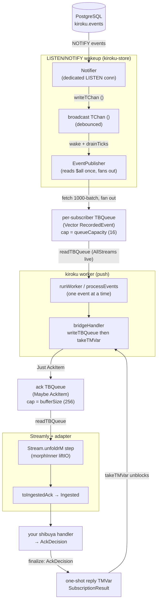

<Callout type="info">
  Part of an ordered walkthrough. The previous parts traced kiroku's own subscription worker
  ([01](/docs/kiroku/walkthrough/01-the-state-machine)–[04](/docs/kiroku/walkthrough/04-subscribe-and-lifecycle)).
  This part reads a *different* package — `shibuya-kiroku-adapter` — plus the one kiroku-store
  module it builds on (`Kiroku/Store/Subscription/Stream.hs`).
</Callout>

## What this part covers

Three source files and the seam between them:

- `kiroku-store/src/Kiroku/Store/Subscription/Stream.hs` — the **Streamly + STM bridge**
  (`subscriptionAckStream`) that turns the push-based worker into a pull-based `Stream IO`.
- `shibuya-kiroku-adapter/src/Shibuya/Adapter/Kiroku.hs` — `kirokuAdapter`, which lifts that stream
  into a shibuya `Adapter`.
- `shibuya-kiroku-adapter/src/Shibuya/Adapter/Kiroku/Convert.hs` — the per-item conversion that
  closes the feedback loop.

The job of the package is one sentence: turn kiroku's **push-based** subscription (the worker calls
_your_ handler) into shibuya's **pull-based** `Adapter` (shibuya pulls a stream of messages) — while
keeping the four properties an event-sourced subscription cannot do without: **strict event
ordering**, per-event checkpointing, no deadlock between the two opposed loops, and bounded memory.
The answer to all four is an **ack-coupled** bridge over a bounded `TBQueue` and a one-shot `TMVar`.
This part reads enough of the real code to show _why_ it is correct on each count — ordering most of
all, since for event sourcing it _is_ the correctness contract.

## The impedance mismatch

kiroku and shibuya have opposite control flow:

- **kiroku subscription** — _push_. The worker owns the loop; it calls your
  `RecordedEvent -> IO SubscriptionResult` handler and acts on the result (see
  [part 02](/docs/kiroku/walkthrough/02-the-worker-driver)).
- **shibuya `Adapter`** — _pull_. Shibuya owns the loop; it consumes a `Stream (Eff es)` of
  `Ingested` messages and calls your handler, expecting an `AckDecision` back.

Bridging them naively would break checkpointing: if you just pushed events into a queue and let the
kiroku worker run ahead, the worker would checkpoint past events shibuya had not yet processed —
losing at-least-once on a crash. The adapter avoids this with the **ack-coupled stream**
(`subscriptionAckStream`): for each event the kiroku worker **blocks** until shibuya's handler
finalizes its decision, then acts on it.

## The full path: from LISTEN/NOTIFY to a shibuya pull

Before zooming into the bridge, see the whole pipeline an event travels. There are **two
independent producer/consumer hops**, each over its own bounded STM queue, plus the LISTEN/NOTIFY
wakeup that drives the front of it. Nothing in the chain polls in a busy loop.



Read it as two halves joined at the worker:

1. **Front half — push, driven by LISTEN/NOTIFY (part 02's territory).** A `NOTIFY` on append wakes
   the `Notifier`'s dedicated connection, which writes a `()` tick to a broadcast `TChan`. The shared
   `EventPublisher` wakes on that tick (or a 30 s safety poll), **debounces** by draining all pending
   ticks, reads the new `$all` events **once** in 1000-event batches, and fans each batch out to every
   `AllStreams` subscriber's own bounded `TBQueue`. The worker reads its batch from that queue. (A
   `Category` or consumer-group worker skips the broadcast and re-queries with a SQL filter when the
   publisher's position advances — same wakeup, different fetch. Catch-up always reads the database
   directly.)
2. **Back half — pull, the subject of this part.** The worker hands each event, one at a time, to the
   `bridgeHandler`, which enqueues an `AckItem` on the **ack `TBQueue`** and blocks on a one-shot
   reply `TMVar`. Streamly's `unfoldrM` pulls items off that queue on demand; the adapter wraps each
   into shibuya's `Ingested`. When shibuya's handler returns an `AckDecision`, `finalize` writes the
   translated result back into the reply `TMVar`, unblocking the worker to checkpoint / retry /
   dead-letter.

The crucial property: **the worker never produces event _N+1_ until shibuya has acked event _N_.**
`processEvents` walks a batch sequentially, and each `handler config event` call is the
`bridgeHandler`, which blocks on `takeTMVar`. That single fact is what bounds memory and prevents the
checkpoint from racing ahead — proven below.

## Building the adapter

`kirokuAdapter` is small — its whole job is to wire the ack-coupled stream into a shibuya `Adapter`:

```haskell
-- shibuya-kiroku-adapter/src/Shibuya/Adapter/Kiroku.hs (trimmed)
kirokuAdapter :: (IOE :> es) => KirokuStore -> KirokuAdapterConfig -> Eff es (Adapter es RecordedEvent)
kirokuAdapter store (KirokuAdapterConfig subName subTarget bs buf cg etf sel) = do
  -- 1. Translate the adapter config into a kiroku SubscriptionConfig, built from the smart
  --    constructor so any future SubscriptionConfig field is inherited at its default.
  let subConfig =
        (defaultSubscriptionConfig subName subTarget (\_ -> pure Continue))
          { batchSize       = bs
          , queueCapacity   = 16             -- the *front-half* per-subscriber queue (batches)
          , overflowPolicy  = DropSubscription
          , consumerGroup   = cg
          , eventTypeFilter = etf
          , selector        = sel
          }

  -- 2. Start the ack-coupled stream: an IO stream of AckItems + a cancel action.
  --    `buf` (bufferSize) is the *back-half* ack TBQueue capacity.
  (ioStream, cancelAction) <- liftIO $ subscriptionAckStream store subConfig buf

  -- 3. Lift IO -> Eff and wrap each AckItem into a shibuya Ingested value.
  let envAttrs = KirokuEnvelopeAttrs { subscriptionName = subNameText, member = ... }
      ingestedStream = fmap (toIngestedAck envAttrs cancelAction) (Stream.morphInner liftIO ioStream)

  pure Adapter
    { adapterName = "kiroku"
    , source      = ingestedStream
    , shutdown    = liftIO cancelAction
    }
```

Three steps, three things to notice:

1. The handler passed to kiroku is `\_ -> pure Continue` — a **placeholder**. The real decision does
   not come from here; it comes from shibuya, through the ack reply. The adapter only borrows kiroku's
   subscription machinery for catch-up, live delivery, partitioning, and checkpointing — not for the
   per-event verdict. (`subscriptionAckStream` overwrites this field with its own `bridgeHandler`
   anyway; the placeholder just satisfies the smart constructor.)
2. There are **two** capacities, and they are different queues. `queueCapacity = 16` sizes the
   front-half per-subscriber queue (the one the publisher fills, measured in _batches_).
   `buf` / `bufferSize` (default 256) sizes the back-half ack queue (the one the bridge fills,
   measured in _items_). Keep them straight — they sit on opposite sides of the worker and fail
   differently (see [deadlocks](#why-there-are-no-deadlocks) and [performance](#why-there-are-no-performance-problems)).
3. `Stream.morphInner liftIO` lifts the `Stream IO` into `Stream (Eff es)`; `toIngestedAck` wraps each
   `AckItem` into shibuya's `Ingested`. The adapter's `shutdown` **is** the cancel action, so shibuya's
   coordinated shutdown tears down the kiroku subscription cleanly.

## The Streamly bridge: `subscriptionAckStream`

This is the heart of the back half, and it is worth reading in full — it is only ~30 lines and every
line carries weight:

```haskell
-- kiroku-store/src/Kiroku/Store/Subscription/Stream.hs (the whole function)
subscriptionAckStream ::
    KirokuStore -> SubscriptionConfig -> Natural -> IO (Stream IO AckItem, IO ())
subscriptionAckStream store config bufferSize = do
    queue <- newTBQueueIO bufferSize
    -- Tracks the previous (eventId, attempt). The worker delivers events one at a
    -- time and blocks on the reply, so there is no concurrent access to this ref.
    attemptRef <- newIORef (Nothing :: Maybe (EventId, Word))

    let bridgeHandler :: RecordedEvent -> IO SubscriptionResult
        bridgeHandler event = do
            attempt <- atomicModifyIORef' attemptRef $ \mPrev ->
                case mPrev of
                    Just (eid, n) | eid == eventId event -> (Just (eid, n + 1), n + 1)
                    _                                     -> (Just (eventId event, 0), 0)
            reply <- newEmptyTMVarIO
            atomically (writeTBQueue queue (Just (AckItem event attempt reply)))
            atomically (takeTMVar reply)                       -- <-- the worker blocks here

    let bridgeConfig = config { handler = bridgeHandler }
    subHandle <- subscribe store bridgeConfig

    let cancelAction = do
            cancel subHandle
            atomically (writeTBQueue queue Nothing)            -- <-- sentinel wakes a blocked reader

    let step :: () -> IO (Maybe (AckItem, ()))
        step () = do
            mItem <- atomically (readTBQueue queue)
            case mItem of
                Just item -> pure (Just (item, ()))
                Nothing   -> pure Nothing                      -- <-- Nothing terminates the stream

    pure (Stream.unfoldrM step (), cancelAction)
```

Why each Streamly choice is the right one:

- **`Stream.unfoldrM step ()` is demand-driven.** `unfoldrM` calls `step` only when the downstream
  consumer (shibuya) pulls. There is no producer thread spinning ahead of the consumer; the only
  producer is the kiroku worker, and it is gated by the ack (next section). So the stream holds no
  backlog of its own — it is a thin adapter over the queue, not a buffer.
- **The element type is `Maybe AckItem`, and `Nothing` is the end-of-stream sentinel.** `step`
  pattern-matches: `Just item` yields one element and loops; `Nothing` returns `Nothing`, which
  `unfoldrM` interprets as stream termination. This is how `cancelAction` makes a _blocked_ reader
  exit — it writes the sentinel.
- **`Stream.morphInner liftIO` (back in `kirokuAdapter`) changes only the base monad**, `IO →
Eff es`. It does not re-order, buffer, or fork; the laziness and the one-element-at-a-time shape
  are preserved across the lift.

The plain `subscriptionStream` is implemented in terms of this same function — it just maps every item
to `putTMVar reply Continue` immediately, so the worker checkpoints without waiting on a downstream
verdict. The adapter deliberately uses the **ack-coupled** variant so a shibuya `AckRetry` /
`AckDeadLetter` drives a real kiroku disposition before the checkpoint advances.

## The STM machinery

Two STM primitives carry the coupling, and the choice of each is deliberate.

**The ack `TBQueue (Maybe AckItem)` — bounded, but effectively depth 1.** Its capacity is `bufferSize`
(256 by default), yet under ack-coupling it never holds more than one live item. The reason is the
sequential producer: `bridgeHandler` does `writeTBQueue` **then** `takeTMVar reply`, and the worker's
`processEvents` does not call the handler for the next event until this call returns. So the worker
enqueues item _N_, blocks, and cannot enqueue _N+1_ until shibuya acks _N_ and the worker loops. The
generous capacity is therefore not a pipeline depth — it is just headroom so the enqueue and the
shutdown sentinel never have to wait for a slot. **The ack-coupling, not the queue size, is the
backpressure.**

**The one-shot reply `TMVar SubscriptionResult` — created per item.** Each `AckItem` carries its own
freshly-`newEmptyTMVarIO`'d reply. This is the textbook one-shot synchronization variable: empty until
written exactly once, then read exactly once. Using a _fresh_ `TMVar` per event (rather than one
shared variable) is what keeps replies from crossing wires when retries redeliver the same event — the
old reply is garbage after its `takeTMVar`, and the redelivery gets a new one. STM gives the wakeup for
free: `takeTMVar` retries until the variable is full, and the runtime re-runs the blocked transaction
the instant `tryPutTMVar` writes it. **No lost wakeup, no spin.**

**The `attemptRef :: IORef (Maybe (EventId, Word))` — plain IORef, not STM.** It tracks the redelivery
count so the envelope's `attempt` is accurate (`0` first time, `1` on the first retry, …). It is an
`IORef` with `atomicModifyIORef'`, _not_ a `TVar`, precisely because it is only ever touched by the
single worker thread inside `bridgeHandler`, which is strictly sequential. Reaching for STM here would
add a transaction for no concurrency that exists — the comment in the source says exactly this. It is a
small but honest signal that the author accounted for who-touches-what.

## The conversion: AckItem → Ingested

`Convert.hs` is where push becomes pull-with-feedback. The `finalize` closure **is** the bridge back to
the worker:

```haskell
-- shibuya-kiroku-adapter/src/Shibuya/Adapter/Kiroku/Convert.hs (trimmed)
toIngestedAck :: (IOE :> es) => KirokuEnvelopeAttrs -> IO () -> AckItem -> Ingested es RecordedEvent
toIngestedAck attrs cancelAction (AckItem event attempt reply) =
  Ingested
    { envelope = (toEnvelope attrs event){ attempt = Just (Attempt attempt) }
    , ack = AckHandle
        { finalize = \case
            AckHalt _ -> liftIO cancelAction
            decision  -> liftIO $ atomically $ void $
                           tryPutTMVar reply (toKirokuResult attempt decision)
        }
    , lease = Nothing
    }
```

When shibuya's handler returns an `AckDecision`, `finalize` writes the translated `SubscriptionResult`
into the `reply` `TMVar`, which **unblocks the kiroku worker** to act on it. Two details that matter for
correctness:

- `AckHalt` is special-cased to `cancelAction` (tear down the whole subscription) rather than a reply.
  The in-flight event is _not_ checkpointed, so it replays on restart — the documented halt semantics.
- `tryPutTMVar` (not `putTMVar`) makes `finalize` **idempotent and non-blocking**: if shibuya's runtime
  finalizes twice, the second call is a silent no-op, and `finalize` can never itself block on a full
  variable. This is load-bearing for the deadlock argument below.

## The decision translation

`toKirokuResult` maps shibuya's verdict onto kiroku's — exactly the per-event checkpointing contract
from [part 02](/docs/kiroku/walkthrough/02-the-worker-driver):

```haskell
-- shibuya-kiroku-adapter/src/Shibuya/Adapter/Kiroku/Convert.hs
toKirokuResult :: Word -> AckDecision -> SubscriptionResult
toKirokuResult attempt = \case
  AckOk                       -> Continue                             -- checkpoint past it
  AckRetry (Ack.RetryDelay d) -> Retry (RetryDelay d)                 -- redeliver, then dead-letter
  AckDeadLetter reason        -> DeadLetter (toKirokuDeadLetterReason attempt reason)
  AckHalt _                   -> Continue                             -- defensive; AckHalt cancels above
```

`AckOk` becomes the worker's `Continue` (checkpoint advances), `AckRetry` becomes `Retry` (bounded
redelivery → dead-letter on exhaustion), and `AckDeadLetter` becomes `DeadLetter` (recorded in
`kiroku.dead_letters`, checkpoint advances). The kiroku-owned types (`RetryDelay`, `DeadLetterReason`)
are deliberately separate from shibuya's so `kiroku-store` never depends on `shibuya-core`; this
function is the translation seam.

## The envelope mapping

`toEnvelope` turns a `RecordedEvent` into a shibuya `Envelope`, preserving identity, ordering, and
trace context:

```text
RecordedEvent field   →  Envelope field
─────────────────────────────────────────
eventId (UUID)        →  messageId (Text)
globalPosition        →  cursor (CursorInt)     -- carried for the handler, not a re-sort key
createdAt             →  enqueuedAt
metadata.traceparent  →  traceContext            -- W3C trace propagation
(the event itself)    →  payload
```

It also stamps `kiroku.*` OpenTelemetry attributes (subscription name, consumer-group member, event
type, global position) onto the envelope so a distributed trace reads consistently across the kiroku
and shibuya sides — the same keys `Kiroku.Otel.Subscription` uses.

## Ordering: the critical guarantee

For an event-sourced system, **order is not a nice-to-have — it is the correctness contract.** A
projection that applies `BalanceWithdrawn` before `AccountOpened`, or `ItemRemoved` before
`ItemAdded`, computes the wrong state. So the question this section answers is the one that matters
most: _does an event-sourced subscription, bridged through shibuya, deliver events to your handler in
the right order — always?_ The answer is yes, and it is a **two-layer** guarantee. kiroku's named
subscription produces a total order; the bridge and shibuya are built so they cannot reintroduce
reordering on top of it.

### Layer 1 — the named subscription produces a total order

kiroku's ordering is not best-effort; it is anchored in the schema. The global stream `$all` is
literally a stream (`stream_id = 0`), and **its `stream_version` _is_ the global position** — a
strictly increasing cursor assigned at append time. Every event an `AllStreams` subscription sees is
read from that one ordered spine:

```sql
-- kiroku-store/src/Kiroku/Store/SQL.hs — readAllForwardSQL
SELECT e.event_id, e.event_type,
       se.stream_version, se.stream_version AS global_position, ...
FROM stream_events se JOIN events e ON e.event_id = se.event_id
WHERE se.stream_id = 0          -- the $all stream
  AND se.stream_version > $1    -- strictly after the checkpoint
ORDER BY se.stream_version ASC  -- ascending global position
LIMIT $2
```

Every read path obeys the same `ORDER BY … ASC`: catch-up reads it directly from the database, and the
`EventPublisher` reads it the same way before fan-out. Because an event's position on `$all` reflects
the moment it was appended, **two events of the same stream always keep their relative order** in the
global sequence — per-stream causal order is a consequence of the total order, not a separate
mechanism.

The worker then preserves that order all the way to the handler, as [part 02](/docs/kiroku/walkthrough/02-the-worker-driver)
traced:

- `processEvents` walks each batch **by index, `0 … n`**, calling the handler in position order.
- The checkpoint only ever moves **forward** (per-batch tail on `Continue`, at the event on `Stop`,
  past the event on `DeadLetter`) — it never rewinds.
- A `Retry` **redelivers the same event in place** and blocks the batch there until it resolves, so a
  retry can never let a later event overtake an earlier one.
- The catch-up→live handoff cannot miss an eligible event or rewind: catch-up runs until the cursor reaches
  the publisher's position, and the `AllStreams` live path drops anything `≤ cursor` (the `> c`
  filter), so the seam is exactly ordered.

So _before_ shibuya is even involved, the contract is: **the handler is offered events in strictly
ascending global position, with no reordering, even across retries and the live handoff.**

### Layer 2 — the bridge and shibuya do not undo it

This is the layer that could go wrong, because shibuya is a **concurrent** runtime: its processor can
prefetch and run handlers in parallel (`Async n`), which on an ordinary queue adapter would reorder.
Two independent mechanisms prevent that here.

**The bridge serializes structurally — regardless of declared concurrency.** Recall the depth-1
ack-coupling: the worker enqueues event _N_, then blocks on `takeTMVar` until shibuya finalizes it.
shibuya's source therefore **never has more than one un-finalized event available**. Trace it through
shibuya's own runner: the ingester pulls from `adapter.source` and forwards to a bounded inbox, then
tries to pull the next element — but the next `AckItem` does not exist until the worker enqueues it,
which happens only after `finalize N`. And `finalize N` runs inside `processOne` _after_ your handler
returns:

```haskell
-- shibuya-core/src/Shibuya/Runner/Supervised.hs — processOne (trimmed)
decision <- handler ingested
ingested.ack.finalize decision      -- unblocks the kiroku worker → event N+1 can now appear
```

The consequence is strong and worth stating plainly: **the handler for event _N+1_ cannot begin until
event _N_ has been handled and finalized** — even under `Async`. Ordering does not depend on the user
remembering to pick a serial policy; the ack-coupling enforces it mechanically.

**shibuya's policy makes the intent explicit and is what the consumer-group case needs.** The runner
maps the declared `Concurrency` onto a Streamly combinator:

```haskell
-- shibuya-core/src/Shibuya/Runner/Supervised.hs — processUntilDrained (trimmed)
case concurrency of
  Serial  -> Stream.mapM processAction inboxStream                         -- one at a time
  Ahead n -> parMapM (maxBuffer n . ordered True) processAction inboxStream -- prefetch n, emit in order
  Async n -> parMapM (maxBuffer n)               processAction inboxStream  -- n concurrent, unordered
```

and `validatePolicy` makes the event-sourced combination a **compile-of-the-config-time** rule rather
than a hope:

```haskell
-- shibuya-core/src/Shibuya/Policy.hs
validatePolicy StrictInOrder (Ahead _) = Left (InvalidPolicyCombo "StrictInOrder requires Serial concurrency")
validatePolicy StrictInOrder (Async _) = Left (InvalidPolicyCombo "StrictInOrder requires Serial concurrency")
validatePolicy _ _                     = Right ()
```

`runApp` runs `validateAllPolicies` up front, so an `StrictInOrder`/`Async` processor is **rejected
before any subscription opens** rather than silently reordering at runtime.

<Callout type="warn">
  shibuya orders by **delivery + serial finalization, not by sorting on `Envelope.cursor`.** The
  cursor (= global position) is carried for _your_ benefit — idempotent dedup, gap detection,
  resume-point logging — not used by the runtime as a reordering key. Do not assume shibuya will
  re-sort out-of-order input by cursor; correctness rests on the in-order source above, which the
  kiroku adapter provides.
</Callout>

### Consumer groups — ordered where it matters, parallel where it is safe

The one case where you _do_ want parallelism is a consumer group, and it stays correct because the
parallelism is **across** independently-ordered partitions, never within one. Each member is its own
adapter with its own depth-1 bridge, so Layer 2 gives each member strict in-order delivery over the
slice of streams it owns. The slice is assigned in SQL by a deterministic hash:

```sql
-- kiroku-store/src/Kiroku/Store/SQL.hs — readAllForwardConsumerGroupSQL
WHERE se.stream_id = 0
  AND se.stream_version > $1
  AND (((hashtextextended(se.original_stream_id::text, 0) % $3) + $3) % $3) = $2  -- member = $2, size = $3
ORDER BY se.stream_version ASC
```

Because the hash is over `original_stream_id`, **every event of a given stream maps to exactly one
member** — so a stream's events are never split across members and their order is preserved globally,
while distinct streams run on different members in parallel. That is precisely shibuya's
`PartitionedInOrder`. The [consumer-group helper](/docs/kiroku/walkthrough/06-consumer-groups-and-policy)
pins each member to `(PartitionedInOrder, Serial)` and reuses `validatePolicy`'s `StrictInOrder ⇒
Serial` rule to reject any per-member `Ahead`/`Async`, so a member can never try to parallelize its own
ordered partition.

## Why there are no deadlocks

Two opposed loops sharing two STM variables is exactly the shape where a deadlock would hide. It does
not, and the argument is small enough to check by hand. There are four places a thread can block;
each has a guaranteed waker, and there is no cycle of "A waits on B waits on A."

| Blocked thread                   | Blocks on                         | Woken by                                                                                                   |
| -------------------------------- | --------------------------------- | ---------------------------------------------------------------------------------------------------------- |
| kiroku worker (`bridgeHandler`)  | `takeTMVar reply`                 | shibuya's `finalize` (`tryPutTMVar`), **or** `cancel subHandle` raising `AsyncCancelled` into the STM wait |
| shibuya / stream reader (`step`) | `readTBQueue queue`               | the worker's `writeTBQueue (Just …)`, **or** `cancelAction`'s `writeTBQueue Nothing` sentinel              |
| kiroku worker, AllStreams live   | `readTBQueue liveQueue`           | the publisher's push, **or** `AsyncCancelled`                                                              |
| EventPublisher                   | `readTChan tick \`orElse\` timer` | a `NOTIFY` tick, **or** the 30 s safety timer                                                              |

The reason it cannot cycle: **shibuya never waits on the worker.** Shibuya's handler runs to a verdict
and calls `finalize`, which is `tryPutTMVar` — it cannot block. So the dependency edge is one-way:
worker → (waits for) → shibuya's verdict → (always produced) → reply. The worker is the only party that
_blocks_ on the other, and the other is structurally guaranteed to eventually unblock it.

Shutdown is the case worth checking explicitly, because that is where a careless bridge wedges:

- `cancelAction` runs `cancel subHandle` first. If the worker is parked in `takeTMVar` (the common
  case), `Async.cancel` delivers `AsyncCancelled`, which aborts the STM transaction — the worker is
  _not_ stuck waiting for a reply that will never come. Its `finally unsubscribe` ([part 04](/docs/kiroku/walkthrough/04-subscribe-and-lifecycle))
  removes it from the publisher registry, so the front half stops pushing too.
- `cancelAction` then writes the `Nothing` sentinel. A stream reader parked in `readTBQueue` wakes,
  `step` returns `Nothing`, and `unfoldrM` ends the stream — shibuya's `source` terminates gracefully
  rather than hanging. The sentinel write itself does not block: the ack queue holds at most the one
  unacked item, far below its capacity, so there is always a free slot.
- An event in flight at shutdown (shibuya mid-handler) is simply never checkpointed — its later
  `finalize` does a `tryPutTMVar` into a `TMVar` no one reads (harmless), and the event replays on
  restart. At-least-once holds across shutdown.

## Why there are no performance problems

Confidence here rests on three properties — bounded memory, no busy-polling, and no head-of-line stall
of the shared publisher — each of which falls out of code already shown.

- **Bounded memory.** The back-half ack queue is depth-1 in practice (ack-coupling), so the bridge
  buffers a single event. The front-half per-subscriber queue is bounded at `queueCapacity` (16
  batches); the publisher _never blocks_ on a slow subscriber — when a subscriber's queue is full it
  applies that subscriber's `OverflowPolicy` and moves on. The adapter selects `DropSubscription`, so a
  sustained-slow handler does not silently inflate memory or stall its neighbours: its queue fills, the
  publisher marks it `Overflowed`, the worker's FSM halts with `SubscriptionOverflowed`, and shibuya's
  supervisor restarts the processor, which re-catches-up from the durable checkpoint. (Lossless if you
  prefer: switch the underlying policy to `PauseAndResume`, which drains and re-catches-up without
  dropping. The adapter's choice trades a restart for never stalling the _shared_ `$all` broadcaster.)
- **No busy-polling.** Every wait in the chain is a blocking STM retry, not a spin. An idle
  subscription costs nothing: the publisher parks on its `TChan`/safety timer, the worker parks on
  `readTBQueue`, the bridge parks on `takeTMVar`. A `Category` worker parks on its category's
  generation counter, so an **idle category does zero database work** even while other categories
  receive traffic. The only floor on idleness is the 30 s safety poll that reconciles a `NOTIFY` lost
  during a listener reconnect — at most one empty fetch per 30 s, not per tick.
- **No redundant database load, no head-of-line blocking on the shared path.** `NOTIFY` ticks are
  **debounced**: `drainTicks` collapses a burst of notifications into a single fetch. The
  `EventPublisher` reads the `$all` log **once** per cycle (in 1000-event batches) and fans the result
  out to every `AllStreams` subscriber, so N subscribers cost one read, not N. And because the
  publisher decouples from consumers via the bounded per-subscriber queues, one slow shibuya handler
  cannot back-pressure the broadcaster and starve the other subscribers — the property that makes the
  `DropSubscription` choice safe.

True backpressure to the _database_ still exists where it should: on catch-up and on the `Category` /
consumer-group live loops, the worker fetches a batch and then delivers it event-by-event through the
ack-coupled `bridgeHandler`, blocking per event. A slow shibuya handler therefore throttles those
loops' own fetching directly — the worker simply does not ask for the next batch until the current one
is fully acked.

## The payoff

Because the worker blocks per event on the reply, that one design choice pays off four times over:
**strict ordering** (the handler sees events in ascending global position, and shibuya cannot reorder
them because it never holds more than one un-finalized event), **at-least-once** delivery, **per-event
checkpointing** driven by shibuya's ack, **bounded memory** (depth-1 coupling plus bounded fan-out
queues), and a **deadlock-free, busy-poll-free** shutdown. kiroku contributes the durable ordered log,
the catch-up, and the LISTEN/NOTIFY wakeup; shibuya contributes supervision, metrics, parallel
consumer-group members, and graceful shutdown on top. The seam between them is the ~30-line
`subscriptionAckStream` and the `finalize` closure — small enough to audit, which is the point.

## Next

[06 — Consumer groups and policy](/docs/kiroku/walkthrough/06-consumer-groups-and-policy): how one
call turns a size-`N` group into `N` correctly-policed shibuya processors.
