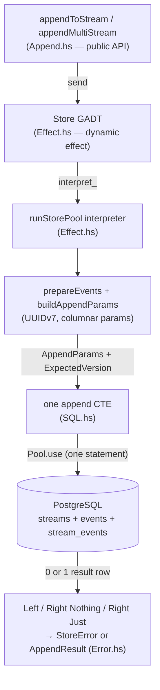

This walkthrough reads kiroku's **real append source** to teach how a write actually lands. We follow
one idea the whole way: an append is a **`Store` effect** interpreted against PostgreSQL, and the
interpreter turns each append into a **single SQL statement**. That single statement — a CTE — is
where atomicity, optimistic concurrency, and the dual-write into the global `$all` sequence all
happen at once. Holding "one append = one statement" in mind explains almost every design choice
below.

<Callout type="info">
  This is an ordered walkthrough and is **separate from the [Subscription
  Walkthrough](/docs/kiroku/walkthrough)** — they share no code on the page. It assumes you have met
  appends from the user's point of view in [Append-only
  log](/docs/kiroku/explanation/append-only-log) and [Optimistic
  concurrency](/docs/kiroku/explanation/optimistic-concurrency); here we read the code that
  implements them.
</Callout>

## The modules we will read

All paths are under `kiroku-store/src/Kiroku/Store/`:

```text
Append.hs          -- the public API: appendToStream / appendMultiStream (thin `send`s)
Effect.hs          -- the Store GADT + the PostgreSQL interpreter (the real work)
Types.hs           -- the vocabulary: ExpectedVersion, EventData, AppendResult, positions
SQL.hs             -- the four append CTEs and their encoders/decoders
Error.hs           -- mapping a SQL outcome (empty result / SQLSTATE) to a typed StoreError
Transaction.hs     -- composing an append with caller SQL in one ACID transaction (the keiro seam)
```

## The shape of the design



Two divisions are worth fixing in your mind before we start, because the rest of the walkthrough leans
on them:

1. **Effect vs. interpreter.** `appendToStream` does nothing but `send` a constructor of the `Store`
   effect. The behaviour lives entirely in the interpreter (`runStorePool`). This is what makes the
   store **mockable** — a test interpreter can answer the same constructors from in-memory state — and
   keeps application code free of `IO` and SQL.
2. **Haskell prepares, PostgreSQL decides.** The interpreter generates ids and packs parameters, but
   it makes **no concurrency decision** itself. Whether an append is allowed to land — the optimistic
   version check — is evaluated inside the one SQL statement, under a row lock the database holds.
   Haskell only _classifies_ the outcome afterward.

## The optimistic-concurrency contract, in one preview

Every append carries an `ExpectedVersion` precondition. There are exactly four, and the interpreter
dispatches to one of four SQL statements on it:

```haskell
-- Kiroku.Store.Types
data ExpectedVersion
  = NoStream              -- the stream must not exist yet (aggregate creation)
  | StreamExists          -- the stream must exist; its version doesn't matter
  | ExactVersion !StreamVersion  -- the stream's version must equal this (the classic OCC check)
  | AnyVersion            -- create-or-append; no version check
```

`ExactVersion` is the one that makes event sourcing safe: you read a stream to version `v`, decide,
and append "only if still at `v`." If a concurrent writer moved it, your append writes nothing and you
get `WrongExpectedVersion`. [Part 02](/docs/kiroku/write-path/02-the-append-cte) shows the SQL that
enforces this; [part 03](/docs/kiroku/write-path/03-outcomes-and-errors) shows how the empty result
becomes that typed error.

## Where to go

- [01 — The Store effect & append API](/docs/kiroku/write-path/01-the-store-effect-and-append-api):
  the `Store` GADT, the four preconditions, and how events are prepared into SQL parameters.
- [02 — The append CTE](/docs/kiroku/write-path/02-the-append-cte): the single statement that checks
  the version, writes the events, and dual-writes `$all` atomically.
- [03 — Outcomes & errors](/docs/kiroku/write-path/03-outcomes-and-errors): how `0 rows` and a
  `SQLSTATE` become a typed `StoreError`, and how idempotent retries work.
- [04 — Multi-stream & transactions](/docs/kiroku/write-path/04-multi-stream-and-transactions): the
  deadlock-free multi-stream append and the atomic append+projection wrapper.
