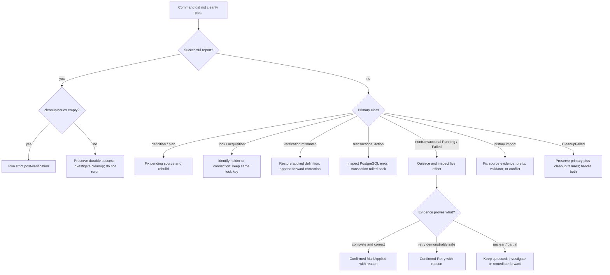

Preserve JSON, release identity, database, role, logs, and timestamps before following the tree.

After any correction or repair, use a fresh connection for status and strict verification. A schema
or application invariant check may be needed in addition to ledger verification.

Never edit ledger rows, replace a stored checksum, change the lock key to bypass a holder, automatically
retry ambiguous SQL, or adopt an existing native row with a later history import.

See [Troubleshoot a migration failure](/docs/pg-migrate/how-to/troubleshoot-a-migration-failure) for
the structured error classes.
