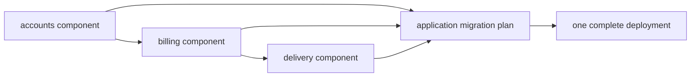

Database migrations often arrive from several libraries that share one service database. A flat
global filename sequence makes every library coordinate names and order with every other library.
pg-migrate separates those concerns.

## The ownership split

A `MigrationComponent` belongs to the library that owns its schema. It contains a stable component
name, an ordered non-empty local history, and dependencies on other component names. Its identities
are component-local, such as `accounts/0001-create-accounts` and
`billing/0001-create-invoices`.

The application owns the `MigrationPlan`. It selects the concrete component set, validates every
dependency, and commits to one cross-component order:

The application is the only layer that can know whether those libraries share a database and which
versions are present in the release artifact. That is why a library exports its component, never a
function that connects and runs it independently.

## Explicit order is a review surface

`migrationPlan` accepts an explicit dependency-ordered list and rejects a dependency placed after
its consumer. This makes release order visible in code review. `resolveMigrationPlan` computes a
stable topological order when the application prefers dependency-driven resolution. Both reject
missing dependencies, duplicates, and cycles.

Dependencies order whole components; they do not create a partial-plan execution feature. Within a
component, existing migrations remain an immutable prefix and new work appends at the end. Across
components, the resolved plan is the unit that `up` verifies and advances.

## Names become durable history

The component name is part of every ledger identity. Renaming an already released component is not a
cosmetic refactor: it makes old rows foreign to the new plan. Removing a component has the same
effect. Preserve released names and append forward migrations when ownership evolves.

This boundary also makes independent packaging possible. A library embeds exact SQL bytes into its
component and ships them in the binary; the application composes those values without reading the
library's source tree at runtime.

## Trade-offs

The model requires the application to enumerate its database-owning libraries and resolve dependency
cycles deliberately. In exchange, each library gets a local namespace, the release artifact carries
the exact reviewed plan, and no dependency can silently migrate the database during initialization.

See [Export a library component](/docs/pg-migrate/how-to/export-a-library-component) and [Compose
multiple components](/docs/pg-migrate/how-to/compose-multiple-components).
