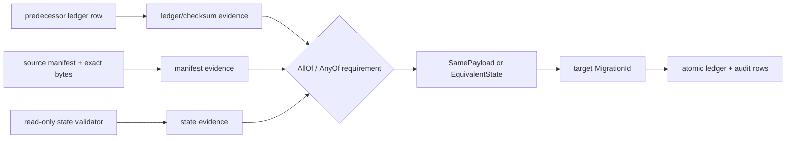

History import must claim that a target migration is already represented in the database without
executing its action. That claim is safe only when the source fact, target identity, payload relation,
and operator reason remain inspectable later.

## Evidence is a graph, not a boolean

Each `ImportEvidence` has a stable key, source identity, optional timestamp, strength, optional
payload checksum, and adapter-specific JSON details. A mapping points to one target `MigrationId` and
declares a requirement expression:

`AllOf` requires every branch. `AnyOf` allows one independently sufficient path, but the selected
path must not be ambiguous. The resolved satisfying evidence is serialized into the audit so a later
review can reconstruct why the mapping passed.

## Payload relation is an explicit claim

`SamePayload key` requires evidence strong enough to establish source bytes, a payload checksum, and
an exact SHA-256 match with the target SQL. It cannot map a Haskell migration because there is no SQL
payload equivalence to prove.

`EquivalentState` says the source and target payloads may differ but the database already satisfies
the target's intended state. That stronger semantic claim requires at least one `StateValidator` in
the evidence requirement. Validators run inside the target lock in read-only transactions and return
structured JSON details or a diagnostic. Equivalent history is rejected unless the operator opts in
with `AllowEquivalentHistory`.

The evidence strengths—ledger only, source manifest verified, source ledger checksum verified, and
state verified—are not interchangeable. Adapters use the strongest fact their predecessor can
actually prove rather than upgrading a timestamp or filename into payload evidence.

## Prefixes prevent selective adoption

Mappings must cover positions 1 through N without gaps for every affected component. Existing target
rows do not fill gaps in the mapping set. The rule forces the cutover artifact to explain the entire
legacy prefix instead of adopting isolated rows.

Import must also occur before native apply for that component. A native ledger row has no matching
source audit; a later import conflicts even if metadata happens to match.

## The target write is one fact

After target-plan verification and state validation, the importer writes each applied migration row
and corresponding `history_imports` audit row in one PostgreSQL transaction under the normal target
advisory lock. Target migration actions never run.

An identical second import is idempotent only when source identifier, non-empty reason, resolved
target metadata, mapping, and complete evidence JSON match. Any change is `HistoryImportConflict`,
not an update. This makes audit rows append-only evidence rather than mutable annotations.

See [Import generic migration history](/docs/pg-migrate/how-to/import-generic-history).
