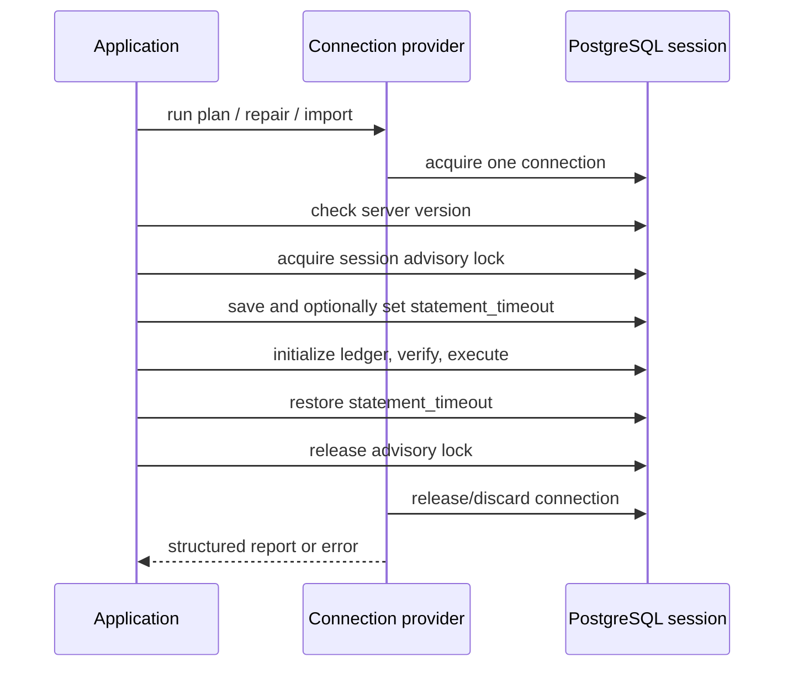

PostgreSQL advisory locks and `statement_timeout` are session state. If a runner checked out a
different pool connection for each statement, its lock and timeout would protect the wrong session.
pg-migrate therefore brackets one dedicated connection for the whole operation.

## The provider contract

`ConnectionProvider` contains a rank-2 bracket: the application supplies a callback that receives
one `Hasql.Connection.Connection`, and the provider keeps it checked out until the callback returns.
`connectionProviderFromSettings` opens a concrete dedicated connection. A pool integration is valid
only when its bracket holds one checkout across the complete callback.

The session lock serializes plan execution, repair, and generic import that use the same ledger
configuration. The runner checks the PostgreSQL major, acquires according to `LockWait`, initializes
or validates ledger schema v1, validates history, and only then mutates in order.

Read-only `status` and `verify` also use one provider connection but do not acquire the migration
advisory lock or initialize the ledger. They are observations, not serialization points.

## Cleanup preserves outcome ordering

The runner attempts timeout restoration and unlock on ordinary success, primary failure, event
callback failure, and asynchronous interruption. Cleanup is downstream of the durable primary
outcome:

- cleanup trouble after success appears in the successful report's `cleanupIssues`;
- cleanup trouble after a primary failure becomes `CleanupFailed primary issues`; and
- asynchronous interruption is rethrown only after cleanup is attempted.

That ordering prevents an unlock error from erasing the fact that SQL and its ledger evidence have
already committed. It also prevents a primary execution error from disappearing behind cleanup
noise.

## Operational consequence

Changing the lock key to escape contention creates a second serialization domain and is unsafe when
both operations touch the same ledger/database. Identify the holder instead. Likewise, a statement
timeout limits waiting or execution time but cannot add atomicity to a nontransactional statement.

See [Configure locks and timeouts](/docs/pg-migrate/how-to/configure-locks-and-timeouts) and [Handle
cleanup issues](/docs/pg-migrate/how-to/handle-cleanup-issues).
