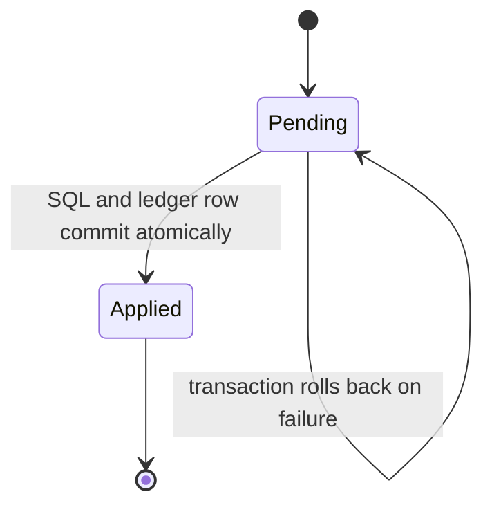
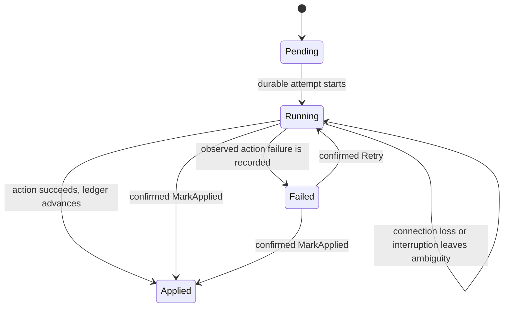

Most migration SQL should run transactionally. Some PostgreSQL operations—such as creating an index
concurrently—cannot run inside a transaction block. pg-migrate gives the two modes different durable
state machines instead of pretending they have the same failure semantics.

## Transactional migration

The runner executes transactional SQL and writes its `Applied` ledger row in the same PostgreSQL
transaction. A failure or condemned transaction rolls both back. Transactional rows therefore never
persist as `Running` or `Failed`.

`transactionMigration` provides the same boundary for a typed `Hasql.Transaction.Transaction ()`
action with an explicit immutable fingerprint.

## Nontransactional migration

A nontransactional SQL file uses the leading `-- pg-migrate: no-transaction` directive and must
contain exactly one statement. The runner records `Running` before execution. An observed failure is
recorded as `Failed`; connection loss or cancellation can leave `Running`. Either state says that
the ledger cannot prove the database effect, not that the effect is absent.

`sessionMigration` supports a typed `Hasql.Session.Session ()` action with an explicit fingerprint.
The action is still restricted to database session work: the public migration constructors do not
accept arbitrary `IO`, so external side effects cannot be replayed or repaired under a misleading
database ledger state.

## Repair is a separate audited transition

Only a declared nontransactional row in `Running` or `Failed` can be repaired. `MarkApplied` is valid
after independent evidence proves the complete intended effect. `Retry` is valid only after evidence
proves repetition safe. Both require confirmation and a non-empty reason, validate the active plan,
and append a repair audit row.

Automatic retry would collapse “absent,” “partial,” and “complete but unrecorded” into one guess.
The explicit state machine keeps that uncertainty visible until an operator resolves it with
evidence.

See [Repair a nontransactional
migration](/docs/pg-migrate/how-to/repair-a-nontransactional-migration).
