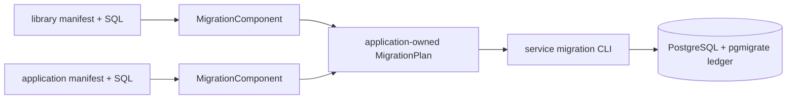

**pg-migrate** is a six-package Haskell family for immutable, forward-only PostgreSQL migrations.
A library embeds its ordered SQL at compile time and exports a `MigrationComponent`; the final
application composes every component into one validated `MigrationPlan`, mounts the reusable CLI,
and ships that exact plan with its release artifact.

This split gives every migration a component-local durable identity such as
`accounts/0001-create-accounts`. It also prevents an independently installed executable from
discovering a different plan at runtime: production SQL bytes, checksums, transaction modes, and
order are already embedded in the application artifact.

The current documentation reviews pg-migrate `1.1.0.0`. Its stable compatibility contracts are
independent: public package APIs, ledger schema v1, manifest format v1, and JSON schema v1.

<Callout type="warn">
  pg-migrate is deliberately forward-only. Never edit applied SQL or ledger rows, bypass a checksum,
  or automatically retry an ambiguous nontransactional migration. Append a corrective migration or
  follow the evidence-backed repair/import runbook.
</Callout>

<Cards>
  <Card title="Tutorials" href="/docs/pg-migrate/tutorials" description="Build, inspect, apply, verify, rerun, and extend your first embedded migration plan." />
  <Card title="How-To Guides" href="/docs/pg-migrate/how-to" description="Author manifests and components, compose plans, mount the CLI, test, deploy, recover, and import history." />
  <Card title="Reference" href="/docs/pg-migrate/reference" description="Package map, public APIs, manifest/ledger/JSON contracts, errors, reports, and compatibility." />
  <Card title="Explanation" href="/docs/pg-migrate/explanation" description="Why component ownership, a dedicated locked connection, strict history, and forward-only recovery fit together." />
</Cards>
