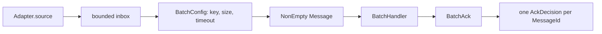

shibuya is a processor framework, not a queue. It gives every backend the same internal shape so the
runner can supervise work without knowing how pgmq, Kafka, kiroku, or Message DB acknowledge
messages.

The single-message shape is:

```text
Adapter.source -> Ingested -> bounded inbox -> Message -> Handler -> AckDecision -> AckHandle.finalize
```

The adapter converts backend messages into `Ingested es msg`. `Ingested` has three fields:
`envelope`, `ack`, and `lease`. The runner projects it to `Message es msg` before calling a
handler, so application code sees `envelope` and `lease` but cannot call the backend finalizer.

`envelope` is the normalized metadata plus payload. It carries a stable `MessageId`, optional
`Cursor`, optional partition key, enqueue time, trace context, raw broker headers, optional
zero-indexed `Attempt`, OpenTelemetry attributes supplied by the adapter, and `payload`.

`ack` is the backend's mechanical finalizer. The runner calls `finalize` after the handler returns
or throws. Application handlers do not call it directly.

`lease` is optional temporary ownership. Queues with visibility timeouts can expose a `Lease` whose
`leaseExtend` action pushes the deadline forward for long-running work. Backends without visibility
leases set it to `Nothing`.

The batch shape keeps the same adapter and finalization boundary, but accumulates by `BatchKey`
before invoking a `BatchHandler`:



The runner adds mechanics around those values: bounded inboxes for backpressure, Streamly traversal
for serial or parallel execution, keyed partition scheduling, NQE supervision for child processors,
metrics stored in hot counters plus TVars, and OpenTelemetry spans around handler invocation.
