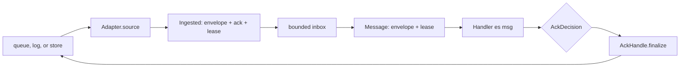

shibuya (渋谷) is the runtime layer that keeps queue work moving. It runs one or more named
processors, each processor reads from an **adapter**, hands each **ingested** message to a
`Handler` as a read-only `Message`, and finalizes the backend message with the handler's explicit
`AckDecision`.

The core package, `shibuya-core`, deliberately separates intent from mechanics. Handlers return
`AckOk`, `AckRetry`, `AckDeadLetter`, or `AckHalt`; adapters own how those decisions become broker
commits, visibility changes, dead-letter writes, or shutdowns. The runner owns the bounded inbox,
supervision, ordering policy, concurrency policy, first-class batching, graceful shutdown, and trace
spans around handler execution.

<Callout type="warn">
  **Breaking API changes:** current docs describe the 0.8 core API. New
  application code should import `Shibuya`, not `Shibuya.Core` or
  `Shibuya.App`. Handlers receive `Message`, not `Ingested`; public runners use
  `AppConfig`; batching is first-class; and adapter finalizers must tolerate
  repeated calls with the same `AckDecision`. The PGMQ and Kafka adapter pages
  document their 0.11/0.8 breaking changes separately.
</Callout>

Use shibuya directly for background workers and queue consumers, or through adapters that connect it
to the rest of the runtime family:
[shibuya ⇄ kiroku](/docs/integrations/shibuya-kiroku-adapter) for event-store subscriptions,
[shibuya ⇄ pgmq](/docs/integrations/shibuya-pgmq-adapter) for PostgreSQL queues, and the Kafka and
Message DB adapters documented in the [adapter comparison](/docs/integrations/shibuya-adapters).

## The processing shape

The `Envelope` carries `messageId`, optional cursor, partition, enqueue time, trace context,
headers, delivery attempt, adapter-supplied trace attributes, and the payload. The `Ingested` value
adds the backend-provided `AckHandle`; handlers see the projected `Message`, which omits the ack
handle so finalization remains framework-owned.

## Where to start

<Cards>
  <Card title="Tutorials" href="/docs/shibuya/tutorials" description="Build a first worker, return each ack decision, and test with the mock adapter." />
  <Card title="How-To Guides" href="/docs/shibuya/how-to" description="Choose runner policy, write handlers, retry with backoff, handle dead letters, and test adapters." />
  <Card title="Reference" href="/docs/shibuya/reference" description="Exact API facts for envelopes, adapters, handlers, policies, runners, retry helpers, and stream utilities." />
  <Card title="Explanation" href="/docs/shibuya/explanation" description="Why shibuya splits adapters, handlers, ack decisions, backpressure, ordering, and concurrency." />
  <Card title="Cookbook" href="/docs/shibuya/cookbook" description="Short operational recipes. Metrics and production recipes are expanded in the operations plan." />
  <Card title="Code Walkthrough" href="/docs/shibuya/walkthrough" description="An ordered tour through the real shibuya-core source." />
</Cards>

## Core vocabulary

An **adapter** is a backend bridge. It exposes a Streamly stream of `Ingested es msg` values and a
`shutdown` action. It does not run handlers.

An **envelope** is the normalized message container inside `Ingested` and `Message`. It is where adapter metadata
becomes portable across pgmq, Kafka, kiroku, Message DB, or a test adapter.

An **ack decision** is the handler's semantic outcome. `AckOk` means success, `AckRetry delay` means
try again later, `AckDeadLetter reason` means stop retrying this message, and `AckHalt reason` means
stop the processor because continuing would be unsafe.

A **runner** is the supervised machinery that reads from adapters into bounded inboxes, applies
ordering and concurrency policy, invokes handlers, finalizes ack decisions, and exposes metrics.

A **batching processor** groups messages by `BatchKey`, emits batches by size, timeout, or flush,
and resolves a `BatchAck` into one final `AckDecision` per retained message.
