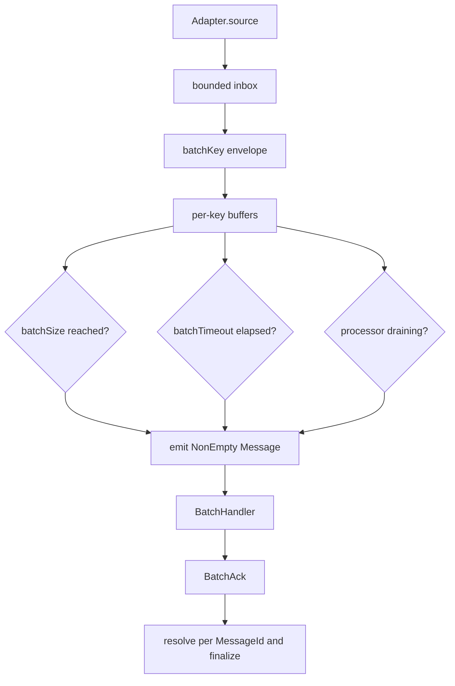

`Shibuya.Batch` is the public API for first-class batch processors. The runtime accumulation engine
and scheduler are internal; application code opts in by building a `BatchingProcessor` with
`mkBatchProcessor` or the `BatchingProcessor` constructor exported by `Shibuya.App`.

## Batch config

```haskell
newtype BatchKey = BatchKey { unBatchKey :: Text }

defaultBatchKey :: BatchKey

data BatchConfig es msg = BatchConfig
  { batchSize :: Int
  , batchTimeout :: NominalDiffTime
  , batchKey :: Envelope msg -> BatchKey
  , tickInterval :: Maybe NominalDiffTime
  }

defaultBatchConfig :: BatchConfig es msg

validateBatchConfig :: BatchConfig es msg -> Either BatchConfigError ()
```

`batchSize` emits a batch once a key has enough messages. `batchTimeout` emits a partial batch after
the first message for that key has waited long enough. `batchKey` lets one processor maintain
independent sub-batches, and `tickInterval` controls timeout scan granularity. When `tickInterval`
is `Nothing`, the ticker uses `batchTimeout`.

`defaultBatchConfig` batches at most `100` messages, flushes after `1` second, uses one
`defaultBatchKey`, and uses the timeout as the tick interval.

## Batch handler

```haskell
data BatchTrigger
  = TriggerSize
  | TriggerTimeout
  | TriggerFlush

data BatchInfo = BatchInfo
  { batchKey :: BatchKey
  , size :: Int
  , trigger :: BatchTrigger
  , partition :: Maybe Text
  }

type BatchHandler es msg =
  BatchInfo -> NonEmpty (Message es msg) -> Eff es BatchAck
```

A batch handler receives a non-empty batch of handler-facing `Message` values. `BatchInfo` records
the shared key, batch size, emission trigger, and the first message partition if present.



## Batch ack

```haskell
data BatchAck = BatchAck
  { decisions :: Map MessageId AckDecision
  , fallback :: AckDecision
  }

ackAllOk :: BatchAck
ackAll :: AckDecision -> BatchAck
ackExcept :: [(MessageId, AckDecision)] -> BatchAck
withFallback :: AckDecision -> [(MessageId, AckDecision)] -> BatchAck
failMessages :: [(MessageId, DeadLetterReason)] -> BatchAck
```

The runtime resolves exactly one `AckDecision` for every retained message in the emitted batch. It
looks up the message id in `decisions`; absent ids use `fallback`. This makes missing, reordered, or
extra handler results deterministic as long as message ids are unique within the batch.

## Policy constraints

Batch configs are validated before processors start. `batchSize` must be at least `1`,
`batchTimeout` must be positive, and `tickInterval` must be positive when present.

`StrictInOrder` still requires `Serial`. `PartitionedInOrder` with `Ahead _` or `Async _` is
supported only for single-message processors; batching processors schedule by `BatchKey`, so
`runApp` rejects that combination for `BatchingProcessor`.
