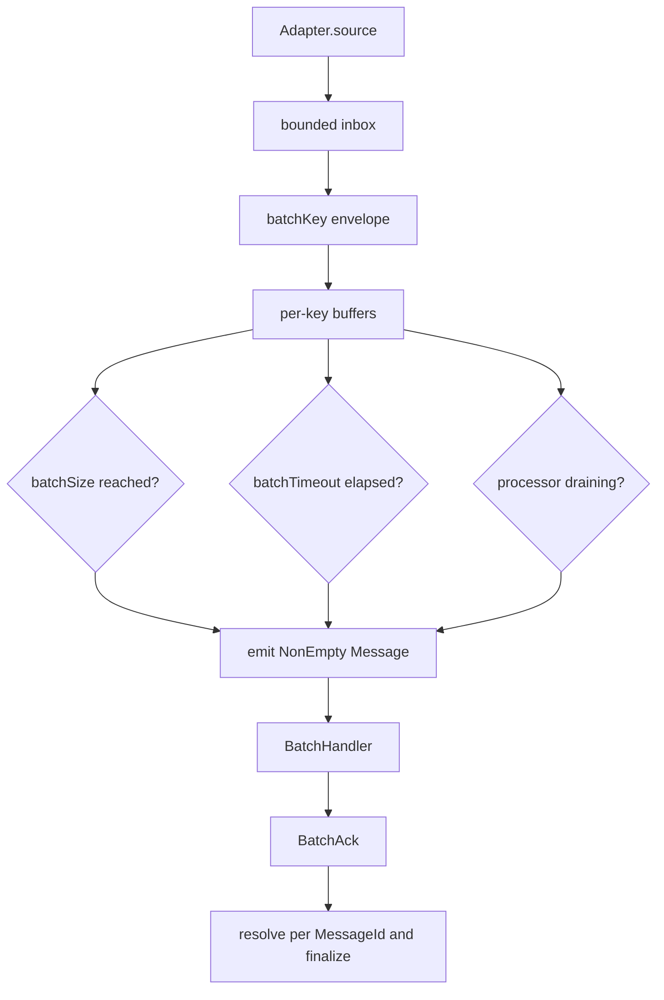

`Shibuya.Batch` is the public API for first-class batch processors. The runtime accumulation engine
and scheduler are internal; application code opts in by building a `BatchingProcessor` with
`mkBatchProcessor` or the `BatchingProcessor` constructor exported by the top-level `Shibuya`
module.

## Batch config

```haskell
newtype BatchKey = BatchKey { unBatchKey :: Text }

defaultBatchKey :: BatchKey

data BatchConfig es msg = BatchConfig
  { batchSize :: Int
  , batchTimeout :: NominalDiffTime
  , batchKey :: Envelope msg -> BatchKey
  , tickInterval :: Maybe NominalDiffTime
  }

defaultBatchConfig :: BatchConfig es msg

validateBatchConfig :: BatchConfig es msg -> Either BatchConfigError ()
```

`batchSize` emits a batch once a key has enough messages. `batchTimeout` emits a partial batch after
the first message for that key has waited long enough. `batchKey` lets one processor maintain
independent sub-batches, and `tickInterval` controls timeout scan granularity. When `tickInterval`
is `Nothing`, the ticker uses `batchTimeout`.

`defaultBatchConfig` batches at most `100` messages, flushes after `1` second, uses one
`defaultBatchKey`, and uses the timeout as the tick interval.

The timeline shows each trigger for two keys, with `batchSize = 3` and the default one-second
`batchTimeout`.

<Diagram
  src="shibuya/batch-trigger-timeline"
  alt="Two lanes for BatchKey a and BatchKey b on a time axis. The batch size is 3 and batchTimeout is 1 second. Key a receives three messages and emits a batch with TriggerSize. Key b receives two messages and emits them with TriggerTimeout after its first message waited batchTimeout. Key a receives one more message and emits it with TriggerFlush when the processor starts draining."
  caption="Size, timeout, and flush apply to each key separately. The timeout starts at the first message for that key."
/>

## Batch handler

```haskell
data BatchTrigger
  = TriggerSize
  | TriggerTimeout
  | TriggerFlush

data BatchInfo = BatchInfo
  { batchKey :: BatchKey
  , size :: Int
  , trigger :: BatchTrigger
  , partition :: Maybe Text
  }

type BatchHandler es msg =
  BatchInfo -> NonEmpty (Message es msg) -> Eff es BatchAck
```

A batch handler receives a non-empty batch of handler-facing `Message` values. `BatchInfo` records
the shared key, batch size, emission trigger, and the first message partition if present.


```mermaid
flowchart TD
  Source["Adapter.source"] --> Inbox["bounded inbox"]
  Inbox --> Key["batchKey envelope"]
  Key --> Buffers["per-key buffers"]
  Buffers --> Size{"batchSize reached?"}
  Buffers --> Timeout{"batchTimeout elapsed?"}
  Buffers --> Flush{"processor draining?"}
  Size --> Emit["emit NonEmpty Message"]
  Timeout --> Emit
  Flush --> Emit
  Emit --> Handler["BatchHandler"]
  Handler --> Ack["BatchAck"]
  Ack --> Finalize["resolve per MessageId and finalize"]
```

## Batch ack

```haskell
data BatchAck = BatchAck
  { decisions :: Map MessageId AckDecision
  , fallback :: AckDecision
  }

ackAllOk :: BatchAck
ackAll :: AckDecision -> BatchAck
ackExcept :: [(MessageId, AckDecision)] -> BatchAck
withFallback :: AckDecision -> [(MessageId, AckDecision)] -> BatchAck
failMessages :: [(MessageId, DeadLetterReason)] -> BatchAck
```

The runtime resolves exactly one `AckDecision` for every retained message in the emitted batch. It
looks up the message id in `decisions`; absent ids use `fallback`. This makes missing, reordered, or
extra handler results deterministic as long as message ids are unique within the batch.

The diagram resolves one example `BatchAck`.

<Diagram
  src="shibuya/batch-ack-resolution"
  alt="A BatchAck has decisions for m2, m4, and m9, and a fallback of AckOk. The retained batch is m1 to m4. m1 and m3 use the fallback AckOk. m2 uses AckRetry from decisions. m4 uses AckDeadLetter from decisions. m9 is not in the batch, so its entry is not used."
  caption="The retained batch decides which messages get a decision. The BatchAck only supplies the values."
/>

## Policy constraints

Batch configs are validated before processors start. `batchSize` must be at least `1`,
`batchTimeout` must be positive, and `tickInterval` must be positive when present.

`StrictInOrder` still requires `Serial`. `PartitionedInOrder` with `Ahead _` or `Async _` is
supported only for single-message processors; batching processors schedule by `BatchKey`, so
`runApp` rejects that combination for `BatchingProcessor`.
