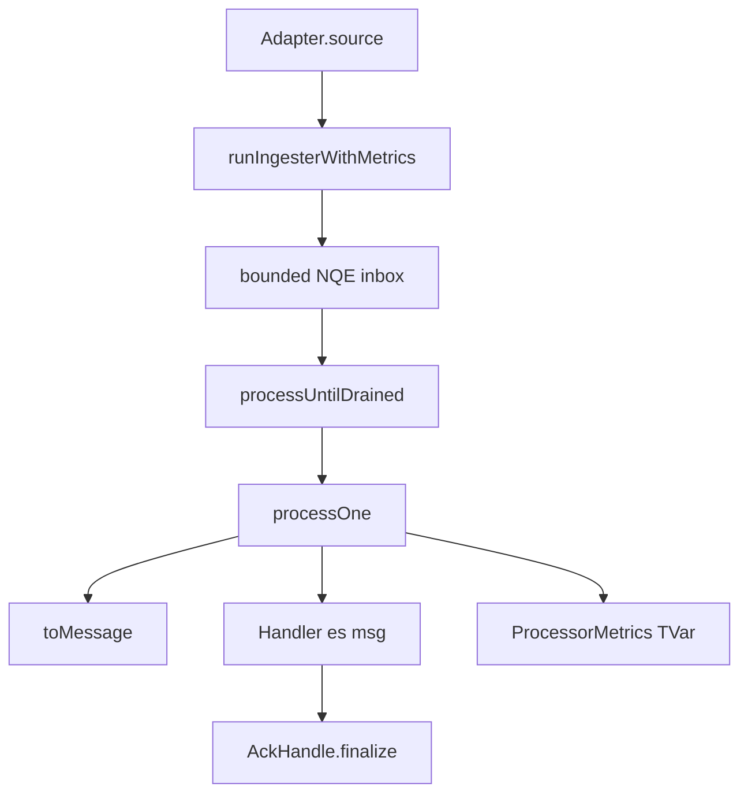

This tour follows one message through `shibuya-core`. Read the chapters in order; later chapters
assume the vocabulary from earlier chapters.

```text
shibuya-core/src/Shibuya/Core/Types.hs       -- MessageId, Cursor, Attempt, Envelope
shibuya-core/src/Shibuya/Core/Ingested.hs    -- Ingested and handler-facing Message
shibuya-core/src/Shibuya/Adapter.hs          -- Adapter.source and shutdown
shibuya-core/src/Shibuya/Internal/Runner/Ingester.hs -- stream to bounded inbox
shibuya-core/src/Shibuya/Internal/Runner/Supervised.hs -- processOne and concurrency
shibuya-core/src/Shibuya/Internal/Runner/Batcher.hs -- keyed batch accumulation
shibuya-core/src/Shibuya/App.hs              -- runApp, QueueProcessor, graceful stop
shibuya-core/src/Shibuya/Internal/Runner/Master.hs -- metrics registry and supervisor handle
```

The key boundary is split in two. Adapters emit `Ingested es msg`, which contains the normalized
`Envelope`, backend `AckHandle`, and optional visibility `Lease`. Handlers receive `Message es msg`,
the read-only projection with envelope and lease but no finalizer. Everything else is runner
mechanics around that boundary.



The application-facing entry point is `Shibuya.runApp`, but the message path is easiest to
understand from the core types upward.
