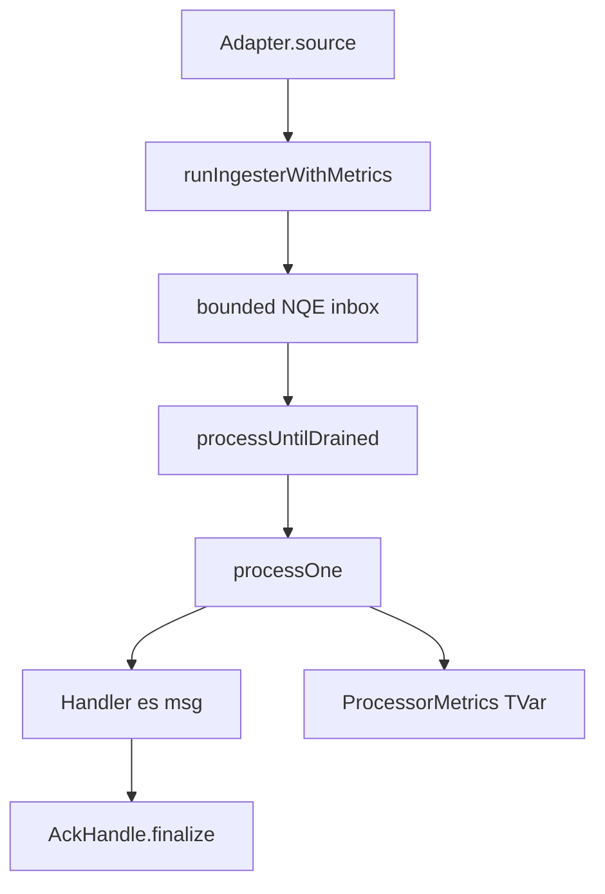

This tour follows one message through `shibuya-core`. Read the chapters in order; later chapters
assume the vocabulary from earlier chapters.

```text
shibuya-core/src/Shibuya/Core/Types.hs       -- MessageId, Cursor, Attempt, Envelope
shibuya-core/src/Shibuya/Core/Ingested.hs    -- Ingested = envelope + ack + lease
shibuya-core/src/Shibuya/Adapter.hs          -- Adapter.source and shutdown
shibuya-core/src/Shibuya/Runner/Ingester.hs  -- stream to bounded inbox
shibuya-core/src/Shibuya/Runner/Supervised.hs -- processOne and concurrency
shibuya-core/src/Shibuya/App.hs              -- runApp, QueueProcessor, graceful stop
shibuya-core/src/Shibuya/Runner/Master.hs    -- metrics registry and supervisor handle
```

The key invariant is that exactly one value flows through the worker: `Ingested es msg`. It already
contains the normalized `Envelope`, the backend `AckHandle`, and the optional visibility `Lease`.
Everything else is runner mechanics around that value.



The application-facing entry point is `Shibuya.App.runApp`, but the message path is easiest to
understand from the core types upward.
