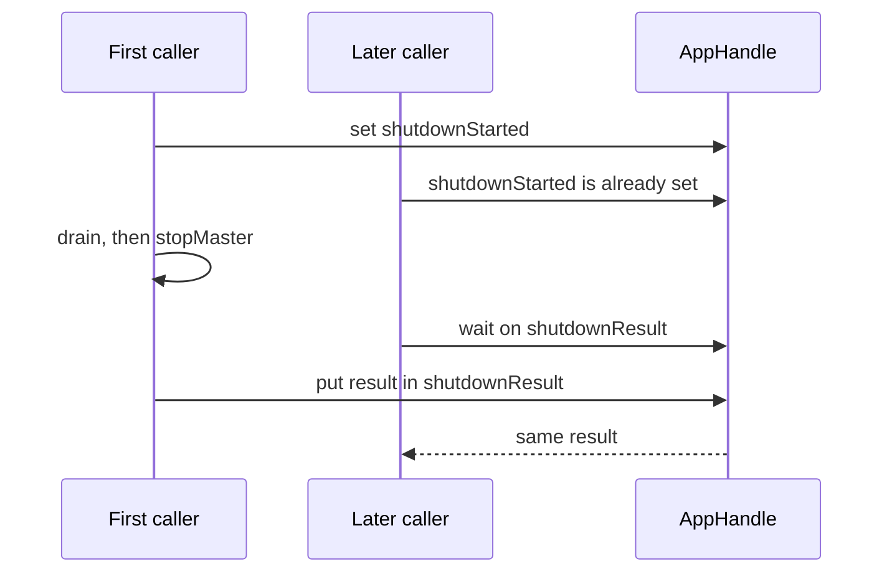

`runApp` from the top-level `Shibuya` module is the application entry point:

```haskell
runApp ::
  (IOE :> es, Tracing :> es) =>
  AppConfig ->
  [(ProcessorId, QueueProcessor es)] ->
  Eff es (Either AppError (AppHandle es))
```

It validates `AppConfig`, every `QueueProcessor` policy, and every batch config first. If validation
passes, it starts a `Master`, spawns each processor with the internal supervised runner, and returns
an `AppHandle`.

The `Master` in `Shibuya.Internal.Runner.Master` owns the NQE supervisor and the processor metrics
registry. Public modules keep `Master` opaque; use `getAppMaster`, `getAppMetrics`, and the metrics
server helpers instead of record fields.

The internal supervised runner creates metrics and done state, registers with the master, then adds
the processor body as a supervised child. It catches `ProcessorHalt` so a handler's intentional halt
is not treated as an unexpected exception by that child.

## Shutdown ownership

`stopAppGracefully` masks the ownership transfer and atomically elects one leader.
The leader runs the stop operation and places its result in a shared TMVar.
Later callers wait for that same result rather than shutting adapters down again.

The sequence shows two concurrent stop calls:



```text
1. mark the master and configured processors as draining
2. try adapter shutdowns; collect synchronous failures
3. if shutdowns succeed, wait for processors up to drainTimeout
4. bound steps 1–3 by totalShutdownTimeout
5. always attempt stopMaster, then publish the result or exception
```

The default drain limit is 30 seconds and the graceful-phase limit is 60 seconds.
Timeout returns `False` after cleanup. A clean drain returns `True`; shutdown or cleanup failures
can throw. Master cleanup lies outside the graceful-phase timeout.

`waitApp` waits until each processor's `done` TVar is true. It does not initiate shutdown.
Use it for finite streams or for programs whose separate shutdown handler owns the stop.

## Retained lifecycle

The master retains configured processor lifecycle independently of the live metrics registry.
A terminal failed processor remains visible to readiness after unregistering. Failed finalization
wakes idle intake and exits as `ProcessorFailure`, while `AckHalt` is a deliberate graceful exit.
`IgnoreFailures` keeps siblings running; `StopAllOnFailure` stops siblings and propagates one failure
to the caller. The supervisor itself is not caller-linked.

## Forced-stop observation

Source cleanup attempts cancellation after timeout. The published release nevertheless has a
reported asynchronous-handler case that finalizes after stop returns. Treat `False` as incomplete
drain, and fence or terminate the old process before replacement. Read the
[shutdown runbook](/docs/shibuya/how-to/configure-graceful-shutdown#verify-the-replacement-boundary).

Startup also rejects duplicate processor IDs before acquiring resources. A masked ownership ledger
tracks acquired processor resources; if a later acquisition fails, cleanup attempts cover earlier
resources and preserve the primary construction exception.
