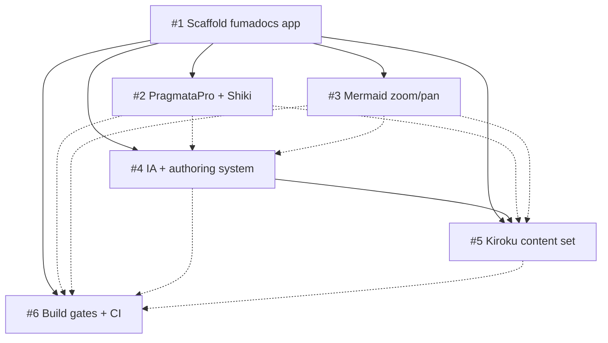

# Keiro Runtime Docs Infrastructure and Kiroku Foundation

> Stand up a unified fumadocs documentation site for the keiro runtime, then fill it with the kiroku foundation library's docs.

<!--
FORMATTING NOTE: Every fenced code block must declare a language tag.
Use ```mermaid for diagrams, ```text for plaintext/trees/ASCII, ```bash for
shell, ```ts for TypeScript. Never use a bare ``` fence.
-->

## Vision & Scope

The end state is a single, polished documentation website that covers the
**keiro runtime** — a family of four **Haskell** libraries. The docs *site* is
a TypeScript / Next.js application built on **fumadocs**; the *code* being
documented is Haskell. Two languages, one project: the application is TS, the
subject matter is Haskell.

The four libraries the site will eventually document:

- **kiroku** — a PostgreSQL-backed **event store** and persistence foundation.
  Append-only event storage, optimistic concurrency, streams, subscriptions,
  snapshots. This is the bottom layer everything else builds on.
- **keiro** — the **integration framework** layered on top of kiroku. Wires the
  event store into application-level command handling and workflows. (Namesake
  of the family.)
- **keiki** — a **pure transducer core**. Composable, IO-free stream and
  transducer composition with algebraic laws.
- **shibuya** — **Broadway-style queue processing**. Concurrent message/job
  pipelines with backpressure, batching, and rate limiting.

Success for *this* master plan means the site exists, looks beautiful, and is
fully populated for the **foundation layer (kiroku)** — the natural starting
point because it is the layer everything else depends on and because it already
has substantial existing documentation to port.

What makes this site distinctive are three greenfield customizations:

- **PragmataPro ligature code blocks** — code rendered in PragmataPro with
  programming ligatures enabled.
- **Haskell-aware Shiki highlighting** — syntax highlighting that understands
  Haskell.
- **Beautiful zoomable Mermaid diagrams** — interactive pan/zoom diagrams for
  event flow, stream organization, and pipeline topology.

The site supports a broad set of document types, organized per library along
Diátaxis lines: **tutorials**, **how-tos**, **explanations**, **references**,
**FAQs**, **code walkthroughs**, **cookbooks**, and **theory explainers**.

### In scope (this master plan)

- The full documentation **infrastructure**: scaffold, fonts/Shiki, Mermaid,
  information architecture + authoring system, and CI quality gates.
- The complete **kiroku** content set ported into the new site.

### Out of scope (future master plans)

- Full content for **keiro**, **keiki**, and **shibuya** — each gets its own
  content master plan once the infrastructure proves itself on kiroku.
- **Choosing a deployment host** — explicitly deferred. This plan targets local
  development plus CI; the production host decision comes later.

## Decomposition Strategy

The work splits into **six child ExecPlans (A–F, numbered #1–#6)** organized
into **four phases**. The grouping is by **functional concern**: each child plan
owns one coherent capability of the documentation system, and the phases order
those capabilities by dependency.

- **Phase 1 — Scaffold:** stand up the app (#1). Nothing can exist without it.
- **Phase 2 — Authoring primitives:** the rendering and quality machinery that
  attaches directly to the bare scaffold — PragmataPro/Shiki (#2), Mermaid (#3),
  and CI (#6). These only need the scaffold to exist and can proceed in
  parallel.
- **Phase 3 — Information architecture:** the authoring system and content tree
  structure (#4), which is best designed once the primitives that content will
  rely on are in place.
- **Phase 4 — Content:** the kiroku documentation set (#5), which fills the
  structure with real, beautifully rendered Haskell content.

This ordering means the **critical path is #1 → #4 → #5**: scaffold, then IA,
then content. The presentation customizations (#2, #3) and CI (#6) ride
alongside as soft dependencies — content is *better* when they land first, but
not *blocked* on them.

### Alternatives considered

- **Fold CI into the scaffold plan (#1).** Rejected. CI quality gates depend on
  knowing what to gate (lint rules, link-checking the content tree, building the
  custom components), so CI is healthiest as its own plan with soft deps on the
  primitives and content rather than baked into the scaffold.
- **Write content before the authoring system (#5 before #4).** Rejected.
  Porting kiroku docs without a settled IA and authoring conventions would force
  rework when the structure changes; the content plan hard-depends on the IA.
- **Multi-app / monorepo split** (separate apps per library or per concern).
  Rejected. This is a **single root fumadocs app** — one Next.js application
  with one content tree — matching the sibling fumadocs sites. A monorepo adds
  coordination overhead with no benefit for one documentation root.

## Exec-Plan Registry

| # | Title | Path | Hard Deps | Soft Deps | Phase | Status |
|---|-------|------|-----------|-----------|-------|--------|
| 1 | Scaffold the fumadocs documentation app | docs/plans/1-scaffold-the-fumadocs-documentation-app.md | — | — | 1 | In Progress |
| 2 | PragmataPro font and Shiki code ligatures | docs/plans/2-pragmatapro-font-and-shiki-code-ligatures.md | #1 | — | 2 | Not Started |
| 3 | Beautiful Mermaid diagrams with zoom and pan | docs/plans/3-beautiful-mermaid-diagrams-with-zoom-and-pan.md | #1 | — | 2 | Not Started |
| 4 | Documentation information architecture and authoring system | docs/plans/4-documentation-information-architecture-and-authoring-system.md | #1 | #2, #3 | 3 | Not Started |
| 5 | Kiroku foundation documentation set | docs/plans/5-kiroku-foundation-documentation-set.md | #1, #4 | #2, #3 | 4 | Not Started |
| 6 | Build quality gates and CI | docs/plans/6-build-quality-gates-and-ci.md | #1 | #2, #3, #4, #5 | 2 | Not Started |

## Dependency Graph



Solid arrows are **hard** dependencies (the target cannot start until the source
is complete); dotted arrows are **soft** dependencies (the target is better with
the source done first, but is not blocked).

Everything hangs off **#1 (scaffold)** — it is the universal hard dependency.
The **critical path is #1 → #4 → #5**: the app must exist before the
information architecture can be designed, and the IA must exist before kiroku
content can be ported into it. The presentation primitives (**#2**, **#3**) hard-
depend only on the scaffold and feed the IA and content as soft deps. **CI
(#6)** hard-depends only on the scaffold but soft-depends on everything else,
because each landing capability adds something for the gates to check.

### Phases

- **Phase 1 — Scaffold:** #1.
- **Phase 2 — Authoring primitives:** #2, #3, #6 (parallelizable once #1 lands).
- **Phase 3 — Information architecture:** #4.
- **Phase 4 — Content:** #5.

## Integration Points

These are the files multiple child plans touch. Each has one **owner** (the plan
that creates and structures it) and **extenders** (plans that add to it under
the owner's contract).

| File / System | Owner | Extenders | Contract |
|---------------|-------|-----------|----------|
| `source.config.ts` | #1 | #2 | #1 defines the doc collections, frontmatter schema, and MDX/`rehypeCodeOptions` skeleton. #2 extends `rehypeCodeOptions` with the Haskell-aware Shiki config and ligature-friendly transformers without changing the collection schema. |
| `mdx-components.tsx` | #1 | #3, #4 | #1 establishes the base MDX-to-React component map. #3 registers the client `Mermaid` / zoomable viewer component; #4 registers authoring components (callouts, walkthrough/cookbook wrappers). Additions only — existing mappings stay stable. |
| `app/global.css` | #1 | #2 | #1 owns global styles and the structure of the stylesheet. #2 adds the PragmataPro `@font-face` declarations (pointing at the `/bokuno/fonts` OTFs) and the code-block font-family/ligature rules. |
| `content/docs/**` + `meta.json` | #4 (structure) | #5 (populate) | #4 defines the directory layout, `meta.json` navigation ordering, and the per-library Diátaxis skeleton. #5 populates the `kiroku/` subtree with real MDX and fills its `meta.json` entries, conforming to #4's structure. |
| `package.json` scripts + `flake.nix` | #1 | #6 | #1 establishes the pnpm scripts (dev/build/typecheck) and the Node 22 / pnpm dev shell in `flake.nix`. #6 adds lint, link-check, and CI wiring on top, keeping the existing script names intact. |

## Progress

### Phase 1 — Scaffold

- [ ] #1 — Copy the shibuya-docs fumadocs skeleton into a single root Next.js app.
- [ ] #1 — Establish `source.config.ts`, `lib/source.ts`, `mdx-components.tsx`, `app/global.css`.
- [ ] #1 — Set up pnpm + Node 22 dev shell in `flake.nix`; base `package.json` scripts.

### Phase 2 — Authoring primitives

- [ ] #2 — Add PragmataPro `@font-face` declarations from the `/bokuno/fonts` flake input.
- [ ] #2 — Configure Haskell-aware Shiki with ligature-friendly code blocks.
- [ ] #3 — Port mina-ui's MermaidViewer; register the zoomable `Mermaid` component.
- [ ] #3 — Wire pan/zoom interaction and styling.
- [ ] #6 — Stand up build, lint, typecheck, and link-check gates.
- [ ] #6 — Wire CI to run the gates on every change.

### Phase 3 — Information architecture

- [ ] #4 — Define the per-library Diátaxis content tree and `meta.json` ordering.
- [ ] #4 — Build the authoring system: callouts, code-walkthrough and cookbook components.

### Phase 4 — Content

- [ ] #5 — Port the kiroku Getting Started tutorial and how-to guides to MDX.
- [ ] #5 — Port the kiroku reference, explanation, and theory docs.
- [ ] #5 — Convert event-flow diagrams to Mermaid and verify Haskell highlighting.

## Surprises & Discoveries

Research during planning corrected several initial premises:

- The libraries are **Haskell**, not TypeScript — the docs app is TS, but the
  documented code is Haskell, which drives the Haskell-aware highlighting need.
- **kiroku** is an **event store**, not a decider / command-handling framework —
  command handling lives in keiro. kiroku is strictly durable event storage and
  retrieval.
- **keiki** is a **pure transducer core**, not a scheduling layer — IO-free
  stream/transducer composition.
- **shibuya** is **queue processing** (Broadway-style pipelines), not an actor
  system.
- The three signature customizations (PragmataPro ligatures, Haskell Shiki,
  zoomable Mermaid) are **greenfield** for this site.
- **shibuya-docs** is the existing **fumadocs precedent** to copy the skeleton
  from; **mina-ui** is the source of the MermaidViewer.

## Decision Log

- **2026-05-30 — Single root app, copy shibuya-docs skeleton.** One Next.js +
  fumadocs application with one content tree. Copying the proven shibuya-docs
  skeleton avoids re-deriving fumadocs wiring and keeps us consistent with
  sibling sites.
- **2026-05-30 — pnpm + Node 22 (switch from the repo's bun flake).** The
  repo's current `flake.nix` is bun-based; the sibling fumadocs sites use pnpm +
  Node 22. We switch to match them so tooling, lockfiles, and CI are consistent
  across the family.
- **2026-05-30 — PragmataPro via the `/bokuno/fonts` nix flake input.** The
  ligature OTFs are provided by that flake input; `@font-face` declarations
  reference those files rather than vendoring fonts into the repo.
- **2026-05-30 — Haskell-aware Shiki highlighting.** Because the documented code
  is Haskell, Shiki is configured in `source.config.ts` with the Haskell grammar
  and ligature-friendly transformers.
- **2026-05-30 — Port mina-ui's MermaidViewer for zoom/pan.** Rather than
  building a diagram viewer from scratch, port the proven MermaidViewer
  component from mina-ui and register it in `mdx-components.tsx`.
- **2026-05-30 — Start content with kiroku.** It is the foundation layer
  everything depends on and already has substantial documentation to port,
  making it the lowest-risk, highest-value first content target.
- **2026-05-30 — Deploy host deferred; local + CI first.** Choosing a production
  host is out of scope for this plan. We target local development and CI gates,
  and decide the host in a later plan.
- **2026-05-30 — Intention linked.** This master plan is linked to intention
  `intention_01ksx5mf7qe2ht659e4kr9w2t0`.

## Outcomes & Retrospective

_To be filled in as phases complete — what shipped, what changed, and what comes
next (the keiro / keiki / shibuya content master plans)._
