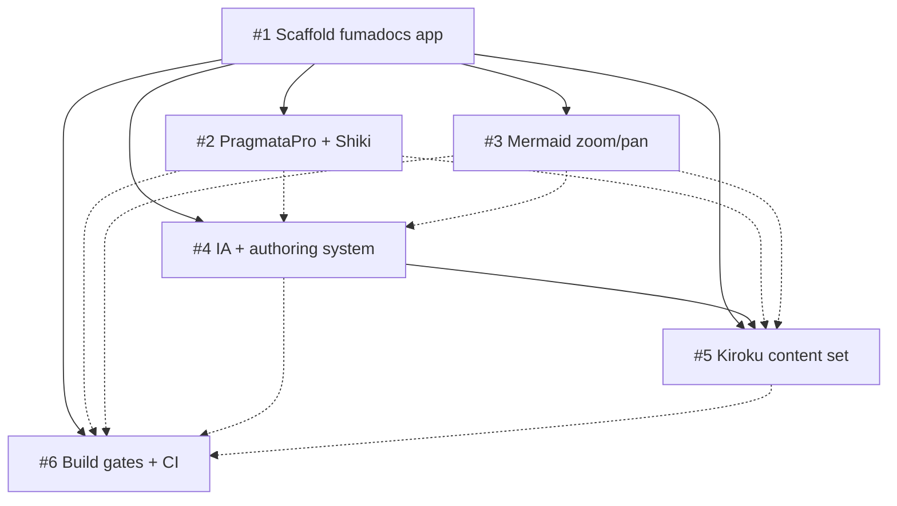

# Keiro Runtime Docs Infrastructure and Kiroku Foundation

> Stand up a unified fumadocs documentation site for the keiro runtime, then fill it with the kiroku foundation library's docs.

<!--
FORMATTING NOTE: Every fenced code block must declare a language tag.
Use ```mermaid for diagrams, ```text for plaintext/trees/ASCII, ```bash for
shell, ```ts for TypeScript. Never use a bare ``` fence.
-->

## Vision & Scope

The end state is a single, polished documentation website that covers the
**keiro runtime** — a family of four **Haskell** libraries. The docs *site* is
a TypeScript application built on **fumadocs** running on **TanStack Start**
(a Vite-based React full-stack framework) and shipped as a **static SPA**
(single-page app prerendered to static files); the *code* being documented is
Haskell. Two languages, one project: the application is TS, the subject matter
is Haskell.

The four libraries the site will eventually document:

- **kiroku** — a PostgreSQL-backed **event store** and persistence foundation.
  Append-only event storage, optimistic concurrency, streams, subscriptions,
  snapshots. This is the bottom layer everything else builds on.
- **keiro** — the **integration framework** layered on top of kiroku. Wires the
  event store into application-level command handling and workflows. (Namesake
  of the family.)
- **keiki** — a **pure transducer core**. Composable, IO-free stream and
  transducer composition with algebraic laws.
- **shibuya** — **Broadway-style queue processing**. Concurrent message/job
  pipelines with backpressure, batching, and rate limiting.

Success for *this* master plan means the site exists, looks beautiful, and is
fully populated for the **foundation layer (kiroku)** — the natural starting
point because it is the layer everything else depends on and because it already
has substantial existing documentation to port.

What makes this site distinctive are three greenfield customizations:

- **PragmataPro ligature code blocks** — code rendered in PragmataPro with
  programming ligatures enabled.
- **Haskell-aware Shiki highlighting** — syntax highlighting that understands
  Haskell.
- **Beautiful zoomable Mermaid diagrams** — interactive pan/zoom diagrams for
  event flow, stream organization, and pipeline topology.

The site supports a broad set of document types, organized per library along
Diátaxis lines: **tutorials**, **how-tos**, **explanations**, **references**,
**FAQs**, **code walkthroughs**, **cookbooks**, and **theory explainers**.

### In scope (this master plan)

- The full documentation **infrastructure**: scaffold, fonts/Shiki, Mermaid,
  information architecture + authoring system, and CI quality gates.
- The complete **kiroku** content set ported into the new site.

### Out of scope (future master plans)

- Full content for **keiro**, **keiki**, and **shibuya** — each gets its own
  content master plan once the infrastructure proves itself on kiroku.
- **Choosing a deployment host** — explicitly deferred. This plan targets local
  development plus CI; the production host decision comes later.

## Decomposition Strategy

The work splits into **six child ExecPlans (A–F, numbered #1–#6)** organized
into **four phases**. The grouping is by **functional concern**: each child plan
owns one coherent capability of the documentation system, and the phases order
those capabilities by dependency.

- **Phase 1 — Scaffold:** stand up the app (#1). Nothing can exist without it.
- **Phase 2 — Authoring primitives:** the rendering and quality machinery that
  attaches directly to the bare scaffold — PragmataPro/Shiki (#2), Mermaid (#3),
  and CI (#6). These only need the scaffold to exist and can proceed in
  parallel.
- **Phase 3 — Information architecture:** the authoring system and content tree
  structure (#4), which is best designed once the primitives that content will
  rely on are in place.
- **Phase 4 — Content:** the kiroku documentation set (#5), which fills the
  structure with real, beautifully rendered Haskell content.

This ordering means the **critical path is #1 → #4 → #5**: scaffold, then IA,
then content. The presentation customizations (#2, #3) and CI (#6) ride
alongside as soft dependencies — content is *better* when they land first, but
not *blocked* on them.

### Alternatives considered

- **Fold CI into the scaffold plan (#1).** Rejected. CI quality gates depend on
  knowing what to gate (lint rules, link-checking the content tree, building the
  custom components), so CI is healthiest as its own plan with soft deps on the
  primitives and content rather than baked into the scaffold.
- **Write content before the authoring system (#5 before #4).** Rejected.
  Porting kiroku docs without a settled IA and authoring conventions would force
  rework when the structure changes; the content plan hard-depends on the IA.
- **Multi-app / monorepo split** (separate apps per library or per concern).
  Rejected. This is a **single root fumadocs app** — one TanStack Start
  application with one content tree. A monorepo adds coordination overhead with
  no benefit for one documentation root.

## Exec-Plan Registry

| # | Title | Path | Hard Deps | Soft Deps | Phase | Status |
|---|-------|------|-----------|-----------|-------|--------|
| 1 | Scaffold the fumadocs documentation app | docs/plans/1-scaffold-the-fumadocs-documentation-app.md | — | — | 1 | Complete |
| 2 | PragmataPro font and Shiki code ligatures | docs/plans/2-pragmatapro-font-and-shiki-code-ligatures.md | #1 | — | 2 | Complete |
| 3 | Beautiful Mermaid diagrams with zoom and pan | docs/plans/3-beautiful-mermaid-diagrams-with-zoom-and-pan.md | #1 | — | 2 | Complete |
| 4 | Documentation information architecture and authoring system | docs/plans/4-documentation-information-architecture-and-authoring-system.md | #1 | #2, #3 | 3 | Complete |
| 5 | Kiroku foundation documentation set | docs/plans/5-kiroku-foundation-documentation-set.md | #1, #4 | #2, #3 | 4 | Not Started |
| 6 | Build quality gates and CI | docs/plans/6-build-quality-gates-and-ci.md | #1 | #2, #3, #4, #5 | 2 | Not Started |

## Dependency Graph



Solid arrows are **hard** dependencies (the target cannot start until the source
is complete); dotted arrows are **soft** dependencies (the target is better with
the source done first, but is not blocked).

Everything hangs off **#1 (scaffold)** — it is the universal hard dependency.
The **critical path is #1 → #4 → #5**: the app must exist before the
information architecture can be designed, and the IA must exist before kiroku
content can be ported into it. The presentation primitives (**#2**, **#3**) hard-
depend only on the scaffold and feed the IA and content as soft deps. **CI
(#6)** hard-depends only on the scaffold but soft-depends on everything else,
because each landing capability adds something for the gates to check.

### Phases

- **Phase 1 — Scaffold:** #1.
- **Phase 2 — Authoring primitives:** #2, #3, #6 (parallelizable once #1 lands).
- **Phase 3 — Information architecture:** #4.
- **Phase 4 — Content:** #5.

## Integration Points

These are the files multiple child plans touch. Each has one **owner** (the plan
that creates and structures it) and **extenders** (plans that add to it under
the owner's contract).

All paths below reflect the **TanStack Start (static SPA)** layout (see the
Decision Log): the app lives under `src/` with file-based routing, not a
Next.js `app/` directory.

| File / System | Owner | Extenders | Contract |
|---------------|-------|-----------|----------|
| `source.config.ts` | #1 | #2 | #1 defines the fumadocs-mdx doc collection (`defineDocs`) and the `defineConfig` skeleton. #2 extends `mdxOptions.rehypeCodeOptions` with the Haskell-aware Shiki config and ligature-friendly transformers without changing the collection. (Processed by the `fumadocs-mdx/vite` plugin in `vite.config.ts`.) |
| `src/components/mdx.tsx` | #1 | #3, #4 | #1 establishes the base MDX-to-React component map (`getMDXComponents`/`useMDXComponents`). #3 registers the client `Mermaid` / zoomable viewer component; #4 registers authoring components (callouts, cards, tabs, walkthrough/cookbook wrappers). Additions only — existing mappings stay stable. Components reach pages via the docs client loader in `src/routes/docs/$.tsx`. |
| `src/styles/app.css` | #1 | #2 | #1 owns global styles and the stylesheet structure (Tailwind v4 + fumadocs CSS). #2 adds the PragmataPro `@font-face` declarations (pointing at the `/bokuno/fonts` OTFs — TanStack Start/Vite has no `next/font`, so fonts load via CSS `@font-face`) and the `--fd-font-mono` / code-block ligature rules. |
| `src/lib/layout.shared.tsx` + `src/lib/source.ts` | #1 | #4 | #1 scaffolds `baseOptions()` (site title only) and the fumadocs `loader()`. #4 owns the navigation taxonomy: it adds the per-library top-level `links` (kiroku/keiro/keiki/shibuya) to `baseOptions()` and may extend the loader (icons, page-tree transforms). #1 deliberately omitted the nav links so the SPA prerenderer does not crawl pages that do not exist yet. |
| `content/docs/**` + `meta.json` | #4 (structure) | #5 (populate) | Framework-agnostic. #4 defines the directory layout, `meta.json` navigation ordering, and the per-library Diátaxis skeleton. #5 populates the `kiroku/` subtree with real MDX and fills its `meta.json` entries, conforming to #4's structure. |
| `package.json` scripts + `flake.nix` | #1 | #6 | #1 establishes the pnpm scripts (`dev`=`vite dev`, `build`=`vite build` → static `.output/public`, `start`=`serve .output/public`, `typecheck`=`fumadocs-mdx && tsc --noEmit`, plus `lint`=`oxlint`/`format`=`oxfmt`) and the Node 22 / pnpm dev shell in `flake.nix`. #6 adds the lint/format/link-check gates and CI wiring on top, keeping the existing script names intact. |

## Progress

### Phase 1 — Scaffold

- [x] #1 — Stand up a single root **TanStack Start** static-SPA fumadocs app (adapted from the fumadocs `tanstack-start-spa` example). _(2026-05-30)_
- [x] #1 — Establish `source.config.ts`, `vite.config.ts`, `src/lib/source.ts`, `src/components/mdx.tsx`, `src/styles/app.css`, and the `src/routes/` tree. _(2026-05-30)_
- [x] #1 — Set up pnpm + Node 22 dev shell in `flake.nix`; base `package.json` scripts (`vite dev`/`vite build`/static `serve`). _(2026-05-30)_

### Phase 2 — Authoring primitives

- [x] #2 — Add PragmataPro `@font-face` declarations from the `/bokuno/fonts` flake input. _(2026-05-30)_
- [x] #2 — Configure Haskell-aware Shiki with ligature-friendly code blocks. _(2026-05-30)_
- [x] #3 — Port mina-ui's MermaidViewer; register the zoomable `Mermaid` component. _(2026-05-30)_
- [x] #3 — Wire pan/zoom interaction and styling. _(2026-05-30; on-screen interactive
      verification still pending a human browser pass — see Surprises & Discoveries.)_
- [ ] #6 — Stand up build, lint, typecheck, and link-check gates.
- [ ] #6 — Wire CI to run the gates on every change.

### Phase 3 — Information architecture

- [x] #4 — Define the per-library Diátaxis content tree and `meta.json` ordering. _(2026-05-30)_
- [x] #4 — Build the authoring system: callouts, code-walkthrough and cookbook components, eight copy-paste templates, and the contributing/style guide. _(2026-05-30)_

### Phase 4 — Content

- [ ] #5 — Port the kiroku Getting Started tutorial and how-to guides to MDX.
- [ ] #5 — Port the kiroku reference, explanation, and theory docs.
- [ ] #5 — Convert event-flow diagrams to Mermaid and verify Haskell highlighting.

## Surprises & Discoveries

Research during planning corrected several initial premises:

- The libraries are **Haskell**, not TypeScript — the docs app is TS, but the
  documented code is Haskell, which drives the Haskell-aware highlighting need.
- **kiroku** is an **event store**, not a decider / command-handling framework —
  command handling lives in keiro. kiroku is strictly durable event storage and
  retrieval.
- **keiki** is a **pure transducer core**, not a scheduling layer — IO-free
  stream/transducer composition.
- **shibuya** is **queue processing** (Broadway-style pipelines), not an actor
  system.
- The three signature customizations (PragmataPro ligatures, Haskell Shiki,
  zoomable Mermaid) are **greenfield** for this site.
- **mina-ui** is the source of the MermaidViewer.

Discovered during implementation of #1:

- **Framework pivot: Next.js → TanStack Start (static SPA).** The plan originally
  targeted Next.js (copying the shibuya-docs skeleton). After scaffolding on
  Next.js, the requirement changed to **TanStack Start**. The scaffold was
  re-implemented as a static SPA using the fumadocs `tanstack-start-spa` example
  as the reference (replacing shibuya-docs, which is Next.js-based). This changes
  the file layout (`app/` → `src/routes/` + `src/lib/` + `src/components/`), the
  build tool (`next build` → `vite build`), and the bundler config
  (`next.config.mjs` → `vite.config.ts`). All child plans (#2–#6) were updated to
  match. See the Decision Log.
- **fumadocs is framework-agnostic.** `fumadocs-core` / `fumadocs-ui` /
  `fumadocs-mdx` all support TanStack Start (via `fumadocs-ui/provider/tanstack`,
  the `fumadocs-mdx/vite` plugin, and a client-loader rendering path). The
  documented capabilities (Shiki seam, MDX component registry, content tree,
  search) all carry over; only the wiring differs.
- **`nitro@3.0.260522-beta` (the latest) breaks the Vite dev SSR worker.** With
  it, `pnpm dev` returns 500s (`Vite environment "ssr" is unavailable`). The
  prior beta `3.0.260429-beta` works for both `pnpm dev` and the prerendered
  `pnpm build`, so nitro is pinned there.
- **The static SPA output makes the deferred host decision easier.** `pnpm build`
  emits a fully static `.output/public`, deployable to any static host with no
  server — well aligned with "deploy host deferred."

Discovered during implementation of #3 (Mermaid):

- **rehype plugin ordering vs. the Shiki seam is load-bearing.** The mermaid
  fence interceptor (`src/lib/rehype-mermaid.ts`) must run **before** fumadocs'
  built-in Shiki `rehypeCode` step (configured by #2's `rehypeCodeOptions` in
  `source.config.ts`). With the plain array form `rehypePlugins: [rehypeMermaid]`
  the plugin ran *after* Shiki, which had already rewritten the
  `language-mermaid` block into highlighted spans, so the fence rendered as code
  instead of a diagram. The fix is the function form
  `rehypePlugins: (v) => [rehypeMermaid, ...v]` (prepend to defaults). **Bearing
  on #4 and #5:** any author-facing component that wants to claim a fenced code
  block (or otherwise compete with the Shiki step) must prepend its rehype
  plugin the same way. **Bearing on #6 (CI):** a useful build-gate assertion is
  that the compiled MDX for a mermaid fence contains a `Mermaid` component call
  and **no** `language-mermaid`/`shiki` strings — a cheap regression check that
  the ordering has not silently broken.
- **`beautiful-mermaid@1.1.3` requires the diagram header on its own line** (it
  rejects the single-line `flowchart TD; A --> B` form). Authoring guidance for
  #5's diagrams: always write multi-line fences (header on line 1).
- **`@types/hast` is now a dev dependency** (added by #3 so the rehype plugin's
  HAST node types resolve under `tsc`). Relevant to #6's typecheck gate.

Discovered during implementation of #4 (IA + authoring):

- **Unquoted MDX frontmatter containing `": "` breaks the build.** A
  `description:` value with an embedded colon-space parsed as a nested YAML
  mapping and failed `pnpm build` with `YAMLException: bad indentation`. **For
  #5:** quote `title`/`description` whenever they may contain `:`, `#`, `[`,
  etc. **For #6:** a cheap, high-value CI gate is to assert every
  `content/docs/**/*.mdx` parses its frontmatter.
- **`meta.json` hides pages from the sidebar but NOT from search.** The
  `_templates/` library (and any allow-list omission) is correctly absent from
  the sidebar/nav and prerender crawl, but the fumadocs/Orama `/api/search`
  index still contains it. **For #6:** if template/search noise is undesirable,
  add a search-exclusion (a frontmatter flag the search route filters, or move
  templates out of the indexed collection). Does not affect the IA.
- **The #2/#3 demo pages are now nav orphans by design.** #4 replaced the root
  `content/docs/meta.json` with the seven-entry family allow-list, which omits
  `ligature-check` and `diagram-demo`. The files remain (still resolve via the
  SPA fallback) but are no longer in the sidebar or prerendered. A future plan
  may fold them into the kiroku content set or delete them.

## Decision Log

- **2026-05-30 — Single root app, copy shibuya-docs skeleton. _(SUPERSEDED — see
  the TanStack Start decision below.)_** Originally: one Next.js + fumadocs
  application copying the proven shibuya-docs skeleton.
- **2026-05-30 — Framework: TanStack Start (static SPA), not Next.js.
  _(Supersedes the shibuya-docs/Next.js decision above.)_** The requirement
  changed to use **TanStack Start** instead of Next.js. The app is a single root
  fumadocs site on TanStack Start (Vite + TanStack Router), built as a **static
  SPA** (`vite build` prerenders to `.output/public`). The known-good reference
  is the fumadocs **`tanstack-start-spa`** example (at
  `/Users/shinzui/Keikaku/fumadocs-project/fumadocs/examples/tanstack-start-spa`),
  which replaces shibuya-docs as the skeleton source. Rationale for the SPA
  variant specifically: it emits host-agnostic static files, matching the
  deferred-host decision. Layout: `src/routes/` (file-based routing),
  `src/lib/`, `src/components/`, `src/styles/app.css`, `vite.config.ts` — no
  Next.js `app/` directory.
- **2026-05-30 — Pin `nitro@3.0.260429-beta`.** The latest nitro
  (`3.0.260522-beta`) breaks the Vite dev SSR worker (`pnpm dev` → 500s); the
  prior beta works for both dev and the prerendered build.
- **2026-05-30 — pnpm + Node 22 (switch from the repo's bun flake).** The
  repo's current `flake.nix` is bun-based; the sibling fumadocs sites use pnpm +
  Node 22. We switch to match them so tooling, lockfiles, and CI are consistent
  across the family.
- **2026-05-30 — PragmataPro via the `/bokuno/fonts` nix flake input.** The
  ligature OTFs are provided by that flake input; `@font-face` declarations
  reference those files rather than vendoring fonts into the repo.
- **2026-05-30 — Haskell-aware Shiki highlighting.** Because the documented code
  is Haskell, Shiki is configured in `source.config.ts` with the Haskell grammar
  and ligature-friendly transformers.
- **2026-05-30 — Port mina-ui's MermaidViewer for zoom/pan.** Rather than
  building a diagram viewer from scratch, port the proven MermaidViewer
  component from mina-ui and register it in `src/components/mdx.tsx`.
- **2026-05-30 — Start content with kiroku.** It is the foundation layer
  everything depends on and already has substantial documentation to port,
  making it the lowest-risk, highest-value first content target.
- **2026-05-30 — Deploy host deferred; local + CI first.** Choosing a production
  host is out of scope for this plan. We target local development and CI gates,
  and decide the host in a later plan.
- **2026-05-30 — Intention linked.** This master plan is linked to intention
  `intention_01ksx5mf7qe2ht659e4kr9w2t0`.

## Outcomes & Retrospective

**Phase 1 — Scaffold (#1): complete (2026-05-30).** A single-root fumadocs
documentation site now exists on **TanStack Start**, shipped as a **static SPA**.
`pnpm build` prerenders `/`, `/docs`, `/docs/index.md`, and the static
`/api/search` index into `.output/public`; `pnpm start` serves it (all routes
200, SPA fallback for unknown paths); `pnpm dev` runs the Vite dev server; and
`pnpm exec tsc --noEmit` is clean. The Nix dev shell reproducibly provides
Node 22 + pnpm. All extension seams for #2–#6 are present (Shiki in
`source.config.ts`, fonts in `src/styles/app.css`, MDX components in
`src/components/mdx.tsx`, nav/IA in `src/lib/layout.shared.tsx` +
`src/lib/source.ts`, content tree in `content/docs/`).

The major mid-flight change was the **Next.js → TanStack Start pivot** (recorded
in the Decision Log and Surprises). The initial scaffold was built on Next.js,
then re-implemented on TanStack Start when the requirement changed; child plans
#2–#6 were revised to match. Lesson for the remaining phases: the fumadocs
`tanstack-start-spa` example is the source of truth for wiring, and the docs page
renders MDX **client-side** (a SPA client loader), so prerendered HTML is a
hydration shell — verify rendered content in a browser (or via the static search
index / raw `.md` route), not by grepping the static HTML.

_Phases 2–4 to be filled in as they complete, then what comes next (the keiro /
keiki / shibuya content master plans)._
