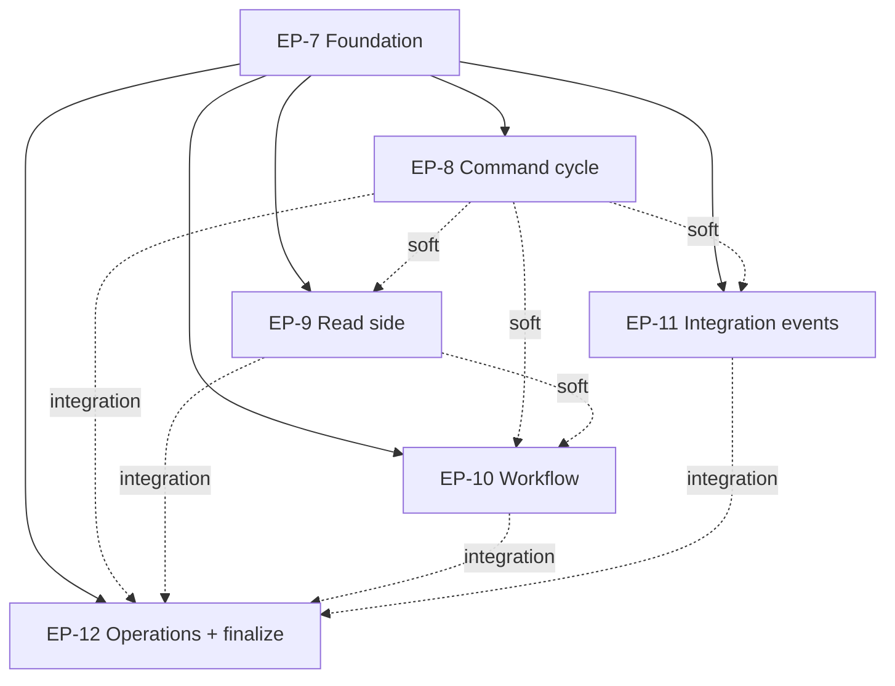
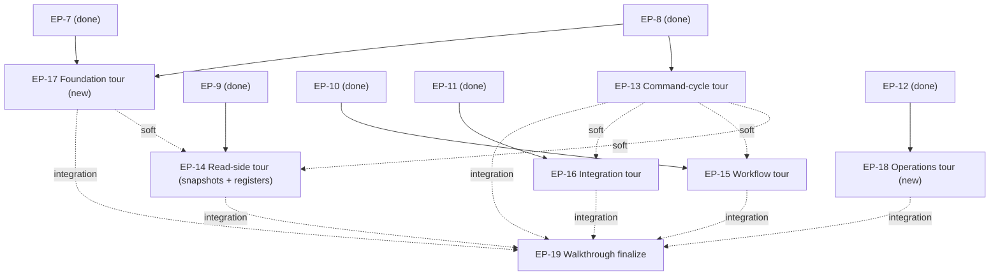

# Keiro framework documentation set

> Fill the scaffolded `content/docs/keiro/` tree with a complete, accurate, navigable
> documentation set for **keiro** — the event-sourcing framework and workflow engine at
> the top of the keiro runtime stack — including code walkthroughs of the command
> processor, inbox, outbox, and the other critical subsystems, plus guides and how-tos.

This MasterPlan is a living document. The sections Progress, Surprises & Discoveries,
Decision Log, and Outcomes & Retrospective must be kept up to date as work proceeds.

<!--
FORMATTING NOTE: Every fenced code block must declare a language tag.
Use ```mermaid for diagrams, ```text for plaintext/trees/ASCII, ```bash for
shell, ```haskell for Haskell, ```sql for SQL, ```json for JSON. Never use a
bare ``` fence.
-->


## Vision & Scope

The end state is a complete documentation set for **keiro** living under
`content/docs/keiro/` in this repository's fumadocs + TanStack Start static-SPA site,
matching the depth and house style already established for **kiroku** under
`content/docs/kiroku/` (built by `docs/plans/5-kiroku-foundation-documentation-set.md`).
A reader who lands on `/docs/keiro` can:

- understand what keiro **is** — a Haskell *library you import* (not a server you operate)
  that composes three lower libraries into an event-sourcing and workflow framework:
  **kiroku** (the append-only PostgreSQL event store), **keiki** (the pure
  symbolic-register finite-state transducer that is the decision core), and **shibuya**
  (the supervised subscription/worker substrate). The framework's thesis is that
  aggregates, process managers, sagas, and (future v2) durable workflows are all the
  *same mathematical object* — keiki's `SymTransducer phi rs s ci co` — persisted to *one*
  substrate (your Postgres);
- follow a hands-on **getting-started tutorial** that opens a store, defines an
  `EventStream` (a keiki transducer married to a codec), runs a command through the
  Hydrate → Transduce → Append cycle, and reads the resulting events back — all against the
  **real** keiro API;
- learn each critical subsystem through an **explanation** essay and look up its exact
  Haskell signatures and PostgreSQL schema in a **reference** page: the command cycle
  (`Keiro.Command`), the codec / schema-evolution surface (`Keiro.Codec`), event streams
  and the typed `Stream` handle, the content-based `Router`, the read side (`Keiro.Projection`,
  `Keiro.ReadModel`, `Keiro.Snapshot`), the workflow engine (`Keiro.ProcessManager`,
  `Keiro.Timer`), and the integration-event surface (`Keiro.Inbox`, `Keiro.Outbox`,
  `Keiro.Integration.Event`);
- read **deep code walkthroughs** — ordered, source-faithful tours that cover *every* core
  function, type, and SQL statement in each subsystem, written so a developer can contribute
  to keiro or gain real confidence in how it works (not just skim a few excerpts). The tours
  cover the keiro↔keiki **foundation** (the typed `EventStream`/`Stream` handles, the codec
  boundary, and the `Keiki.step` transducer call that threads the transducer's
  `(state, registers)` pair), the **command processor**, the **read side** — with snapshots
  and **keiki's symbolic registers** given first-class, detailed treatment because the
  snapshot codec is exactly what persists and restores that `(state, registers)` pair — the
  **workflow engine**, the **inbox/outbox integration path** (the user explicitly asked for
  walkthroughs of the inbox, outbox, and command processor "and other critical features"),
  and the cross-cutting **operations** internals (telemetry spans and the migration runner);
- complete focused **how-to** tasks (configure optimistic-concurrency retries, evolve an
  event schema, choose a consistency mode, run a process manager as a subscription, drive
  the timer worker, choose an inbox dedupe policy, bridge a Kafka producer to the outbox,
  tune outbox ordering/retries, enable OpenTelemetry, run the migrations, write tests with
  the test-support fixture);
- copy a **cookbook** recipe; and
- get quick answers in a **FAQ**.

A single worked example — the **`jitsurei`** package shipped in the keiro repo
(order-fulfillment and incident-escalation domains) — threads through the entire set:
every conceptual page links to the exact `jitsurei/src/Jitsurei/*.hs` module that
demonstrates the feature and the `just jitsurei-*` target that runs it.

You can see the result by running the docs dev server (`pnpm dev`, i.e. `vite dev`) — or a
production build with `pnpm build && pnpm start` — and browsing `http://localhost:3000/docs/keiro`:
the keiro tree appears in the sidebar with the page order defined by the `meta.json`
files; Haskell snippets render in PragmataPro with ligatures; and `mermaid` diagrams
render interactively.

**In scope:** all content under `content/docs/keiro/` plus a new
`docs/keiro-source-sync.md` pointer (mirroring `docs/kiroku-source-sync.md`). The docs
document keiro **as shipped at the pinned upstream commit** (`3f5dc9c`, keiro `0.1.0.0`;
the telemetry page tracks the post-0.1.0.0 pin `94c85e2` — see the Decision Log).

**Phase 4 — Walkthrough deepening (added 2026-06-02).** Phases 1–3 shipped the full Diátaxis
set, but the **code walkthroughs landed thin**: four tours of four short chapters each, mostly
one excerpt plus a paragraph (50–130 MDX lines per chapter), which is not enough for a
developer to contribute to keiro or trust it. Phase 4 reopens the walkthrough tree and brings
it to *contribution-grade depth*: every tour walks its subsystem's real source end to end —
every exported function, the types and their fields, the SQL statements line by line, the
error/retry/edge cases, and the keiki coupling — anchored to `jitsurei` where a runnable
anchor exists. Phase 4 also **adds two new tours** that Phases 1–3 never gave a walkthrough:
a **foundation** tour (`walkthrough/foundation/` — `EventStream`, `Stream`, `Codec`, and the
keiki `SymTransducer`/`step` core, including what *symbolic registers* are and how state and
registers are threaded) and an **operations** tour (`walkthrough/operations/` — the
`Keiro.Telemetry` span helpers and the `Keiro.Migrations` runner). Snapshots and keiki's
registers receive deliberate, detailed coverage across the foundation and read-side tours,
because the snapshot codec (`Keiro.Snapshot.Codec`) is precisely what serializes and rehydrates
the transducer's `(state, registers)` pair. The Diátaxis content authored in Phases 1–3
(explanation/reference/how-to/tutorial/cookbook/FAQ) is **not** re-opened; Phase 4 deepens the
`walkthrough/` tree only.

**Out of scope:** building or modifying the docs app, the highlighter, the font, the
Mermaid component, or the IA/template system — those are owned by MasterPlan #1's plans
(`docs/plans/1`–`docs/plans/4`, `docs/plans/6`) and are already complete. This MasterPlan
populates content only. It also does **not** document keiro's *planned* v2 durable-execution
workflow engine as if it shipped: `Keiro.Workflow`, named steps, `keiro_workflow_steps`,
etc. do not exist in the source and must be presented (if at all) only as a clearly
labelled roadmap.


## Decomposition Strategy

The initiative is decomposed by **functional concern** (the principle in
`agents/skills/master-plan/MASTERPLAN.md`), not by Diátaxis quadrant. Slicing by quadrant
(one plan for "all reference pages", one for "all how-tos") was rejected because it would
force every plan to touch every subsystem's source, maximise cross-plan coupling, and make
no single plan independently verifiable. Slicing by subsystem means each plan reads one
coherent slice of the keiro source and produces that subsystem's full Diátaxis coverage
(explanation + reference + how-to + walkthrough, and tutorials where natural) as one
independently shippable, independently buildable unit.

The natural subsystem seams in the keiro source (`/Users/shinzui/Keikaku/bokuno/keiro`)
are: the command cycle / write path (`Keiro.Command`, `Keiro.Codec`, `Keiro.EventStream`,
`Keiro.Stream`, `Keiro.Router`); the read side (`Keiro.Projection`, `Keiro.ReadModel`,
`Keiro.Snapshot`); the workflow engine (`Keiro.ProcessManager`, `Keiro.Timer`); and the
integration-event path (`Keiro.Inbox`, `Keiro.Outbox`, `Keiro.Integration.Event`). Two
cross-cutting concerns do not belong to any one subsystem — the framework's *introduction*
(why keiro, getting started, core concepts, and the jitsurei example) and its *operations*
(telemetry, migrations, testing) plus the FAQ/cookbook and the final site-integration pass.

That yields **six** child plans grouped into **three phases**:

- **Phase 1 — Foundation (EP-7).** The landing/overview, the core-concepts explanation,
  the getting-started tutorial, the jitsurei example introduction, the
  `docs/keiro-source-sync.md` pointer, and the shared authoring conventions every other
  plan depends on (the cross-link rule, the jitsurei module map, the walkthrough-tree
  layout, the meta.json approach). This is the hard-dependency root.

- **Phase 2 — Subsystems (EP-8, EP-9, EP-10, EP-11).** Four parallel plans, one per
  subsystem seam, each producing that subsystem's explanation, reference, how-tos, and a
  code walkthrough (and tutorials where natural). The command-cycle, inbox, and outbox
  walkthroughs the user named explicitly live in EP-8 and EP-11.

- **Phase 3 — Operations & finalization (EP-12).** The cross-cutting operations docs
  (telemetry, migrations, testing), the FAQ and cookbook, and the final site-integration
  pass: order every `meta.json`, replace every "coming soon" section landing with
  `<Cards>`, and run the build + link-check gate over the whole keiro tree.

Six plans sits inside the two-to-seven guidance in MASTERPLAN.md. The phases group them
into implementation waves so the four Phase-2 plans can be implemented concurrently once
the foundation exists. Balance check: each Phase-2 plan covers a comparable surface (one
subsystem, ~3–7 pages plus a walkthrough); EP-7 and EP-12 are deliberately the bookends
(setup and reconciliation) and are smaller in page count but carry the shared-convention
and whole-tree-integrity responsibilities.

**Phase 4 — Walkthrough deepening (EP-13 … EP-19).** After Phases 1–3 completed, the user
judged the code walkthroughs "very thin … not enough for a developer to contribute or gain
confidence in the system" and asked to expand them "to cover all core parts with great
details," calling out **snapshots and keiki's registers** specifically. Phase 4 is decomposed
the same way as Phase 2 — **by subsystem seam** — because deepening a tour means re-reading one
coherent slice of the keiro source and is independently verifiable (the tour builds, links
resolve, and a depth check confirms it covers that subsystem's whole public surface). The seven
plans are: one deepening plan per existing tour (**EP-13** command-cycle, **EP-14** read-side,
**EP-15** workflow, **EP-16** integration), one for each **new** tour the earlier phases never
wrote (**EP-17** foundation — the keiki↔keiro core; **EP-18** operations — telemetry and
migrations), and a **finalization** plan (**EP-19**) that owns the shared walkthrough hub and
ordering and runs the whole-tree gate. The split-per-tour shape (rather than one consolidated
deepening plan) was chosen so the six authoring plans parallelize and each reads a disjoint
source slice and owns a disjoint `walkthrough/` subdirectory — exactly the collision-avoidance
property Decision (disjoint walkthrough subdirs) established for Phase 2. A dedicated EP-19 is
warranted for the same reason EP-12 owned finalization in Phase 3: the walkthrough hub
(`walkthrough/index.mdx`) and `walkthrough/meta.json` are shared artifacts that all six
authoring plans touch, so they need a single owner for the final ordering pass, the two new hub
`<Card>`s (foundation, operations), and the post-expansion `pnpm build` + `lint:links` gate.

Seven Phase-4 plans pushes the initiative to thirteen child plans total, above the
two-to-seven single-phase guidance — which is exactly why the work is **phased**: Phase 4 is its
own implementation wave, runs entirely after Phases 1–3 are Complete, and its six authoring
plans run concurrently. **Snapshots and keiki's symbolic registers** are given deliberate weight
in two plans: **EP-17** owns the *conceptual* register model (what a `SymTransducer`'s
`registers` are, how `Keiki.step` threads `(state, registers)`), and **EP-14** owns the
*persistence* of that pair (the snapshot codec that encodes and restores state **and**
registers). The two cross-reference each other so the snapshot story reads as one thread.


## Exec-Plan Registry

| # | Title | Path | Hard Deps | Soft Deps | Phase | Status |
|---|-------|------|-----------|-----------|-------|--------|
| 7 | Keiro overview, getting started, and the jitsurei example spine | docs/plans/7-keiro-overview-getting-started-and-the-jitsurei-example-spine.md | — | — | 1 | Complete |
| 8 | Keiro command cycle and write-path documentation | docs/plans/8-keiro-command-cycle-and-write-path-documentation.md | #7 | — | 2 | Complete |
| 9 | Keiro read-side documentation: projections, read models, and snapshots | docs/plans/9-keiro-read-side-documentation-projections-read-models-and-snapshots.md | #7 | #8 | 2 | Complete |
| 10 | Keiro workflow documentation: process managers and timers | docs/plans/10-keiro-workflow-documentation-process-managers-and-timers.md | #7 | #8, #9 | 2 | Complete |
| 11 | Keiro integration-events documentation: inbox, outbox, and Kafka | docs/plans/11-keiro-integration-events-documentation-inbox-outbox-and-kafka.md | #7 | #8 | 2 | Complete |
| 12 | Keiro operations, FAQ, cookbook, and docs finalization | docs/plans/12-keiro-operations-faq-cookbook-and-docs-finalization.md | #7 | #8, #9, #10, #11 | 3 | Complete |
| 13 | Deepen the keiro command-cycle code walkthrough | docs/plans/13-deepen-the-keiro-command-cycle-code-walkthrough.md | #7, #8 | #17 | 4 | Complete |
| 14 | Deepen the keiro read-side walkthrough: snapshots and keiki registers | docs/plans/14-deepen-the-keiro-read-side-walkthrough-snapshots-and-keiki-registers.md | #7, #9 | #13, #17 | 4 | Complete |
| 15 | Deepen the keiro workflow code walkthrough | docs/plans/15-deepen-the-keiro-workflow-code-walkthrough.md | #7, #10 | #13, #14 | 4 | Complete |
| 16 | Deepen the keiro integration-events code walkthrough | docs/plans/16-deepen-the-keiro-integration-events-code-walkthrough.md | #7, #11 | #13 | 4 | Complete |
| 17 | Keiro foundation code walkthrough (EventStream, Stream, Codec, keiki step) | docs/plans/17-keiro-foundation-code-walkthrough-eventstream-stream-codec-and-the-keiki-transducer-step.md | #7, #8 | — | 4 | Complete |
| 18 | Keiro operations code walkthrough: telemetry and migrations | docs/plans/18-keiro-operations-code-walkthrough-telemetry-and-migrations.md | #7, #12 | — | 4 | Complete |
| 19 | Keiro walkthrough finalization: hub, ordering, and whole-tree gate | docs/plans/19-keiro-walkthrough-finalization-hub-ordering-and-whole-tree-gate.md | #7 | #13, #14, #15, #16, #17, #18 | 4 | Complete |

Status values: Not Started, In Progress, Complete, Cancelled.
Hard Deps and Soft Deps reference other rows by their `#` prefix (e.g., #7).


## Dependency Graph

EP-7 is the root. Every other plan **hard-depends** on it because EP-7 establishes
artifacts the rest of the set assumes exist and links into: the `/docs/keiro` overview and
getting-started pages that every subsystem page links back to, the core-concepts
explanation every reference page leans on, the introduction of the `jitsurei` worked
example that every conceptual page cites, the `docs/keiro-source-sync.md` source-of-truth
pointer, and the shared authoring conventions (absolute cross-links, the jitsurei module
map, the `walkthrough/` subdirectory layout, the section-`meta.json` append protocol). A
contributor cannot author an internally-consistent subsystem page without these, so the
relationship is hard, not soft.

The four Phase-2 subsystem plans (EP-8, EP-9, EP-10, EP-11) have **no hard dependencies on
each other** and can be implemented fully in parallel once EP-7 is Complete. They carry
**soft** dependencies that reflect natural reading order and cross-links but do not block
implementation, because every plan is self-contained (it embeds the source context it
needs and uses absolute links that resolve once the target page exists):

- EP-9 (read side) soft-depends on EP-8 because read models and inline projections are
  driven by the command cycle (`runCommandWithProjections` builds on
  `runCommandWithSqlEvents`); read-side pages link to the command-cycle pages for the
  write-path mechanics.
- EP-10 (workflow) soft-depends on EP-8 (process managers dispatch commands through the
  command cycle) and EP-9 (the content-based router resolves targets via a read-model
  query; sagas read models).
- EP-11 (integration events) soft-depends on EP-8 (integration events are minted from
  recorded domain events and reference event metadata / the codec surface).

EP-12 hard-depends on EP-7 (it finalizes the IA EP-7 set up) and **integration-depends** on
EP-8–EP-11: it performs the final `meta.json` ordering pass and the whole-tree build +
link-check, which require every Phase-2 plan's pages to be present. EP-12 can *begin* its
own original content (telemetry/migrations/testing/FAQ/cookbook) as soon as EP-7 is done,
but its **finalization** milestone must run last, after EP-8–EP-11 are Complete.



**Phase 4 (walkthrough deepening).** Each deepening plan **hard-depends** on the Phase-2/3 plan
that originally authored the tour (or the pages) it reopens, because the tour's directory,
chapters, and the surrounding reference/explanation pages its chapters link to must already
exist: EP-13 → EP-8, EP-14 → EP-9, EP-15 → EP-10, EP-16 → EP-11, EP-17 → EP-7 + EP-8 (the
foundation tour reads the `Keiro.EventStream`/`Stream`/`Codec` surface EP-8 documented and links
the core-concepts pages EP-7 wrote), EP-18 → EP-7 + EP-12 (the operations tour reads the
telemetry/migrations references EP-12 wrote). All of EP-8 … EP-12 are Complete, so every Phase-4
plan is immediately implementable. The soft edges encode reading order and cross-links only:
EP-14 soft-depends on EP-17 (the read-side snapshot chapters reference the foundation tour's
register model) and EP-13; EP-15 and EP-16 soft-depend on EP-13 (later tours cross-link the
command-cycle tour). EP-19 **integration-depends** on all six authoring plans: its finalization
milestone (the two new hub `<Card>`s, the `walkthrough/meta.json` ordering pass, and the
whole-tree build + link-check) must run **last**, after EP-13 … EP-18 have each created/expanded
their subdirectory and appended its folder name to `walkthrough/meta.json`. EP-19 hard-depends on
EP-7 (it finalizes the IA EP-7 set up).




## Integration Points

These are the shared artifacts multiple child plans touch. Each plan must respect the
ownership and extension rules here to avoid silent conflicts.

**1. The keiro section `meta.json` files (page ordering).** The top-level
`content/docs/keiro/meta.json` already lists the sections
(`index, tutorials, how-to, reference, explanation, cookbook, walkthrough, faq`). Inside
each section, the per-section `meta.json` `pages` array is **appended to** by several plans.
Rule: each plan appends only its own page slugs to the relevant section `meta.json`; it
never reorders or removes another plan's entries. **EP-12 owns the final ordering pass** of
every section `meta.json` (and replaces each section's "coming soon" `index.mdx` landing
with a `<Cards>` index). The page-to-plan assignment is fixed in each child plan's
"Interfaces and Dependencies" section; the authoritative summary lives in EP-7.

**2. The `walkthrough/` tree.** EP-7 creates `content/docs/keiro/walkthrough/index.mdx`
(a hub linking the tours with `<Cards>`) and the initial
`content/docs/keiro/walkthrough/meta.json`. Each Phase-2 plan owns a **disjoint
subdirectory** under `walkthrough/`, each with its own `meta.json`, a `00-start-here.mdx`,
and numbered chapter files — so parallel plans never collide on a shared numbered
sequence:
  - EP-8 → `walkthrough/command-cycle/`
  - EP-9 → `walkthrough/read-side/`
  - EP-10 → `walkthrough/workflow/`
  - EP-11 → `walkthrough/integration/` (inbox + outbox)

Each Phase-2 plan appends its subdirectory's folder name to `walkthrough/meta.json` when it
creates the subdir. EP-12 finalizes the hub `<Cards>` and the `walkthrough/meta.json`
ordering. (This mirrors the kiroku site, which ships two sibling walkthrough trees,
`walkthrough/` and `write-path/`; keiro groups its tours as subdirectories under one
`walkthrough/` section.)

**Phase-4 extension of this point (2026-06-02).** Phase 4 reopens the `walkthrough/` tree. The
same disjoint-subdirectory ownership rule carries over so the six authoring plans never collide:
EP-13 owns `walkthrough/command-cycle/`, EP-14 owns `walkthrough/read-side/`, EP-15 owns
`walkthrough/workflow/`, EP-16 owns `walkthrough/integration/`, EP-17 owns the **new**
`walkthrough/foundation/`, and EP-18 owns the **new** `walkthrough/operations/`. A deepening plan
(EP-13 … EP-16) may **add, renumber, and rewrite chapters inside its own subdirectory** and must
keep that subdir's `meta.json` `pages` array in sync with the files it ships, but it must not
touch another subdir or the shared `walkthrough/index.mdx` / `walkthrough/meta.json` beyond
**appending** its folder name (the two new tours only). The shared hub and the top-level
`walkthrough/meta.json` ordering are owned by **EP-19**, which adds the two new hub `<Card>`s
(`foundation`, `operations`), runs the final ordering pass over `walkthrough/meta.json`, and runs
the post-expansion build + link-check. Per the hard-won crawler lesson (see Surprises), EP-17 and
EP-18 create their subdir's `00-start-here.mdx` and real chapters and append the folder name to
`walkthrough/meta.json` so the tour is sidebar-navigable, but they do **not** add their hub
`<Card href>` — EP-19 does, once both tours exist, to keep every intermediate `pnpm build` clean.

**3. The `jitsurei` worked-example module map.** EP-7 introduces the jitsurei package and
publishes the canonical feature→module→target map; every other plan links to the **same**
`jitsurei/src/Jitsurei/*.hs` modules and `just jitsurei-*` targets so the example reads as
one coherent story. The canonical map:
  - Order aggregate + command cycle + codec upcasting → `Jitsurei/Domain.hs`,
    `Jitsurei/OrderStream.hs`; `just jitsurei-fulfillment` (EP-8 anchor).
  - Inline projection + read model + consistency → `Jitsurei/ReadModels.hs` (EP-9 anchor).
  - Snapshots → `Jitsurei/Snapshots.hs` (`snapshotOrderEventStream`); `just jitsurei-snapshots` (EP-9).
  - Process manager + dispatch → `Jitsurei/FulfillmentProcess.hs`,
    `Jitsurei/EscalationProcess.hs`; durable timers → `Jitsurei/Timers.hs`;
    `just jitsurei-escalation` (EP-10 anchor).
  - Content-based / effectful fan-out routers → `Jitsurei/Paging.hs`,
    `Jitsurei/AgentQualRouter.hs`, with `Jitsurei/Incident.hs`, `Jitsurei/OncallRoster.hs`;
    `just jitsurei-paging`, `just jitsurei-agent-qual` (EP-8 router page + EP-10).
  - Integration events (inbox/outbox) → the keiro `Keiro.Inbox`/`Keiro.Outbox` modules and
    the keiro repo's `docs/guides/integration-events-with-kafka.md`; jitsurei does not ship
    a Kafka demo, so EP-11 documents the API and the keiro guide, not a jitsurei target.

**4. `docs/keiro-source-sync.md` (the source-of-truth pointer).** EP-7 creates it, mirroring
`docs/kiroku-source-sync.md`, pinning the keiro upstream commit `3f5dc9c` (resolve the path
with `mori registry show shinzui/keiro --full`). All plans cross-check snippets against the
pinned source. EP-12 verifies the pointer's "most-coupled pages" list covers the pages each
plan added.

**5. The `IntegrationEvent` envelope (`Keiro.Integration.Event`).** Shared between EP-11
(inbox + outbox both serialize/deserialize it) and referenced by EP-8 (event metadata and
the codec). **EP-11 owns the `IntegrationEvent` reference page**; EP-8 links to it rather
than re-documenting it.

**6. Shared authoring rules (apply to every plan).** (a) Cross-page links use **absolute**
doc paths (`/docs/keiro/...`), never relative `./` or `../` — relative MDX links resolve
wrong in the static SPA and trip the prerender crawler (a hard-won kiroku lesson, recorded
in `docs/plans/5`'s Surprises). (b) Author every Haskell snippet against the **real, shipped**
signatures and cross-check the pinned source; keiro's in-repo `docs/research/*` and
`docs/plans/*` notes **predate the implementation and diverge** (renamed types, different
SQL columns, unimplemented features) — trust the source, not the notes. (c) Every fenced
code block declares a language tag.

**7. Snapshots and keiki's symbolic registers (Phase 4).** The single most important cross-plan
concept in the deepening pass is how keiro persists a keiki transducer's runtime. keiki's decision
core is a `SymTransducer phi rs s ci co`; stepping it (`Keiki.step`) threads a pair — the state
`s` and the **symbolic registers** `rs` (keiki's auxiliary register bank, distinct from the
folded state). The command path passes `(state current, registers current)` into `Keiki.step`,
and a **snapshot** is what serializes and later restores that *whole pair* so hydration need not
replay every event. Two Phase-4 plans share this concept and must agree:
  - **EP-17 (foundation tour)** owns the **conceptual** treatment: what a `SymTransducer` is, what
    `registers` (`rs`) are versus `state` (`s`), and how `Keiki.step` returns the next
    `(state, registers, events)`. It is the canonical explanation the other tours link to.
  - **EP-14 (read-side tour)** owns the **persistence** treatment: the snapshot codec
    (`keiro/src/Keiro/Snapshot/Codec.hs`), the `keiro_snapshots` schema
    (`keiro/src/Keiro/Snapshot/Schema.hs`), the snapshot policy
    (`keiro-core/src/Keiro/Snapshot/Policy.hs`), and the synchronous inline write in the command
    path — emphasizing that the codec encodes and rehydrates **both** `state` and `registers`, not
    just the folded state. EP-14's snapshot chapters **link to EP-17's register model** rather than
    re-deriving it; EP-17's transducer chapter **links forward to EP-14** for "how this pair is
    persisted." Neither plan may describe registers in a way the other contradicts; both cite the
    same source modules.


## Progress

Milestone-level progress across all child plans. Each child plan maintains its own granular
Progress; this is the at-a-glance roll-up. Check items as the child plans' milestones land.

- [x] EP-7: Overview/landing + core-concepts explanation authored. _(2026-06-01)_
- [x] EP-7: Getting-started tutorial authored (open store → EventStream → runCommand → read back). _(2026-06-01)_
- [x] EP-7: jitsurei example introduced + module map page; `docs/keiro-source-sync.md` created; conventions fixed. _(2026-06-01)_
- [x] EP-8: Command-cycle explanation + reference (Command, Codec, EventStream, Stream, Router) authored. _(2026-06-01)_
- [x] EP-8: Command-cycle how-tos + `walkthrough/command-cycle/` tour authored. _(2026-06-01)_
- [x] EP-9: Read-side explanation + reference (Projection, ReadModel, Snapshot) authored. _(2026-06-01)_
- [x] EP-9: Read-side how-tos + `walkthrough/read-side/` tour authored. _(2026-06-01; + tutorial your-first-read-model.)_
- [x] EP-10: Workflow explanation + reference (ProcessManager, Timer) authored. _(2026-06-01)_
- [x] EP-10: Workflow how-tos + tutorial + `walkthrough/workflow/` tour authored. _(2026-06-01)_
- [x] EP-11: Integration-events explanation + reference (Inbox, Outbox, IntegrationEvent) authored. _(2026-06-01)_
- [x] EP-11: Integration-events how-tos + `walkthrough/integration/` tour (inbox + outbox) authored. _(2026-06-01)_
- [x] EP-12: Operations docs authored (telemetry, migrations, testing) + FAQ + cookbook. _(2026-06-01)_
- [x] EP-12: Finalization — all meta.json ordered, section landings carry `<Cards>`, build + link-check pass over the keiro tree. _(2026-06-01)_
- [x] EP-13: Command-cycle tour deepened — every `Keiro.Command` function (hydrate, prepareCommandPlan, evaluateCommand, appendOnce, retryOrFail, snapshot write), the codec boundary, and the router covered chapter by chapter. _(2026-06-02; 8 chapters)_
- [x] EP-14: Read-side tour deepened — snapshot codec + schema + policy with **keiki registers** treated explicitly (state **and** registers persisted/restored); read-model query path and projections covered in full. _(2026-06-02; 5 chapters)_
- [x] EP-15: Workflow tour deepened — `Keiro.ProcessManager` (dispatch, per-stream transactions), `Keiro.Timer` worker, and the timer schema covered in full. _(2026-06-02; 6 chapters)_
- [x] EP-16: Integration tour deepened — `Keiro.Inbox` (dedupe policies, schema), `Keiro.Outbox` (claim CTE, ordering predicates, drain/backoff/dead-letter), and the Kafka mappings covered in full. _(2026-06-02; 6 chapters)_
- [x] EP-17: Foundation tour authored (new `walkthrough/foundation/`) — `EventStream`/`Stream`, `Codec`, and the keiki `SymTransducer`/`step` core including the **symbolic register** model. _(2026-06-02; 6 chapters)_
- [x] EP-18: Operations tour authored (new `walkthrough/operations/`) — `Keiro.Telemetry` span helpers and the `Keiro.Migrations` runner. _(2026-06-02; 4 chapters)_
- [x] EP-19: Walkthrough finalization — two new hub `<Card>`s (foundation, operations), `walkthrough/meta.json` ordered, whole-tree `pnpm build` + `lint:links` gate green over the expanded tree. _(2026-06-02; gate green over 166 files)_


## Surprises & Discoveries

Cross-plan insights, dependency changes, and scope adjustments discovered during the
initiative. (Per-subsystem source findings live in each child plan; this records things
that affect more than one plan.)

- **The shipped code walkthroughs were too thin to build contributor confidence — Phase 4 added
  (2026-06-02).** After the initiative was marked Complete, the user (keiro's author) reviewed the
  `walkthrough/` tree and found it "very thin … not enough for a developer to contribute or gain
  confidence in the system," asking to expand the tours "to cover all core parts with great
  details" and calling out **snapshots and keiki's registers** specifically. Measured: the four
  tours shipped as 4 chapters each, 50–130 MDX lines per chapter, typically one source excerpt plus
  a paragraph — they sampled each subsystem rather than walking it. **Bearing:** a new **Phase 4**
  (EP-13 … EP-19) reopens the `walkthrough/` tree to contribution-grade depth, adds two missing
  tours (foundation, operations), and gives snapshots + keiki registers first-class coverage. This
  does **not** reopen the Phase-1–3 Diátaxis pages, which the user did not fault. The original
  Outcomes entry for Phases 1–3 still stands; it is annotated below to point here. See the Decision
  Log entries of 2026-06-02.
  - **Concept that drove the snapshot emphasis:** keiki's `Keiki.step` threads a
    `(state, registers)` pair, and the snapshot codec (`keiro-core/src/Keiro/Snapshot/Codec.hs`) is
    what persists/restores that *whole pair* — the symbolic registers `rs` are not a derived view of
    the folded state `s`, so a snapshot that dropped them would corrupt hydration. This is the exact
    detail a contributor needs and the old read-side tour glossed. Integration Point #7 now splits
    its ownership: EP-17 owns the register *model*, EP-14 owns its *persistence*.

- **Command-cycle phase renamed Decide → Transduce (post-completion, 2026-06-01).** The user
  flagged that "Decide" echoes keiki's legacy **Decider façade**, which must not appear in the docs
  or diagrams. The middle phase was renamed to **Transduce** (the shipped op is `Keiki.step` on a
  `SymTransducer`) across all keiro pages, prose, and `mermaid` diagrams, and a basic
  "What is a transducer?" primer was added at
  `/docs/keiro/explanation/the-keiro-stack#what-is-a-transducer` (linked from the command-cycle
  explanation and getting-started). **Bearing on the plan bodies:** the detailed authoring
  instructions in **EP-7** and **EP-8** still say "Hydrate → Decide → Append" — those are now
  *superseded historical records*; the shipped docs use "Hydrate → Transduce → Append". A future
  re-implementation should follow the shipped terminology, not the EP-7/EP-8 prose. Ordinary-English
  "decide" verbs and the `explanation/why-symtransducer-not-decider` contrast page (which argues
  *against* the façade) were intentionally left in place. See the Decision Log entry of the same
  date. Evidence: `grep` for the phase label across `content/docs/keiro` returns no cycle-name or
  diagram hits; gate green (0 crawler warnings, `lint:links` 148 files).

- **The keiro repo's `docs/research/*` and `docs/plans/*` notes predate the shipped code
  and diverge from it in many concrete ways** — renamed types (`AggregateId a` →
  `Stream a`), different `CommandError` variants, different SQL column names/status enums
  for `keiro_timers`/`keiro_outbox`/`keiro_inbox`, the process-manager transaction model
  (separate transactions, not one multi-stream commit), a synchronous (not fire-and-forget)
  snapshot write, and several unimplemented features (the read-model shadow-table rebuild,
  the v2 `Keiro.Workflow` durable-execution engine, timer cancellation SQL, stale
  `publishing`-row recovery in the outbox). Bearing: **every plan documents the source as
  shipped**, treats the notes as rationale/history, and flags the known gaps honestly.
  Evidence: the six subsystem research reports captured during MasterPlan creation
  (2026-06-01); see each child plan's Context section.

- **The walkthrough hub must be created by EP-7 but finalized by EP-12, because the prerender
  crawler follows `<Card href>`s.** (Discovered implementing EP-7, 2026-06-01.) EP-7 builds
  `content/docs/keiro/walkthrough/index.mdx`, the hub. If its `<Cards>` link to the four tours'
  `…/00-start-here` pages (authored by EP-8 … EP-11) before those pages exist, `pnpm build` exits 0
  **but** the crawler emits `[unhandledRejection] … Failed to fetch …/00-start-here` for each — a
  link-check failure. **Resolution / contract reaffirmed:** EP-7 ships the hub `<Cards>` *without*
  `href`s and sets `walkthrough/meta.json` to `["index"]`; this matches Integration Point #2.
  Bearing on later plans: **EP-8 … EP-11** must each (a) append their subdir folder name
  (`command-cycle` / `read-side` / `workflow` / `integration`) to
  `content/docs/keiro/walkthrough/meta.json` when they create their subdir, and (b) author a real
  `00-start-here.mdx`. **EP-12** must add the four `href`s back onto the hub `<Cards>` (each
  pointing at its tour's `00-start-here`) as part of the finalization pass, and order
  `walkthrough/meta.json`. Evidence: EP-7's build log on 2026-06-01 (four `Failed to fetch` lines
  with `href`s present; `OK: no crawler warnings` after removing them).
  - **(Update, implementing EP-8, 2026-06-01.)** EP-8 added `"command-cycle"` to
    `walkthrough/meta.json` (its subdir now exists with real chapters), so the command-cycle tour is
    navigable from the sidebar; its hub `<Card>` is still href-less, awaiting EP-12.
  - **(Update, implementing EP-10, 2026-06-01.)** EP-10 added `"workflow"` to `walkthrough/meta.json`
    (the `walkthrough/workflow/` subdir now exists with `00-start-here` + three real chapters), so the
    workflow tour is navigable from the sidebar; its hub `<Card>` is still href-less, awaiting EP-12.
    **EP-12 finalization now owns three hub hrefs** (`command-cycle`, `read-side`, `workflow`) plus
    EP-11's `integration` once it lands.
  - **(Update, implementing EP-11, 2026-06-01.)** EP-11 added `"integration"` to
    `walkthrough/meta.json` (the `walkthrough/integration/` subdir now exists with `00-start-here` +
    three real chapters: the inbox, the outbox, the Kafka mapping), so the integration tour is
    navigable from the sidebar; its hub `<Card>` is still href-less, awaiting EP-12. **All four
    Phase-2 walkthrough subdirs now exist** (`command-cycle`, `read-side`, `workflow`,
    `integration`); EP-12's finalization adds all four hub `<Card href>`s and runs the final
    `walkthrough/meta.json` ordering pass. EP-11 also shipped `reference/integration-event`
    (Integration Point #5), so EP-8's parked link to it can now be resolved by EP-12.
  - **(Resolved, implementing EP-12, 2026-06-01.)** EP-12's finalization pass added all four hub
    `<Card href>`s (`command-cycle`, `read-side`, `workflow`, `integration` → each tour's
    `00-start-here`) and ran the `walkthrough/meta.json` ordering pass. `pnpm build` re-ran with the
    hrefs present and emitted **zero** crawler warnings (all four tours exist), closing the
    create-hub-without-hrefs contract this Surprise opened in EP-7.

- **Forward-links to not-yet-authored sibling pages are parked on the section landing until their
  owner lands.** (Discovered implementing EP-8, 2026-06-01.) The same crawler behavior that bit the
  walkthrough hub bites any premature cross-link: EP-8 needed to reference EP-9's
  `reference/projection` and `reference/snapshot`, EP-10's `reference/process-manager`, and EP-11's
  `reference/integration-event`, none of which exist yet. EP-8 links the existing landing
  `/docs/keiro/reference` and names the target page in prose. **Bearing:** EP-9, EP-10, and EP-11
  author those reference pages; **EP-12's finalization pass must upgrade these landing links to the
  precise slugs** (grep the keiro tree for `](/docs/keiro/reference)` occurrences that name a
  specific page in nearby prose). Evidence: EP-8 `pnpm build` clean + `pnpm lint:links` 97 files, no
  broken internal links.
  - **(Update, implementing EP-10, 2026-06-01.)** EP-10 created `reference/process-manager` (and
    `reference/timers`), so EP-8's parked landing link to it can now be upgraded by EP-12. EP-10
    itself needed **no** parked landing links — its cross-subsystem references all point at
    already-shipped EP-8 pages. One naming correction for EP-12: the process-manager↔router contrast
    links to **`/docs/keiro/reference/router`**, because EP-8 shipped the router as a *reference*
    page — there is **no** `explanation/the-content-based-router` page (despite the child plan's
    prose suggesting that slug). EP-12 should not try to "upgrade" those router links to a
    non-existent explanation page. Evidence: `reference/meta.json` lists `router`; `pnpm lint:links`
    clean over 125 files including the EP-10 pages.
  - **(Resolved, implementing EP-12, 2026-06-01.)** EP-12 found **six** landing-only
    `](/docs/keiro/reference)` links that named a now-shipped page in nearby prose and upgraded each
    to its precise slug: `explanation/the-jitsurei-example` (→ `reference/inbox` + `reference/outbox`),
    `walkthrough/command-cycle/01-the-command-processor` (→ `reference/snapshot`),
    `how-to/run-a-command-in-a-transaction` (→ `reference/projection`),
    `reference/event-stream-and-stream` (→ `reference/snapshot`), `reference/router`
    (→ `reference/process-manager` + `reference/projection`), and `reference/command`
    (→ `reference/projection`). It did **not** invent an `explanation/the-content-based-router` page,
    per EP-10's correction above. Evidence: `pnpm lint:links` clean over 148 files;
    `grep -rn "](/docs/keiro/reference)" content/docs/keiro` now returns nothing (all six upgraded).

- **Phase-4 parallel authoring: chapter renumbering broke inbound links from the Phase-1–3 pages
  (resolved during EP-19 finalization, 2026-06-02).** The six Phase-4 authoring tours were implemented
  concurrently, each in its disjoint `walkthrough/<subdir>/` (the collision-avoidance property from
  Integration Point #2 held — no two plans touched the same file). The deepening plans **renumbered**
  chapters inside their own subdir (e.g. command-cycle `01-the-command-processor` → `03-…`, integration
  `03-kafka-mapping` → `05-…`, read-side `02-the-read-model-query-path` → `03-…`). That silently broke
  **five inbound links** that pre-existing Phase-1–3 pages (and one sibling tour) pointed at the *old*
  chapter slugs: `reference/snapshot`, `explanation/integration-events`, `how-to/bridge-the-outbox-to-kafka`,
  `walkthrough/workflow/00-start-here`, and one bare-directory link `…/operations/` (which the
  doc-link checker rejects because no `operations/index.mdx` exists). **Bearing:** when a Phase-4 tour
  renumbers a chapter, any inbound link to the old slug from *outside* its subdir must be upgraded —
  the authoring plan cannot see those links (it owns only its subdir), so the **finalization plan
  (EP-19) owns the inbound-link sweep**, exactly as EP-12 owned the parked-link upgrade in Phase 3.
  Resolution: a shared canonical final-slug map was handed to every authoring agent up front (so
  *cross-tour* links were authored against the final numbers), and EP-19's gate caught the five
  remaining *inbound-from-Phase-1–3* breakages via `node scripts/check-doc-links.mjs`; each was
  upgraded to the renumbered slug. Evidence: the checker went `✗ 5 broken` → `✓ doc links OK — checked
  166 files` after the upgrades.


## Decision Log

- Decision: Decompose by **subsystem** (six plans, three phases), not by Diátaxis quadrant.
  Rationale: a per-subsystem plan reads one coherent slice of source and ships that
  subsystem's full Diátaxis coverage as an independently verifiable unit; a per-quadrant
  split would couple every plan to every subsystem and defeat independent verifiability
  (MASTERPLAN.md "decompose by functional concern").
  Date: 2026-06-01
- Decision: Mirror the **kiroku documentation set** (`docs/plans/5`) for depth, house
  style, Diátaxis mapping, and the source-sync-pointer mechanism; mirror its hard-won
  lessons (absolute cross-links; source-over-notes snippet accuracy).
  Rationale: kiroku's set is the established, accepted precedent in this repo; consistency
  across the runtime libraries is a goal.
  Date: 2026-06-01
- Decision: Give each Phase-2 plan a **disjoint walkthrough subdirectory** under
  `walkthrough/` rather than a single shared numbered sequence.
  Rationale: parallel plans must not collide on chapter numbering; a recent kiroku change
  had to renumber a whole walkthrough sequence when a chapter was inserted (commit history),
  exactly the churn disjoint subdirs avoid.
  Date: 2026-06-01
- Decision: Document keiro **as shipped at the pinned commit `3f5dc9c` (keiro 0.1.0.0)**;
  present the planned v2 durable-execution workflow engine only as a clearly labelled
  roadmap, never as a shipped API.
  Rationale: self-containment and accuracy — `Keiro.Workflow` and its tables do not exist
  in the tree; documenting them as real would make examples uncompilable.
  Date: 2026-06-01
- Decision: All four Phase-2 plans hard-depend on EP-7 only; inter-subsystem relationships
  are modelled as soft/integration dependencies so Phase 2 parallelizes.
  Rationale: minimise serialization while respecting that every page links back to the
  shared foundation; self-contained plans + absolute links make soft deps non-blocking.
  Date: 2026-06-01
- Decision (post-completion, 2026-06-01): Rename the middle phase of the command cycle from
  **Decide** to **Transduce** across all keiro docs and diagrams — the cycle is now
  **Hydrate → Transduce → Append** — and add a basic "What is a transducer?" primer for readers
  unfamiliar with the concept.
  Rationale: the user (keiro's author) noted that "Decide" borrows the vocabulary of keiki's
  **Decider façade**, which is a legacy compatibility layer that should not appear in the docs or
  diagrams. The shipped operation is `Keiki.step` on a `SymTransducer` — a *transducer step*, not a
  Decider call — so "Transduce" is the source-honest name. Ordinary-English "decide" verbs and the
  deliberate `explanation/why-symtransducer-not-decider` contrast page (which argues *against* the
  façade) were left intact. The primer lives in `explanation/the-keiro-stack.mdx`
  (`#what-is-a-transducer`), linked from the command-cycle explanation and the getting-started
  tutorial. Gate re-run green: typecheck clean, build 0 crawler warnings, `lint:links` OK over 148
  files.
- Decision (post-completion, 2026-06-01): Update `reference/telemetry.mdx` to the **OpenTelemetry
  1.40** surface and bump the source-sync pin `3f5dc9c → 94c85e2`.
  Rationale: keiro `master` advanced past the original pin with an OTel-1.40 / hs-opentelemetry-1.0
  upgrade — `Keiro.Telemetry` now **imports/re-exports** the semantic-convention `AttributeKey`s from
  `OpenTelemetry.SemanticConventions` instead of **vendoring** them locally. This narrows the earlier
  "document as shipped at `3f5dc9c` (0.1.0.0)" decision: the telemetry page now tracks the
  post-0.1.0.0 development line (keiro's in-tree version is still `0.1.0.0`), while every other page is
  unaffected (the only doc-relevant source change in the range was `Keiro.Telemetry`). Wire-level
  attribute names are unchanged, so the attribute table and span helpers are untouched; only the
  vendoring rationale was reworded. The nuance is recorded in `docs/keiro-source-sync.md`.
  Date: 2026-06-01
- Decision (2026-06-02): Add **Phase 4 — Walkthrough deepening** (EP-13 … EP-19) to reopen and
  significantly expand the code walkthroughs, rather than treat the initiative as closed.
  Rationale: the user judged the shipped tours too thin for a developer to contribute or gain
  confidence; deepening is real, independently verifiable work that deserves tracked plans, not an
  untracked edit. Phasing keeps the original six plans' Outcomes intact while the new wave runs.
  Date: 2026-06-02
- Decision (2026-06-02): Decompose Phase 4 **per tour** — one deepening plan per existing tour
  (EP-13 … EP-16) plus one plan per new tour (EP-17 foundation, EP-18 operations) — not as a single
  consolidated "deepen all walkthroughs" plan.
  Rationale: per-tour plans read disjoint source slices and own disjoint `walkthrough/`
  subdirectories, so the six authoring plans parallelize without colliding on chapter numbers or
  shared files — the same property that made Phase 2 parallel-safe. The user chose this shape over
  the consolidated alternative. Trade-off accepted: a consistent depth/voice across six plans now
  depends on the shared authoring rules (Integration Point #6) and EP-19's review, not on one author.
  Date: 2026-06-02
- Decision (2026-06-02): Add **two new tours** the earlier phases never wrote — a **foundation**
  tour (`walkthrough/foundation/`: `EventStream`, `Stream`, `Codec`, and the keiki
  `SymTransducer`/`step` core) and an **operations** tour (`walkthrough/operations/`: telemetry
  spans, the migration runner).
  Rationale: "cover all core parts" includes the keiki↔keiro foundation (the typed handles and the
  transducer step every command goes through) and the operational internals a contributor must
  understand to run and observe keiro — neither had a source tour. The user selected the
  "deepen + add foundation & ops tours" scope.
  Date: 2026-06-02
- Decision (2026-06-02): Give **snapshots and keiki's symbolic registers** deliberate, split
  ownership — EP-17 owns the register *model*, EP-14 owns its *persistence via the snapshot codec* —
  recorded as Integration Point #7.
  Rationale: the user called this out specifically. `Keiki.step` threads a `(state, registers)` pair
  and the snapshot codec persists/restores the whole pair; splitting concept from persistence lets
  each tour go deep on its half while cross-linking so the snapshot story reads as one thread, and
  avoids two plans describing registers inconsistently.
  Date: 2026-06-02
- Decision (2026-06-02): Add a dedicated finalization plan **EP-19** rather than folding
  finalization into one authoring plan.
  Rationale: the walkthrough hub (`walkthrough/index.mdx`) and `walkthrough/meta.json` are shared
  artifacts every authoring plan touches; a single owner for the two new hub `<Card>`s, the ordering
  pass, and the post-expansion whole-tree gate prevents the merge churn and premature-`<Card href>`
  crawler failures documented in this log's Surprises — exactly the role EP-12 played for Phase 3.
  Date: 2026-06-02


## Outcomes & Retrospective

> **Status update (2026-06-02): the initiative was reopened with Phase 4.** The outcome below
> records Phases 1–3 (EP-7 … EP-12), which remain Complete and are not being re-litigated. Phase 4
> (EP-13 … EP-19) deepens the code walkthroughs the user judged too thin; its own outcome will be
> recorded here when that wave completes. See the Decision Log and Surprises entries of 2026-06-02.

**Outcome (2026-06-01): Phases 1–3 are complete — all six child plans (EP-7 … EP-12) are
Complete and the original Vision & Scope (a full Diátaxis set) is met.**

A reader landing on `/docs/keiro` now finds a full Diátaxis set under `content/docs/keiro/`:
- **Foundation (EP-7):** the overview/landing, core-concepts explanation, getting-started tutorial,
  the `jitsurei` worked-example spine and module map, `docs/keiro-source-sync.md`, and the shared
  authoring conventions every other plan built on.
- **Subsystems (EP-8 … EP-11):** the command cycle / write path, the read side
  (projections/read-models/snapshots), the workflow engine (process managers/timers), and the
  integration-event path (inbox/outbox/Kafka) — each with its explanation, reference, how-tos, and a
  disjoint code walkthrough under `walkthrough/<subdir>/`. The command-processor, inbox, and outbox
  walkthroughs the user named explicitly all shipped (EP-8, EP-11).
- **Operations & finalization (EP-12):** telemetry, migrations, and testing how-tos + references; an
  idempotent-fan-out and a timeout-saga cookbook recipe; a real five-question FAQ; and the
  whole-tree IA finalization (grouped `<Cards>` on every section landing, ordered `meta.json`, the
  walkthrough hub wired up, six parked links upgraded).

**Verification at completion:** `pnpm typecheck` clean; `pnpm build` prerenders the entire tree with
**zero** crawler / `unhandledRejection` warnings; `pnpm lint:links` exits 0 over **148** files with
no broken or relative internal links; the search index carries every new page. Every Haskell snippet
was authored against the shipped source at the pinned commit `3f5dc9c` (keiro 0.1.0.0); the planned
v2 durable-execution engine (`Keiro.Workflow`) appears only as clearly-labelled roadmap in the FAQ.

**What worked:** decomposing by subsystem (not by Diátaxis quadrant) let each plan read one coherent
slice of source and ship independently; the disjoint walkthrough subdirectories let the four Phase-2
plans run without colliding on chapter numbers; the "append-then-order, EP-12 finalizes" contract on
the `meta.json` files and the walkthrough hub avoided merge churn while keeping every intermediate
build green. The hardest-won cross-cutting lesson — absolute links only, plus the
hub-without-hrefs-until-the-target-exists discipline — held across all six plans, so the final
whole-tree build was clean on the first finalization run.

**Gaps / honest notes:** keiro's telemetry instrumentation is genuinely partial (publish/consume/
command spans done; hydration/snapshot/projection/timer deferred) and the reference says so rather
than implying full coverage; the doc set documents only what ships at `3f5dc9c`.

**Phase 4 outcome (Complete, 2026-06-02): the walkthrough tree is deepened to contribution-grade and
both new tours exist — all seven child plans (EP-13 … EP-19) are Complete.**

The `walkthrough/` tree now holds **six** tours totalling **35 chapters** (was four tours of four
thin chapters). The four existing tours were deepened to walk their subsystem's real source end to
end — command cycle (8 chapters: types/errors, hydration, the processor + telemetry seam, the
transactional write path, the codec boundary, the typed handles, the router), read side (5: the
snapshot codec and the register pair, snapshots in the command/hydration path, the read-model query
path, projections + rebuild), workflow (6: the dispatch loop, the separate-transaction model, the
types/config, the timer schema, the timer worker), and integration (6: the IntegrationEvent envelope,
the inbox, the outbox enqueue/claim, the outbox drain/dead-letter, the Kafka mapping). Two **new**
tours were authored: **foundation** (6: the typed `Stream` handle, the `EventStream`, the `Codec`
boundary, the keiki `SymTransducer`/`step` core, and threading `(state, registers)`) and
**operations** (4: the tracer seam + span helpers, the attribute keys + command-outcome seam, the
migration runner). **Snapshots and keiki's symbolic registers** received the deliberate split
treatment Integration Point #7 specified: EP-17's foundation tour owns the conceptual register model,
EP-14's read-side tour owns the snapshot codec's persistence of **both** state and registers, and the
two **cross-link each other bidirectionally** so the story reads as one thread. EP-19 finalized the
shared hub (six `<Card href>`s in pedagogical order, foundation first / operations last), ordered the
top-level `walkthrough/meta.json` to `[index, foundation, command-cycle, read-side, workflow,
integration, operations]`, upgraded the four parked foundation forward-links to the read-side snapshot
chapter, and swept the five inbound links the renumbering broke.

**Verification at Phase-4 completion:** `pnpm typecheck` clean; `pnpm build` prerenders the entire
expanded tree with **zero** crawler / `unhandledRejection` warnings; `pnpm lint:links` exits 0 over
**166** files (up from the Phase-3 baseline of 148) with no broken or relative internal links; no v2
`Keiro.Workflow` API is presented as shipped. Every Haskell/SQL snippet was cross-checked against the
pinned source (`3f5dc9c`; telemetry tracks `94c85e2`) and the keiki dependency.

**What worked:** the disjoint-subdirectory ownership rule let all six authoring tours be implemented
**concurrently** with zero file collisions; a shared canonical final-slug map handed to every author
up front kept cross-tour links pointing at the final (post-renumber) chapter numbers; and centralising
the build/link gate and the inbound-link sweep in one finalization pass (EP-19) caught the only class
of breakage the parallel authors structurally could not see — inbound links from the Phase-1–3 pages
to renumbered chapters. **Honest note:** keiro's telemetry instrumentation remains genuinely partial
and the operations tour says so; the timer worker ships no backoff/recovery path and the workflow tour
documents that gap rather than implying completeness.

---

**Revision note (2026-06-02) — Phase 4 added.** Triggered by the user's `/master-plan update`:
"The code walkthroughs for keiro are very thin and they don't provide enough for a developer to
contribute or gain confidence in the system. they should significantly be expanded to cover all
core parts with great details," refined in-session to emphasize "snapshots especially the keiki's
registers." What changed: added **Phase 4 (EP-13 … EP-19)** — four per-tour deepening plans (command
cycle, read side, workflow, integration), two new-tour plans (foundation, operations), and a
walkthrough-finalization plan. Updated Vision & Scope (deep-walkthrough bullet + Phase-4 scope
paragraph), Decomposition Strategy (Phase-4 rationale), the Exec-Plan Registry (seven new rows),
the Dependency Graph (Phase-4 prose + diagram), Integration Points (#2 extended for the new subdirs
and Phase-4 ownership; new #7 for snapshots + keiki registers), Progress (seven Phase-4 milestones),
Surprises (the thin-walkthroughs finding + the snapshot/register concept), the Decision Log (five
2026-06-02 decisions), and the Outcomes header (reopened note + Phase-4 target). The seven child
ExecPlans were created under `docs/plans/13` … `docs/plans/19` and fleshed out per
`agents/skills/exec-plan/PLANS.md`. Phases 1–3 were not modified; the `walkthrough/` tree is the
only content reopened. Why: the walkthroughs are the artifact a would-be contributor reads to trust
the system, and at four thin chapters per tour they sampled rather than explained — closing that gap
is worth tracking as its own implementation wave.
