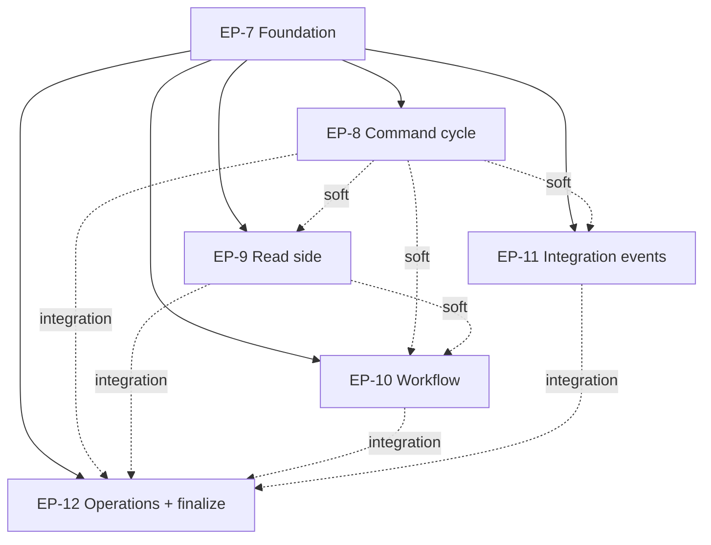

# Keiro framework documentation set

> Fill the scaffolded `content/docs/keiro/` tree with a complete, accurate, navigable
> documentation set for **keiro** — the event-sourcing framework and workflow engine at
> the top of the keiro runtime stack — including code walkthroughs of the command
> processor, inbox, outbox, and the other critical subsystems, plus guides and how-tos.

This MasterPlan is a living document. The sections Progress, Surprises & Discoveries,
Decision Log, and Outcomes & Retrospective must be kept up to date as work proceeds.

<!--
FORMATTING NOTE: Every fenced code block must declare a language tag.
Use ```mermaid for diagrams, ```text for plaintext/trees/ASCII, ```bash for
shell, ```haskell for Haskell, ```sql for SQL, ```json for JSON. Never use a
bare ``` fence.
-->


## Vision & Scope

The end state is a complete documentation set for **keiro** living under
`content/docs/keiro/` in this repository's fumadocs + TanStack Start static-SPA site,
matching the depth and house style already established for **kiroku** under
`content/docs/kiroku/` (built by `docs/plans/5-kiroku-foundation-documentation-set.md`).
A reader who lands on `/docs/keiro` can:

- understand what keiro **is** — a Haskell *library you import* (not a server you operate)
  that composes three lower libraries into an event-sourcing and workflow framework:
  **kiroku** (the append-only PostgreSQL event store), **keiki** (the pure
  symbolic-register finite-state transducer that is the decision core), and **shibuya**
  (the supervised subscription/worker substrate). The framework's thesis is that
  aggregates, process managers, sagas, and (future v2) durable workflows are all the
  *same mathematical object* — keiki's `SymTransducer phi rs s ci co` — persisted to *one*
  substrate (your Postgres);
- follow a hands-on **getting-started tutorial** that opens a store, defines an
  `EventStream` (a keiki transducer married to a codec), runs a command through the
  Hydrate → Decide → Append cycle, and reads the resulting events back — all against the
  **real** keiro API;
- learn each critical subsystem through an **explanation** essay and look up its exact
  Haskell signatures and PostgreSQL schema in a **reference** page: the command cycle
  (`Keiro.Command`), the codec / schema-evolution surface (`Keiro.Codec`), event streams
  and the typed `Stream` handle, the content-based `Router`, the read side (`Keiro.Projection`,
  `Keiro.ReadModel`, `Keiro.Snapshot`), the workflow engine (`Keiro.ProcessManager`,
  `Keiro.Timer`), and the integration-event surface (`Keiro.Inbox`, `Keiro.Outbox`,
  `Keiro.Integration.Event`);
- read **code walkthroughs** — ordered tours over the real source — for the command
  processor, the read side, the workflow engine, and the inbox/outbox integration path
  (the user explicitly asked for walkthroughs of the inbox, outbox, and command
  processor "and other critical features");
- complete focused **how-to** tasks (configure optimistic-concurrency retries, evolve an
  event schema, choose a consistency mode, run a process manager as a subscription, drive
  the timer worker, choose an inbox dedupe policy, bridge a Kafka producer to the outbox,
  tune outbox ordering/retries, enable OpenTelemetry, run the migrations, write tests with
  the test-support fixture);
- copy a **cookbook** recipe; and
- get quick answers in a **FAQ**.

A single worked example — the **`jitsurei`** package shipped in the keiro repo
(order-fulfillment and incident-escalation domains) — threads through the entire set:
every conceptual page links to the exact `jitsurei/src/Jitsurei/*.hs` module that
demonstrates the feature and the `just jitsurei-*` target that runs it.

You can see the result by running the docs dev server (`pnpm dev`, i.e. `vite dev`) — or a
production build with `pnpm build && pnpm start` — and browsing `http://localhost:3000/docs/keiro`:
the keiro tree appears in the sidebar with the page order defined by the `meta.json`
files; Haskell snippets render in PragmataPro with ligatures; and `mermaid` diagrams
render interactively.

**In scope:** all content under `content/docs/keiro/` plus a new
`docs/keiro-source-sync.md` pointer (mirroring `docs/kiroku-source-sync.md`). The docs
document keiro **as shipped at the pinned upstream commit** (`3f5dc9c`, keiro `0.1.0.0`).

**Out of scope:** building or modifying the docs app, the highlighter, the font, the
Mermaid component, or the IA/template system — those are owned by MasterPlan #1's plans
(`docs/plans/1`–`docs/plans/4`, `docs/plans/6`) and are already complete. This MasterPlan
populates content only. It also does **not** document keiro's *planned* v2 durable-execution
workflow engine as if it shipped: `Keiro.Workflow`, named steps, `keiro_workflow_steps`,
etc. do not exist in the source and must be presented (if at all) only as a clearly
labelled roadmap.


## Decomposition Strategy

The initiative is decomposed by **functional concern** (the principle in
`agents/skills/master-plan/MASTERPLAN.md`), not by Diátaxis quadrant. Slicing by quadrant
(one plan for "all reference pages", one for "all how-tos") was rejected because it would
force every plan to touch every subsystem's source, maximise cross-plan coupling, and make
no single plan independently verifiable. Slicing by subsystem means each plan reads one
coherent slice of the keiro source and produces that subsystem's full Diátaxis coverage
(explanation + reference + how-to + walkthrough, and tutorials where natural) as one
independently shippable, independently buildable unit.

The natural subsystem seams in the keiro source (`/Users/shinzui/Keikaku/bokuno/keiro`)
are: the command cycle / write path (`Keiro.Command`, `Keiro.Codec`, `Keiro.EventStream`,
`Keiro.Stream`, `Keiro.Router`); the read side (`Keiro.Projection`, `Keiro.ReadModel`,
`Keiro.Snapshot`); the workflow engine (`Keiro.ProcessManager`, `Keiro.Timer`); and the
integration-event path (`Keiro.Inbox`, `Keiro.Outbox`, `Keiro.Integration.Event`). Two
cross-cutting concerns do not belong to any one subsystem — the framework's *introduction*
(why keiro, getting started, core concepts, and the jitsurei example) and its *operations*
(telemetry, migrations, testing) plus the FAQ/cookbook and the final site-integration pass.

That yields **six** child plans grouped into **three phases**:

- **Phase 1 — Foundation (EP-7).** The landing/overview, the core-concepts explanation,
  the getting-started tutorial, the jitsurei example introduction, the
  `docs/keiro-source-sync.md` pointer, and the shared authoring conventions every other
  plan depends on (the cross-link rule, the jitsurei module map, the walkthrough-tree
  layout, the meta.json approach). This is the hard-dependency root.

- **Phase 2 — Subsystems (EP-8, EP-9, EP-10, EP-11).** Four parallel plans, one per
  subsystem seam, each producing that subsystem's explanation, reference, how-tos, and a
  code walkthrough (and tutorials where natural). The command-cycle, inbox, and outbox
  walkthroughs the user named explicitly live in EP-8 and EP-11.

- **Phase 3 — Operations & finalization (EP-12).** The cross-cutting operations docs
  (telemetry, migrations, testing), the FAQ and cookbook, and the final site-integration
  pass: order every `meta.json`, replace every "coming soon" section landing with
  `<Cards>`, and run the build + link-check gate over the whole keiro tree.

Six plans sits inside the two-to-seven guidance in MASTERPLAN.md. The phases group them
into implementation waves so the four Phase-2 plans can be implemented concurrently once
the foundation exists. Balance check: each Phase-2 plan covers a comparable surface (one
subsystem, ~3–7 pages plus a walkthrough); EP-7 and EP-12 are deliberately the bookends
(setup and reconciliation) and are smaller in page count but carry the shared-convention
and whole-tree-integrity responsibilities.


## Exec-Plan Registry

| # | Title | Path | Hard Deps | Soft Deps | Phase | Status |
|---|-------|------|-----------|-----------|-------|--------|
| 7 | Keiro overview, getting started, and the jitsurei example spine | docs/plans/7-keiro-overview-getting-started-and-the-jitsurei-example-spine.md | — | — | 1 | Complete |
| 8 | Keiro command cycle and write-path documentation | docs/plans/8-keiro-command-cycle-and-write-path-documentation.md | #7 | — | 2 | Complete |
| 9 | Keiro read-side documentation: projections, read models, and snapshots | docs/plans/9-keiro-read-side-documentation-projections-read-models-and-snapshots.md | #7 | #8 | 2 | Complete |
| 10 | Keiro workflow documentation: process managers and timers | docs/plans/10-keiro-workflow-documentation-process-managers-and-timers.md | #7 | #8, #9 | 2 | Not Started |
| 11 | Keiro integration-events documentation: inbox, outbox, and Kafka | docs/plans/11-keiro-integration-events-documentation-inbox-outbox-and-kafka.md | #7 | #8 | 2 | Not Started |
| 12 | Keiro operations, FAQ, cookbook, and docs finalization | docs/plans/12-keiro-operations-faq-cookbook-and-docs-finalization.md | #7 | #8, #9, #10, #11 | 3 | Not Started |

Status values: Not Started, In Progress, Complete, Cancelled.
Hard Deps and Soft Deps reference other rows by their `#` prefix (e.g., #7).


## Dependency Graph

EP-7 is the root. Every other plan **hard-depends** on it because EP-7 establishes
artifacts the rest of the set assumes exist and links into: the `/docs/keiro` overview and
getting-started pages that every subsystem page links back to, the core-concepts
explanation every reference page leans on, the introduction of the `jitsurei` worked
example that every conceptual page cites, the `docs/keiro-source-sync.md` source-of-truth
pointer, and the shared authoring conventions (absolute cross-links, the jitsurei module
map, the `walkthrough/` subdirectory layout, the section-`meta.json` append protocol). A
contributor cannot author an internally-consistent subsystem page without these, so the
relationship is hard, not soft.

The four Phase-2 subsystem plans (EP-8, EP-9, EP-10, EP-11) have **no hard dependencies on
each other** and can be implemented fully in parallel once EP-7 is Complete. They carry
**soft** dependencies that reflect natural reading order and cross-links but do not block
implementation, because every plan is self-contained (it embeds the source context it
needs and uses absolute links that resolve once the target page exists):

- EP-9 (read side) soft-depends on EP-8 because read models and inline projections are
  driven by the command cycle (`runCommandWithProjections` builds on
  `runCommandWithSqlEvents`); read-side pages link to the command-cycle pages for the
  write-path mechanics.
- EP-10 (workflow) soft-depends on EP-8 (process managers dispatch commands through the
  command cycle) and EP-9 (the content-based router resolves targets via a read-model
  query; sagas read models).
- EP-11 (integration events) soft-depends on EP-8 (integration events are minted from
  recorded domain events and reference event metadata / the codec surface).

EP-12 hard-depends on EP-7 (it finalizes the IA EP-7 set up) and **integration-depends** on
EP-8–EP-11: it performs the final `meta.json` ordering pass and the whole-tree build +
link-check, which require every Phase-2 plan's pages to be present. EP-12 can *begin* its
own original content (telemetry/migrations/testing/FAQ/cookbook) as soon as EP-7 is done,
but its **finalization** milestone must run last, after EP-8–EP-11 are Complete.




## Integration Points

These are the shared artifacts multiple child plans touch. Each plan must respect the
ownership and extension rules here to avoid silent conflicts.

**1. The keiro section `meta.json` files (page ordering).** The top-level
`content/docs/keiro/meta.json` already lists the sections
(`index, tutorials, how-to, reference, explanation, cookbook, walkthrough, faq`). Inside
each section, the per-section `meta.json` `pages` array is **appended to** by several plans.
Rule: each plan appends only its own page slugs to the relevant section `meta.json`; it
never reorders or removes another plan's entries. **EP-12 owns the final ordering pass** of
every section `meta.json` (and replaces each section's "coming soon" `index.mdx` landing
with a `<Cards>` index). The page-to-plan assignment is fixed in each child plan's
"Interfaces and Dependencies" section; the authoritative summary lives in EP-7.

**2. The `walkthrough/` tree.** EP-7 creates `content/docs/keiro/walkthrough/index.mdx`
(a hub linking the tours with `<Cards>`) and the initial
`content/docs/keiro/walkthrough/meta.json`. Each Phase-2 plan owns a **disjoint
subdirectory** under `walkthrough/`, each with its own `meta.json`, a `00-start-here.mdx`,
and numbered chapter files — so parallel plans never collide on a shared numbered
sequence:
  - EP-8 → `walkthrough/command-cycle/`
  - EP-9 → `walkthrough/read-side/`
  - EP-10 → `walkthrough/workflow/`
  - EP-11 → `walkthrough/integration/` (inbox + outbox)

Each Phase-2 plan appends its subdirectory's folder name to `walkthrough/meta.json` when it
creates the subdir. EP-12 finalizes the hub `<Cards>` and the `walkthrough/meta.json`
ordering. (This mirrors the kiroku site, which ships two sibling walkthrough trees,
`walkthrough/` and `write-path/`; keiro groups its tours as subdirectories under one
`walkthrough/` section.)

**3. The `jitsurei` worked-example module map.** EP-7 introduces the jitsurei package and
publishes the canonical feature→module→target map; every other plan links to the **same**
`jitsurei/src/Jitsurei/*.hs` modules and `just jitsurei-*` targets so the example reads as
one coherent story. The canonical map:
  - Order aggregate + command cycle + codec upcasting → `Jitsurei/Domain.hs`,
    `Jitsurei/OrderStream.hs`; `just jitsurei-fulfillment` (EP-8 anchor).
  - Inline projection + read model + consistency → `Jitsurei/ReadModels.hs` (EP-9 anchor).
  - Snapshots → `Jitsurei/Snapshots.hs` (`snapshotOrderEventStream`); `just jitsurei-snapshots` (EP-9).
  - Process manager + dispatch → `Jitsurei/FulfillmentProcess.hs`,
    `Jitsurei/EscalationProcess.hs`; durable timers → `Jitsurei/Timers.hs`;
    `just jitsurei-escalation` (EP-10 anchor).
  - Content-based / effectful fan-out routers → `Jitsurei/Paging.hs`,
    `Jitsurei/AgentQualRouter.hs`, with `Jitsurei/Incident.hs`, `Jitsurei/OncallRoster.hs`;
    `just jitsurei-paging`, `just jitsurei-agent-qual` (EP-8 router page + EP-10).
  - Integration events (inbox/outbox) → the keiro `Keiro.Inbox`/`Keiro.Outbox` modules and
    the keiro repo's `docs/guides/integration-events-with-kafka.md`; jitsurei does not ship
    a Kafka demo, so EP-11 documents the API and the keiro guide, not a jitsurei target.

**4. `docs/keiro-source-sync.md` (the source-of-truth pointer).** EP-7 creates it, mirroring
`docs/kiroku-source-sync.md`, pinning the keiro upstream commit `3f5dc9c` (resolve the path
with `mori registry show shinzui/keiro --full`). All plans cross-check snippets against the
pinned source. EP-12 verifies the pointer's "most-coupled pages" list covers the pages each
plan added.

**5. The `IntegrationEvent` envelope (`Keiro.Integration.Event`).** Shared between EP-11
(inbox + outbox both serialize/deserialize it) and referenced by EP-8 (event metadata and
the codec). **EP-11 owns the `IntegrationEvent` reference page**; EP-8 links to it rather
than re-documenting it.

**6. Shared authoring rules (apply to every plan).** (a) Cross-page links use **absolute**
doc paths (`/docs/keiro/...`), never relative `./` or `../` — relative MDX links resolve
wrong in the static SPA and trip the prerender crawler (a hard-won kiroku lesson, recorded
in `docs/plans/5`'s Surprises). (b) Author every Haskell snippet against the **real, shipped**
signatures and cross-check the pinned source; keiro's in-repo `docs/research/*` and
`docs/plans/*` notes **predate the implementation and diverge** (renamed types, different
SQL columns, unimplemented features) — trust the source, not the notes. (c) Every fenced
code block declares a language tag.


## Progress

Milestone-level progress across all child plans. Each child plan maintains its own granular
Progress; this is the at-a-glance roll-up. Check items as the child plans' milestones land.

- [x] EP-7: Overview/landing + core-concepts explanation authored. _(2026-06-01)_
- [x] EP-7: Getting-started tutorial authored (open store → EventStream → runCommand → read back). _(2026-06-01)_
- [x] EP-7: jitsurei example introduced + module map page; `docs/keiro-source-sync.md` created; conventions fixed. _(2026-06-01)_
- [x] EP-8: Command-cycle explanation + reference (Command, Codec, EventStream, Stream, Router) authored. _(2026-06-01)_
- [x] EP-8: Command-cycle how-tos + `walkthrough/command-cycle/` tour authored. _(2026-06-01)_
- [x] EP-9: Read-side explanation + reference (Projection, ReadModel, Snapshot) authored. _(2026-06-01)_
- [x] EP-9: Read-side how-tos + `walkthrough/read-side/` tour authored. _(2026-06-01; + tutorial your-first-read-model.)_
- [ ] EP-10: Workflow explanation + reference (ProcessManager, Timer) authored.
- [ ] EP-10: Workflow how-tos + tutorial + `walkthrough/workflow/` tour authored.
- [ ] EP-11: Integration-events explanation + reference (Inbox, Outbox, IntegrationEvent) authored.
- [ ] EP-11: Integration-events how-tos + `walkthrough/integration/` tour (inbox + outbox) authored.
- [ ] EP-12: Operations docs authored (telemetry, migrations, testing) + FAQ + cookbook.
- [ ] EP-12: Finalization — all meta.json ordered, section landings carry `<Cards>`, build + link-check pass over the keiro tree.


## Surprises & Discoveries

Cross-plan insights, dependency changes, and scope adjustments discovered during the
initiative. (Per-subsystem source findings live in each child plan; this records things
that affect more than one plan.)

- **The keiro repo's `docs/research/*` and `docs/plans/*` notes predate the shipped code
  and diverge from it in many concrete ways** — renamed types (`AggregateId a` →
  `Stream a`), different `CommandError` variants, different SQL column names/status enums
  for `keiro_timers`/`keiro_outbox`/`keiro_inbox`, the process-manager transaction model
  (separate transactions, not one multi-stream commit), a synchronous (not fire-and-forget)
  snapshot write, and several unimplemented features (the read-model shadow-table rebuild,
  the v2 `Keiro.Workflow` durable-execution engine, timer cancellation SQL, stale
  `publishing`-row recovery in the outbox). Bearing: **every plan documents the source as
  shipped**, treats the notes as rationale/history, and flags the known gaps honestly.
  Evidence: the six subsystem research reports captured during MasterPlan creation
  (2026-06-01); see each child plan's Context section.

- **The walkthrough hub must be created by EP-7 but finalized by EP-12, because the prerender
  crawler follows `<Card href>`s.** (Discovered implementing EP-7, 2026-06-01.) EP-7 builds
  `content/docs/keiro/walkthrough/index.mdx`, the hub. If its `<Cards>` link to the four tours'
  `…/00-start-here` pages (authored by EP-8 … EP-11) before those pages exist, `pnpm build` exits 0
  **but** the crawler emits `[unhandledRejection] … Failed to fetch …/00-start-here` for each — a
  link-check failure. **Resolution / contract reaffirmed:** EP-7 ships the hub `<Cards>` *without*
  `href`s and sets `walkthrough/meta.json` to `["index"]`; this matches Integration Point #2.
  Bearing on later plans: **EP-8 … EP-11** must each (a) append their subdir folder name
  (`command-cycle` / `read-side` / `workflow` / `integration`) to
  `content/docs/keiro/walkthrough/meta.json` when they create their subdir, and (b) author a real
  `00-start-here.mdx`. **EP-12** must add the four `href`s back onto the hub `<Cards>` (each
  pointing at its tour's `00-start-here`) as part of the finalization pass, and order
  `walkthrough/meta.json`. Evidence: EP-7's build log on 2026-06-01 (four `Failed to fetch` lines
  with `href`s present; `OK: no crawler warnings` after removing them).
  - **(Update, implementing EP-8, 2026-06-01.)** EP-8 added `"command-cycle"` to
    `walkthrough/meta.json` (its subdir now exists with real chapters), so the command-cycle tour is
    navigable from the sidebar; its hub `<Card>` is still href-less, awaiting EP-12.

- **Forward-links to not-yet-authored sibling pages are parked on the section landing until their
  owner lands.** (Discovered implementing EP-8, 2026-06-01.) The same crawler behavior that bit the
  walkthrough hub bites any premature cross-link: EP-8 needed to reference EP-9's
  `reference/projection` and `reference/snapshot`, EP-10's `reference/process-manager`, and EP-11's
  `reference/integration-event`, none of which exist yet. EP-8 links the existing landing
  `/docs/keiro/reference` and names the target page in prose. **Bearing:** EP-9, EP-10, and EP-11
  author those reference pages; **EP-12's finalization pass must upgrade these landing links to the
  precise slugs** (grep the keiro tree for `](/docs/keiro/reference)` occurrences that name a
  specific page in nearby prose). Evidence: EP-8 `pnpm build` clean + `pnpm lint:links` 97 files, no
  broken internal links.


## Decision Log

- Decision: Decompose by **subsystem** (six plans, three phases), not by Diátaxis quadrant.
  Rationale: a per-subsystem plan reads one coherent slice of source and ships that
  subsystem's full Diátaxis coverage as an independently verifiable unit; a per-quadrant
  split would couple every plan to every subsystem and defeat independent verifiability
  (MASTERPLAN.md "decompose by functional concern").
  Date: 2026-06-01
- Decision: Mirror the **kiroku documentation set** (`docs/plans/5`) for depth, house
  style, Diátaxis mapping, and the source-sync-pointer mechanism; mirror its hard-won
  lessons (absolute cross-links; source-over-notes snippet accuracy).
  Rationale: kiroku's set is the established, accepted precedent in this repo; consistency
  across the runtime libraries is a goal.
  Date: 2026-06-01
- Decision: Give each Phase-2 plan a **disjoint walkthrough subdirectory** under
  `walkthrough/` rather than a single shared numbered sequence.
  Rationale: parallel plans must not collide on chapter numbering; a recent kiroku change
  had to renumber a whole walkthrough sequence when a chapter was inserted (commit history),
  exactly the churn disjoint subdirs avoid.
  Date: 2026-06-01
- Decision: Document keiro **as shipped at the pinned commit `3f5dc9c` (keiro 0.1.0.0)**;
  present the planned v2 durable-execution workflow engine only as a clearly labelled
  roadmap, never as a shipped API.
  Rationale: self-containment and accuracy — `Keiro.Workflow` and its tables do not exist
  in the tree; documenting them as real would make examples uncompilable.
  Date: 2026-06-01
- Decision: All four Phase-2 plans hard-depend on EP-7 only; inter-subsystem relationships
  are modelled as soft/integration dependencies so Phase 2 parallelizes.
  Rationale: minimise serialization while respecting that every page links back to the
  shared foundation; self-contained plans + absolute links make soft deps non-blocking.
  Date: 2026-06-01


## Outcomes & Retrospective

(To be filled during and after implementation. Compare the result against the Vision &
Scope: a complete, accurate, navigable keiro doc set matching the kiroku precedent, with
walkthroughs of the command processor, inbox, outbox, and the other critical subsystems,
plus guides and how-tos, all building and link-checking cleanly.)
