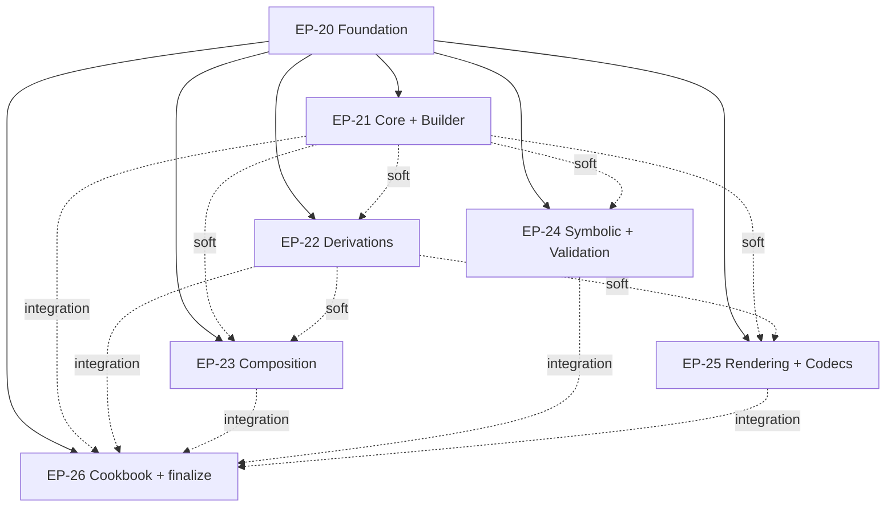

# Keiki framework documentation set

> Fill the scaffolded `content/docs/keiki/` tree with a complete, accurate, navigable
> documentation set for **keiki** — the pure, dependency-free symbolic-register
> finite-state transducer that is the decision core of the keiro runtime — teaching
> developers how to model **type-safe aggregates and process managers** with it across
> many domains, including a theory foundation, an authoring tutorial spine, per-module
> references, ordered code walkthroughs of the real source, and a domain-driven cookbook.

This MasterPlan is a living document. The sections Progress, Surprises & Discoveries,
Decision Log, and Outcomes & Retrospective must be kept up to date as work proceeds.

<!--
FORMATTING NOTE: Every fenced code block must declare a language tag.
Use ```mermaid for diagrams, ```text for plaintext/trees/ASCII, ```bash for
shell, ```haskell for Haskell, ```json for JSON. Never use a bare ``` fence.
-->


## Vision & Scope

The end state is a complete documentation set for **keiki** living under
`content/docs/keiki/` in this repository's fumadocs + TanStack Start static-SPA site,
matching the depth and house style already established for **keiro** under
`content/docs/keiro/` (MasterPlan #2) and **kiroku** under `content/docs/kiroku/`. A
reader who lands on `/docs/keiki` can:

- understand what keiki **is** — a pure, IO-free Haskell *library you import* (not a
  server, not a runtime) whose one formalism, the **symbolic-register finite-state
  transducer** `SymTransducer phi rs s ci co`, models event sourcing, workflow engines,
  and durable execution as a single mathematical object. keiki is a hybrid of **Symbolic
  Finite Transducers** (edges labelled by *predicates* over an infinite input domain, not
  enumerated symbols) and **Streaming String Transducers** (a typed **register file**
  carried alongside the control state). Its load-bearing property is that from one
  `SymTransducer` declaration it **mechanically derives** the Chassaing-shape `Decider`,
  input/output `Acceptor`s, per-vertex projections, composition combinators, and an opt-in
  SBV+z3 single-valuedness CI gate — so `decide` and `evolve` cannot silently disagree;
- understand keiki's place in the keiro family: it is the **pure-semantics foundation**,
  distinct from **kiroku** (記録, the append-only PostgreSQL event store), **shibuya** (the
  supervised subscription/worker substrate), and **keiro** (経路, the framework that
  composes all three). keiro's `EventStream` literally marries a keiki `SymTransducer` to a
  codec, an initial state, and a snapshot policy;
- follow a hands-on **getting-started tutorial** that authors the smallest useful aggregate
  (the `EmailDelivery` two-vertex state machine from the README "A taste") end to end with
  the `Keiki.Builder` DSL, runs it (`cabal build`/`cabal test`), feeds a command through the
  derived step, and watches `reconstitute` recover state with no hand-written `evolve` — all
  against the **real** keiki API;
- learn each capability through an **explanation** essay (including the theory foundations —
  event sourcing and the decider, finite automata and transducers, deriving event sourcing
  via projections, data-carrying alphabets, why SMT) and look up its exact Haskell
  signatures in a **reference** page: the transducer core (`Keiki.Core`), the authoring DSL
  (`Keiki.Builder`, `Keiki.Operators`), the derivations (`Keiki.Decider`, `Keiki.Acceptor`,
  `Keiki.Generics`, `Keiki.Generics.TH`, `Keiki.Shape`), the composition algebra
  (`Keiki.Composition`, `Keiki.Profunctor`), the symbolic/validation surface
  (`Keiki.Symbolic`, the `validateTransducer` umbrella in `Keiki.Core`), the renderers
  (`Keiki.Render.*`), and the sibling JSON codec package (`keiki-codec-json`);
- read **deep code walkthroughs** — ordered, source-faithful tours that read the real
  `keiki` source end to end so a developer can contribute to keiki or gain real confidence
  in how it works. The tours cover the transducer core and builder, the derivations, the
  composition algebra, the symbolic/validation machinery, and the renderers/codecs;
- complete focused **how-to** tasks (write a multi-event command, model a collection as a
  scalar tally, derive aggregate constructors, read a per-vertex view, compose two
  transducers, model a saga with feedback, build a cross-context process, assert a
  transducer is well-formed in CI, diagnose a rejected command, render a Mermaid diagram,
  derive a JSON event codec, persist a register snapshot); and
- learn how to **model their own domain properly** — the central user ask — through a
  domain-driven **cookbook** and **worked-example tutorials** that thread a single spine of
  aggregates (email delivery, an order cart with collections, a user-registration lifecycle,
  a loan-application process manager across bounded contexts) plus a real **FAQ**.

A single worked-example spine — the **`jitsurei`** package shipped *inside the keiki repo*
(`jitsurei/src/Jitsurei/*.hs`) and driven by the test suite — threads through the entire
set: every conceptual page links to the exact module and the test that proves it. The
canonical spine is the capability ladder EmailDelivery → OrderCart → UserRegistration
(+V0) → LoanApplication → Loan/CoreBankingSync/LoanWorkflow (see Integration Point 3).

You can see the result by running the docs dev server (`pnpm dev`) — or a production build
with `pnpm build && pnpm start` — and browsing `http://localhost:3000/docs/keiki`: the
keiki tree appears in the sidebar with the page order defined by the `meta.json` files;
Haskell snippets render in PragmataPro with ligatures; and `mermaid` diagrams render
interactively.

**In scope:** all content under `content/docs/keiki/` (the existing scaffold already has
`index`, `tutorials`, `how-to`, `reference`, `explanation`, `cookbook`, `walkthrough`, and
`faq` sections, each with a stub `index.mdx` + `meta.json`) plus a new
`docs/keiki-source-sync.md` pointer (mirroring `docs/keiro-source-sync.md` and
`docs/kiroku-source-sync.md`). The docs document keiki **as shipped at the pinned upstream
commit** `344c4ca` (keiki `0.1.0.0`, with the sibling `keiki-codec-json` `0.1.0.0`).

**Out of scope:** building or modifying the docs app, the highlighter, the font, the
Mermaid component, or the IA/template system — those are owned by MasterPlan #1's plans and
are already complete; this MasterPlan populates content only. It also does **not** document
keiki's internal `docs/research/*`, `docs/plans/*`, or `docs/historical/*` design notes as
if they were the shipped API — those notes predate the implementation and diverge from it
(see Surprises & Discoveries); the docs document the source as shipped. The keiki↔keiro
*persistence* path (how keiro's snapshot codec uses keiki's register codec and shape hash)
is documented from keiki's side only — the keiro side is owned by MasterPlan #2.


## Decomposition Strategy

The initiative is decomposed by **capability layer** (the principle in
`agents/skills/master-plan/MASTERPLAN.md` — decompose by functional concern, not by file or
by Diátaxis quadrant), not by Diátaxis quadrant. Slicing by quadrant (one plan for "all
reference pages", one for "all how-tos") was rejected for the same reason MasterPlan #2
rejected it: it would force every plan to touch every module's source, maximise cross-plan
coupling, and make no single plan independently verifiable. Slicing by capability layer
means each plan reads one coherent slice of the keiki source (a small set of cohesive
modules) and produces that capability's full Diátaxis coverage (explanation + reference +
how-to + walkthrough, and tutorials where natural) as one independently shippable,
independently buildable unit.

The natural capability seams in the keiki source
(`/Users/shinzui/Keikaku/bokuno/keiki/src/Keiki/`) are: the **transducer core and authoring
DSL** (`Core`, `Builder`, `Operators`, `Internal.Slots` — the "type-safe aggregates"
heart); the **derivations** (`Decider`, `Acceptor`, `Generics`, `Generics.TH`, `Shape` —
what is mechanically produced from one declaration); the **composition algebra**
(`Composition`, `Profunctor` — process managers, sagas, choreography); the **symbolic and
validation** surface (`Symbolic`, the `validateTransducer` umbrella in `Core`, the
`stepEither`/`StepFailure` diagnostics); and the **rendering and codecs** surface
(`Render.{Mermaid,Markdown,Inspector,Pretty}` plus the sibling `keiki-codec-json` package).
Two cross-cutting concerns do not belong to any one capability — the framework's
*introduction and theory* (why keiki, getting started, the foundations essays, and the
jitsurei spine) and its *domain guidance* (the cookbook, the worked-example tutorials, the
FAQ, and the final site-integration pass).

That yields **seven** child plans grouped into **three phases**:

- **Phase 1 — Foundation (EP-20).** The landing/overview, the theory foundations as
  explanation essays, the getting-started tutorial, the `jitsurei` worked-example spine and
  its canonical module map, the `docs/keiki-source-sync.md` pointer, the walkthrough hub,
  and the shared authoring conventions every other plan depends on. This is the
  hard-dependency root.

- **Phase 2 — Capabilities (EP-21, EP-22, EP-23, EP-24, EP-25).** Five parallel plans, one
  per capability seam, each producing that capability's explanation, reference, how-tos, and
  a disjoint code walkthrough (and tutorials where natural). EP-21 owns the **type-safe
  aggregates** heart (core + builder); EP-23 owns the **process managers / sagas /
  choreography** story (composition) — the two capabilities the user named explicitly.

- **Phase 3 — Domain cookbook & finalization (EP-26).** The domain-driven cookbook and the
  worked-example tutorials that show developers how to model their own domains, the FAQ, and
  the final site-integration pass: order every `meta.json`, replace every "coming soon"
  section landing with `<Cards>`, wire the walkthrough hub `<Card href>`s, and run the build
  + link-check gate over the whole keiki tree.

Seven plans sits at the top of the two-to-seven guidance in MASTERPLAN.md, which is why the
work is **phased**: the five Phase-2 capability plans are an implementation wave that runs
concurrently once the foundation exists, and Phase 3 runs last because finalization needs
every Phase-2 page present. Balance check: each Phase-2 plan covers a comparable surface
(one capability, ~3–6 pages plus a 6–11-chapter walkthrough); EP-20 and EP-26 are
deliberately the bookends (setup and reconciliation) and carry the shared-convention and
whole-tree-integrity responsibilities. Compared with MasterPlan #2, keiki's walkthroughs are
authored at **contribution-grade depth in the first pass** (each Phase-2 plan walks its
modules' real source end to end) rather than landing thin and being deepened in a later
phase — the explicit lesson recorded in MasterPlan #2's Surprises & Discoveries.


## Exec-Plan Registry

| # | Title | Path | Hard Deps | Soft Deps | Phase | Status |
|---|-------|------|-----------|-----------|-------|--------|
| 20 | Keiki foundation: theory, getting started, and the worked-example spine | docs/plans/20-keiki-foundation-theory-getting-started-and-the-worked-example-spine.md | — | — | 1 | Complete |
| 21 | Keiki transducer core and authoring aggregates | docs/plans/21-keiki-transducer-core-and-authoring-aggregates.md | EP-20 | — | 2 | Complete |
| 22 | Keiki derivations: decider, acceptors, projections, and generics | docs/plans/22-keiki-derivations-decider-acceptors-projections-and-generics.md | EP-20 | EP-21 | 2 | Complete |
| 23 | Keiki composition: process managers, sagas, and choreography | docs/plans/23-keiki-composition-process-managers-sagas-and-choreography.md | EP-20 | EP-21, EP-22 | 2 | Complete |
| 24 | Keiki symbolic analysis, build-time validation, and diagnostics | docs/plans/24-keiki-symbolic-analysis-build-time-validation-and-diagnostics.md | EP-20 | EP-21 | 2 | Not Started |
| 25 | Keiki rendering, diagrams, and JSON codecs | docs/plans/25-keiki-rendering-diagrams-and-json-codecs.md | EP-20 | EP-21, EP-22 | 2 | Not Started |
| 26 | Keiki domain cookbook, worked-example tutorials, FAQ, and finalization | docs/plans/26-keiki-domain-cookbook-worked-example-tutorials-faq-and-finalization.md | EP-20 | EP-21, EP-22, EP-23, EP-24, EP-25 | 3 | Not Started |

Status values: Not Started, In Progress, Complete, Cancelled.
Hard Deps and Soft Deps reference other rows by their `EP-` prefix (e.g., EP-20).


## Dependency Graph

EP-20 is the root. Every other plan **hard-depends** on it because EP-20 establishes
artifacts the rest of the set assumes exist and links into: the `/docs/keiki` overview and
getting-started pages that every capability page links back to, the foundations/theory
explanation essays every reference and walkthrough page leans on, the introduction of the
`jitsurei` worked-example spine that every conceptual page cites, the
`docs/keiki-source-sync.md` source-of-truth pointer, the walkthrough hub
(`walkthrough/index.mdx`), and the shared authoring conventions (absolute cross-links, the
jitsurei module map, the `walkthrough/` subdirectory layout, the section-`meta.json` append
protocol). A contributor cannot author an internally-consistent capability page without
these, so the relationship is hard, not soft.

The five Phase-2 capability plans (EP-21 … EP-25) have **no hard dependencies on each other**
and can be implemented fully in parallel once EP-20 is Complete. They carry **soft**
dependencies that reflect natural reading order and cross-links but do not block
implementation, because every plan is self-contained (it embeds the source context it needs
and uses absolute links that resolve once the target page exists):

- EP-22 (derivations) soft-depends on EP-21 because everything it documents is *derived from*
  the `SymTransducer` that EP-21 introduces; its pages link to EP-21's `the-symtransducer`
  and `registers-vs-state` explanation pages rather than re-deriving the model.
- EP-23 (composition) soft-depends on EP-21 (a composite is built from the same
  `SymTransducer` model and the same `Guarded` alias) and EP-22 (composition preserves the
  derivations — `solveOutput`, `checkHiddenInputs`, single-valuedness — so the composition
  pages reference the derivation pages).
- EP-24 (symbolic/validation) soft-depends on EP-21 (the guard language `HsPred`, the
  `BoolAlg`/`Sat` classes, and the `stepEither`/`StepFailure` diagnostics all live in
  `Keiki.Core`, which EP-21 documents; EP-24 documents the *symbolic* re-tagging and the
  *validation umbrella* over that same surface).
- EP-25 (rendering/codecs) soft-depends on EP-21 (renderers project the `SymTransducer`/`Edge`
  surface) and EP-22 (the JSON register codec pairs with `Keiki.Shape`'s `regFileShapeHash`,
  which EP-22 owns — see Integration Point 5).

EP-26 hard-depends on EP-20 (it finalizes the IA EP-20 set up) and **integration-depends** on
EP-21 … EP-25: it performs the final `meta.json` ordering pass, wires the walkthrough hub
`<Card href>`s, and runs the whole-tree build + link-check, all of which require every
Phase-2 plan's pages to be present. EP-26 can *begin* its own original content (the cookbook
recipes, the worked-example tutorials, the FAQ) as soon as EP-20 is done — every recipe is
anchored to a jitsurei module that already exists — but its **finalization** milestone must
run last, after EP-21 … EP-25 are Complete.




## Integration Points

These are the shared artifacts multiple child plans touch. Each plan must respect the
ownership and extension rules here to avoid silent conflicts.

**1. The keiki section `meta.json` files (page ordering).** The top-level
`content/docs/keiki/meta.json` already lists the sections
(`index, tutorials, how-to, reference, explanation, cookbook, walkthrough, faq`). Inside each
section, the per-section `meta.json` `pages` array currently holds only `["index"]` and is
**appended to** by several plans. Rule: each plan appends only its own page slugs to the
relevant section `meta.json`; it never reorders or removes another plan's entries. **EP-26
owns the final ordering pass** of every section `meta.json` (and replaces each section's
"coming soon" `index.mdx` landing with a `<Cards>` index). The page-to-plan assignment is
fixed in each child plan's "Interfaces and Dependencies" section; the authoritative summary
lives in EP-20.

**2. The `walkthrough/` tree.** EP-20 creates `content/docs/keiki/walkthrough/index.mdx` (a
hub linking the tours with `<Cards>`) and leaves `walkthrough/meta.json` as `["index"]`. Per
the hard-won crawler lesson recorded in MasterPlan #2's Surprises, EP-20 ships the hub
`<Cards>` **without `href`s** (a `<Card href>` to a not-yet-authored page makes `pnpm build`
emit a crawler `Failed to fetch` link-check failure). Each Phase-2 plan owns a **disjoint
subdirectory** under `walkthrough/`, each with its own `meta.json`, a `00-start-here.mdx`,
and numbered chapter files — so parallel plans never collide on a shared numbered sequence:
  - EP-21 → `walkthrough/core-and-builder/`
  - EP-22 → `walkthrough/derivations/`
  - EP-23 → `walkthrough/composition/`
  - EP-24 → `walkthrough/symbolic-and-validation/`
  - EP-25 → `walkthrough/rendering-and-codecs/`

Each Phase-2 plan, when it creates its subdir, **appends** its subdirectory folder name to
`walkthrough/meta.json` and authors a real `00-start-here.mdx`, so its tour is
sidebar-navigable — but it does **not** add its hub `<Card href>`. **EP-26 finalizes** the
hub `<Card href>`s (one per tour, each pointing at that tour's `00-start-here`) and runs the
final `walkthrough/meta.json` ordering pass, so every intermediate `pnpm build` stays clean.

**3. The `jitsurei` worked-example spine (the canonical module map).** EP-20 introduces the
jitsurei package and publishes the canonical capability→module→test map; every other plan
links to the **same** `jitsurei/src/Jitsurei/*.hs` modules and their `jitsurei/test/...` specs
so the example reads as one coherent story. The canonical spine (all paths under the keiki
repo, `/Users/shinzui/Keikaku/bokuno/keiki/`):
  - **EmailDelivery** (smallest aggregate: single command, single event, builder↔AST
    equivalence, B-view) → `jitsurei/src/Jitsurei/EmailDelivery.hs`;
    `jitsurei/test/Jitsurei/EmailDeliveryBuilderSpec.hs`, `EmailDeliveryViewSpec.hs`.
    Tutorial + getting-started anchor (EP-20, EP-21).
  - **OrderCart** (multi-command lifecycle, the collection-as-scalar-tally pattern,
    `deriveAggregate` fused splice, symbolic witnesses) →
    `jitsurei/src/Jitsurei/OrderCart.hs`; `OrderCartBuilderSpec.hs`, `OrderCartSymbolicSpec.hs`.
    Authoring + symbolic anchor (EP-21, EP-24).
  - **UserRegistration** (full lifecycle, multi-event command, ε-edge/`noEmit`, equality
    guard) → `jitsurei/src/Jitsurei/UserRegistration.hs`; `UserRegistrationBuilderSpec.hs`,
    `UserRegistrationGSMSpec.hs`, `UserRegistrationViewSpec.hs`, `UserRegistrationSymbolicSpec.hs`.
    The canonical running example for the theory essays (EP-20) and authoring (EP-21).
  - **UserRegistrationV0** (the deliberately broken schema — the hidden-input / replay-failure
    teaching foil) → `jitsurei/src/Jitsurei/UserRegistrationV0.hs`; `UserRegistrationV0Spec.hs`.
    Schema-evolution + validation anchor (EP-24, EP-26 cookbook).
  - **LoanApplication** (multi-field threshold guards over money/scores — the realistic
    symbolic-gate domain) → `jitsurei/src/Jitsurei/LoanApplication.hs`;
    `LoanApplicationBuilderSpec.hs`, `LoanApplicationSymbolicSpec.hs`, `LoanApplicationViewSpec.hs`.
    Symbolic + cookbook anchor (EP-24, EP-26).
  - **Loan / CoreBankingSync / LoanWorkflow** (the cross-context **process manager** capstone:
    a downstream aggregate, an events-in/commands-out Process, and the `compose` +
    `lmapMaybeCi` wiring) → `jitsurei/src/Jitsurei/{Loan,CoreBankingSync,LoanWorkflow}.hs`;
    `LoanSpec.hs`, `CoreBankingSyncSpec.hs`, `LoanWorkflowSpec.hs`. Composition anchor (EP-23),
    process-manager tutorial (EP-26).

**4. `docs/keiki-source-sync.md` (the source-of-truth pointer).** EP-20 creates it, mirroring
`docs/keiro-source-sync.md`, pinning the keiki upstream commit `344c4ca` (keiki 0.1.0.0,
keiki-codec-json 0.1.0.0; resolve the on-disk path with `mori registry show shinzui/keiki
--full`). All plans cross-check snippets against the pinned source. EP-26 verifies the
pointer's "most-coupled pages" list covers the pages each plan added (the source-faithful
walkthrough chapters and the signature-transcribing reference pages).

**5. The transducer model and the snapshot/shape-hash concept (the two most-shared
concepts).** Two cross-plan concepts need a single owner so plans don't contradict each other:
  - **The `SymTransducer` model and state-vs-registers.** **EP-21 owns** the canonical
    *conceptual* treatment: what `SymTransducer phi rs s ci co` is, what each type parameter
    means, the difference between the control **state `s`** (finite lifecycle vertices) and
    the **register file `rs`** (typed data memory), and the `delta`/`omega`/`step`/`reconstitute`
    semantics. The pages are `explanation/the-symtransducer.mdx` and
    `explanation/registers-vs-state.mdx`. Every other Phase-2 plan **links to these** rather
    than re-deriving the model. (EP-20's theory essays introduce the *formalism* — automata,
    projections, data-carrying alphabets — and link **forward** to EP-21's concrete model; the
    two read as one thread.)
  - **The snapshot / shape-hash persistence boundary.** keiki has two cooperating pieces here,
    in two packages, so ownership is split: **EP-22 owns `Keiki.Shape`** — `regFileShapeHash`,
    `renderStableTypeRep`, and *why* the hash is the GHC-upgrade-stable discriminator a snapshot
    persister keys on (the page is `reference/shape.mdx` + an explanation of the model). **EP-25
    owns `keiki-codec-json`** — the `RegFile` JSON codec (`RegFileToJSON`, the two encoder
    paths) and the *two-discriminant* snapshot-eligibility story (a snapshot is eligible iff
    both `state_codec_version` and `regfile_shape_hash` match). EP-25's snapshot page **links to
    EP-22's `reference/shape.mdx`** for the hash; EP-22's shape page **links forward to EP-25**
    for "how an eligible RegFile is serialized." Neither plan re-documents the other's half.
    Note for both: `regFileShapeHash`/`Keiki.Shape` lives in the **`keiki`** package (no aeson
    dependency); the codec lives in **`keiki-codec-json`**. This is the keiki side of the same
    boundary MasterPlan #2's keiro read-side tour documents from the keiro side.

**6. The Decider façade framing (must read as legacy/compatibility).** **EP-22 owns** the
`Keiki.Decider` reference (`reference/decider.mdx`) and the
`explanation/decider-facade-and-when-to-use-it.mdx` page. The Decider must be presented as a
**migration-smoothing compatibility façade** for developers coming from the naive
functional-event-sourcing "decider" world — *not* as keiki's recommended everyday API. The
recommended surface is the transducer itself (`step`/`stepEither`/`delta`/`omega`/`reconstitute`,
EP-21). This mirrors MasterPlan #2's hard-won "Decide → Transduce" rename: the word "Decider"
names a legacy shape, and the `explanation/why-symtransducer-not-decider` contrast already
lives in the keiro docs. Every plan that mentions deciding must use ordinary-English "decide"
verbs or point at EP-22's façade page; no plan may present `toDecider` as the default way to
run an aggregate. **Accuracy note:** the shipped `Decider` record has **five** fields and two
state parameters (`decide`, `evolve`, `evolveStreaming`, `initialState`, `isTerminal`), not
the four-field Chassaing record still quoted in the module's own haddock and in keiki's
`docs/research/*` notes — trust the source signature.

**7. Shared authoring rules (apply to every plan).** (a) Cross-page links use **absolute** doc
paths (`/docs/keiki/...`, `/docs/keiro/...`), never relative `./` or `../` — relative MDX
links resolve wrong in the static SPA and trip the prerender crawler (a hard-won kiroku/keiro
lesson). (b) Author every Haskell snippet against the **real, shipped** signatures at the
pinned source `344c4ca` and cross-check it; keiki's in-repo `docs/research/*`,
`docs/historical/*`, and `docs/plans/*` notes **predate the implementation and diverge** from
it (see Surprises) — trust the source, not the notes. (c) Every fenced code block declares a
language tag (` ```haskell `, ` ```mermaid `, ` ```text `, ` ```bash `, ` ```json `). (d)
Hand-authored MDX in this repo does **not** pass `oxfmt --check` cleanly repo-wide; match the
neighbouring `content/docs/keiro/*` file style, do not reformat. (e) Reuse the page templates
in `content/docs/_templates/` (`tutorial.mdx`, `reference.mdx`, `explanation.mdx`,
`theory-explainer.mdx`, `how-to.mdx`, `cookbook-recipe.mdx`, `code-walkthrough.mdx`,
`faq.mdx`).


## Progress

Milestone-level progress across all child plans. Each child plan maintains its own granular
Progress; this is the at-a-glance roll-up. Check items as the child plans' milestones land.

- [x] EP-20: Overview/landing + foundations theory explanation essays authored.
- [x] EP-20: Getting-started tutorial authored (build EmailDelivery → run a command → reconstitute).
- [x] EP-20: jitsurei spine module map + `docs/keiki-source-sync.md` + walkthrough hub + conventions fixed.
- [x] EP-21: Core + builder explanation + reference (Core, Builder, Operators) authored.
- [x] EP-21: Core + builder how-tos + `walkthrough/core-and-builder/` tour authored.
- [x] EP-22: Derivations explanation + reference (Decider, Acceptor, Generics, Generics.TH, Shape) authored.
- [x] EP-22: Derivations how-tos + `walkthrough/derivations/` tour authored.
- [x] EP-23: Composition explanation + reference (Composition, Profunctor) authored.
- [x] EP-23: Composition how-tos + `walkthrough/composition/` tour authored (process-manager emphasis).
- [ ] EP-24: Symbolic/validation explanation + reference (Symbolic, validate, step-failure) authored.
- [ ] EP-24: Symbolic/validation how-tos + `walkthrough/symbolic-and-validation/` tour authored.
- [ ] EP-25: Rendering + codecs explanation + reference (Render.*, keiki-codec-json) authored.
- [ ] EP-25: Rendering + codecs how-tos + `walkthrough/rendering-and-codecs/` tour authored.
- [ ] EP-26: Domain cookbook recipes + worked-example tutorials + FAQ authored.
- [ ] EP-26: Finalization — all meta.json ordered, section landings carry `<Cards>`, hub hrefs wired, build + link-check pass over the keiki tree.


## Surprises & Discoveries

Cross-plan insights, dependency changes, and scope adjustments discovered during the
initiative. (Per-capability source findings live in each child plan; this records things that
affect more than one plan.) The following were established during MasterPlan creation (the
seven capability research reports of 2026-06-07) and bear on multiple child plans:

- **keiki's in-repo design notes diverge from the shipped source — every plan documents the
  source as shipped.** keiki's `docs/research/*`, `docs/historical/*`, and `docs/plans/*` are
  design-time notes that predate or diverge from the implementation in several concrete ways:
  the `Keiki.Decider` record is now **five fields / two state params** (adds `evolveStreaming`),
  not the four-field Chassaing record the notes and the module's own haddock still quote; the
  formalism-choice note still describes a `toMultiDecider`/state-refinement path that the
  shipped GSM `[OutTerm]` output-widening + `InFlight` streaming replaced; `Keiki.Generics`
  exports more than its design note lists (`mkInCtor0`, `mkWireCtor0`, `RegFieldsOf`). **Bearing:**
  EP-21 … EP-26 author against the module headers and test specs, treat the notes as
  rationale/history, and flag gaps honestly. (Integration Point 6, 7b.)

- **`validateTransducer` lives in `Keiki.Core`, not `Keiki.Render.Validate`.** The build-time
  validation umbrella (`validateTransducer`, `ValidationOptions`, `TransducerValidationWarning`,
  the determinism/dead-edge/hidden-input/opaque-guard checks) is exported from **`Keiki.Core`**.
  `Keiki.Render.Validate` is a *different*, unrelated module — a heuristic Mermaid-diagram/atlas
  *text* checker (`validateMermaidDiagram`/`validateMermaidAtlas`). **Bearing:** EP-24 documents
  the transducer validator from `Keiki.Core`; EP-25 documents the Mermaid validator from
  `Keiki.Render.Validate`. Each must include one disambiguating sentence so readers do not
  conflate the two "validate" surfaces. (Affects EP-24 and EP-25.)

- **There is no `StepResult` type and no field-level redaction in the codec.** The successful
  result of `step`/`stepEither` is the bare triple `(s, RegFile rs, [co])`; do not invent a
  `StepResult` wrapper (EP-21, EP-24). And `keiki-codec-json` has **no** PII/secret redaction
  machinery — the `SensitivitySpec` it ships is *shape-hash sensitivity* (each structural slot
  mutation flips `regFileShapeHash`), and the event codec's "sensitivity" is its
  no-silent-fallback property (an unhandled field is a compile-time decision). **Bearing:** EP-25
  must frame "sensitivity" as structural-drift discrimination + no-silent-fallback anti-drift,
  never as data redaction. (Affects EP-25.)

- **`jitsurei` lives inside the keiki repo.** The worked-example package is at
  `/Users/shinzui/Keikaku/bokuno/keiki/jitsurei/`, not a sibling top-level repo. Every plan's
  jitsurei anchors resolve there. (Affects all plans; Integration Point 3.)

- **Each Phase-2 walkthrough is authored deep on the first pass.** MasterPlan #2 shipped its
  walkthroughs thin and had to reopen them in a Phase 4 to reach contribution-grade depth. This
  initiative front-loads that lesson: each Phase-2 plan walks its modules' real source end to end
  in its first (and only) walkthrough milestone — every exported function and type, the key
  algorithms (substitution in `compose`, the SBV translation in `symIsBot`, the TH codegen in the
  derivation splices), and the test anchors that prove each. There is no planned deepening phase.


## Decision Log

- Decision: Decompose by **capability layer** (seven plans, three phases), not by Diátaxis
  quadrant.
  Rationale: a per-capability plan reads one coherent slice of source (a cohesive module set)
  and ships that capability's full Diátaxis coverage as an independently verifiable unit; a
  per-quadrant split would couple every plan to every module and defeat independent
  verifiability (MASTERPLAN.md "decompose by functional concern"). The user confirmed this
  shape (7 plans) at MasterPlan creation.
  Date: 2026-06-07
- Decision: Mirror the **keiro documentation set** (MasterPlan #2) for depth, house style,
  Diátaxis mapping, the source-sync-pointer mechanism, the disjoint-walkthrough-subdirectory
  rule, and the hub-without-hrefs-until-finalization discipline.
  Rationale: keiro's set is the established, accepted precedent in this repo; consistency across
  the runtime libraries is a goal, and keiro already paid the crawler/link-check lessons keiki
  would otherwise repeat.
  Date: 2026-06-07
- Decision: Give the two capabilities the user named — **type-safe aggregates** and **process
  managers** — dedicated Phase-2 homes (EP-21 core+builder, EP-23 composition), and give the
  **"different domains"** ask its own Phase-3 cookbook + worked-example tutorials plan (EP-26)
  threaded through the jitsurei spine.
  Rationale: the user's brief emphasized "type-safe aggregates and process managers" and
  "guide developers on how to use it properly for different domains." Each gets a first-class,
  independently verifiable home, and the domain spine (Integration Point 3) ties them together.
  Date: 2026-06-07
- Decision: Author each Phase-2 walkthrough at **contribution-grade depth on the first pass**;
  no planned deepening phase.
  Rationale: MasterPlan #2's Surprises record that thin walkthroughs had to be reopened in a
  Phase 4. keiki front-loads that lesson — each capability plan walks its source end to end the
  first time. keiki's own existing docs are already an ordered code walkthrough, so the source
  is unusually amenable to a deep tour.
  Date: 2026-06-07
- Decision: Present `Keiki.Decider` strictly as a **legacy/compatibility façade**, never as the
  recommended API, and split the snapshot/shape-hash concept across EP-22 (Shape) and EP-25
  (codec) with bidirectional cross-links (Integration Points 5–6).
  Rationale: mirrors MasterPlan #2's "Decide → Transduce" lesson (the word "Decider" borrows the
  legacy decider vocabulary); and the persistence boundary genuinely spans two packages
  (`keiki`'s `Keiki.Shape` vs `keiki-codec-json`), so a single owner per half with cross-links
  keeps the snapshot story coherent without duplication.
  Date: 2026-06-07
- Decision: Document keiki **as shipped at the pinned commit `344c4ca` (keiki 0.1.0.0,
  keiki-codec-json 0.1.0.0)**; treat the in-repo research/historical/plans notes as
  rationale/history, not as the API.
  Rationale: self-containment and accuracy — the notes diverge from the shipped types in several
  concrete ways (see Surprises); documenting the notes as real would make examples
  uncompilable.
  Date: 2026-06-07


## Outcomes & Retrospective

(To be filled during and after implementation.)
