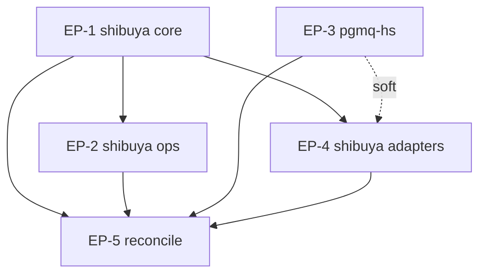

# Complete shibuya pgmq and adapter documentation

This MasterPlan is a living document. The sections Progress, Surprises & Discoveries,
Decision Log, and Outcomes & Retrospective must be kept up to date as work proceeds.

## Vision & Scope

After this initiative, the documentation site has complete, source-checked documentation for
the runtime pieces that were still skeletal after the keiro, kiroku, and keiki sets: shibuya,
pgmq-hs, and the shibuya adapter family. A reader who lands on `/docs/shibuya` can understand
shibuya as the supervised queue-processing layer: adapters provide queue streams, handlers
return explicit ack decisions, runner policies control ordering and concurrency, retry and
dead-letter behavior is visible, and metrics plus OpenTelemetry show what workers are doing.

A reader who lands on `/docs/pgmq` can understand pgmq-hs as the PostgreSQL-native queue
substrate: queue names and message types, create/send/read/archive/delete operations,
visibility timeouts, FIFO and topic routing, notification support, queue observability,
Effectful interpreters, OpenTelemetry attributes, declarative queue configuration, and schema
migration without a PostgreSQL extension. A reader who lands on `/docs/integrations` can compare
the shibuya adapters for pgmq, kiroku, Kafka, and Message DB, and can choose the correct adapter
for background jobs, event-store subscriptions, broker streams, or Message DB streams.

The scope is documentation-only work in this repository. It includes MDX pages under
`content/docs/shibuya/`, `content/docs/pgmq/`, and `content/docs/integrations/`; `meta.json`
navigation files for those sections; source-sync pointers under `docs/`; and final validation of
the Fumadocs site. It excludes source changes in `shinzui/shibuya`, `shinzui/pgmq-hs`,
`shinzui/shibuya-pgmq-adapter`, `shinzui/shibuya-kafka-adapter`,
`shinzui/shibuya-message-db-adapter`, `shinzui/kiroku`, and `shinzui/keiro`.

## Decomposition Strategy

The work is split by user-facing functional concern, not by file or by documentation quadrant.
The mature keiro, kiroku, and keiki documentation sets already organize pages around coherent
subsystems and then fill the relevant Diataxis shapes inside each subsystem. This initiative
follows that pattern.

There are five work streams. EP-1 documents shibuya's foundation: the core types, adapter
contract, handler/ack model, retry model, runner policies, tutorial, reference, explanation, and
source walkthroughs. EP-2 documents shibuya's operational surface: metrics, health, JSON,
Prometheus, WebSocket, OpenTelemetry, operational how-tos, FAQ, and recipes. EP-3 documents
pgmq-hs as a queue substrate, including its package split and PostgreSQL behavior. EP-4 documents
the shibuya adapters, including the pgmq adapter the user called out and the broader adapter
family: kiroku, Kafka, and Message DB. EP-5 performs final reconciliation: navigation ordering,
cross-links, source-sync pointers, integration language, stale stub removal, and whole-site
validation.

A single "write all missing docs" plan was rejected because it would mix shibuya core semantics,
pgmq SQL/client semantics, adapter-specific delivery guarantees, and final navigation work into a
large restart-hostile document. Splitting by Diataxis quadrant was also rejected because one plan
would need to edit every source area at once and would duplicate the same module audit across
reference, tutorials, how-to, explanation, and walkthrough pages. The chosen split keeps EP-1,
EP-2, EP-3, and EP-4 independently verifiable while reserving shared navigation and source-sync
edits for EP-5.

## Exec-Plan Registry

| # | Title | Path | Hard Deps | Soft Deps | Status |
|---|-------|------|-----------|-----------|--------|
| EP-1 | Author shibuya foundation core and walkthrough docs | `docs/plans/35-author-shibuya-foundation-core-and-walkthrough-docs.md` | None | None | Complete |
| EP-2 | Document shibuya metrics operations and recipes | `docs/plans/36-document-shibuya-metrics-operations-and-recipes.md` | EP-1 | None | Not Started |
| EP-3 | Author pgmq hs queue substrate documentation | `docs/plans/37-author-pgmq-hs-queue-substrate-documentation.md` | None | EP-1 | Not Started |
| EP-4 | Document shibuya adapters across pgmq kiroku kafka and message db | `docs/plans/38-document-shibuya-adapters-across-pgmq-kiroku-kafka-and-message-db.md` | EP-1 | EP-3 | Not Started |
| EP-5 | Reconcile shibuya pgmq integrations navigation and source sync | `docs/plans/39-reconcile-shibuya-pgmq-integrations-navigation-and-source-sync.md` | EP-1, EP-2, EP-3, EP-4 | None | Not Started |

Status values: Not Started, In Progress, Complete, Cancelled.
Hard Deps and Soft Deps reference other rows by their # prefix (e.g., EP-1, EP-3).

## Dependency Graph

EP-1 and EP-3 can start immediately. EP-1 owns the canonical shibuya vocabulary: envelope,
adapter, ingested message, handler, ack decision, retry delay, dead letter, runner, processor,
ordering, and concurrency. EP-3 owns the canonical pgmq-hs vocabulary: queue, message, visibility
timeout, archive, delete, topic, FIFO group, notification, configuration reconciliation, and schema
migration.

EP-2 hard-depends on EP-1 because metrics, health checks, telemetry, operational recipes, and FAQ
entries must describe the same processors, handlers, ack decisions, and runner policies that EP-1
defines. It should not invent those terms independently.

EP-4 hard-depends on EP-1 because every adapter page explains how an upstream broker or store is
converted into shibuya envelopes and ack decisions. EP-4 has a soft dependency on EP-3 because the
shibuya-pgmq adapter is easier to document after the pgmq queue substrate is explained, but it can
still proceed by reading pgmq-hs source directly if EP-3 is not complete.

EP-5 hard-depends on EP-1 through EP-4. It updates shared navigation, source-sync pointers,
landing-page links, and integration summaries after the content pages exist. Running the whole-site
build and link checks before those plans finish would only validate an incomplete tree.

## Integration Points

For each shared artifact (type, module, configuration, database table) that multiple
child plans touch, document: which plans are involved, what the shared artifact is,
which plan is responsible for defining it, and how later plans should consume or extend
it.

The shibuya vocabulary and page tree are shared by EP-1, EP-2, EP-4, and EP-5. EP-1 owns the
canonical terminology and the core pages under `content/docs/shibuya/`. EP-2 and EP-4 must link
back to those pages instead of redefining basic terms, and EP-5 owns final navigation ordering.

The shibuya metrics and telemetry language is shared by EP-1, EP-2, and EP-4. EP-2 owns
`Shibuya.Metrics.*`, `Shibuya.Telemetry.*`, operational how-tos, and FAQ language. EP-4 should
describe adapter-specific trace propagation and broker attributes by linking to EP-2's telemetry
pages where possible.

The pgmq-hs queue model is shared by EP-3, EP-4, and EP-5. EP-3 owns the canonical pages under
`content/docs/pgmq/` and the `docs/pgmq-hs-source-sync.md` update notes. EP-4 consumes this
language for the shibuya-pgmq adapter and for cross-links from integration pages. EP-5 reconciles
the final source-sync pointer and nav ordering.

The integration pages under `content/docs/integrations/` are shared by EP-4 and EP-5. EP-4 owns
the adapter content pages. EP-5 owns final cross-library summaries, card descriptions,
root-section cross-links, and stale stub removal.

## Progress

Track milestone-level progress across all child plans. Each entry names the child plan
and the milestone. This section provides an at-a-glance view of the entire initiative.

- [x] EP-1: Audit shibuya core source, upstream user docs, and current `content/docs/shibuya/` stubs.
- [x] EP-1: Author shibuya tutorial, explanation, reference, how-to, and source walkthrough pages.
- [x] EP-1: Validate the shibuya core docs with typecheck, build, link checks, and stale-stub scans.
- [ ] EP-2: Audit shibuya metrics, telemetry, health, JSON, Prometheus, WebSocket, and operations docs.
- [ ] EP-2: Author shibuya operations, metrics, recipes, FAQ, and telemetry pages.
- [ ] EP-2: Validate operational docs and cross-links against EP-1 terminology.
- [ ] EP-3: Audit pgmq-hs source, bundled pgmq docs, and current pgmq stubs.
- [ ] EP-3: Author pgmq-hs reference, how-to, explanation, cookbook, and source-sync updates.
- [ ] EP-3: Validate pgmq pages and queue-substrate cross-links.
- [ ] EP-4: Audit shibuya-pgmq, shibuya-kiroku, shibuya-kafka, and shibuya-message-db adapter sources.
- [ ] EP-4: Author adapter comparison, integration pages, how-tos, and adapter source walkthroughs.
- [ ] EP-4: Validate adapter docs against current source modules and examples.
- [ ] EP-5: Reconcile shibuya, pgmq, integrations, landing pages, and source-sync pointers.
- [ ] EP-5: Run whole-site validation and record final upstream pins.

## Surprises & Discoveries

Document cross-plan insights, dependency changes, scope adjustments, or unexpected
interactions between child plans. Provide concise evidence.

- `mori show --full` confirms this docs repo declares `shinzui/shibuya`,
  `shinzui/shibuya-pgmq-adapter`, and `shinzui/pgmq-hs` as dependencies, but the current
  `content/docs/shibuya/` and `content/docs/pgmq/` trees are still mostly "Documentation in
  progress" skeletons.
- `docs/pgmq-hs-source-sync.md` and `docs/shibuya-pgmq-adapter-source-sync.md` explicitly record
  that the pgmq and shibuya-pgmq pages were bootstrapped as skeletons by
  `docs/plans/27-bootstrap-pgmq-hs-queue-substrate-and-shibuya-pgmq-adapter-docs.md`; this
  initiative is the deferred content-authoring pass.
- `mori registry search shibuya` shows the adapter family is broader than the initial pgmq
  request: shibuya also has kiroku, Kafka, and Message DB adapters. The user asked to include the
  shibuya adapters, so EP-4 covers all four first-party adapters.
- EP-1 confirmed there was no upstream source drift for shibuya core: `mori registry show
  shinzui/shibuya --full` resolved `/Users/shinzui/Keikaku/bokuno/shibuya-project/shibuya`, and
  the upstream git log still reported `3f276ee190e563fddb0bc81e01d62a96a1b31715`
  (`chore(release): 0.7.1.0`). The remaining shibuya FAQ and cookbook stub strings are expected
  because EP-2 owns operations, FAQ, and recipes.

## Decision Log

Record every decomposition or coordination decision made while working on the master
plan.

- Decision: Split the initiative into five child ExecPlans: shibuya core, shibuya operations,
  pgmq-hs substrate, shibuya adapters, and final reconciliation.
  Rationale: These are independently verifiable functional concerns with clear source boundaries
  and shared integration points.
  Date: 2026-06-24
- Decision: Make the adapter plan cover pgmq, kiroku, Kafka, and Message DB adapters.
  Rationale: The user explicitly asked to include the shibuya adapters, and `mori registry search
  shibuya` shows those first-party adapter repos or packages are part of the ecosystem.
  Date: 2026-06-24
- Decision: Keep this initiative documentation-only and source-checked against local dependency
  trees resolved through mori.
  Rationale: The docs repo is a Fumadocs site. Dependency APIs and behavior must be learned from
  their registered source trees, not guessed or changed from this repository.
  Date: 2026-06-24

## Outcomes & Retrospective

Summarize outcomes, gaps, and lessons learned at major milestones or at completion.
Compare the result against the original vision.

(To be filled during and after implementation.)

- EP-1 completed on 2026-06-24. The shibuya core documentation now defines the canonical adapter,
  envelope, ingested message, handler, ack decision, retry, dead-letter, halt, policy, backpressure,
  runner, supervision, and stream-helper vocabulary that EP-2 and EP-4 consume.
