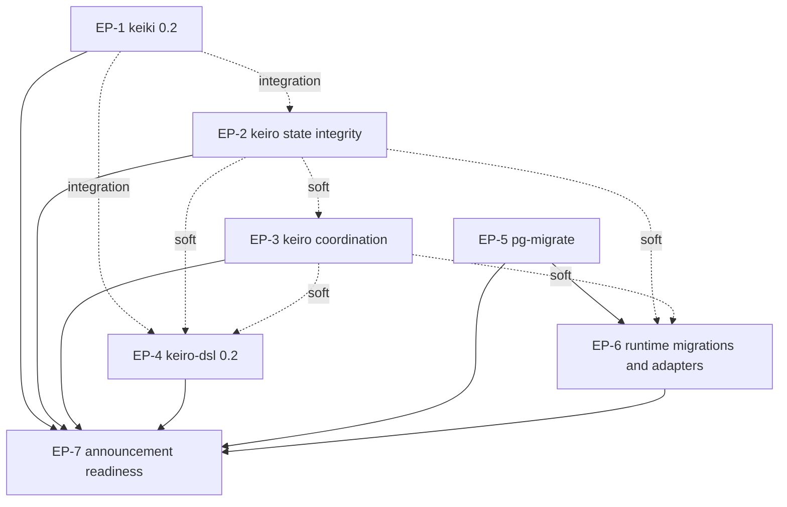

# Prepare keiro runtime documentation for wider announcement

This MasterPlan is a living document. The sections Progress, Surprises & Discoveries,
Decision Log, and Outcomes & Retrospective must be kept up to date as work proceeds.

## Vision & Scope

After this initiative, the public documentation describes the July 2026 release surfaces of the
keiro runtime family closely enough for a reader outside the current contributor group to install,
evaluate, operate, and upgrade the packages without discovering that the prose teaches removed
APIs. The site will explain keiki 0.2's stricter construction and replay contracts, keiro 0.2's
command/read-side/orchestration reliability behavior, the expanded keiro-dsl 0.2 toolchain,
kiroku 0.3, pgmq-hs 0.4, shibuya 0.8, and the current adapter surfaces. It will also add a complete
top-level pg-migrate section that teaches migration ownership, manifest embedding, component and
plan composition, CLI integration, deployment, verification, history import, nontransactional
repair, testing, compatibility, and troubleshooting.

The source-review boundary is the committed state found during planning: `shinzui/keiro` at
`87bf3ff173b2f4ce274e36cea64923ad33817d7c`, `shinzui/keiki` at
`ce5748b5f2311de1355e648db564da8b404e42f2`, `shinzui/pg-migrate` at
`f39d64e354818999667d345a1452f33eb4857fc1`, `shinzui/kiroku` at
`58aff77b3a6d6093e3613753a0543aab62db9fac`, `shinzui/pgmq-hs` at
`8439385b7b4fe0c33355255b9d4f4938aefeacdd`, `shinzui/shibuya` at
`172df245f40a454af46dd7f4cde855eaa4414c5a`, `shinzui/shibuya-pgmq-adapter` at
`85931b45702faecc035d89bb5cff381e8679f793`, `shinzui/shibuya-kafka-adapter` at
`65111ae11fdabd161b2147ce478647a5ed1737f9`, and
`shinzui/shibuya-message-db-adapter` at
`43072558a58d9613cce46c3624157d6fc3e5b6b0`. Implementers must resolve paths with `mori`, verify
those boundaries against the then-current committed `HEAD`, and record intentional later drift
rather than silently mixing uncommitted upstream work into the review.

The work is documentation-only in this repository. It includes MDX under `content/docs/keiki/`,
`content/docs/keiro/`, `content/docs/kiroku/`, `content/docs/pgmq/`,
`content/docs/shibuya/`, `content/docs/integrations/`, and `content/docs/getting-started/`; a new
`content/docs/pg-migrate/` section; navigation metadata; source-sync pointers under `docs/`;
repository metadata when needed to register pg-migrate as a documented dependency; and the final
site quality gate. It excludes source changes in every upstream repository and explicitly excludes
modernizing or source-checking `shinzui/keiro-runtime-jitsurei` and
`content/docs/example-app/`. Announcement-facing pages may label that example as pending an upgrade,
but must not present it as proof of the current package APIs.

## Decomposition Strategy

The initiative is split into seven user-facing functional work streams. The first covers keiki's
0.2 correctness and persistence contract because those semantics are the foundation that keiro
consumes. The next two split keiro by failure domain: command hydration, replay, snapshots, and read
models form one coherent state-integrity surface, while process managers, routers, shards, dead
letters, workflows, telemetry, and worker operations form a separate coordination and delivery
surface. A fourth plan owns keiro-dsl because its grammar, validation, diff, scaffold, harness, and
generated runtime surface changed radically and need a coherent authoring journey rather than
scattered notes inside the runtime reference.

The fifth plan treats pg-migrate as a first-class product and creates the extensive usage and
operations documentation requested by the user. The sixth applies that canonical migration model
to Kiroku, Keiro, PGMQ, Shibuya, and adapter integration pages while sweeping the non-keiro runtime
packages for production-reliability drift. The seventh performs the announcement-facing
reconciliation: discovery, compatibility and upgrade paths, navigation, source pins, stale-claim
scans, and the whole-site release gate.

Splitting by repository was rejected because keiro alone contains several independently
verifiable user concerns, while migration ownership spans pg-migrate, Kiroku, Keiro, PGMQ, and
application composition. Splitting by documentation quadrant was also rejected because a tutorial,
reference page, explanation, and how-to for one behavior must agree on the same current source
contract. A single comprehensive sweep plan was rejected because the source drift is too large for
one restart-friendly document: keiro is 125 commits and keiki is 68 commits beyond their current
site pointers, and pg-migrate adds an entirely new six-package family.

## Exec-Plan Registry

| # | Title | Path | Hard Deps | Soft Deps | Status |
|---|-------|------|-----------|-----------|--------|
| EP-1 | Refresh keiki 0.2 correctness replay and persistence documentation | `docs/plans/40-refresh-keiki-0-2-correctness-replay-and-persistence-documentation.md` | None | None | Complete |
| EP-2 | Refresh keiro command replay snapshot and read-model reliability documentation | `docs/plans/41-refresh-keiro-command-replay-snapshot-and-read-model-reliability-documentation.md` | None | EP-1 | In Progress |
| EP-3 | Refresh keiro orchestration delivery and operations reliability documentation | `docs/plans/42-refresh-keiro-orchestration-delivery-and-operations-reliability-documentation.md` | None | EP-2 | Not Started |
| EP-4 | Rebuild keiro-dsl 0.2 authoring and evolution documentation | `docs/plans/43-rebuild-keiro-dsl-0-2-authoring-and-evolution-documentation.md` | None | EP-1, EP-2, EP-3 | Not Started |
| EP-5 | Author comprehensive pg-migrate usage and operations documentation | `docs/plans/44-author-comprehensive-pg-migrate-usage-and-operations-documentation.md` | None | None | Not Started |
| EP-6 | Reconcile runtime migrations kiroku pgmq shibuya and adapters | `docs/plans/45-reconcile-runtime-migrations-kiroku-pgmq-shibuya-and-adapters.md` | EP-5 | EP-2, EP-3 | Not Started |
| EP-7 | Prepare announcement navigation compatibility and whole-site release gate | `docs/plans/46-prepare-announcement-navigation-compatibility-and-whole-site-release-gate.md` | EP-1, EP-2, EP-3, EP-4, EP-5, EP-6 | None | Not Started |

Status values: Not Started, In Progress, Complete, Cancelled.
Hard Deps and Soft Deps reference other rows by their # prefix (e.g., EP-1, EP-3).

## Dependency Graph

EP-1 through EP-5 can begin immediately. EP-1 defines the canonical keiki 0.2 vocabulary for
structured replay, builder validation, composition, symbolic soundness, event-codec evolution, and
shape hashes. EP-2 and EP-4 have integration dependencies on that vocabulary but can still proceed
in parallel by reading the same committed keiki source; their final examples must be reconciled
before completion.

EP-3 has a soft dependency on EP-2 because orchestration workers surface the same typed command,
hydration, replay, snapshot, and read-model failures that EP-2 explains. EP-4 has soft dependencies
on EP-2 and EP-3 because generated read models, routers, policies, queues, snapshots, and workflows
must use the runtime terminology those plans own. These are not hard dependencies: the keiro-dsl
source and its conformance fixtures contain enough context for EP-4 to work independently.

EP-6 hard-depends on EP-5. Its Kiroku, Keiro, and PGMQ migration pages must link to an existing
canonical pg-migrate section and use its settled terminology for components, plans, manifests,
ledgers, verification, import evidence, and repair. EP-6 has soft dependencies on EP-2 and EP-3
because runtime-package adoption guides cross-link into the refreshed keiro operation pages.

EP-7 hard-depends on EP-1 through EP-6. Announcement-facing discovery pages, compatibility
matrices, source-sync pointers, navigation, and global stale-claim scans can only describe the final
site after every domain plan is complete.

## Integration Points

The keiki-to-keiro replay contract is shared by EP-1, EP-2, EP-3, and EP-4. EP-1 owns the canonical
explanation of `ReplayFailure`, `ReplayFailureReason`, eager builder defects, required
`emit`/`noEmit` intent, validation warnings, stable shape names, and the removal of the Decider
facade. EP-2 owns how keiro translates those contracts into `HydrationReplayReason`,
`CommandAmbiguous`, validated event streams, append replay verification, and snapshot fallback.
EP-3 and EP-4 consume those terms and link back rather than inventing alternate classifications.

The keiro command and worker failure taxonomy is shared by EP-2, EP-3, and EP-4. EP-2 defines
rejection, ambiguity, hydration gaps, replay divergence, snapshot failures, and read-model fencing.
EP-3 defines worker disposition through `RejectedCommandPolicy`, `DispatchFailure`, sharded
acknowledgements, and durable dead letters. EP-4 maps the same runtime outcomes to `.keiro`
validation diagnostics and mandatory disposition-policy clauses.

The PostgreSQL migration model is shared by EP-5, EP-6, and EP-7. EP-5 owns the new
`content/docs/pg-migrate/` tree and canonical terms for `MigrationComponent`, `MigrationPlan`,
ordered manifests, the `pgmigrate` ledger, strict verification, unknown-migration policy,
history import, nontransactional repair, and cleanup issues. EP-6 consumes those terms when
documenting `kirokuMigrations`, `keiroMigrations`, `pgmqMigrations`, component dependencies,
operator CLIs, predecessor-ledger imports, and application-owned composition. EP-7 owns final
navigation, top-level comparison language, and the source-sync pointer for pg-migrate.

The runtime-package compatibility story is shared by every plan and finalized by EP-7. Each domain
plan records the reviewed committed source SHA, package versions, breaking changes, and explicit
upgrade notes in its own outcomes. EP-7 reconciles those facts into discovery and compatibility
pages and updates `docs/keiki-source-sync.md`, `docs/keiro-source-sync.md`,
`docs/kiroku-source-sync.md`, `docs/pgmq-hs-source-sync.md`,
`docs/shibuya-source-sync.md`, and the adapter pointer files. No earlier plan advances a pointer for
a tree that another unfinished plan still edits.

Navigation metadata is shared by the domain plans and EP-7. A domain plan may add pages and update
the nearest `meta.json`, but EP-7 owns the final top-level ordering, orphan-page scan, duplicate-entry
scan, cross-library cards, and announcement-facing path through `content/docs/index.mdx` and
`content/docs/getting-started/`.

## Progress

Track milestone-level progress across all child plans. Each entry names the child plan
and the milestone. This section provides an at-a-glance view of the entire initiative.

- [x] (2026-07-14T15:46:08Z) EP-1 Milestone 1: remove the dead Decider API and teach
  structured replay.
- [x] (2026-07-14T16:19:29Z) EP-1 Milestone 2: refresh builder, validation, symbolic, and
  composition contracts.
- [x] (2026-07-14T16:35:26Z) EP-1 Milestone 3: refresh persistence, codecs, and the keiro
  integration handoff.
- [x] (2026-07-14T16:49:29Z) EP-2 Milestone 1: refresh event-stream validation, hydration, and
  command failures.
- [x] (2026-07-14T16:56:24Z) EP-2 Milestone 2: refresh snapshot correctness and recovery behavior.
- [ ] EP-2 Milestone 3: refresh read models, projections, and rebuild operations.
- [ ] EP-3 Milestone 1: refresh process-manager and router delivery.
- [ ] EP-3 Milestone 2: refresh sharded delivery and dead-letter operations.
- [ ] EP-3 Milestone 3: refresh workflow and cross-worker operations.
- [ ] EP-4 Milestone 1: create the keiro-dsl 0.2 learning and upgrade path.
- [ ] EP-4 Milestone 2: make the notation reference complete and navigable.
- [ ] EP-4 Milestone 3: add task-oriented authoring and evolution guides.
- [ ] EP-4 Milestone 4: reconcile keiro-dsl across the keiro documentation.
- [ ] EP-5 Milestone 1: create the pg-migrate section and fresh-database spine.
- [ ] EP-5 Milestone 2: document authoring, composition, and CLI integration.
- [ ] EP-5 Milestone 3: document production execution and recovery.
- [ ] EP-5 Milestone 4: document predecessor cutovers and practical recipes.
- [ ] EP-6 Milestone 1: replace old migration guidance with component composition.
- [ ] EP-6 Milestone 2: refresh Kiroku 0.3 user and operator behavior.
- [ ] EP-6 Milestone 3: refresh PGMQ, Shibuya, and adapter behavior.
- [ ] EP-6 Milestone 4: reconcile cross-package operations.
- [ ] EP-7 Milestone 1: build the announcement discovery and compatibility path.
- [ ] EP-7 Milestone 2: reconcile integrations and example-status language.
- [ ] EP-7 Milestone 3: update repository metadata and source ledgers.
- [ ] EP-7 Milestone 4: establish and run the whole-site release gate.

## Surprises & Discoveries

Document cross-plan insights, dependency changes, scope adjustments, or unexpected
interactions between child plans. Provide concise evidence.

- EP-1 found that `lmapMaybeCi` is a standalone forward router, not a replay-safe composition
  bridge: concrete checked composition reports its stamped names and the existential category raises
  `PoisonedCompositionError`. EP-3 and EP-4 must keep cross-context filtering at the runtime router or
  generate an honest structural adapter rather than composing across a lossy map.
- EP-1 confirmed that `feedback1` is a two-copy cascade, not shared-state aggregate feedback. Runtime
  orchestration pages should describe durable feedback as explicit cross-stream dispatch owned by
  keiro, not as state sharing hidden inside the keiki combinator.
- EP-1 confirmed that keiki 0.2 intentionally changes every non-empty 0.1 register shape hash once.
  EP-2 must describe this as a benign snapshot cache miss and full event replay; EP-7 must carry the
  upgrade note into announcement-facing compatibility guidance.
- EP-1 confirmed that generated event codecs expose resolved wire kinds and in-band schema versions,
  default compatible additive fields, and require a complete one-envelope migration chain. EP-2 and
  EP-4 should consume these generated surfaces instead of documenting constructor names as durable
  wire identities.
- EP-2 began from clean keiro `c68dcc7`, two commits beyond the planned source boundary. Keiro and
  keiro-core 0.3.0.0 contain no user-facing or source changes; the new release only realigns
  migration/PGMQ dependencies and test-support setup, so EP-2's state-integrity API scope is stable.

## Decision Log

Record every decomposition or coordination decision made while working on the master
plan.

- Decision: Decompose the initiative into seven plans covering keiki correctness, two keiro
  reliability domains, keiro-dsl, pg-migrate, runtime-package migration/adapters, and final
  announcement readiness.
  Rationale: These are independently verifiable user concerns with explicit shared vocabularies;
  the decomposition keeps each plan restartable while reserving cross-site reconciliation for one
  final owner.
  Date: 2026-07-14
- Decision: Make pg-migrate a new top-level documentation product rather than a subsection of the
  keiro migration reference.
  Rationale: The user explicitly requested extensive pg-migrate usage docs, and the registered
  project contains six packages plus authoring, execution, verification, repair, import, CLI,
  testing, compatibility, and deployment contracts used outside keiro.
  Date: 2026-07-14
- Decision: Pin documentation review to committed upstream `HEAD` values and exclude upstream
  working-tree changes.
  Rationale: Planning found local uncommitted changes in keiro, pgmq-hs, and the Message DB adapter.
  A source-sync pointer must be reproducible, and those edits belong to the user until committed.
  Date: 2026-07-14
- Decision: Exclude keiro-runtime-jitsurei and `content/docs/example-app/` from implementation while
  allowing announcement pages to label the example as pending modernization.
  Rationale: The user said the example repository has not yet been upgraded. Updating or presenting
  it as current would create false confidence in obsolete APIs.
  Date: 2026-07-14
- Decision: Keep the initiative documentation-only.
  Rationale: The runtime fixes and package releases already exist in their registered source
  repositories; this repository's responsibility is to explain and validate those surfaces, not to
  mutate upstream code.
  Date: 2026-07-14

## Outcomes & Retrospective

Summarize outcomes, gaps, and lessons learned at major milestones or at completion.
Compare the result against the original vision.

(To be filled during and after implementation.)
