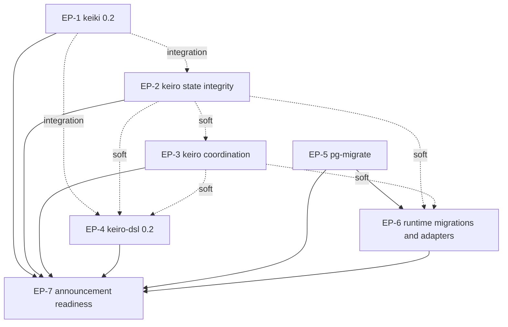

# Prepare keiro runtime documentation for wider announcement

This MasterPlan is a living document. The sections Progress, Surprises & Discoveries,
Decision Log, and Outcomes & Retrospective must be kept up to date as work proceeds.

## Vision & Scope

After this initiative, the public documentation describes the July 2026 release surfaces of the
keiro runtime family closely enough for a reader outside the current contributor group to install,
evaluate, operate, and upgrade the packages without discovering that the prose teaches removed
APIs. The site will explain keiki 0.2's stricter construction and replay contracts, keiro 0.2's
command/read-side/orchestration reliability behavior, the expanded keiro-dsl 0.2 toolchain,
kiroku 0.3, pgmq-hs 0.4, shibuya 0.8, and the current adapter surfaces. It will also add a complete
top-level pg-migrate section that teaches migration ownership, manifest embedding, component and
plan composition, CLI integration, deployment, verification, history import, nontransactional
repair, testing, compatibility, and troubleshooting.

The source-review boundary is the committed state found during planning: `shinzui/keiro` at
`87bf3ff173b2f4ce274e36cea64923ad33817d7c`, `shinzui/keiki` at
`ce5748b5f2311de1355e648db564da8b404e42f2`, `shinzui/pg-migrate` at
`f39d64e354818999667d345a1452f33eb4857fc1`, `shinzui/kiroku` at
`58aff77b3a6d6093e3613753a0543aab62db9fac`, `shinzui/pgmq-hs` at
`8439385b7b4fe0c33355255b9d4f4938aefeacdd`, `shinzui/shibuya` at
`172df245f40a454af46dd7f4cde855eaa4414c5a`, `shinzui/shibuya-pgmq-adapter` at
`85931b45702faecc035d89bb5cff381e8679f793`, `shinzui/shibuya-kafka-adapter` at
`65111ae11fdabd161b2147ce478647a5ed1737f9`, and
`shinzui/shibuya-message-db-adapter` at
`43072558a58d9613cce46c3624157d6fc3e5b6b0`. Implementers must resolve paths with `mori`, verify
those boundaries against the then-current committed `HEAD`, and record intentional later drift
rather than silently mixing uncommitted upstream work into the review.

The work is documentation-only in this repository. It includes MDX under `content/docs/keiki/`,
`content/docs/keiro/`, `content/docs/kiroku/`, `content/docs/pgmq/`,
`content/docs/shibuya/`, `content/docs/integrations/`, and `content/docs/getting-started/`; a new
`content/docs/pg-migrate/` section; navigation metadata; source-sync pointers under `docs/`;
repository metadata when needed to register pg-migrate as a documented dependency; and the final
site quality gate. It excludes source changes in every upstream repository and explicitly excludes
modernizing or source-checking `shinzui/keiro-runtime-jitsurei` and
`content/docs/example-app/`. Announcement-facing pages may label that example as pending an upgrade,
but must not present it as proof of the current package APIs.

## Decomposition Strategy

The initiative is split into seven user-facing functional work streams. The first covers keiki's
0.2 correctness and persistence contract because those semantics are the foundation that keiro
consumes. The next two split keiro by failure domain: command hydration, replay, snapshots, and read
models form one coherent state-integrity surface, while process managers, routers, shards, dead
letters, workflows, telemetry, and worker operations form a separate coordination and delivery
surface. A fourth plan owns keiro-dsl because its grammar, validation, diff, scaffold, harness, and
generated runtime surface changed radically and need a coherent authoring journey rather than
scattered notes inside the runtime reference.

The fifth plan treats pg-migrate as a first-class product and creates the extensive usage and
operations documentation requested by the user. The sixth applies that canonical migration model
to Kiroku, Keiro, PGMQ, Shibuya, and adapter integration pages while sweeping the non-keiro runtime
packages for production-reliability drift. The seventh performs the announcement-facing
reconciliation: discovery, compatibility and upgrade paths, navigation, source pins, stale-claim
scans, and the whole-site release gate.

Splitting by repository was rejected because keiro alone contains several independently
verifiable user concerns, while migration ownership spans pg-migrate, Kiroku, Keiro, PGMQ, and
application composition. Splitting by documentation quadrant was also rejected because a tutorial,
reference page, explanation, and how-to for one behavior must agree on the same current source
contract. A single comprehensive sweep plan was rejected because the source drift is too large for
one restart-friendly document: keiro is 125 commits and keiki is 68 commits beyond their current
site pointers, and pg-migrate adds an entirely new six-package family.

## Exec-Plan Registry

| # | Title | Path | Hard Deps | Soft Deps | Status |
|---|-------|------|-----------|-----------|--------|
| EP-1 | Refresh keiki 0.2 correctness replay and persistence documentation | `docs/plans/40-refresh-keiki-0-2-correctness-replay-and-persistence-documentation.md` | None | None | Complete |
| EP-2 | Refresh keiro command replay snapshot and read-model reliability documentation | `docs/plans/41-refresh-keiro-command-replay-snapshot-and-read-model-reliability-documentation.md` | None | EP-1 | Complete |
| EP-3 | Refresh keiro orchestration delivery and operations reliability documentation | `docs/plans/42-refresh-keiro-orchestration-delivery-and-operations-reliability-documentation.md` | None | EP-2 | Complete |
| EP-4 | Rebuild keiro-dsl 0.2 authoring and evolution documentation | `docs/plans/43-rebuild-keiro-dsl-0-2-authoring-and-evolution-documentation.md` | None | EP-1, EP-2, EP-3 | Complete |
| EP-5 | Author comprehensive pg-migrate usage and operations documentation | `docs/plans/44-author-comprehensive-pg-migrate-usage-and-operations-documentation.md` | None | None | Complete |
| EP-6 | Reconcile runtime migrations kiroku pgmq shibuya and adapters | `docs/plans/45-reconcile-runtime-migrations-kiroku-pgmq-shibuya-and-adapters.md` | EP-5 | EP-2, EP-3 | Complete |
| EP-7 | Prepare announcement navigation compatibility and whole-site release gate | `docs/plans/46-prepare-announcement-navigation-compatibility-and-whole-site-release-gate.md` | EP-1, EP-2, EP-3, EP-4, EP-5, EP-6 | None | In Progress |

Status values: Not Started, In Progress, Complete, Cancelled.
Hard Deps and Soft Deps reference other rows by their # prefix (e.g., EP-1, EP-3).

## Dependency Graph

EP-1 through EP-5 can begin immediately. EP-1 defines the canonical keiki 0.2 vocabulary for
structured replay, builder validation, composition, symbolic soundness, event-codec evolution, and
shape hashes. EP-2 and EP-4 have integration dependencies on that vocabulary but can still proceed
in parallel by reading the same committed keiki source; their final examples must be reconciled
before completion.

EP-3 has a soft dependency on EP-2 because orchestration workers surface the same typed command,
hydration, replay, snapshot, and read-model failures that EP-2 explains. EP-4 has soft dependencies
on EP-2 and EP-3 because generated read models, routers, policies, queues, snapshots, and workflows
must use the runtime terminology those plans own. These are not hard dependencies: the keiro-dsl
source and its conformance fixtures contain enough context for EP-4 to work independently.

EP-6 hard-depends on EP-5. Its Kiroku, Keiro, and PGMQ migration pages must link to an existing
canonical pg-migrate section and use its settled terminology for components, plans, manifests,
ledgers, verification, import evidence, and repair. EP-6 has soft dependencies on EP-2 and EP-3
because runtime-package adoption guides cross-link into the refreshed keiro operation pages.

EP-7 hard-depends on EP-1 through EP-6. Announcement-facing discovery pages, compatibility
matrices, source-sync pointers, navigation, and global stale-claim scans can only describe the final
site after every domain plan is complete.

## Integration Points

The keiki-to-keiro replay contract is shared by EP-1, EP-2, EP-3, and EP-4. EP-1 owns the canonical
explanation of `ReplayFailure`, `ReplayFailureReason`, eager builder defects, required
`emit`/`noEmit` intent, validation warnings, stable shape names, and the removal of the Decider
facade. EP-2 owns how keiro translates those contracts into `HydrationReplayReason`,
`CommandAmbiguous`, validated event streams, append replay verification, and snapshot fallback.
EP-3 and EP-4 consume those terms and link back rather than inventing alternate classifications.

The keiro command and worker failure taxonomy is shared by EP-2, EP-3, and EP-4. EP-2 defines
rejection, ambiguity, hydration gaps, replay divergence, snapshot failures, and read-model fencing.
EP-3 defines worker disposition through `RejectedCommandPolicy`, `DispatchFailure`, sharded
acknowledgements, and durable dead letters. EP-4 maps the same runtime outcomes to `.keiro`
validation diagnostics and mandatory disposition-policy clauses.

The PostgreSQL migration model is shared by EP-5, EP-6, and EP-7. EP-5 owns the new
`content/docs/pg-migrate/` tree and canonical terms for `MigrationComponent`, `MigrationPlan`,
ordered manifests, the `pgmigrate` ledger, strict verification, unknown-migration policy,
history import, nontransactional repair, and cleanup issues. EP-6 consumes those terms when
documenting `kirokuMigrations`, `keiroMigrations`, `pgmqMigrations`, component dependencies,
operator CLIs, predecessor-ledger imports, and application-owned composition. EP-7 owns final
navigation, top-level comparison language, and the source-sync pointer for pg-migrate.

The runtime-package compatibility story is shared by every plan and finalized by EP-7. Each domain
plan records the reviewed committed source SHA, package versions, breaking changes, and explicit
upgrade notes in its own outcomes. EP-7 reconciles those facts into discovery and compatibility
pages and updates `docs/keiki-source-sync.md`, `docs/keiro-source-sync.md`,
`docs/kiroku-source-sync.md`, `docs/pgmq-hs-source-sync.md`,
`docs/shibuya-source-sync.md`, and the adapter pointer files. No earlier plan advances a pointer for
a tree that another unfinished plan still edits.

Navigation metadata is shared by the domain plans and EP-7. A domain plan may add pages and update
the nearest `meta.json`, but EP-7 owns the final top-level ordering, orphan-page scan, duplicate-entry
scan, cross-library cards, and announcement-facing path through `content/docs/index.mdx` and
`content/docs/getting-started/`.

## Progress

Track milestone-level progress across all child plans. Each entry names the child plan
and the milestone. This section provides an at-a-glance view of the entire initiative.

- [x] (2026-07-14T15:46:08Z) EP-1 Milestone 1: remove the dead Decider API and teach
  structured replay.
- [x] (2026-07-14T16:19:29Z) EP-1 Milestone 2: refresh builder, validation, symbolic, and
  composition contracts.
- [x] (2026-07-14T16:35:26Z) EP-1 Milestone 3: refresh persistence, codecs, and the keiro
  integration handoff.
- [x] (2026-07-14T16:49:29Z) EP-2 Milestone 1: refresh event-stream validation, hydration, and
  command failures.
- [x] (2026-07-14T16:56:24Z) EP-2 Milestone 2: refresh snapshot correctness and recovery behavior.
- [x] (2026-07-14T17:05:09Z) EP-2 Milestone 3: refresh read models, projections, and rebuild
  operations.
- [x] (2026-07-14T17:16:13Z) EP-3 Milestone 1: refresh process-manager and router delivery.
- [x] (2026-07-14T17:26:57Z) EP-3 Milestone 2: refresh sharded delivery and dead-letter operations.
- [x] (2026-07-14T17:42:25Z) EP-3 Milestone 3: refresh workflow and cross-worker operations.
- [x] (2026-07-14T17:54:30Z) EP-4 Milestone 1: create the keiro-dsl 0.2 learning and upgrade path.
- [x] (2026-07-14T18:02:54Z) EP-4 Milestone 2: make the notation reference complete and navigable.
- [x] (2026-07-14T18:12:28Z) EP-4 Milestone 3: add task-oriented authoring and evolution guides.
- [x] (2026-07-14T18:19:23Z) EP-4 Milestone 4: reconcile keiro-dsl across the keiro documentation.
- [x] (2026-07-14T18:24:38Z) EP-5 Milestone 1: create the pg-migrate section and fresh-database spine.
- [x] (2026-07-14T18:34:02Z) EP-5 Milestone 2: document authoring, composition, and CLI integration.
- [x] (2026-07-14T18:40:31Z) EP-5 Milestone 3: document production execution and recovery.
- [x] (2026-07-14T18:48:14Z) EP-5 Milestone 4: document predecessor cutovers and practical recipes.
- [x] (2026-07-14T19:00:30Z) EP-6 Milestone 1: replace old migration guidance with component
  composition.
- [x] (2026-07-14T19:11:40Z) EP-6 Milestone 2: refresh Kiroku 0.3 user and operator behavior.
- [x] (2026-07-14T19:19:04Z) EP-6 Milestone 3: refresh PGMQ, Shibuya, and adapter behavior.
- [x] (2026-07-14T19:23:08Z) EP-6 Milestone 4: reconcile cross-package operations.
- [x] (2026-07-14T19:29:05Z) EP-7 Milestone 1: build the announcement discovery and compatibility
  path.
- [x] (2026-07-14T19:36:25Z) EP-7 Milestone 2: reconcile integrations and
  example-status language.
- [ ] EP-7 Milestone 3: update repository metadata and source ledgers.
- [ ] EP-7 Milestone 4: establish and run the whole-site release gate.

## Surprises & Discoveries

Document cross-plan insights, dependency changes, scope adjustments, or unexpected
interactions between child plans. Provide concise evidence.

- EP-1 found that `lmapMaybeCi` is a standalone forward router, not a replay-safe composition
  bridge: concrete checked composition reports its stamped names and the existential category raises
  `PoisonedCompositionError`. EP-3 and EP-4 must keep cross-context filtering at the runtime router or
  generate an honest structural adapter rather than composing across a lossy map.
- EP-1 confirmed that `feedback1` is a two-copy cascade, not shared-state aggregate feedback. Runtime
  orchestration pages should describe durable feedback as explicit cross-stream dispatch owned by
  keiro, not as state sharing hidden inside the keiki combinator.
- EP-1 confirmed that keiki 0.2 intentionally changes every non-empty 0.1 register shape hash once.
  EP-2 must describe this as a benign snapshot cache miss and full event replay; EP-7 must carry the
  upgrade note into announcement-facing compatibility guidance.
- EP-1 confirmed that generated event codecs expose resolved wire kinds and in-band schema versions,
  default compatible additive fields, and require a complete one-envelope migration chain. EP-2 and
  EP-4 should consume these generated surfaces instead of documenting constructor names as durable
  wire identities.
- EP-2 began from clean keiro `c68dcc7`, two commits beyond the planned source boundary. Keiro and
  keiro-core 0.3.0.0 contain no user-facing or source changes; the new release only realigns
  migration/PGMQ dependencies and test-support setup, so EP-2's state-integrity API scope is stable.
- EP-2 found that `finishRebuild` prevents only a named async replay that produced zero applications;
  it does not attest full event or row coverage. Announcement and operations pages must keep table
  and cursor verification as an explicit operator responsibility.
- EP-3 found that process-manager and router duplicate evidence is scoped to the intended target
  stream, including the router's legacy positional-ID probe. Announcement guidance must avoid a
  global exactly-once claim: resolver drift can grow the durable target union, and simultaneous
  code/output changes can cross the legacy compatibility boundary.
- EP-3 found that shard leases exclude simultaneous valid claims but do not fence a stale reader
  after expiry. Announcement guidance must say at-least-once: the ack-coupled Kiroku bridge prevents
  rebalance cancellation from checkpointing first, while idempotency absorbs lease overlap and
  batch-tail replay.
- EP-3 found two easy-to-miss operational boundaries. Workflow journal progress remains successful
  when a later snapshot store write fails, while timer recovery is automatic after five minutes by
  default but has no retry backoff or attempt ceiling. Announcement guidance must distinguish
  durable truth from advisory cache/metrics and state the timer timeout race explicitly.
- EP-3 confirmed that ordered outbox policies sort transaction-start timestamps, not commit order.
  The canonical producer's serialized input is stable; inline concurrent same-key/source enqueues
  need application serialization when strict order is promised.
- EP-3 found that the current Keiro migrations create framework tables in the `keiro` schema while
  the global migration overview still calls it `kiroku`. EP-3 corrected its workflow reference;
  EP-6 must reconcile the migration overview and cross-package schema-composition guidance.
- EP-2 established the runtime schema split consumed by EP-5 and EP-6: application projection data
  is schema-qualified outside both Keiro's `keiro` framework schema and Kiroku's `kiroku` store
  schema. The later migration plans own how those schemas are composed and deployed.
- EP-4 confirmed that Keiro 0.3.0.0 changes only keiro-dsl release metadata after the planned source
  boundary. The authoring grammar, validators, scaffolder, fixtures, and 0.2 user surface remain
  unchanged at committed `c68dcc7`.
- EP-5 began at its planned, clean pg-migrate `1.1.0.0` boundary `f39d64e`; no source drift or
  untracked upstream state affects the new documentation family.
- EP-6 found that clean pgmq-hs advanced to `f4a1018` and release `0.4.0.1`, adding a safe policy
  for unselected rows in a deliberately shared predecessor ledger. It also confirmed that Kiroku's
  native manifest has seven historical migrations plus an eighth native canary, and that committed
  Keiro test support already composes extra migration components into its suite template.
- EP-6 found two stale Kiroku source walkthrough assumptions beneath otherwise-current 0.3
  reference prose: checkpoint-load errors no longer rewind to zero, and stream shutdown no longer
  writes a sentinel through the bounded data queue. The release gate must preserve the loud-failure
  and crash-propagation contracts now documented in the 0.3 upgrade matrix.
- EP-6 confirmed the PGMQ adapter's idle-shutdown defect was an empty-batch filter ordered before the
  stop gate. Release 0.12 reverses those stages, so an empty source terminates on the next returned
  poll chunk and Shibuya can drain. Kafka's only committed drift is 0.8.0.1 release metadata;
  Shibuya core and the Message DB adapter remain aligned at their existing pins.
- EP-7 found that “no committed drift” does not imply current cross-package compatibility:
  `shibuya-message-db-adapter 0.1.0.0` still bounds `shibuya-core` to the 0.5 line and cannot be
  selected with the reviewed 0.8 core. The announcement matrix now distinguishes source-reviewed
  behavior from a compatible release pairing.

## Decision Log

Record every decomposition or coordination decision made while working on the master
plan.

- Decision: Decompose the initiative into seven plans covering keiki correctness, two keiro
  reliability domains, keiro-dsl, pg-migrate, runtime-package migration/adapters, and final
  announcement readiness.
  Rationale: These are independently verifiable user concerns with explicit shared vocabularies;
  the decomposition keeps each plan restartable while reserving cross-site reconciliation for one
  final owner.
  Date: 2026-07-14
- Decision: Make pg-migrate a new top-level documentation product rather than a subsection of the
  keiro migration reference.
  Rationale: The user explicitly requested extensive pg-migrate usage docs, and the registered
  project contains six packages plus authoring, execution, verification, repair, import, CLI,
  testing, compatibility, and deployment contracts used outside keiro.
  Date: 2026-07-14
- Decision: Pin documentation review to committed upstream `HEAD` values and exclude upstream
  working-tree changes.
  Rationale: Planning found local uncommitted changes in keiro, pgmq-hs, and the Message DB adapter.
  A source-sync pointer must be reproducible, and those edits belong to the user until committed.
  Date: 2026-07-14
- Decision: Exclude keiro-runtime-jitsurei and `content/docs/example-app/` from implementation while
  allowing announcement pages to label the example as pending modernization.
  Rationale: The user said the example repository has not yet been upgraded. Updating or presenting
  it as current would create false confidence in obsolete APIs.
  Date: 2026-07-14
- Decision: Keep the initiative documentation-only.
  Rationale: The runtime fixes and package releases already exist in their registered source
  repositories; this repository's responsibility is to explain and validate those surfaces, not to
  mutate upstream code.
  Date: 2026-07-14

## Outcomes & Retrospective

Summarize outcomes, gaps, and lessons learned at major milestones or at completion.
Compare the result against the original vision.

- EP-1 completed the keiki 0.2 correctness foundation: current builder construction, structured
  replay, validation and symbolic gates, composition boundaries, persistence codecs, and stable
  shape-hash terminology are now coherent across the keiki learning paths.
- EP-2 completed the keiro state-integrity surface at committed source `c68dcc7`. Command docs now
  distinguish rejection, ambiguity, hydration gaps/reasons, no-op positions, and post-commit replay
  evidence; snapshot docs consistently teach advisory fallback and observable failure telemetry;
  read-side docs teach explicit registration, qualified application schemas, category-scoped strong
  waits, fenced async outcomes, and the supported guarded rebuild lifecycle. All milestone and final
  site checks passed, including the 448-file internal-link scan.
- EP-3 Milestone 1 completed the orchestration dispatch foundation. Process-manager and router docs
  now agree on transaction boundaries, target-scoped duplicate confirmation, deterministic current
  and legacy router IDs, explicit rejected-command policy, and the distinction between handled
  failures and durable dispatch-dead-letter evidence.
- EP-3 Milestone 2 completed the sharded source-delivery path. The docs now center `ShardDelivery` and
  `ShardAck`, bounded exception retry, batch-tail checkpoint semantics, atomic Kiroku dead-letter
  advancement, the store-level terminal metric bridge, and non-destructive operator replay. All
  milestone checks passed, including the 450-file internal-link scan.
- EP-3 Milestone 3 completed workflow and cross-worker operations. Workflow docs now expose the
  required typed store-error channel and post-journal advisory snapshot behavior; timer and outbox
  docs state their actual recovery/ordering boundaries; and a new production checklist maps workflow,
  dispatch, subscription, inbox, outbox, and timer outcomes to their durable record and telemetry.
  All milestone checks passed, including the 451-file internal-link scan.
- EP-3 is complete against clean committed Keiro `c68dcc7`, Kiroku `58aff77`, and Shibuya
  `172df24`. Its final full-site gate passed. EP-4 inherits the generated disposition, duplicate,
  workflow store-error, and correlation contracts; EP-6 inherits the framework-schema correction;
  EP-7 inherits at-least-once announcement language, explicit-skip caveats, the two dead-letter
  domains, and the durable-worker outcome checklist.
- EP-4 found that the released Keiro Cabal package is `0.3.0.0` while the exported
  `Keiro.version` constant still returns legacy `"0.1.0.0"`. The Keiro landing and selection docs
  now use the package release and label the constant honestly; EP-7 must preserve that distinction
  in announcement compatibility language unless upstream changes the constant.
- EP-4 Milestone 1 rebuilt the keiro-dsl learning spine around the current
  aggregate/read-model/router cold-start fixture, documented the six authoring and upgrade gates,
  and added an explicit 0.1-to-0.2 migration checklist. The upstream check and newsurface
  conformance suite, docs build, and 452-file link scan all passed.
- EP-4 Milestone 2 split the obsolete notation monolith into source-complete overview, domain/read-
  side, runtime/integration, and CLI references. The twelve-node registry, nested policies,
  generated/hole ownership, defaults, identities, scaffold records, and three-tier diff now have a
  navigable owner; nine cross-family fixtures and the 455-file link scan passed.
- EP-4 Milestone 3 added source-backed vertical guides for read-model/router authoring, FIFO queue
  configuration, inbox persistence, snapshots, and workflow evolution. The check, scaffold, Cabal
  placement, and diff procedures now teach current diagnostics, transactional writes, ownership
  boundaries, scaffold records, and all three compatibility tiers. Nine upstream runtime-family
  conformance suites, the docs build, and the 459-file link scan passed.
- EP-4 Milestone 4 reconciled the Keiro landing/FAQ, read-model/router/snapshot/workflow/PGMQ
  explanations, and their task/reference/cookbook links. Stale release and unshipped-workflow claims
  are corrected; Keiro pages no longer use the excluded example application as current evidence;
  and runtime concepts link to the source-backed 0.2 authoring guides. The stale-form scans,
  formatting, MDX/TypeScript checks, production build, and 459-file link scan passed.
- EP-4 is complete against committed Keiro `c68dcc7`. EP-7 inherits the complete twelve-node
  notation/CLI registry, the current generated-versus-hand-owned scaffold contract, three-tier diff
  language, conformance-suite evidence boundary, and the package-version caveat. The shared Keiro
  source pointer remains intentionally unchanged for EP-7.
- EP-5 Milestone 1 created the top-level pg-migrate section and its fresh-database learning spine.
  Readers can now embed exact SQL bytes, construct a component and plan, mount the reusable CLI,
  inspect/apply/verify/rerun it, and append the next migration without runtime discovery. The
  production build and 465-file link scan pass.
- EP-5 Milestone 2 established the supported authoring and API boundary with seven task guides and
  six reference pages. It documents library-owned components, application-owned plan and process
  policy, exact-byte manifests, all eight CLI commands, JSON v1, report and cleanup semantics, and
  the six-package compatibility surface. The upstream public build and all 110 unit tests pass;
  the production docs build and 478-file link scan pass.
- EP-5 Milestone 3 established a source-backed operator runbook from backup and preflight evidence
  through complete-plan apply, strict post-verification, contention policy, shared-ledger handling,
  and forward-only incident recovery. Separate transactional/nontransactional state machines and
  cleanup-outcome guidance prevent unsafe automatic retry or loss of durable success evidence. The
  production docs build and 490-file link scan pass.
- EP-5 Milestone 4 completed predecessor cutover, ledger-v1, cookbook, and FAQ coverage. Generic,
  Codd, and hasql-migration guides preserve exact evidence strength, gap-free prefixes,
  import-before-native order, explicit equivalent-state opt-in, source identity, and atomic audit.
  The registered Kiroku, Keiro, and PGMQ component exports anchor the runtime composition recipe. The
  production docs build and 502-file link scan pass.
- EP-5 is complete against pg-migrate 1.1.0.0 at committed source `f39d64e`. The new top-level
  section covers authoring, APIs, deployment, verification, recovery, cutover, recipes, and FAQ;
  the upstream public build and all 110 unit tests pass. EP-6 inherits this as the canonical runtime
  migration model. EP-7 still owns final `mori.dhall`, README/source-ledger registration, and
  announcement navigation ordering.
- EP-6 Milestone 1 established native runtime migration ownership across Kiroku, Keiro, and PGMQ.
  Fresh setup, application composition, standard CLI gates, dedicated schema ownership, Keiro 0.1
  remediation, Codd import, PGMQ direct/equivalent predecessor histories, and shared-ledger policy
  now agree with the committed sources. The production build and 504-file internal-link scan pass.
- EP-6 Milestone 2 completed the Kiroku 0.3 compatibility and operating path. One upgrade guide now
  classifies new validation, store, transaction, subscription, stream, CLI, and adapter outcomes by
  boundary and recovery action; the source walkthroughs and package labels match the committed July
  releases. The production build and 505-file internal-link scan pass.
- EP-6 Milestone 3 aligned pgmq-hs 0.4 and `shibuya-pgmq-adapter 0.12`, including application-owned
  schema composition, dedicated connection settings, explicit predecessor import, and an observable
  idle-shutdown timeline through Shibuya's drain result. It also recorded Kafka's metadata-only
  0.8.0.1 bump and removed current-proof claims tied to the excluded example app. The production
  build and 505-file internal-link scan pass.
- EP-6 Milestone 4 completed the runtime ownership handoff across installation and integration pages:
  one application plan owns Kiroku, Keiro, PGMQ, and service components; predecessor imports are
  explicit one-time cutovers; and pools, topology reconciliation, and adapters start afterwards. The
  cross-package schema table now correctly places Keiro framework objects in `keiro`. Final source
  boundaries and intentionally excluded dirty files are recorded in EP-6; the production build and
  505-file internal-link scan pass.
- EP-7 Milestone 1 rebuilt public discovery around the five runtime libraries and pg-migrate, added
  an exact release/source matrix and upgrade order, and made adapter incompatibilities and the stale
  example boundary visible before installation. The production build and 506-file internal-link
  scan pass.
- EP-7 Milestone 2 made the integration and landing-page story installable rather than merely
  behaviorally comparable: Kiroku, PGMQ, and Kafka are the reviewed Shibuya 0.8 adapters, while the
  Message DB 0.1 page is explicitly limited to its 0.5 core line. Root and integration navigation
  now follow the product-first card order. The legacy jitsurei route preserves architecture context
  but no longer advertises its old commands as current proof; the excluded example-app subtree and
  source pointer remain untouched. The production build and 506-file internal-link scan pass.
