# Keiro integration-events documentation: inbox, outbox, and Kafka

This ExecPlan is a living document. The sections Progress, Surprises & Discoveries,
Decision Log, and Outcomes & Retrospective must be kept up to date as work proceeds.


## Purpose / Big Picture

After this change, the keiro documentation set under `content/docs/keiro/` in this repository
gains a complete, accurate, navigable slice covering **integration events** — the way one
keiro-backed service publishes a public message that another service consumes, reliably,
across a message broker such as Kafka. A reader who lands on the integration-events pages can:

- understand what an **integration event** is — a stable, public, cross-bounded-context
  message envelope (`Keiro.Integration.Event.IntegrationEvent`) that is deliberately
  *distinct* from a private `RecordedEvent` (the internal fact of one event stream), and
  understand the identity rules that make it safe to deliver more than once;
- understand the **inbox pattern** (idempotent receive) and the **outbox pattern** (durable
  publish) — the two halves of the "exactly-once *effect*" guarantee built on top of
  at-least-once delivery, and why neither the Kafka offset nor a database transaction alone
  is enough;
- look up the exact Haskell signatures and PostgreSQL tables for the envelope
  (`Keiro.Integration.Event`), the inbox (`Keiro.Inbox`, the `keiro_inbox` table) and the
  outbox (`Keiro.Outbox`, the `keiro_outbox` table) in **reference** pages;
- follow a hands-on **tutorial** that builds an `IntegrationEvent`, runs it through
  `runInboxTransaction` with a handler that inserts a local row, delivers the *same* event
  twice, and observes that the handler ran exactly once (one row + an `InboxDuplicate`
  result) — with no Kafka broker required;
- complete focused **how-to** tasks: choose an inbox dedupe policy, wire a real Kafka consumer
  to the inbox, publish through the outbox, choose an outbox ordering policy, and bridge the
  outbox to Kafka; and
- read an ordered **code walkthrough** (`walkthrough/integration/`) that traces the real
  inbox and outbox source line by line — the dedupe-key computation, the single-transaction
  insert-handler-complete sequence, the `FOR UPDATE SKIP LOCKED` claim query, and the
  pure header⇄record Kafka mappings.

You can see it working by running the docs dev server from the repo root
(`/Users/shinzui/Keikaku/bokuno/keiro-runtime-docs`) with `pnpm dev` (which runs `vite dev`),
or a production build with `pnpm build && pnpm start` (the build emits a static SPA under
`.output/public`), and browsing `http://localhost:3000/docs/keiro`: the integration-events
pages appear in the sidebar in the order their `meta.json` files define; Haskell snippets
render in PragmataPro with ligatures (`->`, `=>`, `<-`, `::`, `>>=`, `<$>` shown as glyphs);
and at least one `mermaid` diagram (the producer→outbox→Kafka→inbox→consumer pipeline)
renders as a diagram.

This is a **content** plan. It populates `content/docs/keiro/` only. It does not build the
app, the highlighter, the font, the Mermaid component, or the IA/template system — those are
owned by sibling plans and are already complete. It documents keiro **as shipped at the pinned
upstream commit `3f5dc9c` (keiro `0.1.0.0`)**.


## Progress

Use a checklist to summarize granular steps. Every stopping point must be documented here,
even if it requires splitting a partially completed task into two ("done" vs. "remaining").
This section must always reflect the actual current state of the work.

- [x] M0. Preconditions verified — toolchain present (pnpm 11.4.0, Node 22.22.3 on PATH),
      `content/docs/keiro/` and its section subdirectories exist, EP-7/EP-8/EP-9/EP-10 landed,
      `docs/keiro-source-sync.md` exists, baseline `pnpm build` clean, keiro source readable
      at `3f5dc9c` for cross-checking. _(2026-06-01)_
- [x] M1. Explanation set authored (`explanation/integration-events.mdx`,
      `explanation/the-inbox-pattern.mdx`, `explanation/the-outbox-pattern.mdx`). _(2026-06-01)_
- [x] M2. Reference set authored (`reference/integration-event.mdx` [OWNED], `reference/inbox.mdx`,
      `reference/outbox.mdx`). _(2026-06-01)_
- [x] M3. Tutorial authored (`tutorials/consume-an-integration-event.mdx`). _(2026-06-01)_
- [x] M4. How-to set authored (five guides under `how-to/`). _(2026-06-01)_
- [x] M5. Code walkthrough authored under `walkthrough/integration/` (00-start-here, 01-the-inbox,
      02-the-outbox, 03-kafka-mapping) + its `meta.json`. _(2026-06-01)_
- [x] M6. Section `meta.json` files appended; `walkthrough/meta.json` lists `integration`;
      `pnpm typecheck` clean; `pnpm build` exits 0 with zero crawler warnings; `pnpm lint:links`
      OK (141 files, no broken internal links); every Haskell name/SQL transcribed from the pinned
      keiro source. _(2026-06-01)_


## Surprises & Discoveries

Document unexpected behaviors, bugs, optimizations, or insights discovered during
implementation. Provide concise evidence.

- **The outbox claim query does NOT reclaim stale `publishing` rows — the Haddock comment
  claiming it does is wrong.** `Keiro.Outbox.Types.OutboxStatus` carries a doc comment on
  `OutboxPublishing` that says "Rows left in this state after a worker crash are reclaimable
  through the same claim query." But `Keiro.Outbox.Schema.claimSql` filters
  `WHERE r.status IN ('pending', 'failed')` — `publishing` is *not* selected. A worker that
  crashes between `claimOutboxBatch` (which sets `status = 'publishing'`) and
  `markOutboxSent`/`markOutboxFailedTx` therefore strands the row in `publishing` forever, and
  under `PerKeyHeadOfLine`/`PerSourceStream` that stranded non-terminal row also head-of-line-
  blocks every later row sharing its key/source (the head-of-line predicates check
  `status NOT IN ('sent', 'dead')`, so `publishing` counts as blocking). Evidence: read
  `keiro/keiro/src/Keiro/Outbox/Schema.hs` lines ~301-323 (`claimSql`/`perKeyPredicate`/
  `perSourcePredicate`) against the comment at `keiro/keiro/src/Keiro/Outbox/Types.hs` lines
  ~50-57. **Bearing:** the docs document the SHIPPED behavior (no automatic reclaim) and
  present the manual recovery as an operational runbook item in
  `how-to/choose-an-outbox-ordering-policy.mdx`; they do not repeat the inaccurate Haddock.

- **Re-verified the stale-`publishing`-row gap against the source while authoring** (2026-06-01).
  `claimSql` in `keiro/src/Keiro/Outbox/Schema.hs` selects `WHERE r.status IN ('pending', 'failed')`
  and both head-of-line predicates exclude only `('sent', 'dead')` — so a `publishing` row both
  fails to be reclaimed AND head-of-line-blocks its key. The inaccurate `OutboxPublishing` Haddock
  is in `Keiro/Outbox/Types.hs` (lines ~50-52). Documented honestly: the outbox-pattern explanation,
  the outbox reference, and `how-to/choose-an-outbox-ordering-policy.mdx` all describe the shipped
  behavior + the manual `UPDATE … SET status = 'pending'` recovery; none repeats the Haddock claim.

- **EP-11 needed no parked landing links.** (Authoring, 2026-06-01.) All cross-subsystem references
  point at pages that already exist: EP-8's `/docs/keiro/reference/command` and
  `/docs/keiro/explanation/the-command-cycle`, EP-7's `/docs/keiro/tutorials/getting-started`, and
  EP-11's own pages. The plan suggested linking a "migrations how-to" for the tutorial prereqs; none
  exists yet (EP-12 owns ops/migrations docs), so the tutorial links the existing getting-started
  tutorial instead. Bearing: EP-12 may add a migrations how-to and upgrade that prereq link.

- **EP-8 owes a link to this plan's `reference/integration-event` (Integration Point #5).** EP-11
  now owns and ships `reference/integration-event.mdx`. EP-12's finalization pass should confirm
  EP-8's command-cycle pages link here (and do not re-document the envelope); EP-11's own
  `reference/integration-event.mdx` notes the command-cycle docs link in rather than re-document.


## Decision Log

Record every decision made while working on the plan.

- Decision: Document the integration-event subsystem **as shipped at the pinned keiro commit
  `3f5dc9c` (keiro `0.1.0.0`)**, transcribing names and signatures from the real source files
  listed in Context, not from keiro's in-repo `docs/research/*` or `docs/plans/*` notes.
  Rationale: per the parent MasterPlan's shared authoring rule, those notes predate the shipped
  code and diverge from it; the source is authoritative. Self-containment and snippet accuracy
  are explicit acceptance criteria.
  Date: 2026-06-01
- Decision: **This plan OWNS the `reference/integration-event.mdx` page** (per the parent
  MasterPlan's Integration Point #5: "EP-11 owns the `IntegrationEvent` reference page"). EP-8
  (the command-cycle plan) links to it with an absolute path rather than re-documenting the
  envelope.
  Rationale: the `IntegrationEvent` envelope is shared between the inbox and the outbox (both
  serialize/deserialize it) and is referenced by EP-8 (event metadata / codec); a single owned
  reference page prevents drift.
  Date: 2026-06-01
- Decision: Document the **stale-`publishing`-row gap honestly** as a known limitation and an
  operational runbook item, and do NOT repeat the inaccurate Haddock on `OutboxPublishing`.
  Rationale: the claim query (`status IN ('pending', 'failed')`) provably does not reclaim
  `publishing` rows (see Surprises & Discoveries); documenting the comment's claim would make
  the operational guidance wrong.
  Date: 2026-06-01
- Decision: Document the **shibuya-kafka-adapter header-drop gap honestly**: there is no
  turn-key shibuya→inbox path today because the shibuya Kafka adapter drops the `keiro-*`
  headers the inbox decoder needs. The `how-to/wire-a-kafka-consumer-to-the-inbox.mdx` guide
  shows the `kafka-effectful` direct-consumer path (the approach the keiro cross-context test
  uses) and notes the adapter-extension alternative.
  Rationale: accuracy over convenience; a reader who tries the adapter and finds the headers
  missing must be warned up front.
  Date: 2026-06-01
- Decision: Author MDX **without `import` lines** for `Callout`/`Cards`/`Card`/`Steps`/`Tabs`/
  `TypeTable`/`Mermaid`. The docs app registers these globally in `src/components/mdx.tsx` via
  `getMDXComponents`, and existing keiro/kiroku pages use them bare.
  Rationale: matches the established precedent (`docs/plans/5`'s same decision) and avoids
  duplicate-import drift. Verify by reading `src/components/mdx.tsx` before authoring.
  Date: 2026-06-01
- Decision: Use **absolute** doc links (`/docs/keiro/...`) for every cross-page link, never
  relative `./` or `../`.
  Rationale: relative MDX links resolve wrong in the static SPA and trip the prerender crawler
  (a hard-won kiroku lesson recorded in `docs/plans/5`'s Surprises & Discoveries).
  Date: 2026-06-01
- Decision: Place the inbox+outbox walkthrough in a **new `walkthrough/integration/`
  subdirectory** with its own `meta.json`, rather than adding numbered chapters to a shared
  sequence.
  Rationale: the parent MasterPlan's Integration Point #2 assigns EP-11 the disjoint
  subdirectory `walkthrough/integration/`; disjoint subdirs let the four Phase-2 plans run in
  parallel without colliding on chapter numbering.
  Date: 2026-06-01


## Outcomes & Retrospective

Summarize outcomes, gaps, and lessons learned at major milestones or at completion.
Compare the result against the original purpose.

**Outcome (2026-06-01): complete and accepted.** All 16 pages plus
`walkthrough/integration/meta.json` were authored against the keiro source at `3f5dc9c`: 3
explanation pages, 3 reference pages (`integration-event` owned per Integration Point #5), 1
tutorial, 5 how-to guides, and a 4-chapter walkthrough. Every `IntegrationEvent`/inbox/outbox
signature, the `keiro_inbox`/`keiro_outbox` SQL, and the claim CTE / `ON CONFLICT` clauses were
transcribed from the read-only source (`Keiro/Integration/Event.hs`, `Keiro/Inbox*.hs`,
`Keiro/Outbox*.hs`, the two migrations), not from the divergent in-repo notes.

Measured against Purpose:
- **Builds & link-checks cleanly** — `pnpm typecheck` clean, `pnpm build` exits 0 with zero crawler
  warnings, `pnpm lint:links` OK (141 files, no broken internal links), all cross-links absolute.
- **Identity rule stated prominently** — every page that touches identity says `messageId` is the
  canonical dedupe key and the Kafka offset is delivery metadata only.
- **Exactly-once-effect framing** — the inbox explanation states "exactly-once effect =
  at-least-once delivery + idempotent receive" and the single-transaction boundary.
- **Honest gaps documented** — the shibuya-kafka-adapter header-drop gap (`wire-a-kafka-consumer-to-the-inbox`)
  and the stale-`publishing`-row gap (`choose-an-outbox-ordering-policy`, with a manual recovery
  runbook); neither repeats the inaccurate `OutboxPublishing` Haddock.
- **Pipeline diagram present** — the producer→outbox→Kafka→inbox→consumer `mermaid` appears on the
  outbox-pattern explanation and the walkthrough start page.

Gaps / deferred to EP-12 (by design): the walkthrough hub `<Card>` for the integration tour is
href-less (EP-12 adds it), the final whole-tree `meta.json` ordering is EP-12's, and a migrations
how-to (if added) could replace the tutorial's getting-started prereq link. No content gaps in
EP-11's own surface.


## Context and Orientation

Read this whole section before editing. It is written so that a novice with only this file and
the working tree can complete the work.

### What you are building

You are writing MDX content files under `content/docs/keiro/` in **this** repository
(`/Users/shinzui/Keikaku/bokuno/keiro-runtime-docs`). The site is a **fumadocs** documentation
app (fumadocs-ui 16.9.3 + fumadocs-mdx 15.0.10) built on **TanStack Start as a static SPA**
(React 19 + MDX, TypeScript, Tailwind v4, bundled with **Vite**), built and served with
**pnpm** on **Node 22** inside the Nix dev shell (`nix develop`). `pnpm dev` runs `vite dev`;
`pnpm build` runs `vite build` and emits a static SPA under `.output/public`, served by
`pnpm start`; `pnpm typecheck` runs `fumadocs-mdx && tsc --noEmit`. MDX is compiled by
fumadocs-mdx and rendered client-side. Content lives under `content/docs/`. Each directory has
a `meta.json` whose `pages` array lists child page slugs / nested directory names in display
order. A page is an `.mdx` file with YAML frontmatter (`title`, `description`) followed by an
MDX body. The documented **code samples are Haskell** (the site is TypeScript; the subject is a
Haskell library). Every Haskell snippet must use keiro's real API, transcribed below.

Some non-obvious terms used throughout, defined in plain language:

- **Bounded context** — one service with its own database, its own event streams, and its own
  read models. Two bounded contexts never share a database; they communicate only by exchanging
  messages over a broker.
- **Integration event** — a public message one bounded context publishes for another to consume.
  In keiro it is the `IntegrationEvent` record (module `Keiro.Integration.Event`). It is
  separate from a **private domain event** (kiroku's `RecordedEvent`), which is an internal
  fact of one event stream and never leaves the service.
- **At-least-once delivery** — a broker may deliver the same message more than once (on consumer
  crash, partition rebalance, offset retry, or producer republish). You cannot assume a message
  arrives exactly once.
- **Idempotent receive** — a consumer that produces the same result no matter how many times it
  receives the same message. The inbox provides this.
- **Exactly-once effect** — the practical guarantee you actually want: even though delivery is
  at-least-once, the *effect* of a message (a local write) happens at most once. Keiro reaches it
  by combining at-least-once delivery with an idempotent receive (the inbox) — not by promising
  exactly-once *delivery*, which is impossible over a broker.
- **Dual-write problem** — the bug where a service writes its database and *separately* publishes
  to a broker, and a crash between the two leaves the database and the broker disagreeing. The
  outbox solves this by writing the to-be-published message into the same database transaction
  as the domain change, then publishing it later from that durable row.
- **Transactional outbox** — the pattern: enqueue the message as a row (`keiro_outbox`) in the
  same transaction that records the domain change; a separate worker later reads pending rows
  and publishes them, marking each sent only after the broker acknowledges.
- **Head-of-line blocking** — when one stuck message prevents later messages behind it from being
  processed. The outbox's `PerKeyHeadOfLine` ordering policy *deliberately* head-of-line-blocks
  within one partition key, to preserve per-aggregate order, while letting other keys flow.

### Sibling plans and how this plan depends on them

This plan is **EP-11** in the master plan
`docs/masterplans/2-keiro-framework-documentation-set.md`.

- **HARD DEP — EP-7** (`docs/plans/7-keiro-overview-getting-started-and-the-jitsurei-example-spine.md`):
  the keiro foundation. After EP-7 lands, `content/docs/keiro/index.mdx` (the overview),
  `content/docs/keiro/tutorials/getting-started.mdx`, the core-concepts explanation, the
  jitsurei worked-example module map, the `docs/keiro-source-sync.md` source-of-truth pointer,
  and the shared authoring conventions all exist. EP-7 also creates
  `content/docs/keiro/walkthrough/index.mdx` (a hub) and the initial
  `content/docs/keiro/walkthrough/meta.json`, and lists `integration` among the walkthrough
  subdirectories. **You cannot author internally-consistent pages until EP-7 is Complete.** If
  any of these are missing, finish EP-7 first.
- **SOFT DEP — EP-8** (`docs/plans/8-keiro-command-cycle-and-write-path-documentation.md`):
  the command cycle / write path. Integration events are minted from recorded private domain
  events, and the outbox's inline escape hatch (`enqueueIntegrationEventTx`) runs inside a
  command transaction opened by EP-8's `runCommandWithSqlEvents`. EP-8 links to **this plan's**
  `reference/integration-event.mdx`. Because EP-8 is a *soft* dep, you author your pages now
  with absolute links to EP-8's pages (e.g.
  `/docs/keiro/reference/command`); they resolve once EP-8 lands. If a target page does not yet
  exist, the link still renders text; do not block on it.

Soft deps are non-blocking because every page is self-contained (it embeds the source context
it needs) and uses absolute links that resolve once the target page exists.

### Integration points this plan participates in (from the parent MasterPlan)

- **Integration Point #1 — section `meta.json` ordering.** Each section's per-section
  `meta.json` `pages` array is **appended to** by several plans. Rule: this plan appends only
  its own page slugs and never reorders or removes another plan's entries. **EP-12 owns the
  final ordering pass.** The section `meta.json` files currently read `{"pages": ["index"]}`
  (only the placeholder landing). You append your slugs after `index`.
- **Integration Point #2 — the `walkthrough/` tree.** EP-7 creates `walkthrough/index.mdx` and
  `walkthrough/meta.json`. This plan owns the **disjoint subdirectory `walkthrough/integration/`**
  with its own `meta.json`, a `00-start-here.mdx`, and numbered chapters. When you create the
  subdir, ensure `integration` is listed in `walkthrough/meta.json` (EP-7 should have listed it;
  if not, append it without reordering other entries).
- **Integration Point #5 — the `IntegrationEvent` envelope.** **This plan OWNS
  `reference/integration-event.mdx`.** EP-8 links to it; do not let EP-8 re-document the envelope.
- **Integration Point #6 — shared authoring rules.** Absolute cross-links only; author every
  Haskell snippet against the real shipped signatures and cross-check the pinned source; every
  fenced code block declares a language tag.

### The subject: keiro integration events, transcribed from source (use these REAL names)

Source of truth on disk (read-only, for cross-checking — do **not** edit it). The keiro repo is
at `/Users/shinzui/Keikaku/bokuno/keiro` (confirm with `mori registry show shinzui/keiro --full`).
The pinned commit is `3f5dc9c`. The facts below are transcribed verbatim from these files; treat
this subsection as your API cheat-sheet and re-open the files to confirm a detail:

```text
keiro-core/src/Keiro/Integration/Event.hs                 -- the IntegrationEvent envelope
keiro/src/Keiro/Inbox.hs                                  -- runInboxTransaction(/WithKey)
keiro/src/Keiro/Inbox/Types.hs                            -- inbox policy/status/result/error types
keiro/src/Keiro/Inbox/Kafka.hs                            -- KafkaInboundRecord, integrationEventFromKafka
keiro/src/Keiro/Inbox/Schema.hs                           -- inbox SQL primitives + GC
keiro/src/Keiro/Outbox.hs                                 -- producer helper + publishClaimedOutbox
keiro/src/Keiro/Outbox/Types.hs                           -- outbox policy/status/options types
keiro/src/Keiro/Outbox/Kafka.hs                           -- KafkaProducerRecord, outboxRowToKafkaRecord
keiro/src/Keiro/Outbox/Schema.hs                          -- outbox SQL primitives (claim/mark)
keiro-migrations/sql-migrations/2026-05-17-01-00-00-keiro-outbox.sql
keiro-migrations/sql-migrations/2026-05-17-02-00-00-keiro-inbox.sql
docs/user/inbox.md  docs/user/outbox.md  docs/user/integration-events.md
docs/guides/integration-events-with-kafka.md
```

#### The `IntegrationEvent` envelope (`Keiro.Integration.Event`)

The public cross-context message. Byte-oriented payload (`payloadBytes :: ByteString`) so a
future schema-registry integration (Avro/Protobuf/JSON Schema) needs no table or API migration;
JSON is the v1 encoding but the contract does not commit to it.

```haskell
-- keiro-core/src/Keiro/Integration/Event.hs
data IntegrationEvent = IntegrationEvent
  { messageId            :: !Text                    -- producer-minted TypeID/UUIDv7; canonical dedupe key
  , source               :: !Text                    -- producing bounded context, e.g. "ordering"
  , destination          :: !Text                    -- Kafka topic, e.g. "billing.orders.v1"
  , key                  :: !(Maybe Text)            -- per-aggregate partition key
  , eventType            :: !Text                    -- public event type, e.g. "OrderSubmitted"
  , schemaVersion        :: !Int                     -- contract version
  , contentType          :: !IntegrationContentType
  , schemaReference      :: !(Maybe SchemaReference)
  , sourceEventId        :: !(Maybe EventId)         -- private event that produced this
  , sourceGlobalPosition :: !(Maybe GlobalPosition)  -- $all position of that private event
  , payloadBytes         :: !ByteString              -- the wire body
  , occurredAt           :: !UTCTime
  , causationId          :: !(Maybe EventId)
  , correlationId        :: !(Maybe EventId)
  , traceContext         :: !(Maybe TraceContext)
  , attributes           :: !(Maybe Value)
  }

data IntegrationContentType = ApplicationJson | OtherContentType !Text

data SchemaReference = SchemaReference
  { registry :: !(Maybe Text), subject :: !(Maybe Text), version :: !(Maybe Int)
  , schemaId :: !(Maybe Int64), fingerprint :: !(Maybe Text) }

data TraceContext = TraceContext { traceparent :: !Text, tracestate :: !(Maybe Text) }

data IntegrationEventError
  = MalformedPayload !Text | DecodeFailed !Text | MissingField !Text | UnsupportedContentType !Text
```

Functions and constants (all in `Keiro.Integration.Event`):

```haskell
integrationPayload         :: IntegrationEvent -> ByteString
integrationHeaders         :: IntegrationEvent -> [(Text, Text)]   -- canonical keiro-* headers, emitted only when populated
encodeJsonIntegrationEvent :: ToJSON a => IntegrationEvent -> a -> IntegrationEvent
decodeJsonIntegrationEvent :: FromJSON a => IntegrationEvent -> Either IntegrationEventError a
contentTypeText            :: IntegrationContentType -> Text
parseContentType           :: Text -> IntegrationContentType
```

Canonical header-name constants (each a `Text`): `headerMessageId = "keiro-message-id"`,
`headerSource = "keiro-source"`, `headerDestination = "keiro-destination"`,
`headerEventType = "keiro-event-type"`, `headerSchemaVersion = "keiro-schema-version"`,
`headerContentType = "content-type"`, plus the optional `keiro-schema-registry`,
`keiro-schema-subject`, `keiro-schema-version-ref`, `keiro-schema-id`,
`keiro-schema-fingerprint`, `keiro-source-event-id`, `keiro-source-global-position`,
`keiro-causation-id`, `keiro-correlation-id`, and the W3C `traceparent` / `tracestate`.

**Identity rule (state this prominently on every page that mentions identity):** `messageId`
(the producer-minted time-ordered id) is the canonical dedupe key. It is stable across publish
retries because it lives in the outbox row. The Kafka topic/partition/offset are *delivery
metadata only* and are NOT the dedupe key.

#### The inbox (`Keiro.Inbox`, `Keiro.Inbox.Types`, `Keiro.Inbox.Kafka`, `Keiro.Inbox.Schema`)

Idempotent consumption. The inbox lives in the **consuming** service's database.

```haskell
-- keiro/src/Keiro/Inbox.hs
runInboxTransaction ::
  forall a es. (IOE :> es, Store :> es) =>
  InboxDedupePolicy -> IntegrationEvent -> Maybe KafkaDeliveryRef ->
  (IntegrationEvent -> Tx.Transaction a) ->
  Eff es (Either InboxError (InboxResult a))

runInboxTransactionWithKey ::
  forall a es. (IOE :> es, Store :> es) =>
  Text -> Text -> IntegrationEvent -> Maybe KafkaDeliveryRef ->
  (IntegrationEvent -> Tx.Transaction a) ->
  Eff es (InboxResult a)
```

`runInboxTransaction` runs `handler` **at most once per `(source, dedupe_key)`**: in one
PostgreSQL transaction it (1) inserts the inbox row with `status = 'processing'`, (2) if the row
is new, runs the handler and marks the row `completed`, (3) if the row already exists, branches
on its status. `runInboxTransactionWithKey` is the lower-level variant where the caller supplies
the `source` and dedupe key directly (use when the policy cannot express the identity scheme,
e.g. a key joined from several headers or derived from the payload).

```haskell
-- keiro/src/Keiro/Inbox/Types.hs
data InboxDedupePolicy
  = PreferIntegrationMessageId   -- default: dedupe on (source, messageId)
  | PreferSourceEventIdentity    -- dedupe on the producing private event's id/global position
  | KafkaDeliveryIdentity        -- last-resort: dedupe on topic:partition:offset
  | CustomDedupeKey !Text        -- caller supplies the key

data InboxStatus  = InboxProcessing | InboxCompleted | InboxFailed
data InboxResult a = InboxProcessed !a | InboxDuplicate | InboxInProgress | InboxPreviouslyFailed !(Maybe Text)
data InboxError    = DedupePolicyUnsatisfied !InboxDedupePolicy
data KafkaDeliveryRef = KafkaDeliveryRef { topic :: !Text, partition :: !Int64, offset :: !Int64 }

dedupeKeyFor :: InboxDedupePolicy -> IntegrationEvent -> Maybe KafkaDeliveryRef -> Either InboxError Text
```

`Keiro.Inbox` re-exports `Keiro.Inbox.Types` and exposes `lookupInbox`, `listInbox`, and
`garbageCollectCompleted :: (Store :> es) => NominalDiffTime -> UTCTime -> Eff es Int`. The GC
window IS the duplicate-detection window: a redelivery that arrives after a completed row is
GC'd will be processed again, so the retention must exceed the maximum tolerated delivery delay
(the user guide recommends 30 days). Failed rows are never GC'd. `Keiro.Inbox.Schema` owns the
SQL: `tryInsertProcessingTx`, `markCompletedTx`, and `markFailedTx` (the last is *reserved* — the
v1 single-transaction wrapper never calls it because `InboxProcessing` never escapes a
transaction).

```haskell
-- keiro/src/Keiro/Inbox/Kafka.hs  (pure; no broker dependency)
data KafkaInboundRecord = KafkaInboundRecord
  { topic :: !Text, partition :: !Int64, offset :: !Int64
  , key :: !(Maybe Text), payload :: !ByteString
  , headers :: ![(Text, Text)], receivedAt :: !UTCTime }

data KafkaDecodeError = MissingHeader !Text | InvalidIntHeader !Text !Text | InvalidUuidHeader !Text !Text

integrationEventFromKafka :: KafkaInboundRecord -> Either KafkaDecodeError (IntegrationEvent, KafkaDeliveryRef)
```

The `keiro_inbox` table (`2026-05-17-02-00-00-keiro-inbox.sql`) has
`PRIMARY KEY (source, dedupe_key)`; columns include `message_id`, `source_event_id`,
`source_global_position`, `destination`, `event_type`, `schema_version`, `content_type`, the
`schema_*` reference columns, `causation_id`, `correlation_id`, `traceparent`, `tracestate`,
`kafka_topic`/`kafka_partition`/`kafka_offset`, `payload_bytes BYTEA`, `attributes JSONB`,
`occurred_at`, `status` DEFAULT `'processing'`, `received_at`, `completed_at`, `failed_at`,
`last_error`; indexes `keiro_inbox_received_idx (received_at)` and the partial
`keiro_inbox_completed_idx (completed_at) WHERE status = 'completed'`.

**Inbox gotchas to document:** single-transaction v1 (`InboxProcessing` never escapes a
transaction; a crash mid-handler rolls the row back and the next delivery starts clean); the
Kafka offset is NOT identity (`KafkaDeliveryIdentity` is last-resort); the
shibuya-kafka-adapter drops the `keiro-*` headers, so there is no turn-key shibuya→inbox path
today (integrators extend the adapter or use `kafka-effectful` directly); exactly-once-effect =
at-least-once delivery + idempotent receive.

#### The outbox (`Keiro.Outbox`, `Keiro.Outbox.Types`, `Keiro.Outbox.Kafka`, `Keiro.Outbox.Schema`)

Durable publishing — the transactional outbox pattern.

```haskell
-- keiro/src/Keiro/Outbox/Types.hs
newtype OutboxId = OutboxId { unOutboxId :: UUID }

data OutboxStatus = OutboxPending | OutboxPublishing | OutboxSent | OutboxFailed | OutboxDead
data OrderingPolicy = PerKeyHeadOfLine | PerSourceStream | StopTheLine | BestEffort
data BackoffSchedule = ConstantBackoff !NominalDiffTime | ExponentialBackoff !ExponentialBackoffOptions
data ExponentialBackoffOptions = ExponentialBackoffOptions
  { initial :: !NominalDiffTime, maxDelay :: !NominalDiffTime, multiplier :: !Double }

data OutboxMessage = OutboxMessage { outboxId :: !OutboxId, event :: !IntegrationEvent }
data OutboxRow = OutboxRow
  { outboxId :: !OutboxId, event :: !IntegrationEvent, status :: !OutboxStatus
  , attemptCount :: !Int, nextAttemptAt :: !UTCTime, lastError :: !(Maybe Text)
  , publishedAt :: !(Maybe UTCTime), createdAt :: !UTCTime, updatedAt :: !UTCTime }

data OutboxPublishOptions = OutboxPublishOptions
  { batchSize :: !Int, maxAttempts :: !Int, backoff :: !BackoffSchedule
  , orderingPolicy :: !OrderingPolicy, tracer :: !(Maybe Tracer) }
data OutboxPublishSummary = OutboxPublishSummary
  { claimed :: !Int, published :: !Int, retried :: !Int, dead :: !Int, haltedOn :: !(Maybe OutboxId) }

defaultPublishOptions :: OutboxPublishOptions   -- batch 32, maxAttempts 10, ConstantBackoff 2, PerKeyHeadOfLine, no tracer
nextDelay :: BackoffSchedule -> Int -> NominalDiffTime
```

```haskell
-- keiro/src/Keiro/Outbox.hs
freshOutboxId :: (IOE :> es) => Eff es OutboxId
enqueueIntegrationEventTx :: OutboxId -> IntegrationEvent -> Tx.Transaction ()   -- inline escape hatch

data IntegrationProducer e = IntegrationProducer
  { name :: !Text, source :: !Text, messageIdPrefix :: !Text
  , mapEvent :: !(RecordedEvent -> e -> Maybe IntegrationEventDraft) }

data IntegrationEventDraft = IntegrationEventDraft { destination, key, eventType, schemaVersion
  , contentType, schemaReference, sourceEventId, sourceGlobalPosition, payloadBytes
  , occurredAt, causationId, correlationId, traceContext, attributes }   -- IntegrationEvent minus messageId+source

mintIntegrationEvent  :: (IOE :> es) => IntegrationProducer e -> IntegrationEventDraft -> Eff es IntegrationEvent
draftToEvent          :: Text -> Text -> IntegrationEventDraft -> IntegrationEvent
enqueueProducerEventTx :: (IOE :> es) => IntegrationProducer e -> OutboxId -> IntegrationEventDraft -> Eff es (Tx.Transaction ())

data PublishOutcome = PublishSucceeded | PublishFailed !Text
publishClaimedOutbox :: (IOE :> es, Store :> es) => (OutboxRow -> Eff es PublishOutcome) -> OutboxPublishOptions -> Eff es OutboxPublishSummary
```

`publishClaimedOutbox` is **one claim pass per call** — it claims a batch, hands each row to the
caller's publish function, marks each row sent/failed/dead, and returns. It does NOT loop; the
application schedules it repeatedly (e.g. once per process-compose tick). `Keiro.Outbox.Schema`
owns the SQL: `enqueueOutboxTx` (`INSERT … ON CONFLICT (source, message_id) DO NOTHING`),
`claimOutboxBatch` (a CTE with `FOR UPDATE SKIP LOCKED` plus the ordering predicate, selecting
`WHERE status IN ('pending', 'failed')` and transitioning claimed rows to `publishing` with
`attempt_count + 1`), `markOutboxSent`, `markOutboxFailedTx` (reads `attempt_count`;
`>= maxAttempts` → `OutboxDead`, else `OutboxFailed` with `next_attempt_at = now + delay`),
`lookupOutbox`, `listOutbox`.

```haskell
-- keiro/src/Keiro/Outbox/Kafka.hs  (pure; no librdkafka)
data KafkaProducerRecord = KafkaProducerRecord
  { topic :: !Text, key :: !(Maybe ByteString), payload :: !ByteString, headers :: ![(ByteString, ByteString)] }

outboxRowToKafkaRecord       :: OutboxRow -> KafkaProducerRecord
integrationEventToKafkaRecord :: IntegrationEvent -> KafkaProducerRecord
```

The `keiro_outbox` table (`2026-05-17-01-00-00-keiro-outbox.sql`) has `outbox_id UUID PRIMARY
KEY`; columns include `message_id`, `source`, `destination`, `message_key`, `event_type`,
`schema_version`, `content_type`, the `schema_*` reference columns, `source_event_id`,
`source_global_position`, `causation_id`, `correlation_id`, `traceparent`, `tracestate`,
`payload_bytes BYTEA`, `attributes JSONB`, `occurred_at`, `status` DEFAULT `'pending'`,
`attempt_count` DEFAULT 0, `next_attempt_at` DEFAULT `now()`, `last_error`, `published_at`,
`created_at`, `updated_at`, and `UNIQUE (source, message_id)`; indexes
`keiro_outbox_pending_idx (status, next_attempt_at, created_at)` and the partial
`keiro_outbox_head_of_line_idx (source, message_key, created_at) WHERE status NOT IN ('sent',
'dead') AND message_key IS NOT NULL`.

**Outbox gotchas to document:** at-least-once (mark a row sent only *after* the broker
acknowledges; the inbox dedupes a double-send); `PerKeyHeadOfLine` (the default) prevents
reordering of same-key records by blocking later same-key rows behind a non-terminal earlier
one; auto-dead-letter after `maxAttempts`; `messageId` is a TypeID/UUIDv7 minted at enqueue and
stable across retries, but row-level idempotency hinges on a stable `OutboxId`; **KNOWN GAP —
stale `publishing` rows are NOT reclaimed** (the claim query selects only `pending`/`failed`; a
crash between claim and mark strands the row in `publishing` and head-of-line-blocks its key —
document this as an operational runbook item, and do not repeat the inaccurate Haddock that
claims otherwise; see Surprises & Discoveries).

#### The end-to-end pipeline (from `docs/guides/integration-events-with-kafka.md`)

```text
Ordering context (Postgres A)                         Billing context (Postgres B)
  command -> private domain event (kiroku)              Kafka consumer
    -> IntegrationProducer subscription                   -> integrationEventFromKafka
       (reads RecordedEvent, mints messageId,             -> runInboxTransaction
        builds IntegrationEvent, writes ONE                  -> local handler (kiroku, Postgres B)
        keiro_outbox row in the checkpoint txn)
    -> publishClaimedOutbox worker
       (FOR UPDATE SKIP LOCKED + per-key head-of-line
        + auto-dead-letter)
    -> Kafka producer  ──────────  Kafka topic  ──────────►
```

### Diátaxis + house-style templates (how to shape each page)

The repo ships copy-me MDX templates under `content/docs/_templates/`: `explanation.mdx`,
`reference.mdx`, `how-to.mdx`, `tutorial.mdx`, and `code-walkthrough.mdx` (plus `cookbook-recipe.mdx`,
`faq.mdx`, `theory-explainer.mdx`). Match each page to its mode and copy that template's
frontmatter + section skeleton. Look at the existing kiroku pages for tone and shape — e.g.
`content/docs/kiroku/how-to/integrate-with-shibuya.mdx` (how-to), a kiroku reference page, and a
kiroku walkthrough chapter under `content/docs/kiroku/walkthrough/`. Conventions: lowercase
product names in nav labels ("keiro"); prefer fumadocs-ui built-ins (`Callout`, `Steps`, `Tabs`,
`Cards`, `TypeTable`) and use them **bare** (no import lines); use `<Steps>` for tutorials and
`<TypeTable>` for reference field tables.

### Fence/formatting rules (hard requirement)

Every fenced code block MUST carry a language tag. Use ` ```haskell ` for Haskell,
` ```mdx ` for MDX page bodies, ` ```json ` for `meta.json`, ` ```sql ` for SQL,
` ```mermaid ` for diagrams, ` ```bash ` for shell, ` ```text ` for plain transcripts. Never
write a bare ```` ``` ````. Include at least one ` ```mermaid ` diagram (the
producer→outbox→Kafka→inbox→consumer pipeline) and Haskell snippets containing ligature-bearing
operators (`->`, `=>`, `<-`, `::`, `>>=`, `<$>`) so the ligature rendering is exercised.


## Plan of Work

The work is one milestone per logical page group, each independently verifiable by building the
site and viewing the pages. Author pages in IA order. The final milestone wires the sidebar
(`meta.json` files) and runs the full acceptance checks. All pages live under
`content/docs/keiro/`. Every page opens with a one-line "what this is" sentence and links back
to the keiro overview (`/docs/keiro`) and to the relevant reference page.

**Page set (file → Diátaxis type → key content):**

| File | Type | Key content |
|---|---|---|
| `explanation/integration-events.mdx` | Explanation | the envelope; identity (`messageId` vs offset vs `sourceEventId`); bounded contexts; public vs private events; byte-oriented payload |
| `explanation/the-inbox-pattern.mdx` | Explanation | at-least-once + idempotent receive = exactly-once-effect; single-transaction boundary; GC-window = dedup-window; why the offset isn't the key; the `markFailedTx`-reserved / `InboxProcessing`-never-escapes note |
| `explanation/the-outbox-pattern.mdx` | Explanation | the dual-write problem; transactional outbox; subscription→outbox→worker pipeline; ordering / head-of-line; auto-dead-letter; at-least-once |
| `reference/integration-event.mdx` | Reference (**OWNED**) | `IntegrationEvent` + `IntegrationContentType` + `SchemaReference`/`TraceContext` + helpers + the canonical `keiro-*` headers |
| `reference/inbox.mdx` | Reference | `runInboxTransaction`/`WithKey`, `dedupeKeyFor`, the types, `garbageCollectCompleted`, `KafkaInboundRecord`/`KafkaDecodeError`/`integrationEventFromKafka`, the `keiro_inbox` table |
| `reference/outbox.mdx` | Reference | the full `Outbox.Types` + the `Outbox` API + the `Schema` helpers + the Kafka conversion + `defaultPublishOptions`/`nextDelay` + the `keiro_outbox` table |
| `tutorials/consume-an-integration-event.mdx` | Tutorial | build an `IntegrationEvent`, `runInboxTransaction` with a row-inserting handler, deliver twice, observe one row + `InboxDuplicate` (no Kafka) |
| `how-to/choose-an-inbox-dedupe-policy.mdx` | How-To | when to use each `InboxDedupePolicy`; `runInboxTransactionWithKey` + `CustomDedupeKey` |
| `how-to/wire-a-kafka-consumer-to-the-inbox.mdx` | How-To | broker headers → `KafkaInboundRecord` → `integrationEventFromKafka` → `runInboxTransaction`; map `InboxResult`/`KafkaDecodeError` to ack/retry/dead-letter; shibuya header-drop gotcha + `kafka-effectful` alternative |
| `how-to/publish-with-the-outbox.mdx` | How-To | define an `IntegrationProducer`, `mapEvent` → `IntegrationEventDraft`, schedule `publishClaimedOutbox`; the inline escape hatch (`freshOutboxId` + `enqueueIntegrationEventTx` inside `runCommandWithSqlEvents`) |
| `how-to/choose-an-outbox-ordering-policy.mdx` | How-To | `PerKeyHeadOfLine` vs `PerSourceStream` vs `StopTheLine` vs `BestEffort`; tuning `maxAttempts`/backoff/dead-letter; the stale-`publishing`-row recovery runbook |
| `how-to/bridge-the-outbox-to-kafka.mdx` | How-To | write the `OutboxRow -> Eff es PublishOutcome` callback over `KafkaProducerRecord` (the integration-package pattern) |
| `walkthrough/integration/00-start-here.mdx` | Walkthrough | the pipeline overview + a `mermaid` diagram; reading order |
| `walkthrough/integration/01-the-inbox.mdx` | Walkthrough | `integrationEventFromKafka` → `dedupeKeyFor` → `runInboxTransaction` → `tryInsertProcessingTx` ON CONFLICT → handler → `markCompletedTx`, with the duplicate + rollback paths |
| `walkthrough/integration/02-the-outbox.mdx` | Walkthrough | `enqueueProducerEventTx` → INSERT → `claimOutboxBatch` CTE / SKIP LOCKED / policy → `drainBatch` → mark sent/failed |
| `walkthrough/integration/03-kafka-mapping.mdx` | Walkthrough | `outboxRowToKafkaRecord` / `integrationEventFromKafka` header mapping (the canonical header set) |

### Milestones

- **M0 — Preconditions.** Confirm the toolchain, the keiro content tree, and the EP-7 foundation
  are present, and that the empty site builds. At the end: `pnpm build` succeeds before you add
  any EP-11 page; the keiro source is readable for cross-checking. Acceptance: see Concrete Steps.

- **M1 — Explanation set** (3 pages under `explanation/`). At the end: a reader can understand
  the envelope, the inbox pattern, and the outbox pattern conceptually. Acceptance: all three
  build and render; the inbox page states "exactly-once effect = at-least-once delivery +
  idempotent receive" and that the offset is not the dedupe key; the outbox page states the
  dual-write problem and the head-of-line behavior. One page carries the pipeline `mermaid`
  diagram (or put it on `walkthrough/integration/00-start-here.mdx`; at least one such diagram
  must exist in the EP-11 page set).

- **M2 — Reference set** (3 pages under `reference/`). At the end: every signature and table
  column is copy-exact from Context. Acceptance: `reference/integration-event.mdx` lists every
  `IntegrationEvent` field (use `<TypeTable>`), every `keiro-*` header constant, and the helper
  signatures; `reference/inbox.mdx` and `reference/outbox.mdx` list every type/function and the
  table schema. This plan OWNS `reference/integration-event.mdx`.

- **M3 — Tutorial** (`tutorials/consume-an-integration-event.mdx`). At the end: a reader can
  follow build-event → `runInboxTransaction` with a row-inserting handler → deliver twice →
  observe one row + `InboxDuplicate`, with no Kafka. Acceptance: the page builds; every
  `runInboxTransaction`/`InboxResult`/`InboxDuplicate` reference matches Context signatures.

- **M4 — How-to set** (5 pages under `how-to/`). At the end: each guide solves its one task with
  real-API snippets. Acceptance: each builds; the Kafka-consumer guide documents the shibuya
  header-drop gotcha and the `kafka-effectful` alternative; the ordering-policy guide documents
  the stale-`publishing`-row recovery runbook.

- **M5 — Code walkthrough** (`walkthrough/integration/`: `00-start-here`, `01-the-inbox`,
  `02-the-outbox`, `03-kafka-mapping`) + `walkthrough/integration/meta.json`. At the end: an
  ordered tour over the real inbox/outbox source. Acceptance: the four chapters build; each
  excerpt names its source file path; cross-chapter links are absolute.

- **M6 — Sidebar + full acceptance.** Append EP-11 slugs to the section `meta.json` files; create
  `walkthrough/integration/meta.json`; ensure `walkthrough/meta.json` lists `integration`.
  Acceptance: see Validation and Acceptance.


## Concrete Steps

Run all commands from the repo root `/Users/shinzui/Keikaku/bokuno/keiro-runtime-docs` unless
stated otherwise. The docs toolchain is **pnpm** on **Node 22** inside the Nix dev shell.

### M0 — Preconditions

```bash
# enter the Nix dev shell (pnpm + Node 22) first
nix develop

# confirm the scaffold + IA are present
test -f source.config.ts && test -f src/lib/source.ts && test -f vite.config.ts && echo "app scaffold present"

# confirm the EP-7 keiro foundation has landed (hard dep)
test -f content/docs/keiro/index.mdx && echo "keiro overview present"
test -f content/docs/keiro/tutorials/getting-started.mdx && echo "keiro getting-started present"
test -f docs/keiro-source-sync.md && echo "source-sync pointer present"
test -f content/docs/keiro/walkthrough/meta.json && echo "walkthrough hub present"

# confirm the section subdirectories exist (EP-7/IA created them)
for d in explanation reference how-to tutorials walkthrough; do
  test -d "content/docs/keiro/$d" && echo "keiro/$d dir present"
done

# install + verify the site builds before you start
pnpm install
pnpm build
```

Expected (abridged):

```text
app scaffold present
keiro overview present
keiro getting-started present
source-sync pointer present
walkthrough hub present
keiro/explanation dir present
...
✓ built in <N>s
```

If `content/docs/keiro/index.mdx` or `docs/keiro-source-sync.md` is missing, EP-7 has not
landed; stop and finish EP-7 first (it is a HARD DEP).

Confirm the keiro source path and the pinned commit for cross-checking (read-only; do not edit):

```bash
mori registry show shinzui/keiro --full
# expect Path: /Users/shinzui/Keikaku/bokuno/keiro
# verify the files you will quote exist:
ls /Users/shinzui/Keikaku/bokuno/keiro/keiro-core/src/Keiro/Integration/Event.hs
ls /Users/shinzui/Keikaku/bokuno/keiro/keiro/src/Keiro/Inbox.hs
ls /Users/shinzui/Keikaku/bokuno/keiro/keiro/src/Keiro/Outbox.hs
```

Confirm the MDX component registry so you author components bare (no imports):

```bash
grep -n "getMDXComponents\|Callout\|TypeTable\|Cards\|Steps" src/components/mdx.tsx
```

### M1 — Explanation set (`content/docs/keiro/explanation/*.mdx`)

Copy `content/docs/_templates/explanation.mdx` for each page (prose, no steps). Author:

1. `integration-events.mdx` — Title "Integration events". Explain bounded contexts, public vs
   private events (contrast `IntegrationEvent` with kiroku's `RecordedEvent`), the byte-oriented
   payload (future schema-registry friendliness), and the identity rule. Include a `<Callout
   type="info">` stating that `messageId` is the canonical dedupe key and the Kafka offset is
   delivery metadata only. Link to `/docs/keiro/reference/integration-event`. Ports from
   `docs/user/integration-events.md`.

2. `the-inbox-pattern.mdx` — Title "The inbox pattern". Explain at-least-once delivery + idempotent
   receive = exactly-once *effect*; the single-transaction boundary (insert + handler + complete
   commit atomically; a crash mid-handler rolls back the inbox row so the next delivery starts
   clean); the GC-window = dedup-window relationship (`garbageCollectCompleted`; recommend 30
   days; failed rows never GC'd); why the offset is not the key; the v1 note that
   `InboxProcessing` never escapes a transaction and `markFailedTx` is reserved. Ports from
   `docs/user/inbox.md`.

3. `the-outbox-pattern.mdx` — Title "The outbox pattern". Explain the dual-write problem, the
   transactional outbox (enqueue in the same transaction as the domain change), the
   subscription→outbox→worker pipeline, ordering / head-of-line blocking (and why
   `PerKeyHeadOfLine` blocking is *intentional*), auto-dead-letter after `maxAttempts`, and
   at-least-once publish (mark sent only after the broker acks; the inbox dedupes). Include the
   pipeline `mermaid` diagram (the producer→outbox→Kafka→inbox→consumer flow shown in Context),
   or place it on `walkthrough/integration/00-start-here.mdx` instead — at least one such diagram
   must exist somewhere in the EP-11 set. Ports from `docs/user/outbox.md`.

The pipeline diagram (place on one explanation page or the walkthrough start page):

```mermaid
flowchart LR
  Cmd["command -> private domain event\n(kiroku, Postgres A)"] --> Prod["IntegrationProducer\nsubscription"]
  Prod -- "writes ONE keiro_outbox row\nin the checkpoint txn" --> Outbox[("keiro_outbox")]
  Outbox --> Worker["publishClaimedOutbox\n(FOR UPDATE SKIP LOCKED +\nper-key head-of-line)"]
  Worker -- "produce (after ack: mark sent)" --> Kafka["Kafka topic\nbilling.orders.v1"]
  Kafka --> FromKafka["integrationEventFromKafka"]
  FromKafka --> Inbox["runInboxTransaction\n(dedupe on source, messageId)"]
  Inbox -- "handler + complete in one txn" --> DB[("local handler\nkiroku, Postgres B")]
```



### M2 — Reference set (`content/docs/keiro/reference/*.mdx`)

Copy `content/docs/_templates/reference.mdx` (dry, exhaustive; one subsection per item). Author:

1. `integration-event.mdx` — **OWNED by this plan.** Title "Integration event". A `<TypeTable>`
   for every `IntegrationEvent` field (field → type → note, copied from Context), the
   `IntegrationContentType`/`SchemaReference`/`TraceContext`/`IntegrationEventError`
   constructors, the helper signatures (`integrationPayload`, `integrationHeaders`,
   `encodeJsonIntegrationEvent`, `decodeJsonIntegrationEvent`, `contentTypeText`,
   `parseContentType`), and a subsection listing the canonical `keiro-*` header constants and
   their string values. Note that EP-8 links here. Example `<TypeTable>` start:

   ```mdx
   <TypeTable
     type={{
       messageId:   { type: 'Text',                  description: 'Producer-minted TypeID/UUIDv7; the canonical dedupe key' },
       source:      { type: 'Text',                  description: 'Producing bounded context, e.g. "ordering"' },
       destination: { type: 'Text',                  description: 'Kafka topic, e.g. "billing.orders.v1"' },
       key:         { type: 'Maybe Text',            description: 'Per-aggregate partition key' },
       eventType:   { type: 'Text',                  description: 'Public event type, e.g. "OrderSubmitted"' },
       payloadBytes:{ type: 'ByteString',            description: 'The wire body (JSON in v1)' },
     }}
   />
   ```

2. `inbox.mdx` — Title "Inbox". Subsections for `runInboxTransaction`, `runInboxTransactionWithKey`,
   `dedupeKeyFor`, the `InboxDedupePolicy`/`InboxStatus`/`InboxResult`/`InboxError`/`KafkaDeliveryRef`
   types, `garbageCollectCompleted`, `lookupInbox`/`listInbox`, and the Kafka decoder
   (`KafkaInboundRecord`, `KafkaDecodeError`, `integrationEventFromKafka`). Close with the
   `keiro_inbox` table in a ` ```sql ` block (the `PRIMARY KEY (source, dedupe_key)`, the columns,
   the two indexes). Note that `markFailedTx` exists but is reserved (not called by the v1
   wrapper).

3. `outbox.mdx` — Title "Outbox". Subsections for the full `Outbox.Types` (the newtype, the four
   status/policy enums, `BackoffSchedule`/`ExponentialBackoffOptions`, `OutboxMessage`/`OutboxRow`,
   `OutboxPublishOptions`/`OutboxPublishSummary`, `defaultPublishOptions`, `nextDelay`), the
   `Outbox` API (`freshOutboxId`, `enqueueIntegrationEventTx`, `IntegrationProducer`,
   `IntegrationEventDraft`, `mintIntegrationEvent`, `draftToEvent`, `enqueueProducerEventTx`,
   `PublishOutcome`, `publishClaimedOutbox`), the `Schema` helpers (`enqueueOutboxTx`,
   `claimOutboxBatch`, `markOutboxSent`, `markOutboxFailedTx`, `lookupOutbox`, `listOutbox`), and
   the Kafka conversion (`KafkaProducerRecord`, `outboxRowToKafkaRecord`,
   `integrationEventToKafkaRecord`). Close with the `keiro_outbox` table in a ` ```sql ` block
   (the PK, `UNIQUE (source, message_id)`, the columns, the two indexes). Note that
   `publishClaimedOutbox` is one pass per call (the app schedules it).

### M3 — Tutorial (`content/docs/keiro/tutorials/consume-an-integration-event.mdx`)

Copy `content/docs/_templates/tutorial.mdx`; wrap the walkthrough in `<Steps>`. Title "Consume
an integration event". No Kafka broker is required — the tutorial constructs an
`IntegrationEvent` in memory and feeds it to `runInboxTransaction` twice. Outline:
**Prerequisites** (a migrated Postgres with the `keiro_inbox` table — point at the migrations how-to
or the keiro getting-started; an open `Store`) → **Step 1 Build an `IntegrationEvent`** (fill the
envelope fields; use `encodeJsonIntegrationEvent` for the payload) → **Step 2 Write a handler**
(`IntegrationEvent -> Tx.Transaction a` that inserts one local row) → **Step 3 Deliver it once**
(`runInboxTransaction PreferIntegrationMessageId event Nothing handler`; expect `Right
(InboxProcessed _)`) → **Step 4 Deliver the same event again** (expect `Right InboxDuplicate`;
the handler did not run) → **Step 5 Inspect** (`listInbox` shows one row; the local table has one
row) → **What you proved / next steps** (link to the dedupe-policy how-to and the Kafka-consumer
how-to). Key snippet:

```haskell
{-# LANGUAGE OverloadedStrings #-}
{-# LANGUAGE OverloadedLabels  #-}
import Keiro.Inbox
import Keiro.Integration.Event
import qualified Hasql.Transaction as Tx
import Control.Lens ((^.))

-- Step 1: build the envelope (JSON payload via the helper)
buildEvent :: UTCTime -> IntegrationEvent
buildEvent now =
  encodeJsonIntegrationEvent
    IntegrationEvent
      { messageId = "msg_01hxyz..."          -- stable; the dedupe key under the default policy
      , source = "ordering"
      , destination = "billing.orders.v1"
      , key = Just "order-42"
      , eventType = "OrderSubmitted"
      , schemaVersion = 1
      , contentType = ApplicationJson
      , schemaReference = Nothing
      , sourceEventId = Nothing
      , sourceGlobalPosition = Nothing
      , payloadBytes = ""                      -- replaced by encodeJsonIntegrationEvent
      , occurredAt = now
      , causationId = Nothing
      , correlationId = Nothing
      , traceContext = Nothing
      , attributes = Nothing
      }
    (Aeson.object ["orderId" Aeson..= ("order-42" :: Text)])

-- Steps 3 + 4: deliver twice; the handler runs at most once
demo :: (IOE :> es, Store :> es) => IntegrationEvent -> Eff es ()
demo event = do
  let handler ev = Tx.statement () insertLocalRowStmt  -- your idempotent local write
  first  <- runInboxTransaction PreferIntegrationMessageId event Nothing handler
  second <- runInboxTransaction PreferIntegrationMessageId event Nothing handler
  -- first  == Right (InboxProcessed ())
  -- second == Right InboxDuplicate     <- handler did NOT run the second time
  pure ()
```

Add a `<Callout type="warn">` noting the handler runs inside the inbox transaction, so it must
use `Tx.Transaction` (not arbitrary `IO`), and that a thrown exception or `Tx.condemn` rolls back
the whole transaction including the inbox row.

### M4 — How-to set (`content/docs/keiro/how-to/*.mdx`)

Copy `content/docs/_templates/how-to.mdx` (task-focused; assumes the basics). One task each:

1. `choose-an-inbox-dedupe-policy.mdx` — Title "Choose an inbox dedupe policy". When to use each
   `InboxDedupePolicy`: `PreferIntegrationMessageId` (default; stable across publish retries),
   `PreferSourceEventIdentity` (collapse republishes of the same private fact under different
   message ids), `KafkaDeliveryIdentity` (last resort), `CustomDedupeKey` /
   `runInboxTransactionWithKey` (keys joined from headers or derived from the payload; the
   service owns collision resistance). Show `runInboxTransactionWithKey "ordering" customKey
   event mKafka handler`. Note that `dedupeKeyFor` returns `Left (DedupePolicyUnsatisfied …)`
   when the chosen policy's field is absent.

2. `wire-a-kafka-consumer-to-the-inbox.mdx` — Title "Wire a Kafka consumer to the inbox". Bridge
   the broker's record + headers into `KafkaInboundRecord`, call `integrationEventFromKafka`,
   then `runInboxTransaction`, and map the results to ack/retry/dead-letter:
   `Right (InboxProcessed _)` / `Right InboxDuplicate` → ack; `Right InboxPreviouslyFailed` →
   route to operator review; `Left (DedupePolicyUnsatisfied _)` and `KafkaDecodeError` (a
   `MissingHeader`/`InvalidIntHeader`/`InvalidUuidHeader`) → dead-letter (these are poison
   messages — re-delivering won't help). Open with a `<Callout type="warn">`: **the
   shibuya-kafka-adapter drops the `keiro-*` headers**, so there is no turn-key shibuya→inbox path
   today; use `kafka-effectful` directly (the approach keiro's cross-context test uses) or extend
   the adapter to preserve headers. Snippet shape:

   ```haskell
   handleDelivery :: (IOE :> es, Store :> es) => KafkaInboundRecord -> Eff es Ack
   handleDelivery record =
     case integrationEventFromKafka record of
       Left _decodeErr -> pure DeadLetter                 -- poison: missing/invalid headers
       Right (event, kafka) -> do
         result <- runInboxTransaction PreferIntegrationMessageId event (Just kafka) handler
         pure $ case result of
           Right (InboxProcessed _)      -> AckCommit
           Right InboxDuplicate          -> AckCommit      -- safe: handler already ran once
           Right (InboxPreviouslyFailed _) -> AckCommit    -- + alert an operator
           Right InboxInProgress         -> Retry          -- transient (async paths only)
           Left  _policyErr              -> DeadLetter
     where handler ev = Tx.statement () applyLocallyStmt
   ```

3. `publish-with-the-outbox.mdx` — Title "Publish with the outbox". Two paths. (a) The canonical
   producer: define an `IntegrationProducer` with `mapEvent` returning an `IntegrationEventDraft`
   (or `Nothing` to skip), and schedule `publishClaimedOutbox publish defaultPublishOptions`
   repeatedly (one pass per tick). (b) The inline escape hatch for sagas/process managers:
   `freshOutboxId` then `enqueueIntegrationEventTx outboxId event` inside the command transaction
   opened by EP-8's `runCommandWithSqlEvents` (link absolute:
   `/docs/keiro/reference/command`) — reuse a stable `OutboxId` for idempotent retries (the
   `(source, message_id)` unique constraint coalesces them). Show the `IntegrationProducer` value
   from `docs/guides/integration-events-with-kafka.md`.

4. `choose-an-outbox-ordering-policy.mdx` — Title "Choose an outbox ordering policy".
   `PerKeyHeadOfLine` (default; preserves per-aggregate order, one stuck key cannot stall others;
   null-keyed rows bypass), `PerSourceStream` (strict per-source order; rare), `StopTheLine`
   (halt on first failure for manual review; populates `haltedOn`), `BestEffort` (no blocking;
   opt-in only). Tuning `maxAttempts`/`backoff` (`ConstantBackoff` vs `ExponentialBackoff`) and
   the auto-dead-letter behavior. Include a **runbook** subsection for the stale-`publishing`-row
   gap: the claim query selects only `pending`/`failed`, so a worker that crashes between claim
   and mark strands a row in `publishing` that also head-of-line-blocks its key; recover by
   manually resetting such a row to `pending` (e.g.
   `UPDATE keiro_outbox SET status = 'pending' WHERE status = 'publishing' AND updated_at < now() - interval '5 minutes'`)
   after confirming no worker still holds it. Present this as the SHIPPED behavior; do not claim
   the worker reclaims it automatically.

5. `bridge-the-outbox-to-kafka.mdx` — Title "Bridge the outbox to Kafka". Write the
   `OutboxRow -> Eff es PublishOutcome` callback: call `outboxRowToKafkaRecord row` to get a
   `KafkaProducerRecord` (topic = destination, UTF-8 key bytes, payload bytes, UTF-8 header
   bytes), produce it with your broker library *synchronously*, and return `PublishSucceeded` only
   after the broker acks (else `PublishFailed err`). Explain that keiro stays free of librdkafka:
   the integration package bridges `KafkaProducerRecord` to the broker library's record type in
   its own dependency scope. Snippet:

   ```haskell
   publishViaKafka :: (IOE :> es) => Producer -> OutboxRow -> Eff es PublishOutcome
   publishViaKafka producer row = do
     let rec = outboxRowToKafkaRecord row    -- :: KafkaProducerRecord
     result <- liftIO (produceSync producer (toBrokerRecord rec))
     pure $ case result of
       Right () -> PublishSucceeded
       Left err -> PublishFailed (renderProduceError err)
   ```

### M5 — Code walkthrough (`content/docs/keiro/walkthrough/integration/*.mdx`)

Create the subdirectory and copy `content/docs/_templates/code-walkthrough.mdx` for each chapter.
Use absolute links between chapters (`/docs/keiro/walkthrough/integration/01-the-inbox`). Each
chapter names its source file path above each excerpt.

1. `00-start-here.mdx` — Title "00 — Start here". The pipeline overview, the reading order, and
   (if not already on an explanation page) the pipeline `mermaid` diagram from M1. Link to the
   three following chapters with absolute paths and to the reference pages.

2. `01-the-inbox.mdx` — Title "01 — The inbox". Trace, in order, the receive path:
   `integrationEventFromKafka` (header → envelope reconstruction; required vs optional headers) →
   `dedupeKeyFor` (the four policy branches) → `runInboxTransaction` (one transaction) →
   `tryInsertProcessingTx` (`INSERT … ON CONFLICT (source, dedupe_key) DO NOTHING RETURNING TRUE`;
   the `Right ()` new-row path vs the `Left existingRow` duplicate path) → handler →
   `markCompletedTx`. Show the duplicate branch (`InboxCompleted → InboxDuplicate`, etc.) and the
   rollback path (exception/`Tx.condemn` rolls back the inbox row). Source files:
   `keiro/src/Keiro/Inbox.hs`, `keiro/src/Keiro/Inbox/Types.hs`, `keiro/src/Keiro/Inbox/Schema.hs`,
   `keiro/src/Keiro/Inbox/Kafka.hs`.

3. `02-the-outbox.mdx` — Title "02 — The outbox". Trace the publish path:
   `enqueueProducerEventTx` (mint `messageId`, build the envelope, `INSERT … ON CONFLICT (source,
   message_id) DO NOTHING`) → `publishClaimedOutbox` → `claimOutboxBatch` (the CTE: `status IN
   ('pending','failed')`, the policy predicate, `ORDER BY created_at LIMIT $1 FOR UPDATE SKIP
   LOCKED`, then `UPDATE … SET status = 'publishing'`) → `drainBatch` (call publish per row; on
   success `markOutboxSent`, on failure `markOutboxFailedTx` deciding `OutboxDead` vs `OutboxFailed`;
   `StopTheLine` halts and records `haltedOn`). Call out the stale-`publishing` gap here too.
   Source files: `keiro/src/Keiro/Outbox.hs`, `keiro/src/Keiro/Outbox/Types.hs`,
   `keiro/src/Keiro/Outbox/Schema.hs`.

4. `03-kafka-mapping.mdx` — Title "03 — Kafka mapping". The pure header⇄record boundary:
   `integrationEventToKafkaRecord`/`outboxRowToKafkaRecord` (envelope → `KafkaProducerRecord`,
   UTF-8 key/header encoding, `integrationHeaders` emitting only populated headers) and the
   inverse `integrationEventFromKafka` (the canonical header names; required headers →
   `MissingHeader`; numeric/UUID parse → `InvalidIntHeader`/`InvalidUuidHeader`). Source files:
   `keiro/src/Keiro/Outbox/Kafka.hs`, `keiro/src/Keiro/Inbox/Kafka.hs`,
   `keiro-core/src/Keiro/Integration/Event.hs`.

### M6 — Sidebar (`meta.json`) appends + ordering

Append EP-11's slugs to each section's `meta.json` `pages` array, **after** `index`, without
reordering or removing existing entries (EP-12 owns the final ordering pass). The current files
read `{"title": "...", "pages": ["index"]}`. After your appends:

```json
// content/docs/keiro/explanation/meta.json
{ "title": "Explanation", "pages": ["index", "integration-events", "the-inbox-pattern", "the-outbox-pattern"] }
```

```json
// content/docs/keiro/reference/meta.json
{ "title": "Reference", "pages": ["index", "integration-event", "inbox", "outbox"] }
```

```json
// content/docs/keiro/tutorials/meta.json
{ "title": "Tutorials", "pages": ["index", "consume-an-integration-event"] }
```

```json
// content/docs/keiro/how-to/meta.json
{
  "title": "How-To Guides",
  "pages": [
    "index",
    "choose-an-inbox-dedupe-policy",
    "wire-a-kafka-consumer-to-the-inbox",
    "publish-with-the-outbox",
    "choose-an-outbox-ordering-policy",
    "bridge-the-outbox-to-kafka"
  ]
}
```

Create the walkthrough subdir's `meta.json`:

```json
// content/docs/keiro/walkthrough/integration/meta.json
{ "title": "Integration (inbox & outbox)", "pages": ["00-start-here", "01-the-inbox", "02-the-outbox", "03-kafka-mapping"] }
```

Ensure `walkthrough/meta.json` lists `integration` (EP-7 should have listed it). If it currently
reads `{"title": "Code Walkthrough", "pages": ["index"]}`, append `"integration"`:

```json
// content/docs/keiro/walkthrough/meta.json
{ "title": "Code Walkthrough", "pages": ["index", "integration"] }
```

If EP-7 (or other Phase-2 plans) already added other subdirectories, append `integration` without
reordering them. Then build:

```bash
pnpm typecheck
pnpm build
pnpm dev   # then browse http://localhost:3000/docs/keiro
```


## Validation and Acceptance

Exercise the system and observe specific behaviors:

1. **Section builds.** From the repo root, `pnpm typecheck` (`fumadocs-mdx && tsc --noEmit`)
   passes so the generated `.source/` collection picks up the new pages, and `pnpm build`
   (`vite build`) exits 0 with all EP-11 pages present, emitting the static SPA under
   `.output/public`. Expected tail (abridged):

   ```text
   ✓ built in <N>s
   .output/public/...
   ```

2. **Zero crawler warnings.** The `pnpm build` log contains no `unhandledRejection` /
   `Failed to fetch` lines. Such lines indicate a broken (usually relative) cross-link. Confirm
   no EP-11 page uses a relative `./` or `../` doc link:

   ```bash
   grep -rn "](\.\./\|](\./" content/docs/keiro/explanation content/docs/keiro/reference \
     content/docs/keiro/how-to content/docs/keiro/tutorials/consume-an-integration-event.mdx \
     content/docs/keiro/walkthrough/integration
   ```

   Expected: no matches (all cross-links are absolute `/docs/keiro/...`).

3. **Renders in the sidebar.** `pnpm dev` (or `pnpm build && pnpm start`), open
   `http://localhost:3000/docs/keiro`. The sidebar shows the new pages in `meta.json` order:
   Explanation gains 3 pages, Reference gains 3, Tutorials gains 1, How-To Guides gains 5, and
   Code Walkthrough gains the "Integration (inbox & outbox)" group with its 4 chapters. Every
   page opens without a 404 and shows its frontmatter `title`.

4. **Haskell shows ligatures.** On a reference page, an `appendToStream`-style signature renders
   `->`, `=>`, `::`, `>>=`, `<$>` as ligature glyphs in PragmataPro. Verify visually (zoom the
   browser). If the highlighter/font plan is not yet merged, the fences still render plain;
   record the check as deferred in Progress (same as `docs/plans/5`).

5. **Mermaid renders.** The pipeline ` ```mermaid ` fence renders as a diagram (or, if the
   Mermaid component is not yet merged, at least as a fenced block); record interactivity as
   deferred if needed.

6. **Snippets match the real API.** Every Haskell name used in an EP-11 snippet appears in the
   pinned keiro source with the signature transcribed in Context. Spot-check:

   ```bash
   K=/Users/shinzui/Keikaku/bokuno/keiro
   grep -rn "runInboxTransaction ::"        "$K/keiro/src/Keiro/Inbox.hs"
   grep -rn "data InboxDedupePolicy"        "$K/keiro/src/Keiro/Inbox/Types.hs"
   grep -rn "integrationEventFromKafka ::"  "$K/keiro/src/Keiro/Inbox/Kafka.hs"
   grep -rn "publishClaimedOutbox ::"       "$K/keiro/src/Keiro/Outbox.hs"
   grep -rn "data OrderingPolicy"           "$K/keiro/src/Keiro/Outbox/Types.hs"
   grep -rn "data IntegrationEvent"         "$K/keiro-core/src/Keiro/Integration/Event.hs"
   grep -rn "PRIMARY KEY (source, dedupe_key)" "$K/keiro-migrations/sql-migrations/2026-05-17-02-00-00-keiro-inbox.sql"
   grep -rn "UNIQUE (source, message_id)"   "$K/keiro-migrations/sql-migrations/2026-05-17-01-00-00-keiro-outbox.sql"
   ```

   Acceptance: every grep finds its target. Where the source diverges from this plan's
   transcription, follow the source and record the divergence in Surprises & Discoveries.

7. **Honest gaps present.** The Kafka-consumer how-to documents the shibuya header-drop gotcha;
   the ordering-policy how-to documents the stale-`publishing`-row recovery runbook; neither page
   repeats the inaccurate `OutboxPublishing` Haddock.

   ```bash
   grep -rln "keiro-\*\|shibuya" content/docs/keiro/how-to/wire-a-kafka-consumer-to-the-inbox.mdx
   grep -rln "publishing" content/docs/keiro/how-to/choose-an-outbox-ordering-policy.mdx
   ```


## Idempotence and Recovery

All steps are file authoring and are safe to repeat: re-running `pnpm typecheck`/`pnpm build`/
`pnpm dev` is idempotent; editing or recreating an `.mdx`/`meta.json` file overwrites it.
Creating the `walkthrough/integration/` subdirectory with `mkdir -p` is idempotent. No database
or keiro source is modified by this plan (the keiro tree is opened read-only for cross-checking
only).

Recovery:
- If a page breaks the build, the error names the offending `.mdx` file and line; fix the MDX
  (most often an untagged fence, an unregistered component used as a tag, or a stray `<` in
  prose) and rebuild.
- If the sidebar order or a group is wrong, edit the relevant `meta.json` `pages` array; only
  append EP-11 slugs after `index` and never reorder another plan's entries (EP-12 owns the final
  ordering pass).
- To start a page over, delete the `.mdx` and re-author from its row in the Plan of Work page
  table.
- If a snippet diverges from the real keiro API, fix the snippet to match the pinned source (the
  source is authoritative over this plan's transcription) and note the divergence in Surprises &
  Discoveries.
- If a cross-link 404s in the SPA, it is almost certainly a relative link; convert it to an
  absolute `/docs/keiro/...` path.


## Interfaces and Dependencies

**Libraries / systems referenced by the content (Haskell, the documented subject), at the pinned
keiro commit `3f5dc9c`:**
- `keiro-core` — module `Keiro.Integration.Event` (the `IntegrationEvent` envelope, content type,
  schema reference, trace context, JSON helpers, header constants). Supplies the
  `reference/integration-event.mdx` and the `03-kafka-mapping` walkthrough content.
- `keiro` — modules `Keiro.Inbox`, `Keiro.Inbox.Types`, `Keiro.Inbox.Kafka`, `Keiro.Inbox.Schema`
  (the inbox), `Keiro.Outbox`, `Keiro.Outbox.Types`, `Keiro.Outbox.Kafka`, `Keiro.Outbox.Schema`
  (the outbox). Supplies the inbox/outbox explanation, reference, how-to, tutorial, and
  walkthrough content. (`Store` and `RecordedEvent`/`EventId`/`GlobalPosition` come from kiroku
  via keiro's dependency; the inbox/outbox run inside a kiroku `Store` transaction.)
- `keiro-migrations` — `2026-05-17-01-00-00-keiro-outbox.sql` and
  `2026-05-17-02-00-00-keiro-inbox.sql`. Supplies the table schemas in the reference pages.

**Tooling / app (TypeScript, the docs site — TanStack Start static SPA):**
- fumadocs (`fumadocs-core`/`fumadocs-ui` 16.9.3, `fumadocs-mdx` 15.0.10) — MDX content + sidebar
  from `meta.json`; built-in components `Callout`, `Steps`, `Tabs`, `Cards`, `TypeTable`,
  registered globally in `src/components/mdx.tsx` (used bare, no imports). Loader/config in
  `src/lib/source.ts` and `source.config.ts`.
- TanStack Start + Vite — `pnpm dev` = `vite dev`; `pnpm build` = `vite build` (static SPA in
  `.output/public`); `pnpm start` serves it; `pnpm typecheck` = `fumadocs-mdx && tsc --noEmit`.
- pnpm + Node 22 inside the Nix dev shell (`nix develop`).

**Files this plan creates/owns (all under `content/docs/keiro/`):**

```text
explanation/integration-events.mdx                 -- title "Integration events"
explanation/the-inbox-pattern.mdx                  -- title "The inbox pattern"
explanation/the-outbox-pattern.mdx                 -- title "The outbox pattern"
reference/integration-event.mdx                    -- title "Integration event"   (OWNED — EP-8 links here)
reference/inbox.mdx                                -- title "Inbox"
reference/outbox.mdx                               -- title "Outbox"
tutorials/consume-an-integration-event.mdx         -- title "Consume an integration event"
how-to/choose-an-inbox-dedupe-policy.mdx           -- title "Choose an inbox dedupe policy"
how-to/wire-a-kafka-consumer-to-the-inbox.mdx      -- title "Wire a Kafka consumer to the inbox"
how-to/publish-with-the-outbox.mdx                 -- title "Publish with the outbox"
how-to/choose-an-outbox-ordering-policy.mdx        -- title "Choose an outbox ordering policy"
how-to/bridge-the-outbox-to-kafka.mdx              -- title "Bridge the outbox to Kafka"
walkthrough/integration/00-start-here.mdx          -- title "00 — Start here"
walkthrough/integration/01-the-inbox.mdx           -- title "01 — The inbox"
walkthrough/integration/02-the-outbox.mdx          -- title "02 — The outbox"
walkthrough/integration/03-kafka-mapping.mdx       -- title "03 — Kafka mapping"
walkthrough/integration/meta.json                  -- NEW; created by this plan
```

**meta.json `pages` entries this plan ADDS (appends only; never reorders other plans' slugs;
EP-12 owns the final ordering pass):**

```text
explanation/meta.json  += "integration-events", "the-inbox-pattern", "the-outbox-pattern"
reference/meta.json     += "integration-event", "inbox", "outbox"
tutorials/meta.json     += "consume-an-integration-event"
how-to/meta.json        += "choose-an-inbox-dedupe-policy", "wire-a-kafka-consumer-to-the-inbox",
                            "publish-with-the-outbox", "choose-an-outbox-ordering-policy",
                            "bridge-the-outbox-to-kafka"
walkthrough/meta.json   += "integration"   (if not already listed by EP-7)
```

**Files this plan touches but does not own:** the section `meta.json` files above (shared with
other Phase-2 plans and finalized by EP-12 — append only) and `walkthrough/meta.json` (created by
EP-7 — ensure `integration` is listed, append only).

**Ownership notes:** This plan OWNS `reference/integration-event.mdx` (parent MasterPlan
Integration Point #5); EP-8 (`docs/plans/8-keiro-command-cycle-and-write-path-documentation.md`)
**links** to it and must not re-document the envelope. The outbox inline-escape-hatch how-to
references EP-8's `runCommandWithSqlEvents`; link to EP-8's command reference page with an
absolute path (`/docs/keiro/reference/command`).

**Postconditions / interfaces that must exist at the end:**
- Every file above exists and the site builds (`pnpm typecheck` passes, `pnpm build` exits 0).
- The EP-11 pages render in the sidebar in the order set by the section `meta.json` files; the
  `walkthrough/integration/` group appears under Code Walkthrough.
- Each Haskell snippet uses only names present in the pinned keiro source (verified per Validation
  step 6); each SQL block matches the migration files.
- At least one `mermaid` diagram (the producer→outbox→Kafka→inbox→consumer pipeline) and
  ligature-bearing Haskell snippets are present.
- The shibuya header-drop gap and the stale-`publishing`-row gap are documented honestly.
