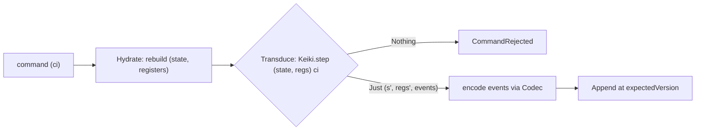

# Keiro foundation code walkthrough: EventStream, Stream, Codec, and the keiki transducer step

This ExecPlan is a living document. The sections Progress, Surprises & Discoveries,
Decision Log, and Outcomes & Retrospective must be kept up to date as work proceeds.


## Purpose / Big Picture

After this change, the keiro documentation set under `content/docs/keiro/` gains a brand-new,
contribution-grade **code walkthrough of the keiki↔keiro foundation** — the layer *every command in
the framework passes through*. Today a reader who lands on `/docs/keiro` can read four code
walkthroughs (the command cycle, the read side, the workflow engine, the integration path), but none
of them walks the *handles and the transducer step* those tours all stand on. They mention an
`EventStream`, a `Codec`, and "step the keiki transducer" and move on. A developer who wants real
confidence in the system — the user's stated goal for Phase 4 — has nowhere to read, end to end, what
a typed `Stream` handle *is*, what an `EventStream` actually marries together field by field, how the
`Codec` encode/decode boundary behaves, and — the heart of it — what keiki's `SymTransducer phi rs s
ci co` is, what its **symbolic registers** are versus its folded **state**, and exactly what
`Keiki.step` returns. This plan writes that tour.

"Event sourcing" means the system stores an append-only log of **events** (facts that happened, like
`OrderPlaced`) instead of a mutable row of current state; current state is *derived* by folding the
events back. keiro is a Haskell library (not a server) that builds event-sourced aggregates,
process managers, and sagas on top of three lower libraries: **kiroku** (the append-only PostgreSQL
event store), **keiki** (a pure symbolic-register finite-state **transducer** — the decision core),
and **shibuya** (the subscription/worker substrate). A **transducer** is a finite-state machine that,
on each transition, also *emits output*: feed keiki's machine the current state and a command and it
returns the next state plus the events to emit — or rejects the command because no transition applies.
That single object, threaded against a durable store, is what every keiro write goes through. This
plan documents the modules that define and run it: `Keiro.Stream`, `Keiro.EventStream`, `Keiro.Codec`
(all in `keiro-core/`), and keiki's `Keiki.Core` (`step`, `SymTransducer`, `RegFile`, `applyEvents`).

A reader who finishes this new tour can:

- **Name and resolve a stream.** They understand that a `Stream a` is a phantom-typed `newtype` over
  kiroku's `StreamName` — a compile-time tag so a name built for one aggregate cannot be passed where
  another is expected — and that an `EventStream`'s `resolveStreamName` field is what maps that typed
  handle to the physical `StreamName` the store reads and appends to.
- **Read an `EventStream` field by field.** They can explain every one of its seven fields — the
  `transducer`, the `initialState`/`initialRegisters` seed, the `eventCodec`, `resolveStreamName`, the
  `snapshotPolicy`, and the optional `stateCodec` — and why `stateCodec = Nothing` disables
  snapshotting regardless of policy. They see the marriage concretely on the `jitsurei` `orderEventStream`.
- **Trace the codec boundary.** They can follow `encodeForAppendWithMetadata` stamping a
  `schemaVersion` into metadata on write, and `decodeRecorded` reading that stamp back, replaying the
  upcaster chain, and running the current `decode` on read — and they know an unknown event-type tag
  on read is *fatal*.
- **Explain the heart: the `SymTransducer` and `step`.** In plain English they can say what a
  `SymTransducer phi rs s ci co` is, distinguish the **symbolic registers `rs`** (keiki's auxiliary
  typed register bank — a counter, an accumulated id, a deadline) from the folded **control state `s`**
  (the vertex the machine sits at), and state precisely that `Keiki.step` has type
  `SymTransducer phi rs s ci co -> (s, RegFile rs) -> ci -> Maybe (s, RegFile rs, [co])` —
  `Nothing` is a rejection, `Just (s', regs', events)` is the next state, the next register file, and
  the emitted events. Crucially, they understand that **registers are not derived from state**: they
  are a separate bank carried alongside it, which is exactly why a snapshot must persist *both*.
- **See why both halves of the pair must be threaded.** They can read the real keiro call site —
  `Keiki.step (eventStream ^. #transducer) (state current, registers current) command` — and explain
  why the command cycle carries the whole `(state, registers)` pair through hydration and into the
  step, not just the state.

You can see it working by running the docs site from the repo root
(`/Users/shinzui/Keikaku/bokuno/keiro-runtime-docs`): `pnpm dev` (runs `vite dev`) for the dev server,
or `pnpm build` (runs `vite build`, emitting a static single-page app under `.output/public`) for a
production build. Browse `http://localhost:3000/docs/keiro/walkthrough` and the sidebar shows a new
**foundation** tour nested under "Code Walkthrough": a `00 — Start here` plus five numbered chapters.
Haskell snippets render (with ligatures once the font plan has landed) and the `mermaid` diagrams
render as diagrams.

This is a **content** plan: it populates `content/docs/keiro/` only. It does not build the app, the
highlighter, the font, the Mermaid component, or the IA/template system — those are owned by
MasterPlan #1's plans and are complete. Every Haskell snippet documents keiro/keiki **as shipped** at
the pinned commits (keiro `3f5dc9c`, keiki read from its registered source on disk); where keiro's or
keiki's in-repo `docs/research/*` and `docs/plans/*` notes diverge from the shipped code, this plan
follows the source.


## Progress

Use a checklist to summarize granular steps. Every stopping point must be documented here, even if it
requires splitting a partially completed task into two ("done" vs. "remaining"). This section must
always reflect the actual current state of the work.

- [x] M0. Preconditions verified — EP-7 + EP-8 Complete (overview, jitsurei map,
      `docs/keiro-source-sync.md`, the `walkthrough/` hub + `walkthrough/meta.json`, the transducer
      primer page, and the command-cycle tour all exist); keiro source readable at `3f5dc9c`; keiki
      source located via `mori registry show shinzui/keiki --full` → `/Users/shinzui/Keikaku/bokuno/keiki`;
      the new `walkthrough/foundation/` subdir created. (No `pnpm build` run — out of this EP's scope per
      the dispatch; verification was by file existence + source cross-check.)
- [x] M1. `00-start-here.mdx` authored (56 lines) — overview `mermaid` (Hydrate → Transduce → Append),
      `<Cards>` index with absolute hrefs, source-file `text` block, forward-link-to-read-side note in
      prose parked on `/docs/keiro/walkthrough`, link back to the transducer primer.
- [x] M2. `01-the-stream-handle.mdx` authored (104 lines) — walks `Keiro.Stream` in full (`Stream a`,
      `stream`, `streamName`, `mapStreamName`), phantom-type rationale, `AggregateId a` → `Stream a`
      rename note, anchored to jitsurei `orderStream`; cross-links the EventStream-and-Stream reference.
- [x] M3. `02-the-event-stream.mdx` authored (179 lines) — `<TypeTable>`s for the five type params, the
      seven `EventStream` fields, the four `SnapshotPolicy` constructors, the four `StateCodec` fields;
      both jitsurei marriage blocks; the `(s, RegFile rs)` pair parameterization and the
      `stateCodec = Nothing` rule; links the snapshot runtime to the snapshot reference + read-side tour.
- [x] M4. `03-the-codec.mdx` authored (161 lines) — `<TypeTable>` of the six `Codec` fields, the six
      `CodecError` constructors, the seven encode/decode/migrate/metadata signatures; write stamp
      (schema key wins), read path, fatal-on-unknown-`eventType`, ascending-contiguous chain rule;
      decode-path `mermaid`; anchored to jitsurei `orderCodec`; links EP-8's deep codec material.
- [x] M5. `04-the-symtransducer-and-step.mdx` authored (223 lines, THE HEART) — plain-English
      transducer + symbolic-register definitions linking the primer; `RegFile` GADT; empty `OrderRegs`
      vs populated `OrderCartRegs` + separate `OrderVertex` contrast ("registers are not derived from
      state"); `SymTransducer`'s four fields; `step`'s exact signature/body + `Maybe (s, RegFile rs, [co])`
      return shape; `step` `mermaid`; `applyEvents` inverse; forward-link to read-side in prose.
- [x] M6. `05-threading-state-and-registers.mdx` authored (109 lines) — `Hydrated rs s` record and
      `evaluateCommand` from `Keiro.Command`, the `Keiki.step … (state current, registers current) …`
      line, the "both halves carried" rationale, forward-link to read-side in prose, cross-link to the
      command-cycle start-here.
- [x] M7. `walkthrough/foundation/meta.json` created (title "The foundation", six slugs in order);
      `"foundation"` appended to `walkthrough/meta.json` (preserving `operations` that EP-18 added in
      parallel); **no** `<Card href>` added to `walkthrough/index.mdx` (EP-19 owns that — confirmed 0
      hits).
- [x] M8. Self-verification gate (no `pnpm`, per scope): all internal links resolve to existing files;
      relative-link audit clean; every fence tagged (equal tagged-openers/bare-closers per file);
      Haskell-name audit 0 missing across keiro + keiki; depth checklist all covered. **Deferred to EP-19:**
      the full `pnpm build` / `pnpm lint:links` whole-tree gate and the browser render check.


## Surprises & Discoveries

Document unexpected behaviors, bugs, optimizations, or insights discovered during implementation.
Provide concise evidence.

- **Source matched the transcription exactly.** Cross-checking every quoted name against the pinned
  trees, the Context §"transcribed from source" snippets were verbatim-accurate: `Keiro.Stream`,
  `Keiro.EventStream` (seven fields, `SnapshotPolicy` four ctors, `StateCodec` four fields),
  `Keiro.Codec` (six fields, `Upcaster`, six `CodecError` ctors, all seven functions), keiki
  `Keiki.Core` (`Slot`, `RegFile`/`RNil`/`RCons`, `SymTransducer` four fields, `step`'s exact body,
  `applyEvents`/`applyEventStreaming`, `BoolAlg`), and `Keiro.Command` (`Hydrated`, `evaluateCommand`).
  No `EventStream`/`Codec` field renames between the pin and the transcription. Evidence: the M8
  Haskell-name audit reported 0 MISSING across both source trees.
- **keiki OrderCart uses `OrderCmd`, not `OrderCommand`.** The populated-register example
  (`jitsurei/src/Jitsurei/OrderCart.hs`) names its command sum `OrderCmd` and its transducer is
  `orderCart :: Guarded OrderCartRegs OrderVertex OrderCmd OrderEvent`. (keiro's *own* jitsurei order
  aggregate, by contrast, uses `OrderCommand`.) Chapter 04 quotes `OrderCartRegs`, `OrderVertex`, and
  the `'[]`/populated contrast only — it does not quote `OrderCmd` in a code fence, so no name
  collision reaches the page; the distinction is noted here for accuracy.
- **CROSS-TOUR SLUG DRIFT — command-cycle codec chapter renumbered `03-` → `05-`.** This plan's prose
  named the codec-on-the-boundary cross-link as
  `/docs/keiro/walkthrough/command-cycle/03-the-codec-on-the-boundary`, but EP-13's parallel command-cycle
  *deepening* renumbered it to `05-the-codec-on-the-boundary` (the dispatch's canonical slug map confirms
  this). Resolution: chapter 03 links the canonical
  `/docs/keiro/walkthrough/command-cycle/05-the-codec-on-the-boundary`. All other named slugs (the
  command-cycle `00-start-here`, the reference/explanation pages, the primer anchor) were unchanged and
  resolve.
- **`walkthrough/meta.json` already carried `"operations"`.** EP-18 (parallel) had appended its tour
  before this EP ran. Per the append-only contract, `"foundation"` was added after `"operations"` without
  reordering or removing any entry. Final `pages`:
  `["index", "command-cycle", "read-side", "workflow", "integration", "operations", "foundation"]`.


## Decision Log

Record every decision made while working on the plan.

- Decision: This plan **creates the new `walkthrough/foundation/` subdirectory** (with its own
  `meta.json`, a `00-start-here.mdx`, and five numbered chapters) and **appends `"foundation"` to
  `content/docs/keiro/walkthrough/meta.json`** so the tour is sidebar-navigable, but it does **not** add
  a `<Card href>` for it to the hub `content/docs/keiro/walkthrough/index.mdx`.
  Rationale: MasterPlan Integration Point #2's Phase-4 extension assigns the two new hub `<Card>`s
  (`foundation`, `operations`) to **EP-19**, which adds them once *both* new tours exist. Adding a hub
  `<Card href>` to a page before its target's siblings all exist is exactly the hard-won crawler failure
  recorded in the MasterPlan's Surprises (the prerender crawler follows `<Card href>`s and emits
  `Failed to fetch` for not-yet-existing targets). A `meta.json` entry alone makes the tour navigable
  from the sidebar with no dead link.
  Date: 2026-06-02
- Decision: EP-17 owns the **conceptual** register model only; the **persistence** of the
  `(state, registers)` pair (the snapshot codec, the `keiro_snapshots` schema, the snapshot policy
  evaluation) is owned by **EP-14** (read-side tour).
  Rationale: MasterPlan Integration Point #7 splits the snapshot story so neither plan contradicts the
  other and the thread reads as one. EP-17's transducer chapter links *forward* to the read-side tour
  for "how this pair is persisted"; EP-14's snapshot chapters link *back* to EP-17 for the register
  model. Because EP-14's read-side *deepening* may not be merged when EP-17 builds, the forward link is
  **parked on the `walkthrough` landing** (`/docs/keiro/walkthrough`) and the read-side target named in
  prose, per the crawler rule.
  Date: 2026-06-02
- Decision: Use the **command-cycle phrasing "Hydrate → Transduce → Append"**, never "Decide".
  Rationale: "Decide" echoes keiki's banned legacy **Decider façade**; the shipped operation is
  `Keiki.step` on a `SymTransducer` (a *transducer step*). The MasterPlan renamed the phase
  framework-wide (Decision of 2026-06-01) and this new tour must match.
  Date: 2026-06-02
- Decision: Illustrate "registers vs state" with **two** jitsurei-style examples: the keiro
  `jitsurei` order aggregate (`OrderRegs = '[]`, an *empty* register file — perfect for showing the
  *marriage mechanism* without register noise) and keiki's own `OrderCart` example
  (`OrderCartRegs` — a *populated* register bank: `itemCount`, `discountBp`, accumulated ids — perfect
  for showing *why registers exist* and that they are not derived from the vertex).
  Rationale: the task requires defining symbolic registers concretely, and the keiro order stream
  deliberately uses no registers, so a populated example from keiki source is needed to make the
  concept land. Evidence: `jitsurei/src/Jitsurei/OrderStream.hs` `type OrderRegs = '[]`;
  keiki `jitsurei/src/Jitsurei/OrderCart.hs` `type OrderCartRegs = '[ '("itemCount", ItemCount), … ]`.
  Date: 2026-06-02


## Outcomes & Retrospective

Summarize outcomes, gaps, and lessons learned at major milestones or at completion. Compare the
result against the original purpose.

**Outcome (2026-06-02).** The six-page `walkthrough/foundation/` tour exists and meets its purpose. A
reader can now: name/resolve a stream (ch. 01), read an `EventStream` field by field (ch. 02), trace the
codec boundary (ch. 03), explain a `SymTransducer` and `Keiki.step`'s exact `Maybe (s, RegFile rs, [co])`
return shape and distinguish the symbolic registers `rs` from the folded control state `s` (ch. 04 — the
canonical register-model chapter for Integration Point #7), and read the real `evaluateCommand` call site
that threads `(state current, registers current)` through `Keiki.step` (ch. 05). Every snippet was
cross-checked verbatim against the pinned source (keiro `3f5dc9c`; keiki at
`/Users/shinzui/Keikaku/bokuno/keiki`); the Haskell-name audit is 0 missing.

Files: `00-start-here.mdx` (56), `01-the-stream-handle.mdx` (104), `02-the-event-stream.mdx` (179),
`03-the-codec.mdx` (161), `04-the-symtransducer-and-step.mdx` (223), `05-threading-state-and-registers.mdx`
(109), `meta.json` (11). `"foundation"` appended to `walkthrough/meta.json` (after EP-18's `"operations"`);
the hub `walkthrough/index.mdx` was left untouched (0 foundation hits) so EP-19 owns its `<Card href>`.

Forward-links to read-side snapshot persistence are parked in prose on `/docs/keiro/walkthrough` on the
`00-start-here`, ch. 04, and ch. 05, naming the read-side snapshot chapters as the persistence owner — no
direct link to a possibly-unbuilt page, per Integration Point #7.

Gaps / deferred: the whole-tree `pnpm build` (zero-crawler-warnings) and `pnpm lint:links` gate, plus the
browser render check (mermaid/TypeTable/sidebar), are out of this EP's dispatch scope and are owned by
**EP-19**'s finalization gate. Self-verification here was by file-existence link resolution (all internal
links resolve), the relative-link audit (clean), the fence audit (every opener tagged), and the
Haskell-name + depth checklists (all covered).


## Context and Orientation

Read this whole section before editing. It is written so a novice with only this file and the working
tree can complete the work. You will write MDX content files; you will not write or compile Haskell.
The Haskell appears only as *quoted snippets* inside the docs, and every snippet must match the real
source transcribed below.

### What you are building, and where

This repository (`/Users/shinzui/Keikaku/bokuno/keiro-runtime-docs`) is a **fumadocs** documentation
site (fumadocs-ui + fumadocs-mdx) built on **TanStack Start as a static single-page app** (React + MDX +
TypeScript, bundled with **Vite**), built and served with **pnpm** on **Node 22**. `pnpm dev` runs
`vite dev`; `pnpm build` runs `vite build` and emits a static SPA under `.output/public`. Content lives
under `content/docs/`. Each directory has a `meta.json` whose `pages` array lists child page slugs (and
nested directory names) in sidebar order. A "page" is an `.mdx` file: YAML frontmatter (`title`,
`description`) followed by an MDX body.

The documented **code samples are Haskell** (the site is TypeScript; the subjects, keiro and keiki, are
Haskell libraries). MDX components (`Callout`, `Cards`, `Card`, `Steps`, `Step`, `Tabs`, `Tab`,
`TypeTable`, `Accordion`, `Accordions`, and `Mermaid`) are **registered globally** in
`src/components/mdx.tsx` — so in page bodies you use them **bare, with no `import` lines**. This matches
every existing keiro/kiroku page. Do not add `import` statements for these components.

### Where this plan sits in the larger effort (reference by path)

This is **EP-17** in the MasterPlan `docs/masterplans/2-keiro-framework-documentation-set.md`, in
**Phase 4 (walkthrough deepening)**. It authors a **new** tour the earlier phases never wrote.

- **HARD DEP — EP-7** (`docs/plans/7-keiro-overview-getting-started-and-the-jitsurei-example-spine.md`)
  and **EP-8** (`docs/plans/8-keiro-command-cycle-and-write-path-documentation.md`): both must be
  **Complete** before you start (per the MasterPlan registry they are). EP-7 created the `/docs/keiro`
  overview, the core-concepts explanation pages this tour links back to (notably the transducer primer
  at `/docs/keiro/explanation/the-keiro-stack#what-is-a-transducer`), the jitsurei worked-example map,
  `docs/keiro-source-sync.md`, the `walkthrough/index.mdx` hub, and `walkthrough/meta.json`. EP-8 wrote
  the `Keiro.Command`/`Keiro.Codec`/`Keiro.EventStream`/`Keiro.Stream` *reference and explanation* pages
  this tour cross-links (e.g. `/docs/keiro/reference/event-stream-and-stream`,
  `/docs/keiro/reference/codec`, `/docs/keiro/explanation/why-symtransducer-not-decider`) and the
  `walkthrough/command-cycle/` tour the foundation tour sits beneath conceptually. Verify both in M0; if
  `content/docs/keiro/index.mdx` or `content/docs/keiro/walkthrough/index.mdx` is missing, stop and
  finish the prerequisite plan first.
- **SOFT — EP-14** (`docs/plans/14-deepen-the-keiro-read-side-walkthrough-snapshots-and-keiki-registers.md`):
  EP-14 deepens the read-side tour and owns the **persistence** of the `(state, registers)` pair (the
  snapshot codec). Per MasterPlan Integration Point #7, EP-17's transducer chapter links *forward* to
  EP-14's snapshot material for "how this pair is persisted," and EP-14 links *back* to this tour's
  register model. Soft means non-blocking: because EP-14's deepened chapters may not exist when you
  build, **park the forward link on the `walkthrough` landing** `/docs/keiro/walkthrough` and name the
  read-side snapshot target in prose (see "Hard-won house rules" below).
- **INTEGRATION — EP-19** (`docs/plans/19-keiro-walkthrough-finalization-hub-ordering-and-whole-tree-gate.md`):
  EP-19 finalizes the walkthrough hub. **It** adds the two new hub `<Card href>`s (`foundation`,
  `operations`) and runs the whole-tree gate, once both new tours exist. This plan must **not** add a
  hub `<Card href>` for the foundation tour.

### Hard-won house rules (apply to every page you write)

1. **Absolute doc links only.** Cross-page links use absolute doc paths
   (`/docs/keiro/reference/codec`), never relative `./sibling` or `../section/page`. Relative MDX links
   resolve *wrong* in the static SPA and trip the prerender crawler. This applies even to the
   code-walkthrough template's `[00 — Start here](./00-start-here)` line — when you copy that template,
   **rewrite the link to an absolute path**
   (`/docs/keiro/walkthrough/foundation/00-start-here`).
2. **Park forward-links to not-yet-shipped pages on the section/tour landing.** The prerender crawler
   follows MDX links and `<Card href>`s and emits `Failed to fetch` for any target that does not exist
   yet. For the read-side snapshot persistence link (EP-14, may be unbuilt), link
   `/docs/keiro/walkthrough` (the tour landing — which always exists) and name the read-side target in
   prose. Do **not** add a hub `<Card href>` for this tour to `walkthrough/index.mdx` (EP-19 owns it).
3. **Every fenced code block carries a language tag.** Use ` ```haskell `, ` ```json `, ` ```mermaid `,
   ` ```bash `, ` ```text `. Never a bare ```` ``` ````.
4. **Snippet accuracy is an acceptance criterion.** Every Haskell type, field, and function name you
   quote must appear in the pinned source. The verified transcription is below; cross-check against the
   files named before declaring a snippet done.
5. **No `import` lines for the MDX components** (see above).
6. **Command-cycle phrasing is "Hydrate → Transduce → Append," never "Decide."**

### The subject, transcribed from source (use these REAL names)

Two source trees, both read-only — do **not** edit either:

- **keiro** at `/Users/shinzui/Keikaku/bokuno/keiro`, pinned commit `3f5dc9c` (keiro `0.1.0.0`). The
  foundation modules live in `keiro-core/src/Keiro/` (`Stream.hs`, `EventStream.hs`, `Codec.hs`,
  `Prelude.hs`) and the call site in `keiro/src/Keiro/Command.hs`.
- **keiki** at `/Users/shinzui/Keikaku/bokuno/keiki` (locate it yourself with
  `mori registry show shinzui/keiki --full` — its `Path:` line prints `/Users/shinzui/Keikaku/bokuno/keiki`).
  The transducer core is `src/Keiki/Core.hs`; the shape-hash helper is `src/Keiki/Shape.hs`; a
  populated-register example is `jitsurei/src/Jitsurei/OrderCart.hs`.

The facts below are transcribed verbatim from those trees. Treat this as your API cheat-sheet.

**(A) THE TYPED STREAM HANDLE** (`keiro-core/src/Keiro/Stream.hs`, 40 lines — quoted in full where
useful).

```haskell
-- A StreamName tagged with the phantom type @a@ of the stream it names.
newtype Stream a = Stream
  { name :: StreamName
  }
  deriving stock (Generic, Eq, Ord, Show)

stream     :: Text -> Stream a                                  -- build a handle from a raw stream-name Text
streamName :: Stream a -> StreamName                            -- recover the underlying StreamName
mapStreamName :: (StreamName -> StreamName) -> Stream a -> Stream a  -- transform the name, keep the phantom tag
```

The implementations are tiny and worth quoting: `stream name = Stream { name = StreamName name }`;
`streamName value = value ^. #name`; `mapStreamName f value = value & #name %~ f`. The **phantom type**
`a` carries no runtime value — it exists only so the type checker can demand, say, a
`Stream OrderEventStream` rather than a bare `StreamName`, so a name built for one aggregate cannot be
passed where another is expected. `StreamName` comes from kiroku (`Kiroku.Store.Types`). The jitsurei
anchor: `orderStream :: OrderId -> Stream OrderEventStream`, defined
`orderStream orderId = stream ("order-" <> orderIdText orderId)` in `jitsurei/src/Jitsurei/OrderStream.hs`.
(The keiro design notes' old name for this handle was `AggregateId a`; the **shipped** type is
`Stream a` — trust the source.)

**(B) THE EVENT STREAM + SNAPSHOT POLICY + STATE CODEC** (`keiro-core/src/Keiro/EventStream.hs`, 97
lines). The module Haddock states the thesis verbatim: an `EventStream` "marries a pure keiki
`SymTransducer` … with everything keiro needs to run it against a durable event store."

```haskell
-- The complete description of one persistent event stream. Type params thread through from the
-- underlying transducer: phi = guard alphabet, rs = register set, s = control state,
-- ci = command input, co = event output (what eventCodec serializes).
data EventStream phi rs s ci co = EventStream
  { transducer        :: !(SymTransducer phi rs s ci co)
  , initialState      :: !s
  , initialRegisters  :: !(RegFile rs)
  , eventCodec        :: !(Codec co)
  , resolveStreamName :: !(Stream (EventStream phi rs s ci co) -> StreamName)
  , snapshotPolicy    :: !(SnapshotPolicy (s, RegFile rs))
  , stateCodec        :: !(Maybe (StateCodec (s, RegFile rs)))  -- Nothing disables snapshotting
  }
  deriving stock (Generic)

data SnapshotPolicy state
  = Never                                  -- never snapshot; always replay the full log
  | Every !Int                             -- snapshot when version is a multiple of n (non-positive disables)
  | OnTerminal                             -- snapshot only at a final state
  | Custom !(state -> StreamVersion -> Bool)
  deriving stock (Generic)

data StateCodec state = StateCodec
  { stateCodecVersion :: !Int     -- bumped when the snapshot encoding changes incompatibly
  , shapeHash         :: !Text    -- digest of the folded-state shape; guards snapshot reuse
  , encode            :: !(state -> Value)
  , decode            :: !(Value -> Either Text state)
  }
  deriving stock (Generic)
```

Two load-bearing facts from the Haddock and field types: (1) `snapshotPolicy` and `stateCodec` are
both parameterized over **`(s, RegFile rs)`** — the *pair* of folded state and register file — which is
the structural proof, visible in the type, that snapshots concern both halves, not just `s`. (2)
`stateCodecVersion` and `shapeHash` *together* gate snapshot reuse: a stored snapshot is loaded only
when both match, so changing the snapshot encoding or the folded-state shape invalidates older
snapshots and forces a clean rehydration from events. The jitsurei anchor shows both ends:
`orderEventStream` uses `snapshotPolicy = Never`, `stateCodec = Nothing` (no snapshotting), while
`snapshotOrderEventStream` overrides those to `snapshotPolicy = Every 2`,
`stateCodec = Just (defaultStateCodec @OrderRegs @OrderState 1)`
(`jitsurei/src/Jitsurei/OrderStream.hs`). The **runtime** snapshot mechanics — `writeSnapshot`,
`hydrateWithSnapshot`, `defaultStateCodec`, `shouldSnapshot`, the `keiro_snapshots` table — are
documented by EP-9's `/docs/keiro/reference/snapshot` and deepened by EP-14's read-side tour; this tour
documents the `EventStream` *fields* and links there for the read/write mechanics.

The full jitsurei marriage block to quote (verbatim from `OrderStream.hs`):

```haskell
orderEventStream :: OrderEventStream
orderEventStream = EventStream
  { transducer        = orderTransducer
  , initialState      = NotStarted
  , initialRegisters  = RNil               -- OrderRegs = '[]: an empty register file
  , eventCodec        = orderCodec
  , resolveStreamName = Stream.streamName
  , snapshotPolicy    = Never
  , stateCodec        = Nothing
  }
```

where `type OrderEventStream = EventStream (HsPred OrderRegs OrderCommand) OrderRegs OrderState
OrderCommand OrderEvent` and `type OrderRegs = '[]`.

**(C) THE CODEC** (`keiro-core/src/Keiro/Codec.hs`, 223 lines). The codec is a **value-level record**,
not a typeclass.

```haskell
-- One rung of an upcaster chain: the source version it upgrades FROM, and a pure migration.
type Upcaster = (Int, Value -> Either Text Value)

data Codec e = Codec
  { eventTypes    :: !(NonEmpty Text)          -- the complete event-type allow-list this codec owns
  , eventType     :: !(e -> Text)              -- project a domain value to its wire tag
  , schemaVersion :: !Int                      -- current payload version; must be >= 1
  , encode        :: !(e -> Value)             -- current-version JSON serialization
  , decode        :: !(Value -> Either Text e) -- only ever sees payloads migrated to schemaVersion
  , upcasters     :: ![Upcaster]               -- migrations keyed by source version
  }
  deriving stock (Generic)

data CodecError
  = UnknownEventType !EventType ![Text]        -- tag not in eventTypes (offending tag, allowed set)
  | InvalidSchemaVersion !Int                  -- schemaVersion is not >= 1
  | UnknownVersion !Int                        -- stored version is < 1 or beyond the chain
  | UpcasterError !Int !Text                   -- an upcaster rejected its input (source version, msg)
  | DecodeFailed !Text                         -- the current decode rejected a migrated payload
  | GapInUpcasterChain !Int !Int               -- reached version n, next rung starts later
  deriving stock (Generic, Eq, Show)

encodeForAppend             :: Codec e -> e -> Either CodecError EventData
encodeForAppendWithMetadata :: Codec e -> Maybe Value -> e -> Either CodecError EventData
decodeRecorded              :: Codec e -> RecordedEvent -> Either CodecError e
decodeRaw                   :: Codec e -> Int -> Value -> Either CodecError e
migrateToCurrent            :: Codec e -> Int -> Value -> Either CodecError Value
extractSchemaVersion        :: RecordedEvent -> Int            -- defaults to 1 when absent/invalid
metadataFor                 :: Int -> Maybe Value -> Value     -- inserts the schemaVersion key
```

Behavior to teach (from the module Haddock and EP-8's verified findings): producers call
`encodeForAppend`/`encodeForAppendWithMetadata`, which **stamp `schemaVersion` into event metadata**
(the schema key wins over any clashing caller key, so the stamp on disk is authoritative); consumers
call `decodeRecorded`, which reads that stamp back via `extractSchemaVersion` (defaulting to `1` when
absent), replays the upcaster chain via `migrateToCurrent` (`n, n+1, …` up to `schemaVersion`), then
runs the current `decode`. **An unknown `eventType` on read is fatal** (`UnknownEventType`). The
upcaster chain must be ascending and contiguous: reaching version `n` with the next rung starting later
yields `GapInUpcasterChain n nextVersion`. The jitsurei anchor: `orderCodec :: Codec OrderEvent` has
`schemaVersion = 2`, `upcasters = [(1, upcastOrderPlacedV1)]`,
`eventTypes = "OrderPlaced" :| ["PaymentApproved", "OrderPacked", "OrderShipped", "OrderCancelled"]`
(`jitsurei/src/Jitsurei/OrderStream.hs`). This tour documents the codec as the *boundary the
`EventStream` owns*; the schema-evolution *how-to* and the deep upcaster walk already live in EP-8's
`/docs/keiro/explanation/codec-and-schema-evolution`, `/docs/keiro/reference/codec`, and
`/docs/keiro/walkthrough/command-cycle/03-the-codec-on-the-boundary` — link there rather than
re-deriving the upcaster chain in full.

**(D) THE HEART — keiki's `SymTransducer`, `RegFile`, and `step`** (`src/Keiki/Core.hs` in the keiki
tree). `Keiro.EventStream` imports `RegFile` and `SymTransducer` directly from `Keiki.Core`
(`import Keiki.Core (RegFile, SymTransducer)`), so these are the real keiki types, not keiro wrappers.

The register file is a typed heterogeneous tuple indexed by a list of named **slots** (a slot is a
label paired with the type of its value, `type Slot = (Symbol, Type)`):

```haskell
-- A typed heterogeneous register tuple indexed by a list of Slots.
data RegFile (rs :: [Slot]) where
  RNil  :: RegFile '[]
  RCons :: KnownSymbol s => Proxy s -> r -> RegFile rs -> RegFile ('(s, r) ': rs)
```

So `RegFile '[]` (written `RNil`) is the *empty* register bank — exactly the jitsurei order aggregate's
`OrderRegs`. A *populated* bank looks like keiki's `OrderCart` example
(`jitsurei/src/Jitsurei/OrderCart.hs`):

```haskell
type OrderCartRegs =
  '[ '("itemCount",       ItemCount)
   , '("discountBp",      DiscountBp)
   , '("reservationId",   Text)
   , '("paymentRef",      Text)
   , '("amountPaid",      Money)
   , '("shippingCarrier", Text)
   , '("trackingId",      Text)
   -- … and more
   ]
```

Each slot is a named cell of typed working memory the machine carries *alongside* its control state.
`OrderCart`'s control state is a separate enum vertex
(`data OrderVertex = Empty | OpenWithItems | Reserved | Paid | Shipped | Delivered | Cancelled |
Refunded`). This is the canonical "registers vs state" contrast: the vertex says *where in the
lifecycle* the order is; the registers hold *running data* (a quantity tally, an accumulated payment
reference) that the vertex alone does not encode. **Registers are not derived from the state** — they
are an auxiliary bank, which is why hydration and snapshots must carry both.

The transducer itself is a finite control graph plus that register file:

```haskell
data SymTransducer phi rs s ci co = SymTransducer
  { edgesOut    :: s -> [Edge phi rs ci co s]   -- the outgoing transitions from each control state
  , initial     :: s                            -- the start vertex
  , initialRegs :: RegFile rs                   -- the start register file
  , isFinal     :: s -> Bool                    -- which control states are terminal
  }
```

(An `Edge` carries a `guard :: phi`, an `update` to the registers, an `output :: [OutTerm …]` — `[]`
is an ε-edge that emits nothing, `[o]` a single event, `[o1, o2, …]` a multi-event edge — and a
`target` vertex. You do not need to walk `Edge` field by field for this tour; name it and move on.)

The single most important signature in this whole tour is `step`:

```haskell
-- One full step of the transducer. Returns Nothing if no edge from the current vertex has a
-- satisfied guard. The inner [co] is [] for an ε-edge, [o] for a letter edge, [o1, …] for a
-- multi-event edge.
step
  :: BoolAlg phi (RegFile rs, ci)
  => SymTransducer phi rs s ci co
  -> (s, RegFile rs)
  -> ci
  -> Maybe (s, RegFile rs, [co])
step t (s, regs) ci = case delta t s regs ci of
  Nothing          -> Nothing
  Just (s', regs') -> Just (s', regs', omega t s regs ci)
```

Read the type aloud: given the transducer, the **pair** `(s, RegFile rs)` (current control state *and*
current registers), and a command `ci`, `step` returns `Nothing` (no edge's guard was satisfied — a
**rejection**) or `Just (s', regs', events)` (the next control state, the **next register file**, and
the list of emitted events `[co]`). The `BoolAlg phi (RegFile rs, ci)` constraint is keiki's effective
Boolean algebra over the guard alphabet `phi` — `models :: phi -> (RegFile rs, ci) -> Bool` is the
predicate-evaluation method `delta` uses to decide which edge fires. The internal `delta` returns the
unique active edge's `(target, updated-registers)`; `omega` returns that edge's evaluated outputs;
`step` combines them. Note both `delta` and `omega` see the *old* `regs` — register updates apply on
the transition, and the emitted events are evaluated against the pre-update register snapshot.

Two more keiki entry points the runtime uses (quote, do not deep-dive — they belong to EP-13/EP-14's
hydration chapters): `applyEvents :: (BoolAlg phi (RegFile rs, ci), Eq co) => SymTransducer phi rs s
ci co -> (s, RegFile rs) -> [co] -> Maybe (s, RegFile rs)` replays a chunk of *events* (not commands)
forward from a `(state, registers)` start, returning the next pair — the inverse direction used when
rebuilding state from the log; `applyEventStreaming` is its single-event, multi-event-edge-aware
companion that `Keiro.Command.hydrateFull` folds over the stored events. The point this tour makes:
both directions thread the **same pair**.

**(E) THE REAL CALL SITE** (`keiro/src/Keiro/Command.hs`). keiro hydrates a stream into a `Hydrated`
record and then steps the transducer with the whole pair:

```haskell
data Hydrated rs s = Hydrated
  { state          :: !s
  , registers      :: !(RegFile rs)
  , streamVersion  :: !StreamVersion
  , globalPosition :: !(Maybe GlobalPosition)
  }
  deriving stock (Generic)

evaluateCommand ::
  BoolAlg phi (RegFile rs, ci) =>
  EventStream phi rs s ci co ->
  Hydrated rs s ->
  ci ->
  Either CommandError [co]
evaluateCommand eventStream current command =
  case Keiki.step (eventStream ^. #transducer) (state current, registers current) command of
    Nothing             -> Left CommandRejected
    Just (_, _, events) -> Right events
```

This is the linchpin the whole tour builds to: `(state current, registers current)` — *both* halves of
the hydrated pair — are passed into `Keiki.step`. A `Nothing` becomes `CommandRejected`; a
`Just (_, _, events)` yields the events to encode and append. The command cycle therefore must hydrate
and carry registers, not just state, all the way through. (How those events get encoded, appended at an
expected version, and how a snapshot of the `(state, registers)` pair is *persisted* are the
command-cycle and read-side tours' jobs respectively — link, do not re-document.)

### The jitsurei worked example (your anchor)

`jitsurei` (実例, "worked example") is the runnable package shipped in the keiro repo; the keiki repo
ships its own `jitsurei/` examples too. This tour anchors to:

- **keiro `jitsurei`** — `jitsurei/src/Jitsurei/OrderStream.hs` (`orderEventStream`,
  `snapshotOrderEventStream`, `orderTransducer`, `orderCodec`, `orderStream`, `type OrderRegs = '[]`)
  and `jitsurei/src/Jitsurei/Domain.hs` (the `OrderCommand`/`OrderEvent`/`OrderState` types). This is
  the *marriage* example (empty registers, so the `EventStream` wiring is the focus). Run target:
  `just jitsurei-fulfillment`.
- **keiki `jitsurei`** — `jitsurei/src/Jitsurei/OrderCart.hs` (`type OrderCartRegs`, `OrderVertex`,
  `orderCart :: Guarded OrderCartRegs OrderVertex OrderCmd OrderEvent`). This is the *populated-register*
  example used in chapter 04 to show why registers exist and that they are distinct from the vertex.

### The pages this plan authors (all under `content/docs/keiro/walkthrough/foundation/`)

`00-start-here.mdx`, `01-the-stream-handle.mdx`, `02-the-event-stream.mdx`, `03-the-codec.mdx`,
`04-the-symtransducer-and-step.mdx`, `05-threading-state-and-registers.mdx`, plus `meta.json`.

### Templates to copy from

Copy the code-walkthrough template's frontmatter + skeleton from
`content/docs/_templates/code-walkthrough.mdx`. Good in-repo exemplars for tone and component usage:
`content/docs/keiro/walkthrough/command-cycle/00-start-here.mdx` (start-here framing + overview
`mermaid` + the `<Cards>` chapter index) and `content/docs/keiro/walkthrough/command-cycle/03-the-codec-on-the-boundary.mdx`
(a chapter that quotes source and walks it in prose). Re-read the transducer primer at
`content/docs/keiro/explanation/the-keiro-stack.mdx` (`#what-is-a-transducer`) so chapter 04's plain-English
definitions stay consistent with it and *link* it rather than re-explaining from scratch.


## Plan of Work

The work is nine milestones. M0 verifies preconditions and creates the subdir. M1–M6 each author one
page and are independently verifiable by building the site and viewing the new page. M7 wires the
sidebar. M8 runs the full acceptance gate. Author in order; the early chapters establish vocabulary the
heart chapter (M5) leans on.

### M0 — Preconditions and subdir

Confirm EP-7 and EP-8 are Complete and the toolchain/trees are ready. Locate the keiki source. Create
the `walkthrough/foundation/` subdir. At the end you can run `pnpm build` on the existing tree with
zero errors and the empty subdir exists. Acceptance: the build succeeds before you add any page, and
`content/docs/keiro/index.mdx`, `content/docs/keiro/walkthrough/index.mdx`, and `docs/keiro-source-sync.md`
all exist; `mori registry show shinzui/keiki --full` prints the keiki `Path:`.

### M1 — `00-start-here.mdx` (start here)

Frame the foundation in prose: the typed `Stream` handle, the `EventStream` that marries a keiki
`SymTransducer` to a `Codec` + `SnapshotPolicy`, the codec boundary, and the transducer `step` that
threads `(state, registers)`. Include an overview `mermaid` showing a command entering the
`EventStream`, hydrating the `(state, registers)` pair, `Keiki.step` producing the next pair + events,
and the codec encoding them — i.e. the **Hydrate → Transduce → Append** shape, with the foundation
pieces labelled. Provide a `<Cards>` index linking the five chapters with **absolute** hrefs. Name the
source files in a `text` block. **In prose**, place the forward-link note: snapshots persist the whole
`(state, registers)` pair — see the read side, linking `/docs/keiro/walkthrough` (the tour landing) and
naming the read-side snapshot tour as the place that covers persistence (EP-14). Link back to the
transducer primer `/docs/keiro/explanation/the-keiro-stack#what-is-a-transducer`. Acceptance:
`pnpm build` prerenders it with no crawler warnings.

### M2 — `01-the-stream-handle.mdx`

Walk `Keiro.Stream` in full (it is only 40 lines). Quote the `newtype Stream a` and the three
functions, explain the phantom type in plain English (a compile-time-only tag; no runtime value),
quote the tiny implementations, and anchor to jitsurei `orderStream`. Note the design-note rename
(`AggregateId a` → `Stream a`) and that `resolveStreamName` (next chapter) is what turns this handle
into the physical `StreamName`. Cross-link `/docs/keiro/reference/event-stream-and-stream` (EP-8's
reference). Acceptance: builds; links absolute.

### M3 — `02-the-event-stream.mdx`

Walk `Keiro.EventStream` field by field. Use a `<TypeTable>` for the seven `EventStream` fields, then
`SnapshotPolicy` (four constructors) and `StateCodec` (four fields). Quote the jitsurei
`orderEventStream` marriage block and `snapshotOrderEventStream` override. Make the two load-bearing
points: every field's purpose, and that `stateCodec = Nothing` disables snapshotting regardless of
policy; emphasize that `snapshotPolicy`/`stateCodec` are parameterized over the **`(s, RegFile rs)`
pair**. Link the snapshot *runtime* mechanics to `/docs/keiro/reference/snapshot` (EP-9) and, in prose,
to the read-side tour for the deep snapshot walk. Acceptance: builds; `<TypeTable>` renders.

### M4 — `03-the-codec.mdx`

Walk `Keiro.Codec` as the stream's serialization boundary. `<TypeTable>` the six `Codec` fields; list
the six `CodecError` constructors; quote the seven encode/decode/migrate/metadata signatures. Teach the
write stamp (schema key wins), the read path (`extractSchemaVersion` default 1 → `migrateToCurrent` →
`decode`), fatal-on-unknown-`eventType`, and the ascending-contiguous upcaster rule. Anchor to jitsurei
`orderCodec` (`schemaVersion = 2`, `upcasters = [(1, upcastOrderPlacedV1)]`). Because EP-8 already
ships the deep codec walk, **link** `/docs/keiro/walkthrough/command-cycle/03-the-codec-on-the-boundary`,
`/docs/keiro/explanation/codec-and-schema-evolution`, and `/docs/keiro/reference/codec` rather than
duplicating the full upcaster chapter; this chapter's job is to place the codec *within the foundation*.
Include the decode-path `mermaid` (read stamp → migrate chain → decode). Acceptance: builds.

### M5 — `04-the-symtransducer-and-step.mdx` (THE HEART)

This is the chapter the whole tour exists for. Define **transducer** and **symbolic register** in plain
English first (one short paragraph each), linking the primer
`/docs/keiro/explanation/the-keiro-stack#what-is-a-transducer` and noting it as the gentle introduction.
Then: quote `RegFile` (the GADT), contrast the empty `OrderRegs = '[]` with keiki's populated
`OrderCartRegs` and the separate `OrderVertex` control state — making explicit that **registers are an
auxiliary bank, not derived from state**. Quote `SymTransducer`'s four fields. Then quote `step`'s exact
signature and body and read it aloud: input is the **pair** `(s, RegFile rs)` plus a command; output is
`Maybe (s, RegFile rs, [co])` — `Nothing` = rejection, `Just (s', regs', events)` = next state, next
registers, emitted events. Mention `applyEvents`/`applyEventStreaming` as the *event-replay* inverse
that threads the same pair (hydration), linking forward in prose to the command-cycle tour for hydration
detail. **In prose**, place the forward-link to read-side snapshot persistence: the `(state, registers)`
pair `step` returns is exactly what a snapshot serializes — see the read-side tour (link
`/docs/keiro/walkthrough`, name the target). Include a small `mermaid` of `step` (pair + command →
delta/omega → Nothing | Just). Acceptance: builds; the plain-English definitions match the primer.

### M6 — `05-threading-state-and-registers.mdx`

Walk the real keiro call site. Quote the `Hydrated rs s` record and `evaluateCommand` from
`keiro/src/Keiro/Command.hs`, highlighting `Keiki.step (eventStream ^. #transducer) (state current,
registers current) command`. Explain why **both** halves must be carried: the registers are not
recoverable from the state, so hydration replays events to rebuild the pair, the step consumes the pair,
and a snapshot persists the pair. Close the loop with the forward-link-to-read-side note in prose (link
`/docs/keiro/walkthrough`, name EP-14's read-side snapshot tour as where persistence is covered) and
cross-link `/docs/keiro/walkthrough/command-cycle/00-start-here` for the full append path. Acceptance:
builds; links absolute.

### M7 — meta.json wiring (NO hub card)

Create `content/docs/keiro/walkthrough/foundation/meta.json` listing the six pages in order. Append
`"foundation"` to `content/docs/keiro/walkthrough/meta.json`'s `pages` array (append only — never
reorder/remove other tours' entries). **Do not** touch `content/docs/keiro/walkthrough/index.mdx` (the
hub) — EP-19 adds the `<Card href>`. Acceptance: the tour appears nested under "Code Walkthrough" in the
sidebar; the hub has no foundation card yet.

### M8 — Full acceptance gate

Run the whole build + link-check + audits (see Validation and Acceptance). Acceptance: `pnpm build`
zero crawler warnings; `pnpm lint:links` exit 0; Haskell-name audit 0 missing; depth checklist all
covered; no relative links; no bare fences.


## Concrete Steps

Run all commands from the repo root `/Users/shinzui/Keikaku/bokuno/keiro-runtime-docs` unless stated
otherwise. The toolchain is **pnpm** on **Node 22** (enter the Nix dev shell first if the repo uses
one: `nix develop`).

### M0 — Preconditions and subdir

```bash
# Confirm prerequisite artifacts exist (HARD DEPs EP-7 + EP-8). If any is missing, finish that plan first.
test -f content/docs/keiro/index.mdx && echo "keiro overview present"
test -f content/docs/keiro/walkthrough/index.mdx && echo "walkthrough hub present"
test -f docs/keiro-source-sync.md && echo "source-sync pointer present"
test -f content/docs/keiro/explanation/the-keiro-stack.mdx && echo "transducer primer page present"

# Locate the keiki source on disk (prints its Path:).
mori registry show shinzui/keiki --full | grep -i "Path:"

# Install deps and confirm the existing site builds before you add pages.
pnpm install
pnpm build
```

Expected (abridged):

```text
keiro overview present
walkthrough hub present
source-sync pointer present
transducer primer page present
  Path: /Users/shinzui/Keikaku/bokuno/keiki
✓ built in <N>s
```

Create the subdir you will populate:

```bash
mkdir -p content/docs/keiro/walkthrough/foundation
```

Optional but recommended — confirm the API names you will quote still exist (read-only; do not edit the
trees):

```bash
grep -RnE "newtype Stream a|mapStreamName|data EventStream|SnapshotPolicy|StateCodec|data Codec|encodeForAppendWithMetadata|decodeRecorded|migrateToCurrent" \
  /Users/shinzui/Keikaku/bokuno/keiro/keiro-core/src/Keiro
grep -nE "data SymTransducer|^step$|data RegFile|^applyEvents$" \
  /Users/shinzui/Keikaku/bokuno/keiki/src/Keiki/Core.hs
grep -n "Keiki.step\|evaluateCommand\|data Hydrated" \
  /Users/shinzui/Keikaku/bokuno/keiro/keiro/src/Keiro/Command.hs
```

### M1–M6 — Author the pages

Author each `.mdx` file under `content/docs/keiro/walkthrough/foundation/` from
`content/docs/_templates/code-walkthrough.mdx`. **Rewrite the template's `./00-start-here` link to the
absolute path `/docs/keiro/walkthrough/foundation/00-start-here`.** Each chapter quotes the real source
(note the file path above each block) and walks it in prose, explaining the *why*. Cross-links between
chapters are absolute (e.g. `/docs/keiro/walkthrough/foundation/04-the-symtransducer-and-step`). Use the
verified snippets from Context §"The subject, transcribed from source." Below is the `00-start-here.mdx`
body in full (shown inside a four-backtick fence so the inner ` ```mermaid ` survives); author the other
five from the per-milestone instructions in Plan of Work and the Context snippets.

````mdx
---
title: "00 — Start here"
description: "An ordered tour of the keiki↔keiro foundation: the typed Stream handle, the EventStream, the Codec boundary, and the SymTransducer step every command goes through."
---

This is an **ordered source tour** of the foundation every keiro command passes through — the layer
beneath the command cycle. It reads the real Haskell in `keiro-core/src/Keiro/Stream.hs`,
`keiro-core/src/Keiro/EventStream.hs`, and `keiro-core/src/Keiro/Codec.hs`, then keiki's
`src/Keiki/Core.hs`, and explains *why* the code is shaped the way it is. Read the chapters in order.

If the word "transducer" is new, read
[What is a transducer?](/docs/keiro/explanation/the-keiro-stack#what-is-a-transducer) first — this tour
builds directly on it.

## The design in one picture

An **EventStream** marries a keiki **SymTransducer** (the pure decision machine) to a **Codec** and a
snapshot policy. A command runs the same three phases every write does — **Hydrate** (rebuild the
`(state, registers)` pair from stored events), **Transduce** (`Keiki.step` produces the next pair plus
events), **Append** (encode via the codec and write):



The `(state, registers)` **pair** is the thread running through every box: hydration rebuilds it,
`step` consumes and returns it, and a snapshot persists it.

## The chapters

<Cards>
  <Card title="01 — The typed Stream handle" href="/docs/keiro/walkthrough/foundation/01-the-stream-handle" description="Stream a: a phantom-typed newtype over kiroku's StreamName." />
  <Card title="02 — The EventStream" href="/docs/keiro/walkthrough/foundation/02-the-event-stream" description="Marrying a SymTransducer to a Codec, a SnapshotPolicy, and a StateCodec — field by field." />
  <Card title="03 — The Codec boundary" href="/docs/keiro/walkthrough/foundation/03-the-codec" description="encode/decode, event-type tags, and the schema-evolution surface." />
  <Card title="04 — The SymTransducer and step" href="/docs/keiro/walkthrough/foundation/04-the-symtransducer-and-step" description="The heart: registers (rs) vs state (s), and what Keiki.step returns." />
  <Card title="05 — Threading state and registers" href="/docs/keiro/walkthrough/foundation/05-threading-state-and-registers" description="The real call site, and why both halves of the pair are carried." />
</Cards>

The source files this tour reads:

```text
keiro-core/src/Keiro/Stream.hs        -- the typed Stream handle
keiro-core/src/Keiro/EventStream.hs   -- the EventStream marriage + SnapshotPolicy + StateCodec
keiro-core/src/Keiro/Codec.hs         -- the encode/decode/migrate boundary
src/Keiki/Core.hs   (keiki)           -- SymTransducer, RegFile, step
keiro/src/Keiro/Command.hs            -- the real Keiki.step call site
```

How the `(state, registers)` pair is *persisted* — so hydration need not replay the whole log — is the
job of the **read-side** tour's snapshot chapters, reachable from the
[Code Walkthrough](/docs/keiro/walkthrough) landing.
````

### M7 — meta.json wiring

Create `content/docs/keiro/walkthrough/foundation/meta.json`:

```json
{
  "title": "The foundation",
  "pages": [
    "00-start-here",
    "01-the-stream-handle",
    "02-the-event-stream",
    "03-the-codec",
    "04-the-symtransducer-and-step",
    "05-threading-state-and-registers"
  ]
}
```

Append `"foundation"` to `content/docs/keiro/walkthrough/meta.json` (append only; keep existing
entries). After editing it should read like (other tours' entries preserved):

```json
{
  "title": "Code Walkthrough",
  "pages": ["index", "command-cycle", "read-side", "workflow", "integration", "foundation"]
}
```

Do **not** edit `content/docs/keiro/walkthrough/index.mdx` — EP-19 adds the hub `<Card href>` once both
new tours (foundation, operations) exist.

### M8 — Build and audit

```bash
pnpm build
```

Expected: `✓ built in <N>s` with no `[unhandledRejection]` / `Failed to fetch` lines.


## Validation and Acceptance

Acceptance is observable behavior, not just "files exist."

1. **The site builds and prerenders the six new pages.** From the repo root:

   ```bash
   pnpm build
   ```

   Succeeds (`✓ built`) and the log shows the six new routes prerendered:
   `/docs/keiro/walkthrough/foundation/00-start-here`,
   `/docs/keiro/walkthrough/foundation/01-the-stream-handle`,
   `/docs/keiro/walkthrough/foundation/02-the-event-stream`,
   `/docs/keiro/walkthrough/foundation/03-the-codec`,
   `/docs/keiro/walkthrough/foundation/04-the-symtransducer-and-step`,
   `/docs/keiro/walkthrough/foundation/05-threading-state-and-registers`.

2. **Zero crawler warnings.** The build log contains no `[unhandledRejection]` or `Failed to fetch`
   lines:

   ```bash
   pnpm build 2>&1 | grep -E "unhandledRejection|Failed to fetch" || echo "no crawler warnings"
   ```

   Expected: `no crawler warnings`. (The foundation tour is navigable via `meta.json` even though EP-19
   has not yet added its hub `<Card>` — the absence of a hub href is *why* the build stays clean.)

3. **Link check passes.**

   ```bash
   pnpm lint:links
   ```

   Expected: exit 0, no broken or relative internal links.

4. **Absolute links only.** No relative MDX links in the new pages:

   ```bash
   grep -RnE "\]\((\./|\.\./)" content/docs/keiro/walkthrough/foundation || echo "no relative links"
   ```

   Expected: `no relative links`.

5. **No hub card was added (EP-19's job).** The foundation tour must be in `meta.json` but absent from
   the hub `index.mdx`:

   ```bash
   grep -c "foundation" content/docs/keiro/walkthrough/meta.json        # expect >= 1
   grep -c "walkthrough/foundation" content/docs/keiro/walkthrough/index.mdx  # expect 0
   ```

   Expected: the first is `1`, the second is `0`.

6. **Quoted Haskell names exist in the pinned source.** Every key identifier you quoted appears in the
   keiro and keiki trees:

   ```bash
   for name in Stream stream streamName mapStreamName \
               EventStream SnapshotPolicy StateCodec resolveStreamName initialRegisters \
               Codec Upcaster CodecError encodeForAppendWithMetadata decodeRecorded \
               migrateToCurrent extractSchemaVersion metadataFor \
               orderEventStream snapshotOrderEventStream orderCodec orderStream; do
     grep -Rqs "$name" /Users/shinzui/Keikaku/bokuno/keiro/keiro-core \
       /Users/shinzui/Keikaku/bokuno/keiro/keiro /Users/shinzui/Keikaku/bokuno/keiro/jitsurei \
       && echo "ok: $name" || echo "MISSING: $name"
   done
   for name in SymTransducer RegFile RNil RCons step applyEvents applyEventStreaming OrderCartRegs OrderVertex; do
     grep -Rqs "$name" /Users/shinzui/Keikaku/bokuno/keiki/src /Users/shinzui/Keikaku/bokuno/keiki/jitsurei \
       && echo "ok: $name" || echo "MISSING: $name"
   done
   ```

   Expected: every line says `ok:`.

7. **Every fence is language-tagged.** No bare opening fences in the new pages:

   ```bash
   grep -RnE "^```$" content/docs/keiro/walkthrough/foundation \
     | grep -v "^.*```[a-z]" || echo "all fences tagged"
   ```

   (Closing fences are bare ```` ``` ````; eyeball any hits to confirm they are closers, not untagged
   openers.)

8. **Depth checklist — assert full coverage of the foundation surface.** Confirm by reading the pages
   that each item is present and walked (not merely name-dropped):

   - `Keiro.Stream` exports: `Stream` (the `newtype` + phantom-type rationale), `stream`, `streamName`,
     `mapStreamName` — chapter 01.
   - `Keiro.EventStream` exports: every one of `EventStream`'s seven fields (`transducer`,
     `initialState`, `initialRegisters`, `eventCodec`, `resolveStreamName`, `snapshotPolicy`,
     `stateCodec`); all four `SnapshotPolicy` constructors; all four `StateCodec` fields; the
     `stateCodec = Nothing` disables-snapshotting rule; the `(s, RegFile rs)` pair parameterization —
     chapter 02.
   - `Keiro.Codec` exports: the six `Codec` fields, the six `CodecError` constructors, and the seven
     encode/decode/migrate/metadata functions; the schema-key-wins stamp; fatal-on-unknown-`eventType`
     — chapter 03.
   - keiki core: `SymTransducer`'s four fields; `RegFile` (`RNil`/`RCons`) and the slot model;
     registers (`rs`) vs state (`s`) with the empty `OrderRegs` and populated `OrderCartRegs` contrast;
     `step`'s exact signature and `Maybe (s, RegFile rs, [co])` return shape; the "registers are not
     derived from state" point — chapter 04.
   - The real call site: `evaluateCommand` calling `Keiki.step … (state current, registers current) …`,
     and the "both halves carried" rationale — chapter 05.
   - The forward-link to read-side snapshot persistence is present **in prose** on the `00-start-here`
     and on chapters 04 and 05, parked on `/docs/keiro/walkthrough`, naming the read-side target — not a
     direct link to an unbuilt page.

9. **The pages render in a browser.** Run `pnpm dev`, open
   `http://localhost:3000/docs/keiro/walkthrough/foundation/00-start-here`, and confirm the overview
   `mermaid` renders as a diagram, the `<Cards>` chapter index navigates correctly, and the foundation
   tour appears nested under "Code Walkthrough" in the sidebar. Open
   `http://localhost:3000/docs/keiro/walkthrough/foundation/02-the-event-stream` and confirm the
   `<TypeTable>` renders. (Ligature glyphs and Mermaid pan/zoom are browser-only; if the font/Mermaid
   plans have not landed, note the deferral in Progress — the fences still render.)


## Idempotence and Recovery

Every step is safe to repeat. Authoring `.mdx` files is additive; re-running `pnpm build` and
`pnpm lint:links` is idempotent. If a page slug needs to change, rename the file *and* update the
matching `meta.json` slug in the same edit — a slug pointing at a missing file (or a file missing from
`pages`) yields a broken sidebar entry, not a crash, so the build still exits 0; catch it with the
browser check (acceptance #9).

If `pnpm build` reports a `Failed to fetch`, the cause is almost always a relative link or a link to a
page that does not exist yet. Run acceptance check #4 to find relative links and fix them to absolute
paths. The single most likely such failure for this plan is a **premature link to the read-side snapshot
persistence pages or a premature hub `<Card href>`** — both targets may not exist when you build. The
fix is the documented contract: park the read-side forward link on `/docs/keiro/walkthrough` and name the
target in prose, and leave the hub card to EP-19 (acceptance #5).

If `"foundation"` is accidentally added to `walkthrough/index.mdx` as a `<Card href>` and the build
warns, remove that `<Card>` (not the `meta.json` entry) — the sidebar navigation comes from `meta.json`,
which is the only place this plan wires the tour.

Where the keiro or keiki source diverges from this plan's transcription, **follow the source** (keiro at
`3f5dc9c`; keiki at its registered path) and record the delta in Surprises & Discoveries and (if it
changes an instruction) the Decision Log. Do not edit either source tree.


## Interfaces and Dependencies

This plan **hard-depends** on EP-7 and EP-8 (Complete) and **soft/integration-depends** on EP-14 and
EP-19. All are in MasterPlan `docs/masterplans/2-keiro-framework-documentation-set.md`. EP-7 provides the
overview/getting-started pages, the transducer primer
(`/docs/keiro/explanation/the-keiro-stack#what-is-a-transducer`), the jitsurei module map,
`docs/keiro-source-sync.md`, and the `walkthrough/` hub + `walkthrough/meta.json`. EP-8 provides the
`reference/event-stream-and-stream`, `reference/codec`, `explanation/codec-and-schema-evolution`,
`explanation/why-symtransducer-not-decider`, and `walkthrough/command-cycle/` pages this tour cross-links.
Per MasterPlan Integration Point #7, **EP-14 owns snapshot persistence** of the `(state, registers)`
pair — this tour links forward to it (parked on the landing) and does not document the snapshot codec.
Per Integration Point #2's Phase-4 extension, **EP-19 owns the hub `<Card href>`** for this tour — this
plan only appends `"foundation"` to `walkthrough/meta.json`.

**Source of truth (read-only):**
- keiro at `3f5dc9c`: `/Users/shinzui/Keikaku/bokuno/keiro/keiro-core/src/Keiro/Stream.hs`,
  `.../keiro-core/src/Keiro/EventStream.hs`, `.../keiro-core/src/Keiro/Codec.hs`,
  `.../keiro-core/src/Keiro/Prelude.hs`, `.../keiro/src/Keiro/Command.hs`, and the jitsurei anchors
  `.../jitsurei/src/Jitsurei/OrderStream.hs` and `.../jitsurei/src/Jitsurei/Domain.hs`.
- keiki (path from `mori registry show shinzui/keiki --full`, i.e.
  `/Users/shinzui/Keikaku/bokuno/keiki`): `src/Keiki/Core.hs` (`SymTransducer`, `RegFile`, `step`,
  `applyEvents`, `applyEventStreaming`, `BoolAlg`), `src/Keiki/Shape.hs` (the shape-hash helper), and
  `jitsurei/src/Jitsurei/OrderCart.hs` (the populated-register `OrderCartRegs`/`OrderVertex`/`orderCart`
  example).

**Files created (all under `content/docs/keiro/walkthrough/foundation/`):**

- `00-start-here.mdx` — title "00 — Start here".
- `01-the-stream-handle.mdx` — title "01 — The typed Stream handle".
- `02-the-event-stream.mdx` — title "02 — The EventStream".
- `03-the-codec.mdx` — title "03 — The Codec boundary".
- `04-the-symtransducer-and-step.mdx` — title "04 — The SymTransducer and step".
- `05-threading-state-and-registers.mdx` — title "05 — Threading state and registers".
- `meta.json` — new (title "The foundation"; the six chapter slugs in order).

**Files edited (append only — never reorder/remove other tours' entries):**

- `content/docs/keiro/walkthrough/meta.json` — append `"foundation"` to `pages`.

**Do not touch** `content/docs/keiro/walkthrough/index.mdx` (EP-19 owns the hub `<Card href>`s), any
other tour's subdirectory or slugs, the top-level `content/docs/keiro/meta.json`, or any file outside
`content/docs/keiro/walkthrough/foundation/` (besides the one `meta.json` append above). Do not edit the
keiro or keiki source trees.

**Haskell interfaces that must be quoted correctly by the end** (present verbatim in the pinned source):
from `Keiro.Stream` — `Stream`, `stream`, `streamName`, `mapStreamName`; from `Keiro.EventStream` —
`EventStream` (its seven fields), `SnapshotPolicy` (four constructors), `StateCodec` (four fields); from
`Keiro.Codec` — `Codec` (six fields), `Upcaster`, `CodecError` (six constructors), `encodeForAppend`,
`encodeForAppendWithMetadata`, `decodeRecorded`, `decodeRaw`, `migrateToCurrent`,
`extractSchemaVersion`, `metadataFor`; from keiki `Keiki.Core` — `SymTransducer` (four fields),
`RegFile` (`RNil`/`RCons`), `step` (`SymTransducer phi rs s ci co -> (s, RegFile rs) -> ci -> Maybe (s,
RegFile rs, [co])`), `applyEvents`, `applyEventStreaming`, `BoolAlg`; from `Keiro.Command` — `Hydrated`,
`evaluateCommand` (the `Keiki.step … (state current, registers current) …` call); and the anchors
`orderEventStream`, `snapshotOrderEventStream`, `orderCodec`, `orderStream` (keiro jitsurei) and
`OrderCartRegs`, `OrderVertex`, `orderCart` (keiki jitsurei).
