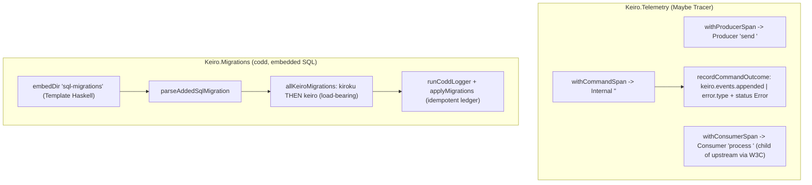

# Keiro operations code walkthrough: telemetry and migrations

This ExecPlan is a living document. The sections Progress, Surprises & Discoveries,
Decision Log, and Outcomes & Retrospective must be kept up to date as work proceeds.


## Purpose / Big Picture

**keiro** is a Haskell *library you import* (not a server you run): it composes **kiroku** (an
append-only PostgreSQL event store), **keiki** (a pure finite-state transducer that is the decision
core), and **shibuya** (a supervised worker substrate) into one event-sourcing and workflow
framework. Its documentation lives under `content/docs/keiro/` in this repository — a **fumadocs**
+ **TanStack Start** static single-page app (an "SPA" is a website whose pages render in the browser
via JavaScript rather than being served as finished HTML).

Today the keiro docs already have a `walkthrough/` section — *ordered source tours* that read the
real Haskell line by line so a developer can contribute, not just skim. Four such tours exist
(`command-cycle`, `read-side`, `workflow`, `integration`). Two cross-cutting **operations**
internals have a *reference* page and a *how-to* (shipped by EP-12) but **no source tour**: the
OpenTelemetry span helpers in `Keiro.Telemetry`, and the migration runner in `Keiro.Migrations`.
A contributor who wants to know *exactly how a command span is opened and closed*, *which attribute
the runner writes after a successful append*, or *how the embedded SQL is baked into the binary and
applied idempotently* has nowhere to read the code with a guide.

After this plan, a reader who lands on `/docs/keiro/walkthrough/operations/00-start-here` can follow
a brand-new **operations tour**: a `00-start-here.mdx` hub plus three numbered chapters that walk
`keiro/src/Keiro/Telemetry.hs` (357 lines) and `keiro-migrations/src/Keiro/Migrations.hs` (92 lines)
end to end. The tour explains:

- **Telemetry (chapters 01–02).** How `Keiro.Telemetry` wraps work in OpenTelemetry spans through a
  `Maybe Tracer` opt-in: `withProducerSpan` (outbox publish), `withConsumerSpan` (inbox consume,
  including the W3C remote-parent join), and `withCommandSpan` (the command run). The attribute keys
  each site sets; the fact that since the OpenTelemetry-1.40 upgrade (`hs-opentelemetry-semantic-conventions 1.40.0.0`)
  keiro **imports and re-exports** the typed `AttributeKey`s from `OpenTelemetry.SemanticConventions`
  rather than vendoring hand-typed strings; and the `recordCommandOutcome` / `commandErrorClass`
  seam in `Keiro.Command` that closes the command span with `keiro.events.appended` on success or
  `error.type` + span status `Error` on failure. The tour states **honestly** that instrumentation is
  **partial** — only outbox-publish, inbox-consume, and command-run spans exist today; hydration,
  snapshot, projection, and timer spans are deferred.
- **Migrations (chapter 03).** How `Keiro.Migrations` embeds keiro's three SQL files with Template
  Haskell (`Data.FileEmbed.embedDir`), parses them into `codd` migrations, concatenates kiroku's
  event-store migrations **before** keiro's framework migrations (a load-bearing order), and applies
  them idempotently through `codd`'s ledger. The five tables it creates (`keiro_snapshots`,
  `keiro_read_models`, `keiro_timers`, `keiro_outbox`, `keiro_inbox`, all in the `kiroku` schema)
  and the `keiro-migrate` CLI.

You can see it working from the docs repo root `/Users/shinzui/Keikaku/bokuno/keiro-runtime-docs`:
`pnpm build` prerenders the new pages with **zero** crawler warnings, `pnpm lint:links` exits 0, and
browsing `http://localhost:3000/docs/keiro/walkthrough/operations/00-start-here` (via `pnpm dev`)
shows the tour in the sidebar with its three chapters in order. This tour does **not** re-document
the EP-12 telemetry/migrations *reference* pages — it **links** to them and walks the source instead.


## Progress

Use a checklist to summarize granular steps. Every stopping point must be documented here,
even if it requires splitting a partially completed task into two ("done" vs. "remaining").
This section must always reflect the actual current state of the work.

- [x] M0. Preconditions verified — keiro source resolves at `/Users/shinzui/Keikaku/bokuno/keiro`
      and `git rev-parse HEAD` = `94c85e2a3ccbdb1adb07fcb5a7ee57b964802a2f` (the telemetry pin);
      `docs/keiro-source-sync.md` confirms the OTel-1.40 import-and-re-export story; the keiro tree,
      `walkthrough/index.mdx`, `walkthrough/meta.json`, `reference/telemetry.mdx`,
      `reference/migrations-and-schema.mdx`, and the four existing tours all exist.
- [x] M1. Tour scaffold created — `content/docs/keiro/walkthrough/operations/` with `meta.json`
      listing the four pages, and `00-start-here.mdx` (one-picture mermaid overview, `<Cards>` index,
      the honest partial-coverage `<Callout type="warn">`, the source-file `text` fence, and absolute
      cross-links to both references + both how-tos). `"operations"` appended to
      `walkthrough/meta.json` (EP-17 also appended `"foundation"` in parallel; both intact). **No**
      hub `<Card href>` added to `walkthrough/index.mdx` (confirmed unchanged).
- [x] M2. Chapter 01 authored — `01-the-tracer-seam-and-span-helpers.mdx`: the single-surface Haddock
      claim, the `Maybe Tracer` opt-in (`Nothing` pass-through / `Just` `inSpan'` +
      `defaultSpanArguments {kind = …}`), all three `with*Span` helpers with verbatim signatures,
      `withRemoteParent` (`decodeSpanContext`, `bracket attachContext detachContext`), and the
      `Outbox.hs` `drainBatch` + `Command.hs` `runCommand` call sites. Every binding cross-checked.
- [x] M3. Chapter 02 authored — `02-attribute-keys-and-the-command-outcome-seam.mdx`: the
      imported/re-exported semantic-convention `AttributeKey`s vs. the three bespoke `keiro.*` keys
      (and *why* — spec-anchored, one-stop import), each setter's attributes, the W3C bridge with the
      honest "only `withConsumerSpan` uses it internally" note, the `recordCommandOutcome` /
      `commandErrorClass` seam (six cases verbatim), and the partial-coverage note.
- [x] M4. Chapter 03 authored — `03-the-migration-runner.mdx`: `embedDir`, `parseAddedSqlMigration`,
      `keiroFrameworkMigrations`/`keiroMigrations`/`allKeiroMigrations` (kiroku-then-keiro,
      load-bearing), the four runners (`runCoddLogger` + `applyMigrations`/`applyMigrationsNoCheck`,
      `VerifySchemas`, the `DiffTime` timeout), idempotency (codd ledger + `IF NOT EXISTS`), the
      `keiro-migrate` CLI dispatch on `KEIRO_MIGRATE_NO_CHECK`, and the five-table map.
- [x] M5. Self-verify (no whole-tree gate — EP-19 owns that) — `pnpm typecheck` clean (fumadocs-mdx
      parses all four pages; `tsc --noEmit` clean); no relative links under the subdir; no bare
      opening fences (27 tagged fences: 24 haskell, 1 mermaid, 2 text); every quoted binding/table
      confirmed in keiro source at pin `94c85e2`; all internal links from the subdir resolve;
      `walkthrough/index.mdx` unchanged. (`scripts/check-doc-links.mjs` reports broken links only in
      *sibling* tours mid-authoring — none originate from `operations/`.)


## Surprises & Discoveries

Document unexpected behaviors, bugs, optimizations, or insights discovered during
implementation. Provide concise evidence.

- **The telemetry source tracks a *later* pin than the rest of the keiro docs.** `docs/keiro-source-sync.md`
  records the last-reviewed commit as `94c85e2` and notes that `reference/telemetry.mdx` is the **one**
  page that tracks a post-0.1.0.0 change: the OpenTelemetry-1.40 upgrade, in which `Keiro.Telemetry`
  switched from **vendoring** semantic-convention `AttributeKey`s to **importing/re-exporting** them
  from `OpenTelemetry.SemanticConventions`. This tour walks the source **as it is at `94c85e2`** — so
  the import-and-re-export story is the shipped one, and the "vendored keys" framing that appears in
  keiro's own `docs/research/opentelemetry-semconv-audit.md` is **historical**. Evidence: the module
  Haddock at `keiro/src/Keiro/Telemetry.hs` lines 13–26 says it links `hs-opentelemetry-semantic-conventions 1.40.0.0`
  and imports the keys; the source-sync pointer's Note block.

- **Two exported W3C-bridge helpers have no in-tree caller.** `injectTraceContext` and
  `traceContextFromHeaders` are exported from `Keiro.Telemetry` and used by adapters, but a grep of
  `keiro/src` and `jitsurei/src` at `94c85e2` finds **no** call site outside `Telemetry.hs` itself
  (only `withConsumerSpan` uses the bridge, via the private `withRemoteParent`/`parentSpanContext`).
  The tour documents them as **the public bridge an adapter author calls**, not as something a
  command/outbox path invokes internally — to avoid implying a wiring that does not exist in the
  shipped tree. Evidence: `grep -rn "injectTraceContext\|traceContextFromHeaders" keiro/src jitsurei/src`
  → matches only in `Telemetry.hs`.

- **The integration tour's chapter slugs are in flux during parallel authoring.** This plan's
  cheat-sheet anticipated linking `integration/01-the-inbox` and `integration/02-the-outbox`, but the
  live integration subdir (being deepened by EP-16 concurrently) now has
  `02-the-inbox.mdx`, `03-the-outbox-enqueue-and-claim.mdx`, and `05-kafka-mapping.mdx` — and its own
  `00-start-here.mdx` still carries the *old* cards. To avoid emitting a link to a slug that is
  actively churning, the two integration cross-links in chapter 01 point at the **stable**
  `integration/00-start-here` entry point rather than a specific chapter. Evidence:
  `ls content/docs/keiro/walkthrough/integration/` shows the renamed files; `scripts/check-doc-links.mjs`
  flags the integration start-here's own stale cards (a sibling-tour issue EP-19's gate will resolve).

- **A sibling tour already links *into* operations.** `command-cycle/03-the-command-processor.mdx`
  contains `href="/docs/keiro/walkthrough/operations/"` (the command-outcome-seam back-link the
  contract anticipated). With `operations/00-start-here.mdx` now present, that directory target
  resolves; the trailing-slash form is the sibling author's concern, not this subdir's.

- **EP-17 appended `"foundation"` to `walkthrough/meta.json` in parallel.** After this plan appended
  `"operations"`, the shared meta became
  `["index", "command-cycle", "read-side", "workflow", "integration", "operations", "foundation"]`.
  Both new entries are intact; EP-19 owns the final ordering pass, so no reordering was done here.


## Decision Log

Record every decision made while working on the plan.

- Decision: This plan **creates** `content/docs/keiro/walkthrough/operations/` (its own `meta.json`,
  a `00-start-here.mdx`, and three numbered chapters) and **appends** `"operations"` to
  `content/docs/keiro/walkthrough/meta.json`. It does **not** add a hub `<Card href>` to
  `walkthrough/index.mdx`.
  Rationale: Master plan Integration Point #2 (Phase-4 extension) assigns the two new hub `<Card>`s
  (foundation, operations) to **EP-19**, once both new tours exist, because a premature `<Card href>`
  pointing at a not-yet-existing page makes the prerender crawler emit
  `[unhandledRejection] … Failed to fetch` — the hard-won lesson recorded in the master plan's
  Surprises. Appending the folder name to `walkthrough/meta.json` makes the tour sidebar-navigable
  without tripping the crawler.
  Date: 2026-06-02

- Decision: Document the telemetry source **as shipped at pin `94c85e2`** (the OTel-1.40 line), not at
  the older `3f5dc9c` baseline the rest of the keiro docs were first authored against.
  Rationale: `docs/keiro-source-sync.md` explicitly pins telemetry to `94c85e2`; the live
  `keiro/src/Keiro/Telemetry.hs` imports/re-exports the keys from `OpenTelemetry.SemanticConventions`.
  The source is authoritative over keiro's diverging in-repo `docs/research/*` and `docs/plans/*`
  notes (which still say "vendored").
  Date: 2026-06-02

- Decision: Three chapters — (01) the tracer seam + the three span helpers; (02) the attribute keys,
  the W3C bridge, and the command-outcome seam; (03) the migration runner — rather than one chapter
  per file or a single long page.
  Rationale: the two telemetry concerns (opening spans vs. naming attributes and closing the command
  span) are large enough to split, and each maps to a coherent slice of `Telemetry.hs`/`Command.hs`;
  migrations are one self-contained file and earn one chapter. Three chapters matches the depth and
  cadence of the existing tours (the integration tour ships three chapters).
  Date: 2026-06-02

- Decision: Use **absolute** `/docs/keiro/...` links only; phrase the command cycle as
  **Hydrate → Transduce → Append** (never "Decide"); every code fence carries a language tag.
  Rationale: master plan Integration Point #6 (absolute links; the relative-link crawler trap) and the
  post-completion Decision (2026-06-01) renaming the middle phase Decide → Transduce to avoid keiki's
  legacy Decider façade vocabulary.
  Date: 2026-06-02

- Decision: State the **partial-instrumentation** honesty note prominently in `00-start-here` and again
  in chapter 02, mirroring the warning already on `reference/telemetry.mdx`.
  Rationale: enabling a tracer does **not** give full coverage today (only publish/consume/command
  spans exist; hydration/snapshot/projection/timer are deferred). The reference page says so; a source
  tour that implied full coverage would mislead exactly the contributor it is written for.
  Date: 2026-06-02


## Outcomes & Retrospective

Summarize outcomes, gaps, and lessons learned at major milestones or at completion.
Compare the result against the original purpose.

**2026-06-02 — tour authored and self-verified.** The operations tour ships as planned: a
`00-start-here.mdx` hub plus three chapters under `content/docs/keiro/walkthrough/operations/`, with
`meta.json` listing the four slugs in order and `"operations"` appended to `walkthrough/meta.json`.
All four pages compile (`pnpm typecheck` clean). Every Haskell identifier and SQL table/index quoted
in a snippet was cross-checked against the keiro source at pin `94c85e2`; the telemetry keys are
documented as **imported/re-exported** from `OpenTelemetry.SemanticConventions` (not vendored), the
command cycle is phrased Hydrate → Transduce → Append, all fences are language-tagged, all links are
absolute and (within this subdir) resolve.

Against the original purpose, the depth checklist (Validation §7) is satisfied: all three span helpers
with kinds/names and call sites; the imported-vs-bespoke key split with the *why*; the
`recordCommandOutcome`/`commandErrorClass` seam (six cases); the partial-coverage honesty note in both
`00-start-here` and chapter 02; the full migration runner (`embedDir` → `parseAddedSqlMigration` →
kiroku-then-keiro → four runners → idempotency → `keiro-migrate` CLI) and the three-files→five-tables
map with subsystem cross-links.

**Gaps / deferred to EP-19.** The whole-tree `pnpm build` crawler gate and `pnpm lint:links` exit-0
were *not* run to green here because sibling tours (command-cycle, integration, workflow, read-side)
are mid-authoring and currently carry their own broken links; `scripts/check-doc-links.mjs` confirms
none of those originate from `operations/`. EP-19 owns the expanded-tree gate and the two hub
`<Card href>`s (foundation, operations); this plan deliberately left `walkthrough/index.mdx`
untouched.


## Context and Orientation

Read this whole section before editing. It is written so that a novice with only this file and the
working tree can complete the work.

### Where you are working

You author MDX content files under `content/docs/keiro/` in **this** repository,
`/Users/shinzui/Keikaku/bokuno/keiro-runtime-docs`. The site is a **fumadocs** documentation app
(fumadocs-ui 16.9.3, fumadocs-mdx 15.0.10) on **TanStack Start as a static SPA** (React 19 + Vite,
TypeScript), built and served with **pnpm** on **Node 22** inside the Nix dev shell (`nix develop`).
`pnpm dev` runs `vite dev`; `pnpm build` runs `vite build` and emits a static SPA under
`.output/public`; `pnpm start` serves it.

Each directory under `content/docs/` has a `meta.json` whose `pages` array lists the child page slugs
(a *slug* is the filename without its `.mdx` extension, or a subdirectory name) **in sidebar display
order**. A page is an `.mdx` file: YAML frontmatter (`title`, `description`) then an MDX body. The
documented library is **Haskell**, so subject code samples are Haskell; SQL and shell snippets use
`sql`/`bash`. **Every fenced code block must carry a language tag** — `haskell`, `sql`, `bash`,
`text`, `json`, or `mermaid`. A bare ```` ``` ```` is not allowed and will read as broken.

The MDX components you will use — `Callout`, `Cards`, `Card`, `Steps`, `Tabs`, `TypeTable` — are
**registered globally** in `src/components/mdx.tsx`, so use them **without** an `import` line (every
existing keiro page uses them bare). Do not add import lines.

### What already exists (do not recreate)

EP-7 created the `content/docs/keiro/` tree, including:

- `content/docs/keiro/walkthrough/index.mdx` — the **walkthrough hub**. It currently shows a `<Cards>`
  block whose four `<Card href>`s point at the four existing tours. **You must not edit this file.**
  EP-19 adds the two new hub cards (foundation, operations). Read it only to match voice.
- `content/docs/keiro/walkthrough/meta.json` — currently
  `{"title":"Code Walkthrough","pages":["index","command-cycle","read-side","workflow","integration"]}`.
  You **append** `"operations"` to the `pages` array (append only; do not reorder existing entries —
  EP-19 owns the final ordering pass).
- The four existing tours under `walkthrough/{command-cycle,read-side,workflow,integration}/`, each
  with a `00-start-here.mdx`, a `meta.json`, and numbered chapters. Open
  `walkthrough/integration/00-start-here.mdx` and `walkthrough/command-cycle/00-start-here.mdx` as
  **shape templates**: they open with a one-paragraph framing, a `## The design in one picture`
  `mermaid` diagram, a `## The chapters` `<Cards>` index, a `text` fence listing the source files the
  tour reads, and a closing "for the conceptual version, read …" cross-link.

EP-12 shipped the two **reference** pages this tour links to (do **not** re-document them — link):

- `content/docs/keiro/reference/telemetry.mdx` — title "Telemetry". The three span-helper signatures,
  the attribute table, the imported/re-exported semantic-convention keys, the W3C bridge, and a
  `<Callout type="warn">` stating instrumentation is partial. Link target:
  `/docs/keiro/reference/telemetry`.
- `content/docs/keiro/reference/migrations-and-schema.mdx` — title "Migrations and schema". The
  migration accessors, the four runners, the `keiro-migrate` CLI, and the five-table overview. Link
  target: `/docs/keiro/reference/migrations-and-schema`.

There are also two EP-12 **how-tos** to cross-link: `/docs/keiro/how-to/enable-opentelemetry`
(the wiring narrative — make a `Tracer`, thread it via the option records) and
`/docs/keiro/how-to/run-migrations` (the `keiro-migrate` invocation).

### Define the terms you will use

- **Span.** A timed unit of work in OpenTelemetry — a node in a distributed trace with a name, a
  *kind* (`Producer`, `Consumer`, `Internal`, …), key/value **attributes**, and a status. keiro opens
  spans through `hs-opentelemetry-api`.
- **Tracer.** The object that creates spans. The application makes one (typically with
  `hs-opentelemetry-sdk`'s `OpenTelemetry.Trace.makeTracer`) and threads a `Maybe Tracer` into keiro.
  `Nothing` ⇒ no spans (pass-through); `Just t` ⇒ spans are opened.
- **Attribute key.** A typed name for a span attribute, `AttributeKey a`. Its wire name is a dotted
  string like `"messaging.operation.type"`. keiro re-exports the standard ones and defines three of
  its own (`keiro.*`).
- **W3C TraceContext.** The web standard for propagating a trace across processes via the
  `traceparent`/`tracestate` headers, so a consumer's span can be made a *child* of the producer's
  span in another process.
- **codd.** A Haskell database-migration tool. keiro bakes its SQL files into the binary at compile
  time (Template Haskell `Data.FileEmbed.embedDir "sql-migrations"`) and hands them to codd, which
  keeps a **ledger** of applied migrations so re-running is idempotent.
- **Template Haskell.** Compile-time code generation in Haskell (`$(...)` splices). `embedDir` reads
  the directory's files at *compile* time and inlines their bytes, so the deployed binary needs no
  loose `.sql` files.

### The source of truth (NEVER search `/nix/store` or `/`)

The keiro source is on disk at `/Users/shinzui/Keikaku/bokuno/keiro` (resolve with
`mori registry show shinzui/keiro --full` if the path has moved). Open it **read-only**; do not edit
it. Per `docs/keiro-source-sync.md`, the telemetry surface is pinned at `94c85e2`
(`94c85e2a3ccbdb1adb07fcb5a7ee57b964802a2f`). keiro's own in-repo `docs/research/*` and `docs/plans/*`
notes **predate the implementation and diverge** (e.g. they say the semantic-convention keys are
*vendored*; the shipped source imports them). **Trust the source.**

The files this tour walks (full paths):

```text
keiro/src/Keiro/Telemetry.hs                    -- the three span helpers, the W3C bridge, the keys
keiro/src/Keiro/Command.hs                      -- withCommandSpan call site + recordCommandOutcome seam
keiro/src/Keiro/Outbox.hs                       -- withProducerSpan call site (publish)
keiro-migrations/src/Keiro/Migrations.hs        -- the migration runner
keiro-migrations/app/Main.hs                    -- the keiro-migrate CLI
keiro-migrations/sql-migrations/2026-05-17-00-00-00-keiro-bootstrap.sql
keiro-migrations/sql-migrations/2026-05-17-01-00-00-keiro-outbox.sql
keiro-migrations/sql-migrations/2026-05-17-02-00-00-keiro-inbox.sql
```

### Source cheat-sheet (verified at pin `94c85e2`; re-open to confirm a detail)

#### `Keiro.Telemetry` — the opt-in tracer seam and three span helpers

The module Haddock (lines 1–26) states it is the **single** place keiro reaches for
`hs-opentelemetry-api` and `hs-opentelemetry-semantic-conventions 1.40.0.0` (generated from spec
v1.40). It imports the messaging/db `AttributeKey`s from `OpenTelemetry.SemanticConventions` and
re-exports them, so `Keiro.Telemetry` stays the one-stop import; only the three bespoke `keiro.*` keys
are defined locally.

The opt-in shape: every helper takes a `Maybe Tracer`. Under `Nothing` it runs the body and returns —
**zero spans**, one `Maybe` branch of cost. Under `Just tracer` it calls `inSpan'` from
`OpenTelemetry.Trace.Core` to open the span, sets attributes, then runs the body with `Just span`.

The three span helpers (verbatim signatures — re-verify against the module):

```haskell
withProducerSpan
  :: (MonadUnliftIO m, HasCallStack)
  => Maybe Tracer -> IntegrationEvent -> KafkaProducerRecord -> (Maybe Span -> m a) -> m a
-- Producer-kind span named ("send " <> event^.#destination); setProducerAttributes.

withConsumerSpan
  :: (MonadUnliftIO m, HasCallStack)
  => Maybe Tracer -> Maybe Text -> KafkaInboundRecord -> Maybe IntegrationEvent
  -> (Maybe Span -> m a) -> m a
-- Consumer-kind span named ("process " <> record^.#topic); wrapped in withRemoteParent so it
-- becomes a CHILD of the upstream producer span (joins traces by trace id).

withCommandSpan
  :: (MonadUnliftIO m, HasCallStack)
  => Maybe Tracer -> Text -> Maybe Int64 -> (Maybe Span -> m a) -> m a
-- Internal-kind span named after the resolved stream; sets keiro.stream.name and (when given)
-- keiro.retry.attempt. The caller adds keiro.events.appended after a successful append.
```

The remote-parent join is a private helper `withRemoteParent :: MonadUnliftIO m => [(Text,Text)] -> m a -> m a`:
it reads the inbound record's `headers`, looks up `headerTraceParent`/`headerTraceState`, calls
`decodeSpanContext` (from `hs-opentelemetry-propagator-w3c`), and — when a parent is present —
`bracket`s `attachContext`/`detachContext` around the body so the consumer span opens inside the
upstream context.

The attribute setters (private): `setProducerAttributes` sets `messaging.system = "kafka"`,
`messaging.operation.type = "publish"`, `messaging.operation.name = "send"`,
`messaging.destination.name = destination`, `messaging.message.id = messageId`, and
`messaging.kafka.message.key` when the event has a key. `setConsumerAttributes` sets
`messaging.system = "kafka"`, `messaging.operation.type = "process"`,
`messaging.operation.name = "process"`, `messaging.destination.name = topic`,
`messaging.destination.partition.id`, `messaging.kafka.offset`, the message key when present, the
consumer group when given, and `messaging.message.id` when the envelope decoded.

The W3C bridge (verbatim):

```haskell
traceContextFromCurrentSpan :: (MonadIO m) => m (Maybe TraceContext)
traceContextFromHeaders     :: [(Text, Text)] -> Maybe TraceContext
injectTraceContext          :: (MonadIO m) => [(Text, Text)] -> m [(Text, Text)]
```

`traceContextFromCurrentSpan` reads the thread-local span and formats it (`encodeSpanContext`) as a
`TraceContext`; `traceContextFromHeaders` lifts a `TraceContext` out of a flat header list without
validating the `traceparent` format; `injectTraceContext` appends the current span's
`traceparent`/`tracestate` to a header list (or returns it unchanged when no span is active). Per the
Surprises note, only `withConsumerSpan` exercises the bridge internally; the other two are the public
hooks an adapter calls.

The bespoke keys (verbatim, `Telemetry.hs` lines 129–136):

```haskell
keiro_stream_name     :: AttributeKey Text  -- "keiro.stream.name"
keiro_retry_attempt   :: AttributeKey Int64 -- "keiro.retry.attempt"
keiro_events_appended :: AttributeKey Int64 -- "keiro.events.appended"
```

The re-exported semantic-convention keys (from `OpenTelemetry.SemanticConventions`):
`messaging_operation_type`, `messaging_operation_name`, `messaging_destination_partition_id`,
`messaging_consumer_group_name`, `messaging_client_id`, `messaging_kafka_offset`, `db_system_name`,
`db_namespace`, `db_collection_name`, `db_operation_name`.

#### The command-outcome seam — `keiro/src/Keiro/Command.hs`

`runCommand` (and `runCommandWithSql*`) wrap their work in `withCommandSpan` and call
`recordCommandOutcome` after the runner returns:

```haskell
-- in runCommand (Command.hs ~354):
withCommandSpan (options ^. #tracer) (resolvedStreamName eventStream targetStream) Nothing $ \mSpan -> do
  result <- attempt (options ^. #retryLimit)
  recordCommandOutcome mSpan (^. #eventsAppended) result
  pure result
```

```haskell
recordCommandOutcome
  :: (IOE :> es) => Maybe Span -> (a -> Int) -> Either CommandError a -> Eff es ()
recordCommandOutcome Nothing _ _ = pure ()
recordCommandOutcome (Just sp) eventsOf result = do
  addAttribute sp (unkey db_system_name) ("postgresql" :: Text)
  case result of
    Right v   -> addAttribute sp (unkey keiro_events_appended) (fromIntegral (eventsOf v) :: Int64)
    Left  err -> do
      addAttribute sp (unkey error_type) (commandErrorClass err)
      setStatus sp (Error (Text.pack (show err)))
```

The low-cardinality error classifier (`commandErrorClass`, verbatim cases):

```haskell
commandErrorClass :: CommandError -> Text
commandErrorClass = \case
  HydrationDecodeFailed{} -> "hydration_decode_failed"
  HydrationReplayFailed{} -> "hydration_replay_failed"
  CommandRejected         -> "command_rejected"
  EncodeFailed{}          -> "encode_failed"
  StoreFailed{}           -> "store_failed"
  RetryExhausted{}        -> "retry_exhausted"
```

Note `db_system_name` and `error_type` are imported in `Command.hs` directly from
`OpenTelemetry.SemanticConventions` (not via `Keiro.Telemetry`); `keiro_events_appended` comes from
`Keiro.Telemetry`. The tracer is the `tracer :: !(Maybe Tracer)` field on `RunCommandOptions`
(default `Nothing`).

#### The producer-span call site — `keiro/src/Keiro/Outbox.hs`

`publishClaimedOutbox`'s `drainBatch` wraps each row's publish in `withProducerSpan`, and on a
`PublishFailed` outcome records `error.type = "publish_failed"` and span status `Error` on the live
span (Outbox.hs ~250):

```haskell
withProducerSpan (options ^. #tracer) (row ^. #event) (outboxRowToKafkaRecord row) $ \mSpan -> do
  out <- publish row
  case (mSpan, out) of
    (Just sp, PublishFailed errMsg) -> do
      addAttribute sp (unkey error_type) ("publish_failed" :: Text)
      setStatus sp (Error errMsg)
    _ -> pure ()
  pure out
```

The consumer-span site lives in the inbox/Kafka consumer surface owned by EP-11/EP-16; this tour walks
the **helper** (`withConsumerSpan`) and links the integration tour for the call site.

#### `Keiro.Migrations` — the migration runner (`keiro-migrations/src/Keiro/Migrations.hs`, 92 lines)

The exports:

```haskell
keiroFrameworkMigrations     :: (MonadFail m, EnvVars m) => m [AddedSqlMigration m]  -- keiro-owned SQL only
keiroMigrations              :: (MonadFail m, EnvVars m) => m [AddedSqlMigration m]  -- alias of the above
allKeiroMigrations           :: (MonadFail m, EnvVars m) => m [AddedSqlMigration m]  -- Kiroku THEN Keiro
runKeiroMigrations           :: CoddSettings -> DiffTime -> VerifySchemas -> IO ApplyResult
runKeiroMigrationsNoCheck    :: CoddSettings -> DiffTime -> IO ()
runAllKeiroMigrations        :: CoddSettings -> DiffTime -> VerifySchemas -> IO ApplyResult
runAllKeiroMigrationsNoCheck :: CoddSettings -> DiffTime -> IO ()
```

The embedding + parse (verbatim shape):

```haskell
embeddedMigrationFiles :: [(FilePath, ByteString)]
embeddedMigrationFiles = $(embedDir "sql-migrations")

keiroFrameworkMigrations :: (MonadFail m, EnvVars m) => m [AddedSqlMigration m]
keiroFrameworkMigrations = traverse parseEmbeddedMigration embeddedMigrationFiles
 where
  parseEmbeddedMigration (name, bytes) = do
    let stream = PureStream $ Streaming.yield (TE.decodeUtf8 bytes)
    result <- parseAddedSqlMigration name stream
    case result of
      Left err        -> fail ("Invalid Keiro migration " <> name <> ": " <> err)
      Right migration -> pure migration
```

`allKeiroMigrations` concatenates `Kiroku.kirokuMigrations` **then** `keiroFrameworkMigrations` — the
order is **load-bearing** (keiro's tables live in the `kiroku` schema and reference the event-store
tables, which must exist first). The runners wrap `runCoddLogger` around `applyMigrations` (with a
`VerifySchemas`) or `applyMigrationsNoCheck` (skips the expected-schema comparison but keeps codd's
ledger and locking — so it is **still idempotent**). The `DiffTime` argument is the connect timeout.

The CLI `keiro-migrate` (`app/Main.hs`, verbatim logic): `getCoddSettings` reads codd's env vars;
then if `KEIRO_MIGRATE_NO_CHECK` is set → `runAllKeiroMigrationsNoCheck settings (secondsToDiffTime 5)`,
else → `runAllKeiroMigrations settings (secondsToDiffTime 5) LaxCheck`.

The three embedded SQL files (applied in filename-timestamp order) and the tables they create, all in
the `kiroku` schema:

```text
2026-05-17-00-00-00-keiro-bootstrap.sql  -> keiro_snapshots, keiro_read_models, keiro_timers
                                            (+ indexes keiro_snapshots_compat_idx, keiro_timers_due_idx)
2026-05-17-01-00-00-keiro-outbox.sql     -> keiro_outbox  (+ keiro_outbox_pending_idx, keiro_outbox_head_of_line_idx)
2026-05-17-02-00-00-keiro-inbox.sql      -> keiro_inbox   (+ keiro_inbox_received_idx, keiro_inbox_completed_idx)
```

Each table uses `CREATE TABLE IF NOT EXISTS` and each index `CREATE INDEX IF NOT EXISTS`, so the SQL
is itself re-runnable; codd's ledger additionally records what has been applied. The tour names each
table's *purpose* and **cross-links the owning subsystem reference** rather than re-listing every
column (that lives on `reference/migrations-and-schema`).


## Plan of Work

The work is six milestones. M0 verifies preconditions. M1 scaffolds the new tour directory and the hub
page. M2–M4 author the three chapters. M5 is the gate. Each milestone is independently verifiable: the
tour builds and links resolve after each, and the depth checklist is satisfied at M5.

The pages this plan creates, all under `content/docs/keiro/walkthrough/operations/`:

| File | Role | Walks |
|---|---|---|
| `00-start-here.mdx` | Tour hub | one-picture overview + chapter index + honest coverage note |
| `01-the-tracer-seam-and-span-helpers.mdx` | Chapter | `Telemetry.hs` opt-in + the three `with*Span` helpers + call sites |
| `02-attribute-keys-and-the-command-outcome-seam.mdx` | Chapter | the keys (imported vs. bespoke), the W3C bridge, `recordCommandOutcome`/`commandErrorClass` |
| `03-the-migration-runner.mdx` | Chapter | `Migrations.hs`, `app/Main.hs`, the three SQL files |

### Milestones

- **M0 — Preconditions.** Confirm Node 22 + pnpm on PATH and `node_modules` present; confirm EP-7 and
  EP-12 are Complete (the keiro tree, `walkthrough/index.mdx`, `walkthrough/meta.json`,
  `reference/telemetry.mdx`, `reference/migrations-and-schema.mdx`, and the four existing tours all
  exist); confirm the keiro source resolves and matches pin `94c85e2`. At the end, a baseline
  `pnpm typecheck` and `pnpm build` both succeed before adding a page. Acceptance: both commands exit
  0 on the unmodified tree; the precondition `test` lines all print "present".

- **M1 — Scaffold + hub.** Create the directory `content/docs/keiro/walkthrough/operations/`, its
  `meta.json` (`["00-start-here","01-the-tracer-seam-and-span-helpers","02-attribute-keys-and-the-command-outcome-seam","03-the-migration-runner"]`),
  and `00-start-here.mdx` modeled on the existing tours' start-here pages: a framing paragraph naming
  the two files walked, a `## The design in one picture` `mermaid` diagram, a `## The chapters`
  `<Cards>` index, a `text` fence listing the source files, a `<Callout type="warn">` repeating the
  partial-coverage note, and closing cross-links to the two reference pages + the two how-tos.
  **Append `"operations"`** to `content/docs/keiro/walkthrough/meta.json`. **Do not** touch
  `walkthrough/index.mdx`. Acceptance: `pnpm build` clean (zero crawler warnings); the tour appears in
  the sidebar; the `<Card href>`s in `00-start-here` resolve only to pages that exist (chapters 01–03
  created in M2–M4 — until then, author the hub's chapter cards but create the chapter files in the
  same milestone if you prefer to keep every intermediate build green; the safe order is M1 hub +
  empty-but-valid chapter stubs, then fill them in M2–M4. Each stub must be a valid MDX page with
  frontmatter so no `<Card href>` dangles).

- **M2 — Chapter 01: the tracer seam and span helpers.** Author
  `01-the-tracer-seam-and-span-helpers.mdx`. Walk: the module Haddock's "single OpenTelemetry surface"
  claim; the `Maybe Tracer` opt-in and the `Nothing`/`Just` branches; `inSpan'` +
  `defaultSpanArguments {kind = …}`; `withProducerSpan` (Producer kind, `"send " <> destination`,
  `setProducerAttributes`) with its **call site** in `Outbox.hs`'s `drainBatch`; `withConsumerSpan`
  (Consumer kind, `"process " <> topic`, `setConsumerAttributes`) and the `withRemoteParent` join
  (`decodeSpanContext`, `bracket attachContext detachContext`); `withCommandSpan` (Internal kind,
  named after the resolved stream) with its call site in `runCommand`. Cross-link the integration tour
  for the consume call site and the command-cycle tour for the command call site. Acceptance: every
  binding named in a snippet appears in `Keiro/Telemetry.hs`/`Outbox.hs`/`Command.hs`; build clean.

- **M3 — Chapter 02: attribute keys and the command-outcome seam.** Author
  `02-attribute-keys-and-the-command-outcome-seam.mdx`. Walk: the imported/re-exported
  semantic-convention `AttributeKey`s vs. the three locally-defined `keiro.*` keys (and **why** —
  spec-anchored names, one-stop import); the exact attributes each setter writes; the W3C bridge
  (`traceContextFromCurrentSpan`, `traceContextFromHeaders`, `injectTraceContext`) and the honest note
  that only `withConsumerSpan` uses it internally; the `recordCommandOutcome` seam in `Command.hs`
  (`db.system.name` + `keiro.events.appended` on success; `error.type` from `commandErrorClass` +
  span status `Error` on failure); the `commandErrorClass` cases; and the **partial-coverage** note.
  Cross-link `reference/telemetry`. Acceptance: the key names, the seam, and `commandErrorClass` cases
  match source; the partial-coverage note is present; build clean.

- **M4 — Chapter 03: the migration runner.** Author `03-the-migration-runner.mdx`. Walk: `embedDir`
  (Template Haskell compile-time embedding) → `parseAddedSqlMigration` (parse each embedded file into
  an `AddedSqlMigration`, `fail` on a bad parse); `keiroFrameworkMigrations` vs. `keiroMigrations`
  (alias) vs. `allKeiroMigrations` (kiroku **then** keiro, load-bearing); the four runners
  (`runCoddLogger` + `applyMigrations`/`applyMigrationsNoCheck`, `VerifySchemas`, the `DiffTime`
  connect timeout); idempotency (codd's ledger + `IF NOT EXISTS`); the `keiro-migrate` CLI dispatch on
  `KEIRO_MIGRATE_NO_CHECK`; and the three SQL files → five tables map with each table's purpose and a
  cross-link to its owning subsystem reference. Cross-link `reference/migrations-and-schema` and
  `how-to/run-migrations`. Acceptance: function/CLI names and the five table names match source; build
  clean.

- **M5 — Gate.** From the docs repo root: `pnpm typecheck` clean; `pnpm build` exits 0 with **no**
  `[unhandledRejection]`/`Failed to fetch` line; `pnpm lint:links` exit 0; no relative `./`/`../`
  links under the new subdir; the depth checklist (Validation §7) satisfied; confirm **no** hub
  `<Card href>` was added to `walkthrough/index.mdx`. Acceptance: see Validation and Acceptance.


## Concrete Steps

Run all commands from the repo root `/Users/shinzui/Keikaku/bokuno/keiro-runtime-docs` unless stated
otherwise. The toolchain is **pnpm** on **Node 22** inside the Nix dev shell.

### M0 — Preconditions

```bash
nix develop                       # enter the dev shell (pnpm + Node 22)

# EP-7 + EP-12 must be Complete: these must all exist.
test -f content/docs/keiro/walkthrough/index.mdx          && echo "walkthrough hub present"
test -f content/docs/keiro/walkthrough/meta.json          && echo "walkthrough meta present"
test -f content/docs/keiro/reference/telemetry.mdx        && echo "telemetry reference present"
test -f content/docs/keiro/reference/migrations-and-schema.mdx && echo "migrations reference present"
for d in command-cycle read-side workflow integration; do
  test -d content/docs/keiro/walkthrough/$d && echo "tour $d present" || echo "MISSING tour $d"
done
test ! -d content/docs/keiro/walkthrough/operations && echo "operations tour not yet created (expected)"

pnpm install
pnpm typecheck
pnpm build
```

Expected (abridged):

```text
walkthrough hub present
walkthrough meta present
telemetry reference present
migrations reference present
tour command-cycle present
tour read-side present
tour workflow present
tour integration present
operations tour not yet created (expected)
✓ built in <N>s
```

Confirm the keiro source and the telemetry pin:

```bash
KEIRO=$(mori registry show shinzui/keiro --full | sed -n 's/.*[Pp]ath: *//p' | head -1)
git -C "$KEIRO" rev-parse HEAD     # source-sync pins telemetry at 94c85e2a3ccbdb1adb07fcb5a7ee57b964802a2f
grep -n "OpenTelemetry.SemanticConventions" "$KEIRO/keiro/src/Keiro/Telemetry.hs"
```

Expected: the import line prints (the keys are imported, not vendored). If `walkthrough/index.mdx` or
the reference pages are missing, EP-7/EP-12 have not landed — stop (hard dependency).

### M1 — Scaffold + hub

Create the directory and `meta.json`:

```bash
mkdir -p content/docs/keiro/walkthrough/operations
```

```json
// content/docs/keiro/walkthrough/operations/meta.json
{
  "title": "Operations internals",
  "pages": [
    "00-start-here",
    "01-the-tracer-seam-and-span-helpers",
    "02-attribute-keys-and-the-command-outcome-seam",
    "03-the-migration-runner"
  ]
}
```

Append `"operations"` to the walkthrough section meta (append only — do not reorder; EP-19 orders):

```json
// content/docs/keiro/walkthrough/meta.json
{
  "title": "Code Walkthrough",
  "pages": ["index", "command-cycle", "read-side", "workflow", "integration", "operations"]
}
```

Author `content/docs/keiro/walkthrough/operations/00-start-here.mdx`. Model it on
`walkthrough/integration/00-start-here.mdx`. A complete shape to fill in (the outer four-backtick
fence wraps the MDX so its inner `mermaid`/`text` fences nest cleanly):

````mdx
---
title: "00 — Start here"
description: "An ordered tour of keiro's operations internals: the OpenTelemetry span helpers in Keiro.Telemetry and the embedded migration runner in Keiro.Migrations."
---

This is an **ordered source tour** of keiro's two cross-cutting **operations** internals: how
`Keiro.Telemetry` wraps work in OpenTelemetry spans, and how `Keiro.Migrations` embeds and applies
keiro's SQL schema. It reads the real Haskell in `keiro/src/Keiro/Telemetry.hs`,
`keiro/src/Keiro/Command.hs`, `keiro/src/Keiro/Outbox.hs`, and
`keiro-migrations/src/Keiro/Migrations.hs`, and explains *why* the code is shaped the way it is. Read
the chapters in order.

## The design in one picture

Telemetry is **opt-in** through a `Maybe Tracer`: with `Nothing` every helper is a pass-through
(zero spans); with `Just tracer` it opens a span. Three sites open spans today; the migration runner
embeds three SQL files and applies kiroku's then keiro's schema in one idempotent ledger.



## The chapters

<Cards>
  <Card title="01 — The tracer seam and span helpers" href="/docs/keiro/walkthrough/operations/01-the-tracer-seam-and-span-helpers" description="The Maybe Tracer opt-in, inSpan', and withProducerSpan / withConsumerSpan / withCommandSpan with their call sites." />
  <Card title="02 — Attribute keys and the command-outcome seam" href="/docs/keiro/walkthrough/operations/02-attribute-keys-and-the-command-outcome-seam" description="Imported vs. bespoke AttributeKeys, the W3C bridge, recordCommandOutcome / commandErrorClass, and the honest partial-coverage note." />
  <Card title="03 — The migration runner" href="/docs/keiro/walkthrough/operations/03-the-migration-runner" description="embedDir, parseAddedSqlMigration, the kiroku-then-keiro order, the four runners, the keiro-migrate CLI, and the five tables." />
</Cards>

The source files this tour reads:

```text
keiro/src/Keiro/Telemetry.hs              -- the three span helpers, the W3C bridge, the keys
keiro/src/Keiro/Command.hs                -- withCommandSpan + recordCommandOutcome / commandErrorClass
keiro/src/Keiro/Outbox.hs                 -- withProducerSpan call site (publish)
keiro-migrations/src/Keiro/Migrations.hs  -- the migration runner
keiro-migrations/app/Main.hs              -- the keiro-migrate CLI
keiro-migrations/sql-migrations/*.sql     -- the three embedded files (five tables)
```

<Callout type="warn">
**Instrumentation coverage is partial.** Today three sites emit spans: **outbox publish**, **inbox
consume**, and **command run**. Hydration, snapshot reads, projection writes, and the timer worker are
**not yet instrumented** — those spans are deferred. Enabling a tracer does not give full coverage of
the framework's internals today. (Same note as the [Telemetry reference](/docs/keiro/reference/telemetry).)
</Callout>

For the look-up version of this material, read the
[Telemetry reference](/docs/keiro/reference/telemetry) and the
[Migrations and schema reference](/docs/keiro/reference/migrations-and-schema); for the wiring task,
the how-tos [Enable OpenTelemetry](/docs/keiro/how-to/enable-opentelemetry) and
[Run the migrations](/docs/keiro/how-to/run-migrations).
````

Create the three chapter files in the **same** milestone as valid (even if briefly skeletal) MDX pages
so the hub's `<Card href>`s never dangle, then fill them in M2–M4. A valid stub is just frontmatter
plus a one-line body. Build:

```bash
pnpm typecheck && pnpm build
```

Expected tail: `✓ built in <N>s` with no `[unhandledRejection]`/`Failed to fetch` line.

### M2 — Chapter 01

Author `content/docs/keiro/walkthrough/operations/01-the-tracer-seam-and-span-helpers.mdx`. Use
`haskell` fences for source, the signatures from the cheat-sheet, and a closing cross-link to the
integration and command-cycle tours. Verify every name:

```bash
KEIRO=$(mori registry show shinzui/keiro --full | sed -n 's/.*[Pp]ath: *//p' | head -1)
grep -nE "withProducerSpan|withConsumerSpan|withCommandSpan|withRemoteParent|inSpan'|decodeSpanContext" \
  "$KEIRO/keiro/src/Keiro/Telemetry.hs"
grep -nE "withProducerSpan" "$KEIRO/keiro/src/Keiro/Outbox.hs"
grep -nE "withCommandSpan|resolvedStreamName" "$KEIRO/keiro/src/Keiro/Command.hs"
pnpm typecheck && pnpm build
```

Expected: each name prints at least one line; build clean.

### M3 — Chapter 02

Author `content/docs/keiro/walkthrough/operations/02-attribute-keys-and-the-command-outcome-seam.mdx`.
Verify the keys, the seam, and the classifier:

```bash
KEIRO=$(mori registry show shinzui/keiro --full | sed -n 's/.*[Pp]ath: *//p' | head -1)
grep -nE "keiro_stream_name|keiro_retry_attempt|keiro_events_appended" "$KEIRO/keiro/src/Keiro/Telemetry.hs"
grep -nE "messaging_operation_type|db_system_name|db_namespace|db_collection_name|db_operation_name" \
  "$KEIRO/keiro/src/Keiro/Telemetry.hs"
grep -nE "recordCommandOutcome|commandErrorClass|error_type|setStatus" "$KEIRO/keiro/src/Keiro/Command.hs"
pnpm typecheck && pnpm build
```

Expected: each name prints; build clean. Confirm the partial-coverage note is on the page:

```bash
grep -n "partial\|deferred\|not yet instrumented" \
  content/docs/keiro/walkthrough/operations/02-attribute-keys-and-the-command-outcome-seam.mdx
```

Expected: at least one match.

### M4 — Chapter 03

Author `content/docs/keiro/walkthrough/operations/03-the-migration-runner.mdx`. Verify names and
tables:

```bash
KEIRO=$(mori registry show shinzui/keiro --full | sed -n 's/.*[Pp]ath: *//p' | head -1)
grep -nE "embedDir|parseAddedSqlMigration|keiroFrameworkMigrations|allKeiroMigrations|runAllKeiroMigrations|runCoddLogger" \
  "$KEIRO/keiro-migrations/src/Keiro/Migrations.hs"
grep -nE "KEIRO_MIGRATE_NO_CHECK|runAllKeiroMigrations|LaxCheck|secondsToDiffTime" \
  "$KEIRO/keiro-migrations/app/Main.hs"
grep -rnE "CREATE TABLE IF NOT EXISTS keiro_(snapshots|read_models|timers|outbox|inbox)" \
  "$KEIRO/keiro-migrations/sql-migrations"
pnpm typecheck && pnpm build
```

Expected: the migration functions, the CLI dispatch, and all five `CREATE TABLE` lines print; build
clean.

### M5 — Gate

```bash
pnpm typecheck
pnpm build
pnpm lint:links
```

Expected (abridged):

```text
✓ built in <N>s
✓ doc links OK — checked <N> files, no broken internal links.
```

The `pnpm build` output must contain **no** `[unhandledRejection]`/`Failed to fetch` line. Confirm no
relative links and no premature hub card:

```bash
grep -rnE "\]\(\.\.?/" content/docs/keiro/walkthrough/operations && echo "FOUND relative links" || echo "no relative links"
grep -n "operations" content/docs/keiro/walkthrough/index.mdx && echo "CHECK: hub must NOT yet link operations (EP-19)" || echo "no premature hub card (correct)"
```

Expected: `no relative links` and `no premature hub card (correct)`.


## Validation and Acceptance

Exercise the system and observe specific behaviors:

1. **The new tour builds and renders.** After M1–M4, `pnpm typecheck` and `pnpm build` exit 0.
   Browsing `http://localhost:3000/docs/keiro/walkthrough/operations/00-start-here` (via `pnpm dev`)
   shows the tour in the sidebar under **Code Walkthrough**, after the four existing tours, with its
   three chapters listed in `meta.json` order. Each chapter opens without a 404 and shows its
   frontmatter title.

2. **The hub diagram and chapter cards resolve.** The `00-start-here` page shows the `mermaid` diagram
   and three `<Card>`s; each card navigates to an existing chapter page (no dangling `href`).

3. **Whole-tree build is clean.** `pnpm build` exits 0 and its output contains no
   `[unhandledRejection]` and no `Failed to fetch` line. Evidence to capture:

   ```text
   ✓ built in <N>s
   ```

4. **Link-check passes; no relative links.** `pnpm lint:links` prints
   `✓ doc links OK — checked <N> files, no broken internal links.`. No relative `./`/`../` links exist
   under the new subdir:

   ```bash
   grep -rnE "\]\(\.\.?/" content/docs/keiro/walkthrough/operations && echo "FOUND relative links" || echo "no relative links"
   ```

   Expected: `no relative links`.

5. **No premature hub card.** `walkthrough/index.mdx` does **not** yet link the operations tour (EP-19
   adds that):

   ```bash
   grep -n "walkthrough/operations" content/docs/keiro/walkthrough/index.mdx && echo "CHECK" || echo "OK — no premature hub card"
   ```

   Expected: `OK — no premature hub card`.

6. **Snippets match the real API at pin `94c85e2`.** Every distinctive Haskell identifier in a snippet
   resolves to a definition in the keiro source. Spot-check:

   ```bash
   KEIRO=$(mori registry show shinzui/keiro --full | sed -n 's/.*[Pp]ath: *//p' | head -1)
   grep -rnE "withProducerSpan|withConsumerSpan|withCommandSpan|recordCommandOutcome|commandErrorClass|allKeiroMigrations|keiroFrameworkMigrations|keiro_events_appended" "$KEIRO"
   ```

   Every identifier quoted in the tour must appear. The telemetry source must **import** the
   semantic-convention keys from `OpenTelemetry.SemanticConventions` (not vendor them) — confirm:

   ```bash
   grep -n "import .*OpenTelemetry.SemanticConventions" "$KEIRO/keiro/src/Keiro/Telemetry.hs"
   ```

7. **Depth checklist (the substantive acceptance — all must be true).**
   - **Telemetry — span helpers.** All three helpers are walked with their exact signatures, span
     **kind** (`Producer`/`Consumer`/`Internal`), and span **name** (`"send " <> destination`,
     `"process " <> topic`, the resolved stream): `withProducerSpan`, `withConsumerSpan` (including
     `withRemoteParent` / `decodeSpanContext` / `bracket attachContext detachContext`), and
     `withCommandSpan`. Each helper's **call site** is shown or linked (`Outbox.hs` `drainBatch` for
     producer, the integration tour for consume, `runCommand` for command).
   - **Telemetry — attribute keys.** The tour distinguishes the **imported/re-exported**
     semantic-convention `AttributeKey`s (from `OpenTelemetry.SemanticConventions`, post-OTel-1.40 pin
     `94c85e2`) from the **three bespoke** `keiro.*` keys defined locally
     (`keiro_stream_name`, `keiro_retry_attempt`, `keiro_events_appended`), and explains *why* the
     keys are imported rather than vendored.
   - **Telemetry — the outcome seam.** `recordCommandOutcome` is walked (`db.system.name` +
     `keiro.events.appended` on success; `error.type` from `commandErrorClass` + span status `Error`
     on failure), and `commandErrorClass`'s six cases are listed.
   - **Telemetry — honesty.** The **partial-coverage** note (publish/consume/command done;
     hydration/snapshot/projection/timer deferred) appears in **both** `00-start-here` and chapter 02.
   - **Migrations — runner.** `embedDir` (Template Haskell), `parseAddedSqlMigration`,
     `keiroFrameworkMigrations`/`keiroMigrations` (alias)/`allKeiroMigrations` (kiroku-then-keiro,
     load-bearing), the four runners (`runCoddLogger` + `applyMigrations`/`applyMigrationsNoCheck`,
     `VerifySchemas`, the `DiffTime` connect timeout), **idempotency** (codd ledger + `IF NOT EXISTS`),
     and the `keiro-migrate` CLI dispatch on `KEIRO_MIGRATE_NO_CHECK` are all walked.
   - **Migrations — tables.** All five tables (`keiro_snapshots`, `keiro_read_models`, `keiro_timers`,
     `keiro_outbox`, `keiro_inbox`, in the `kiroku` schema) are named with their purpose and a
     cross-link to the owning subsystem reference; the three SQL files are mapped to the tables.
   - **Cross-links.** The tour links the EP-12 references (`/docs/keiro/reference/telemetry`,
     `/docs/keiro/reference/migrations-and-schema`), the EP-12 how-tos
     (`/docs/keiro/how-to/enable-opentelemetry`, `/docs/keiro/how-to/run-migrations`), and the
     subsystem tours that emit the spans (command-cycle, integration). It does **not** re-document the
     reference pages.


## Idempotence and Recovery

All steps are file authoring and are safe to repeat. Re-running `pnpm typecheck`/`pnpm build`/
`pnpm lint:links` is idempotent. Creating or rewriting an `.mdx`/`meta.json` overwrites it; re-running
a milestone simply rewrites the same files. No database, no keiro source, and no other plan's pages are
modified — the keiro tree is opened read-only for cross-checking, and the only shared file touched is
`content/docs/keiro/walkthrough/meta.json`, to which `"operations"` is **appended** (never reordering
or removing a sibling — EP-19 owns ordering).

Recovery:
- If a page breaks the build, the error names the offending `.mdx` file and line; the usual causes are
  an untagged code fence, a stray `<` in prose, or a link to a non-existent route. Fix and rebuild.
- If `pnpm build` emits `[unhandledRejection]`/`Failed to fetch`, a `<Card href>` or link points at a
  route that does not exist — most often a chapter card whose file was not created yet. Create the
  missing chapter (a valid stub is enough to clear the crawler) and rebuild. **Never** fix this by
  adding the operations card to `walkthrough/index.mdx` — that file belongs to EP-19; adding it here
  would create exactly the premature-`<Card href>` failure the contract forbids.
- If `pnpm lint:links` fails, it prints each broken `file -> target`; fix the link to an existing
  `/docs/keiro/...` page (absolute, never relative) and re-run.
- If a snippet diverges from the source at pin `94c85e2`, fix the snippet (the source is
  authoritative) and record the divergence in Surprises & Discoveries.
- If M0 shows a missing reference page or the walkthrough hub, EP-7/EP-12 has not landed — stop; this
  plan hard-depends on both.


## Interfaces and Dependencies

### Documented subject (Haskell, read-only at `/Users/shinzui/Keikaku/bokuno/keiro`, telemetry pin `94c85e2`)

- `Keiro.Telemetry` (`keiro/src/Keiro/Telemetry.hs`) — the three span helpers (`withProducerSpan`,
  `withConsumerSpan`, `withCommandSpan`), the private `withRemoteParent` W3C join, the public W3C
  bridge (`traceContextFromCurrentSpan`, `traceContextFromHeaders`, `injectTraceContext`), the
  re-exported semantic-convention `AttributeKey`s (from `OpenTelemetry.SemanticConventions`), and the
  three bespoke `keiro_*` keys. Backed by `hs-opentelemetry-api`,
  `hs-opentelemetry-semantic-conventions 1.40.0.0`, and `hs-opentelemetry-propagator-w3c`; the tracer
  is made application-side (`hs-opentelemetry-sdk`'s `makeTracer`) and threaded via the
  `tracer :: Maybe Tracer` field on `RunCommandOptions` / `OutboxPublishOptions`.
- `Keiro.Command` (`keiro/src/Keiro/Command.hs`) — the `withCommandSpan` call site in `runCommand` and
  the `recordCommandOutcome` / `commandErrorClass` seam (the only place `db.system.name`,
  `keiro.events.appended`, and `error.type` are set on a command span).
- `Keiro.Outbox` (`keiro/src/Keiro/Outbox.hs`) — the `withProducerSpan` call site in
  `publishClaimedOutbox`'s `drainBatch` (sets `error.type = "publish_failed"` on failure).
- `Keiro.Migrations` (`keiro-migrations/src/Keiro/Migrations.hs`, exe `keiro-migrate` from
  `keiro-migrations/app/Main.hs`) — `embedDir`-embedded SQL, `parseAddedSqlMigration`,
  `keiroFrameworkMigrations`/`keiroMigrations`/`allKeiroMigrations`, the four runners, and the three
  SQL files creating the five tables (`keiro_snapshots`, `keiro_read_models`, `keiro_timers`,
  `keiro_outbox`, `keiro_inbox`, all in the `kiroku` schema).

### Docs tooling (TypeScript, this repo)

- fumadocs (`fumadocs-core`/`fumadocs-ui` 16.9.3, `fumadocs-mdx` 15.0.10) — MDX + sidebar from
  `meta.json`; components registered globally in `src/components/mdx.tsx` (`Callout`, `Cards`, `Card`,
  `Steps`, `Tabs`, `TypeTable`) — use bare, no imports.
- TanStack Start + Vite — `pnpm dev`/`pnpm build`/`pnpm start`; `pnpm typecheck` =
  `fumadocs-mdx && tsc --noEmit`; `pnpm lint:links` = `node scripts/check-doc-links.mjs && linkinator
  .output/public …`; `pnpm check` runs the whole chain.
- pnpm + Node 22 inside the Nix dev shell (`nix develop`).

### Files this plan CREATES / OWNS

- `content/docs/keiro/walkthrough/operations/meta.json` — the new tour's section meta.
- `content/docs/keiro/walkthrough/operations/00-start-here.mdx` — title "00 — Start here".
- `content/docs/keiro/walkthrough/operations/01-the-tracer-seam-and-span-helpers.mdx`.
- `content/docs/keiro/walkthrough/operations/02-attribute-keys-and-the-command-outcome-seam.mdx`.
- `content/docs/keiro/walkthrough/operations/03-the-migration-runner.mdx`.

### Shared file this plan APPENDS to (append only; EP-19 orders)

- `content/docs/keiro/walkthrough/meta.json` — append `"operations"` to `pages`.

### Files this plan must NOT touch

- `content/docs/keiro/walkthrough/index.mdx` — the hub. **EP-19** adds the two new hub `<Card href>`s
  (foundation, operations). Adding the operations card here would trip the prerender crawler if the
  foundation tour does not yet exist and violates Integration Point #2.
- The four existing tour subdirectories and any reference/how-to page — read-only here.

### Dependencies on other plans

- **Hard dependency — EP-7** (`docs/plans/7-…`): created the `content/docs/keiro/` tree, the
  walkthrough hub + `walkthrough/meta.json`, and the authoring conventions (absolute links, the
  walkthrough subdir layout, the append protocol).
- **Hard dependency — EP-12** (`docs/plans/12-keiro-operations-faq-cookbook-and-docs-finalization.md`):
  shipped `reference/telemetry.mdx`, `reference/migrations-and-schema.mdx`, and the two operations
  how-tos this tour links to. Both EP-7 and EP-12 are Complete, so this plan is immediately
  implementable.
- **Integration dependency — EP-19** (`docs/plans/19-…`): owns the final `walkthrough/index.mdx` hub
  cards (foundation, operations), the `walkthrough/meta.json` ordering pass, and the whole-tree
  build + link-check gate over the expanded tree. This plan appends `"operations"` to
  `walkthrough/meta.json` and creates the subdir so EP-19 can wire the hub card once the foundation
  tour (EP-17) also exists.

### Postconditions that must hold at the end

- The four new files plus the new `meta.json` exist under
  `content/docs/keiro/walkthrough/operations/`; `"operations"` is in `walkthrough/meta.json`.
- `pnpm typecheck`, `pnpm build`, and `pnpm lint:links` all exit 0; `pnpm build` emits no
  `[unhandledRejection]`/`Failed to fetch` line.
- No relative links under the new subdir; the command cycle is phrased Hydrate → Transduce → Append.
- The depth checklist (Validation §7) is satisfied; the partial-coverage honesty note appears in
  `00-start-here` and chapter 02.
- `walkthrough/index.mdx` is unchanged (no premature operations hub card).
- Every Haskell identifier quoted in a snippet exists in the keiro source at the telemetry pin
  `94c85e2`; the telemetry keys are documented as **imported/re-exported**, not vendored.
