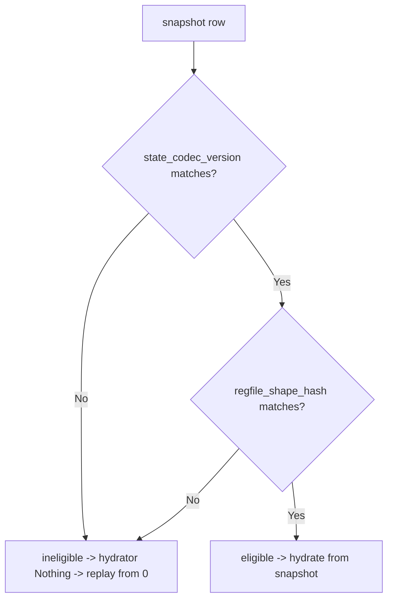

# Keiki rendering, diagrams, and JSON codecs

This ExecPlan is a living document. The sections Progress, Surprises & Discoveries,
Decision Log, and Outcomes & Retrospective must be kept up to date as work proceeds.


## Purpose / Big Picture

After this change, the keiki documentation set under `content/docs/keiki/` in this repository
gains a complete, accurate, navigable **rendering-and-codecs** slice. keiki (経機) is a pure,
dependency-free Haskell library whose one formalism — the **symbolic-register finite-state
transducer** `SymTransducer phi rs s ci co` — models event-sourced aggregates and process
managers. "Pure" here means no `IO`, no database, no effects: a transducer is a value. This
slice documents the two faces of that purity that a developer reaches for *after* they have an
aggregate: turning a transducer into something a human can **read** (Mermaid diagrams, an edge
inspector, a domain-readable pretty-printer, a Markdown diagram atlas) and turning a register
file or an event into something a machine can **store and transmit** (the JSON codecs in the
sibling `keiki-codec-json` package).

A reader who finishes this slice can:

- **Render any transducer as a diagram from one declaration, with no extra annotation.** keiki's
  `Keiki.Render.Mermaid` module turns a `SymTransducer` into a Mermaid `stateDiagram-v2` purely
  (`toMermaid`, `toMermaidWith`, `toMermaidWithLabels`), including composites (flat cross-product,
  nested subgraphs, three-deep, alternative arms, single-state feedback) and a typed multi-diagram
  **atlas**. The docs teach the load-bearing pedagogy that the **default diagram is guard-free**:
  it shows the control skeleton (`<input> / <output>` per edge) and hides predicate guards, because
  a guard-free topology is the one-way-door view you scan to spot a wrong edge.
- **Inspect, pretty-print, and validate without leaving the pure core.** `renderEdgeInspector`
  emits a full per-edge Markdown report; `prettyTerm`/`prettyPred`/`prettyUpdate` render the
  guard and update language in domain-readable form, **marking** (never silently dropping) the
  shapes they cannot print (`<fn>(…)`, `<lit>`); and `Keiki.Render.Validate` heuristically checks
  generated Mermaid *text* (`validateMermaidDiagram`/`validateMermaidAtlas`). The docs draw one
  sharp line here: `Keiki.Render.Validate` is a **diagram-text checker** and is *not* the
  transducer validator `validateTransducer`, which lives in `Keiki.Core` and is documented by a
  sibling plan.
- **Serialize a register file and an event to JSON, deterministically and strictly.** The
  `keiki-codec-json` package's `RegFileToJSON` class gives three methods (`regFileToJSON` builds an
  aeson `Value`; `regFileToEncoding` streams bytes with no intermediate; `regFileFromJSON` decodes
  *strictly* — a missing, extra, or mistyped slot is a `Left`). Template-Haskell derivers
  (`deriveRegFileCodec`, `deriveEventCodecSkeleton`) generate codec bindings for a record snapshot
  and an event sum. The event deriver's defining property is **no silent fallback**: a payload
  field with no codec is a *compile-time* decision (abort the splice, or emit a `_todo_` stub),
  never a dropped field at runtime.
- **Persist a register snapshot across the keiki↔keiro boundary, understanding the two
  discriminants.** A keiro snapshot row is eligible to skip replay **iff both** a
  consumer-managed `state_codec_version` *and* keiki's structural `regfile_shape_hash` match. This
  slice owns the JSON codec half of that boundary and **links to** the sibling plan that owns the
  shape hash itself (`reference/shape.mdx`); it never re-documents the hash. "Sensitivity" in this
  slice means exactly two things — structural-drift sensitivity (each slot mutation flips the shape
  hash) and the event codec's no-silent-fallback property — and **never** PII/secret redaction,
  which `keiki-codec-json` does not have.

You can see it working by running the docs dev server from the repo root
(`/Users/shinzui/Keikaku/bokuno/keiro-runtime-docs`) with `pnpm dev`, then browsing
`http://localhost:3000/docs/keiki`: the new pages appear in the sidebar under Reference,
Explanation, How-To, and a nine-chapter code walkthrough nested under "Code Walkthrough" →
"Rendering and codecs". Haskell snippets render with ligatures; ` ```mermaid ` fences render as
zoomable, pannable interactive diagrams.

This is a **content** plan. It populates `content/docs/keiki/` only. It does **not** build the
app, the highlighter, the font, the Mermaid component, or the IA/template system — those are
owned by MasterPlan #1's plans and are already complete. Every Haskell snippet documents keiki
**as shipped at the pinned upstream commit `344c4ca`** (keiki `0.1.0.0`, with the sibling
`keiki-codec-json` `0.1.0.0`); where keiki's own `docs/research/*` / `docs/historical/*` design
notes diverge from the shipped code, this plan follows the source.


## Progress

Use a checklist to summarize granular steps. Every stopping point must be documented here,
even if it requires splitting a partially completed task into two ("done" vs. "remaining").
This section must always reflect the actual current state of the work.

- [x] M0. Preconditions verified (2026-06-06) — EP-20 Complete; toolchain present; section subdirs
      exist; baseline `pnpm build` clean and `pnpm lint:links` exit 0; keiki source readable at
      `344c4ca`; `walkthrough/rendering-and-codecs/` subdir created.
- [x] M1. Reference + explanation pages authored (2026-06-06): `reference/render-mermaid.mdx` (with
      the `Keiki.Render.Validate` disambiguation), `reference/render-inspector.mdx`,
      `reference/render-pretty.mdx`, `reference/render-markdown.mdx` (documents `Keiki.Render.Validate`),
      `reference/codec-json.mdx`, `explanation/diagrams-from-one-declaration.mdx`,
      `explanation/the-regfile-codec-and-snapshots.mdx` (links forward to EP-22 `reference/shape`).
- [x] M2. How-to guides authored (2026-06-06): `how-to/render-a-mermaid-diagram.mdx`,
      `how-to/build-a-diagram-atlas.mdx`, `how-to/derive-a-json-event-codec.mdx`,
      `how-to/persist-a-register-snapshot.mdx`.
- [x] M3. Walkthrough authored (2026-06-06): `walkthrough/rendering-and-codecs/` subdir + its
      `meta.json` — `00-start-here.mdx` plus chapters `01-pretty-printer` … `09-shape-hash-and-snapshots`.
- [x] M4. meta.json appends done; full `pnpm build` exit 0 with zero crawler warnings;
      `pnpm lint:links` exit 0 (304 files); Haskell-name and relative-link audits pass. (2026-06-06)


## Surprises & Discoveries

Document unexpected behaviors, bugs, optimizations, or insights discovered during
implementation. Provide concise evidence.

(None yet.)


## Decision Log

Record every decision made while working on the plan.

- Decision: `Keiki.Render.Validate` (the Mermaid-diagram/atlas **text** checker —
  `validateMermaidDiagram`, `validateMermaidAtlas`, `MermaidValidationWarning`) is documented
  **here** (EP-25), and every page that names it includes one disambiguating sentence that it is
  *not* `Keiki.Core`'s `validateTransducer` (the transducer validator owned by EP-24).
  Rationale: keiki has two unrelated "validate" surfaces and the module names invite conflation.
  `Keiki.Render.Validate` only ever inspects rendered Mermaid *strings* (its `DuplicateStateId`
  warning is keyed off the same id token the AST checker uses, so AST and text checks agree);
  `validateTransducer` analyses the transducer's edges. MasterPlan #3 Surprises records this split
  and assigns the Mermaid checker to EP-25. Putting it on `reference/render-markdown.mdx` (and
  mentioning it on `reference/render-mermaid.mdx`) keeps it beside the rendering it checks.
  Date: 2026-06-07
- Decision: Frame "sensitivity" in the codec pages as (i) **shape-hash drift sensitivity** — each
  structural slot mutation flips `regFileShapeHash`, the property the `SensitivitySpec` golden
  pins (cases #1–9 each flip the hash) — and (ii) the **event-codec no-silent-fallback** property
  — an unhandled payload field is a *compile-time* decision (`FailAtCompileTime` aborts the splice;
  `EmitTodoBindings` emits a `_todo_<Ctor>_<field>` stub). **Never** describe redaction.
  Rationale: `keiki-codec-json` ships **no** PII/secret redaction machinery (MasterPlan #3
  Surprises confirms this); promising a redaction page would be inaccurate and would strand a
  reader looking for a feature that does not exist.
  Date: 2026-06-07
- Decision: EP-25 owns the **JSON codec** (`keiki-codec-json`: the `RegFile` codec and the
  two-discriminant snapshot-eligibility story); EP-22 owns the **shape hash** (`Keiki.Shape`'s
  `regFileShapeHash`, `reference/shape.mdx`). `explanation/the-regfile-codec-and-snapshots.mdx`
  and `how-to/persist-a-register-snapshot.mdx` **link** to EP-22's `reference/shape.mdx` for the
  hash and do not re-document it.
  Rationale: MasterPlan #3 Integration Point 5b splits the snapshot/shape-hash persistence
  boundary across two packages so plans don't contradict each other; a single owner per half with
  absolute cross-links keeps the snapshot story coherent without duplication.
  Date: 2026-06-07
- Decision: State explicitly, wherever the boundary appears, that `regFileShapeHash` / `Keiki.Shape`
  lives in the **`keiki`** package (which has **no** aeson dependency), while the codec lives in
  the separate **`keiki-codec-json`** package (which depends on aeson).
  Rationale: the two-package split is the reason keiki's core stays dependency-free; readers must
  not assume the codec is part of `keiki`, and EP-22's shape page must not be assumed to import
  aeson. MasterPlan #3 Integration Point 5b and its closing note fix this ownership.
  Date: 2026-06-07


## Outcomes & Retrospective

Summarize outcomes, gaps, and lessons learned at major milestones or at completion.
Compare the result against the original purpose.

**Outcome (2026-06-06).** EP-25 is complete: 21 pages — five reference (`render-mermaid`,
`render-inspector`, `render-pretty`, `render-markdown`, `codec-json`), two explanations
(`diagrams-from-one-declaration`, `the-regfile-codec-and-snapshots`), four how-tos
(`render-a-mermaid-diagram`, `build-a-diagram-atlas`, `derive-a-json-event-codec`,
`persist-a-register-snapshot`), and the ten-file `walkthrough/rendering-and-codecs/` tour. The whole
keiki tree builds clean (`pnpm build` exit 0, zero crawler warnings) and link-checks (304 files);
every quoted Haskell identifier was audited against the pinned source `344c4ca`. The guard-free-default
pedagogy, the `Keiki.Render.Validate`-vs-`validateTransducer` disambiguation, the two-package
aeson-free split, and the two-discriminant snapshot eligibility are documented; "sensitivity" is
framed only as structural-drift + no-silent-fallback, never redaction; and the shape hash is linked
to EP-22's `reference/shape` rather than re-documented. No build or crawler issues this milestone —
the stray-harness-tag and forward-link hazards were pre-empted in the agent briefs.


## Context and Orientation

Read this whole section before editing. It is written so a novice with only this file and the
working tree can complete the work. You will write MDX content files; you will not write or
compile Haskell. The Haskell appears only as *quoted snippets* inside the docs, and every snippet
must match the real source transcribed below.

### What you are building, and where

This repository (`/Users/shinzui/Keikaku/bokuno/keiro-runtime-docs`) is a **fumadocs**
documentation site (fumadocs-ui + fumadocs-mdx) built on **TanStack Start as a static
single-page app** (React + MDX + TypeScript, bundled with **Vite**), built and served with
**pnpm**. `pnpm dev` runs the dev server; `pnpm build` builds the static SPA and prerenders every
route; `pnpm lint:links` checks internal links and must exit 0; `pnpm typecheck` type-checks the
TypeScript. Content lives under `content/docs/`. Each directory has a `meta.json` whose `pages`
array lists child page slugs (and nested directory names) in sidebar order. A "page" is an
`.mdx` file: YAML frontmatter (`title`, `description`) followed by an MDX body.

The documented **code samples are Haskell** (the site is TypeScript; the subject, keiki, is a
Haskell library). MDX components (`Callout`, `Cards`, `Card`, `Steps`, `Step`, `Tabs`, `Tab`,
`TypeTable`, `Accordion`, `Accordions`, and the diagram renderer) are **registered globally** in
the site's MDX setup — so in page bodies you use them **bare, with no `import` lines**. This
matches every existing keiro/kiroku page. Do not add `import` statements for these. The site
renders ` ```mermaid ` fences as zoomable, interactive diagrams (use a fenced code block, not a
component).

### Where this plan sits in the larger effort (reference by path)

This is **EP-25** in the MasterPlan
`docs/masterplans/3-keiki-framework-documentation-set.md`. It is **Phase 2** (the capabilities
wave).

- **HARD DEP — EP-20** (`docs/plans/20-keiki-foundation-theory-getting-started-and-the-worked-example-spine.md`):
  EP-20 must be **Complete** before you start. EP-20 creates the `/docs/keiki` overview and
  getting-started pages your pages link back to, the foundations/theory explanation essays, the
  introduction of the `jitsurei` worked-example spine and its module map,
  `docs/keiki-source-sync.md`, the walkthrough hub (`walkthrough/index.mdx`) and
  `walkthrough/meta.json`, and the shared authoring conventions. Verify EP-20 is done in M0; if
  `content/docs/keiki/index.mdx` or `docs/keiki-source-sync.md` is missing, stop and finish EP-20
  first.
- **SOFT DEP — EP-21** (`docs/plans/21-keiki-transducer-core-and-authoring-aggregates.md`):
  the type-safe-aggregates heart (core + builder). EP-21 owns the canonical *conceptual* treatment
  of `SymTransducer phi rs s ci co`, the difference between control **state `s`** and the
  **register file `rs`**, and the explanation pages `explanation/the-symtransducer.mdx` and
  `explanation/registers-vs-state.mdx`. Soft means non-blocking: your renderer pages **link** to
  those EP-21 model pages rather than re-deriving the model (Integration Point 5a). Use absolute
  links (`/docs/keiki/explanation/the-symtransducer`); they resolve once EP-21 lands. If you cannot
  confirm an EP-21 page's exact slug, link to the section landing (`/docs/keiki/explanation`) and
  note the intended target in prose.
- **SOFT DEP — EP-22** (`docs/plans/22-keiki-derivations-decider-acceptors-projections-and-generics.md`):
  the derivations. **EP-22 owns `Keiki.Shape`** — `regFileShapeHash`, `renderStableTypeRep`, and
  *why* the hash is the GHC-upgrade-stable discriminator a snapshot persister keys on (the page is
  `reference/shape.mdx`). Your snapshot pages **link** to `reference/shape.mdx` for the hash and do
  **not** re-document it (Integration Point 5b). Same link discipline as above.

This plan **integration-feeds EP-26** (the finalization plan,
`docs/plans/26-keiki-domain-cookbook-worked-example-tutorials-faq-and-finalization.md`): EP-26 runs
the final `meta.json` ordering pass and wires the walkthrough hub `<Card href>` that points at
your tour's `00-start-here`. You do **not** add the hub `<Card href>` yourself (a `<Card href>` to
a not-yet-final page can trip the crawler); you only append your subdir name to
`walkthrough/meta.json` and ship a real `00-start-here.mdx`.

### Hard-won house rules (apply to every page you write)

1. **Absolute doc links only.** Cross-page links use absolute doc paths
   (`/docs/keiki/reference/render-mermaid`), never relative `./sibling` or `../section/page`.
   Relative MDX links resolve *wrong* in the static SPA and trip the prerender crawler. This
   applies even to the code-walkthrough template's `[00 — Start here](./00-start-here)` line — when
   you copy that template, **rewrite the link to an absolute path**
   (`/docs/keiki/walkthrough/rendering-and-codecs/00-start-here`).
2. **Every fenced code block carries a language tag.** Use ` ```haskell `, ` ```json `,
   ` ```mermaid `, ` ```bash `, ` ```text `. Never a bare ```` ``` ````.
3. **Snippet accuracy is an acceptance criterion.** Every Haskell type, field, and function name
   you quote must appear in the pinned source. The verified transcription is below; cross-check
   against the files named before declaring a snippet done. Where keiki's in-repo `docs/research/*`
   notes diverge from the shipped source, **trust the source**.
4. **No `import` lines for the MDX components** (see above).
5. **Do not reformat neighbouring files.** Hand-authored MDX in this repo does not pass
   `oxfmt --check` cleanly repo-wide; match the neighbouring `content/docs/keiro/*` file style and
   do not run a formatter over the tree.

### The subject, transcribed from source (use these REAL names)

Source of truth on disk (read-only — do **not** edit it):
`/Users/shinzui/Keikaku/bokuno/keiki`, pinned commit `344c4ca` (resolve the path with
`mori registry show shinzui/keiki --full`; mori name `shinzui/keiki`). The `jitsurei` worked
example lives **inside** that repo at `/Users/shinzui/Keikaku/bokuno/keiki/jitsurei/`. The facts
below are transcribed from that tree at the pinned commit. Treat this as your API cheat-sheet; the
files to cross-check are named inline.

#### `Keiki.Render.Mermaid` (`src/Keiki/Render/Mermaid.hs`)

Single-transducer renderers:

```haskell
toMermaid           :: (Enum s, Bounded s, Show s)
                    => SymTransducer (HsPred rs ci) rs s ci co -> Text
toMermaidWith       :: MermaidOptions
                    -> SymTransducer (HsPred rs ci) rs s ci co -> Text
toMermaidWithLabels :: (Bounded s, Enum s)
                    => MermaidOptions -> MermaidStateLabels s
                    -> SymTransducer (HsPred rs ci) rs s ci co -> Text
duplicateStateIds   :: (Bounded s, Enum s)
                    => MermaidStateLabels s
                    -> SymTransducer (HsPred rs ci) rs s ci co -> [Text]
```

`toMermaid` emits a `stateDiagram-v2`: a `[*] --> <initial>` start arrow, one
`<src> --> <tgt> : <edgeLabel>` line per edge, and a `<v> --> [*]` line per `isFinal` vertex. The
default edge label is `<input ctor> / <output ctor>` (a missing input constructor renders `?`; an
ε-edge — one that emits nothing — renders `ε`). **The default is guard-FREE** — it shows the
control skeleton and hides predicate guards. This is golden-pinned and is load-bearing pedagogy:
the guard-free topology is the one-way-door view you scan to spot a wrong edge. `toMermaidWith`
adds, on the **single-transducer path only**, a bracketed suffix `[w: <slots>; g: <guard>]` per the
options; composites stay plain. `toMermaidWithLabels` takes caller-supplied `stableId` (emitted
**verbatim**, ASCII, not sanitised) and `displayLabel`, emitting `state "<display>" as <id>` only
when the two differ; if the two functions are identical it is byte-identical to `toMermaidWith`.
`duplicateStateIds` is a pure AST collision check over the label function (`[]` means every id is
unique).

Composite renderers:

```haskell
toMermaidComposite       :: ...  -- flat cross-product of two transducers
toMermaidCompositeNested :: ...  -- Shape B: one subgraph per outer state
toMermaidCompose3        :: ...  -- right-associated 3-deep, flat
toMermaidCompose3Nested  :: ...  -- right-associated 3-deep, nested subgraphs
toMermaidAlternative     :: ...  -- two parallel arms
toMermaidAlternativeWith :: ...  -- arms, with MermaidOptions
toMermaidFeedback1       :: ...  -- single-state feedback loop
```

Composite state ids join with `_` (the `compositeLabel` of `a` and `b` is `<a>_<b>`).

Atlas (multi-diagram document):

```haskell
toMermaidAtlas     :: [(Text, Text)] -> Text                       -- (title, diagram) pairs
toMermaidAtlasWith :: MermaidAtlasOptions -> [MermaidSection] -> Text
defaultMermaidAtlasOptions :: MermaidAtlasOptions
```

Label primitives (exported, reusable): `vertexLabel`, `compositeLabel`, `compose3Label`,
`edgeInputName`, `edgeOutputName`, `edgeLabel`.

Option and section types:

```haskell
data MermaidGuardMode
  = MermaidGuardHidden
  | MermaidGuardStructuralSummary
  | MermaidGuardPretty

data MermaidLabelLayout  = MermaidLabelInline | MermaidLabelMultiline
data MermaidOutputLayout = MermaidOutputSemicolon | MermaidOutputMultiline | MermaidOutputCounted

data MermaidOptions = MermaidOptions
  { showWrittenSlots      :: Bool
  , showGuardSummary      :: Bool
  , guardMode             :: MermaidGuardMode
  , labelLayout           :: MermaidLabelLayout
  , maxInlineWrittenSlots :: Maybe Int
  , maxInlineGuardWidth   :: Maybe Int
  , outputLayout          :: MermaidOutputLayout
  }
defaultMermaidOptions :: MermaidOptions

data MermaidStateLabels s = MermaidStateLabels
  { stateId           :: s -> Text
  , stateDisplayLabel :: s -> Text
  }

data MermaidSection = MermaidSection
  { sectionId      :: Text
  , sectionTitle   :: Text
  , sectionKind    :: MermaidSectionKind
  , sectionDiagram :: Text
  }

data MermaidSectionKind
  = AggregateDiagram
  | ProcessManagerDiagram
  | WorkflowDiagram
  | CustomDiagram Text

data AtlasKindDisplay = KindHidden | KindAsLabel | KindAsComment

data MermaidAtlasOptions = MermaidAtlasOptions
  { atlasTitle              :: Maybe Text
  , atlasSectionHeadingLevel :: Int
  , atlasShowSectionKind    :: AtlasKindDisplay
  , atlasWrapMarkers        :: Maybe Text
  , atlasFenceLanguage      :: Text
  }
```

Test anchors: `Keiki.Render.MermaidSpec`; the loan capstone golden lives at
`Jitsurei.Render.MermaidLoanSpec` (`toMermaidCompose3`/`toMermaidCompose3Nested` over
`loanWorkflow`: a **54-vertex flat** diagram and a **6×9 nested** one).

#### `Keiki.Render.Validate` — OWNED BY THIS PLAN (`src/Keiki/Render/Validate.hs`)

A heuristic checker over rendered Mermaid **text** (strings), not over the transducer:

```haskell
validateMermaidDiagram :: Text -> [MermaidValidationWarning]
validateMermaidAtlas   :: Text -> [MermaidValidationWarning]
data MermaidValidationWarning = ... | DuplicateStateId ... | ...
```

`DuplicateStateId` is keyed off the same id token `toMermaidWithLabels`/`duplicateStateIds` use,
so the AST check and the text check agree. **DISAMBIGUATION SENTENCE (must appear):**
`Keiki.Render.Validate` checks rendered diagram *text*; it is distinct from `Keiki.Core`'s
`validateTransducer` (the transducer validator, documented by EP-24,
`/docs/keiki/reference/validate`). Test anchor: `Keiki.Render.ValidateSpec`.

#### `Keiki.Render.Markdown` (`src/Keiki/Render/Markdown.hs`)

Generic marker-replacement — it references **no** keiki type, so it works on any fenced block in a
Markdown file:

```haskell
data MarkdownDiagramBlock = MarkdownDiagramBlock
  { blockNamespace :: Text
  , blockId        :: Text
  , blockLanguage  :: Text
  , blockContent   :: Text
  }

data MarkdownDiagramError
  = MissingBeginMarker Text
  | MissingEndMarker   Text
  | DuplicateMarker    Text Int

replaceMarkdownDiagramBlock :: MarkdownDiagramBlock -> Text -> Either MarkdownDiagramError Text
beginMarker :: Text -> Text -> Text   -- beginMarker ns id = "<!-- {ns}: {id} begin -->"
endMarker   :: Text -> Text -> Text
```

`replaceMarkdownDiagramBlock` is **idempotent**: it strips trailing newlines before the closing
fence and validates that exactly one begin marker and one end marker exist (otherwise
`MissingBeginMarker` / `MissingEndMarker` / `DuplicateMarker`). This is how a doc keeps a fenced
diagram in sync with the source: regenerate the diagram, then replace the marked block in place.
Test anchor: `Keiki.Render.MarkdownSpec`.

#### `Keiki.Render.Inspector` (`src/Keiki/Render/Inspector.hs`)

```haskell
data EdgeInspectorOptions = EdgeInspectorOptions
  { includeEdgeIndex      :: Bool
  , includeStructuralGuard :: Bool
  , includePrettyGuard    :: Bool
  , includeWrittenSlots   :: Bool
  , includeOutputFields   :: Bool
  }
defaultEdgeInspectorOptions :: EdgeInspectorOptions
-- defaults: index=True, structural=True, written=True; pretty=False, outputFields=False

renderEdgeInspector :: (Bounded s, Enum s, Show s)
                    => EdgeInspectorOptions
                    -> SymTransducer (HsPred rs ci) rs s ci co -> Text
```

`renderEdgeInspector` emits a full per-edge Markdown report: a `# Edge inspector` heading, a
`### <state>` heading per source vertex, then `- **src -> tgt**` per edge with indented detail
bullets; it joins multiple outputs with `; `. **Walkthrough note:** the `guardSummary` and
`writtenSlots` helpers are *replicated byte-identically* from `Keiki.Render.Mermaid` (not imported,
because they are unexported there). Test anchor: `Keiki.Render.InspectorSpec`.

#### `Keiki.Render.Pretty` (`src/Keiki/Render/Pretty.hs`)

```haskell
indexName   :: Index rs r -> String
prettyTerm  :: Term rs ci ifs r -> Text
prettyPred  :: HsPred rs ci -> Text
prettyUpdate :: Update rs w ci -> Text
```

Domain-readable rendering: registers by slot name, input fields as `ctor.field`, arithmetic as
`(a + b)`, predicates with parenthesised `&& || !`, updates as `slot := term` or `(keep)`.
Crucially, unprintable shapes are **marked, not dropped**: `TApp1`/`TApp2` render as `<fn>(…)` and
`TLit` renders as `<lit>`. Test anchor: `Keiki.Render.PrettySpec`.

#### `keiki-codec-json` — the JSON codec package (`keiki-codec-json/src/Keiki/Codec/JSON.hs`)

```haskell
class RegFileWalk rs => RegFileToJSON rs where
  regFileToJSON     :: RegFile rs -> Aeson.Value
  regFileToEncoding :: RegFile rs -> Aeson.Encoding             -- streaming, no Value intermediate
  regFileFromJSON   :: Aeson.Value -> Either String (RegFile rs) -- strict; "<slot>: <reason>" on failure

instance RegFileWalk rs => RegFileToJSON rs                     -- blanket; users never write instances

class RegFileWalk rs where
  regFilePairs      :: ...      -- internal slot walker
  regFileSeries     :: ...
  regFileReadObject :: ...
-- instances: RegFileWalk '[]
--            RegFileWalk ('(s,t) ': rs)  needs (KnownSymbol s, ToJSON t, FromJSON t)
```

Slot keys are the slot **symbols** in slot-list order. The decoder is strict: missing slot, extra
field, or type mismatch each produce `Left "<slot>: <reason>"`. There are **two encoder paths**:
`regFileToJSON` builds an aeson `Value` (use when you also need to manipulate the JSON); `regFileToEncoding`
streams via `Aeson.pairs` (recommended for large payloads — roughly `>100KB` — or hot paths: about
`1.5×` faster and `~33%` less allocation). **Cross-path byte equality is NOT asserted** (the `Value`
path iterates a `KeyMap` alphabetically; the `Encoding` path emits slot-list order) — the codec
guarantees only *within-path* determinism and a *per-path* round-trip. Test anchors:
`Keiki.Codec.JSON.PropSpec` (round-trip + determinism), `Keiki.Codec.JSON.GoldenSpec`,
`Keiki.Codec.JSON.SensitivitySpec` (each of cases #1–9 flips the shape hash).

#### `keiki-codec-json` TH record deriver (`keiki-codec-json/src/Keiki/Codec/JSON/TH.hs`)

```haskell
deriveRegFileCodec   :: Name -> Q [Dec]          -- prefix = lowercased type name
deriveRegFileCodecAs :: String -> Name -> Q [Dec]
```

For a single-constructor record `T` (deriving `Generic`), `deriveRegFileCodec ''T` emits
`<p>ToJSON :: T -> Aeson.Value`, `<p>ToEncoding :: T -> Aeson.Encoding`, and
`<p>FromJSON :: Aeson.Value -> Either String T`, routing through
`RegFileToJSON @(RegFieldsOf T)` via `gToRegFile . from` / `to . gFromRegFile`. It **rejects** type
synonyms, multi-constructor sums, and positional (non-record) constructors; it **accepts** a
no-field singleton (`'[]` → `{}`). Test anchor: `Keiki.Codec.JSON.THSpec`.

#### `keiki-codec-json` TH event deriver (`keiki-codec-json/src/Keiki/Codec/JSON/Event.hs`)

```haskell
data FieldCodec = FieldCodec { fcEncode :: Name, fcDecode :: Name }
data OnMissingCodec = FailAtCompileTime | EmitTodoBindings

data EventCodecOptions = EventCodecOptions
  { fieldCodecOverrides :: Map String FieldCodec
  , passthroughFields   :: Set String
  , kindFieldName       :: String
  , onMissingCodec      :: OnMissingCodec
  }
defaultEventCodecOptions :: EventCodecOptions
-- defaults: empty overrides, empty passthrough, kind = "kind", FailAtCompileTime

deriveEventCodecSkeleton   :: EventCodecOptions -> Name -> Q [Dec]
deriveEventCodecSkeletonAs :: ...
```

For an event sum `data E = C1 P1 | … | Singleton`, `deriveEventCodecSkeleton` (prefix = lowercased
type name) emits **four** bindings: `<p>ToJSON :: E -> Aeson.Value`,
`<p>FromJSON :: Aeson.Value -> Either String E`, `<p>EventTypes :: [Text]` (constructor names in
declaration order), and `<p>KindMap :: [(Text, Text)]` (`(ctor, kind)` pairs — feed a Keiro
`eventTypes` registry; this is plain `Text`, with **no** Keiro import). Each constructor encodes to
a JSON object with a `"kind"` discriminator plus one entry per payload field; the decoder reads the
kind and dispatches via a nested `if`, ending in `Left "unknown event kind: …"`. Singleton
constructors encode to just `{"kind":"Singleton"}`. It **rejects** multi-argument, record-syntax,
GADT, and infix constructors. **NO-SILENT-FALLBACK:** a payload field is encoded by
`fieldCodecOverrides`, else by `passthroughFields`, else it is *unhandled* — and an unhandled field
triggers `onMissingCodec`: `FailAtCompileTime` aborts the splice listing every unhandled field, or
`EmitTodoBindings` emits `_todo_<Ctor>_<field> = error "TODO: …"`. Helpers: `lookupField`,
`lookupText`, `aesonResultToEither`. Test anchor: `Keiki.Codec.JSON.THEventSpec`.

#### Shape hash and snapshots — LINK to EP-22, do NOT re-document

`regFileShapeHash` lives in `Keiki.Shape` — in the **`keiki`** package, which has **no** aeson
dependency. EP-22 owns its reference (`/docs/keiki/reference/shape`). The two-discriminant
persistence story (keiro's `keiro_snapshots` table): a snapshot row carries a consumer-managed
`state_codec_version` (catches wire-breaking `ToJSON` changes the structural hash cannot see) and
keiki's `regfile_shape_hash` (catches structural drift); a snapshot is **eligible iff BOTH match**.
A mismatch makes the hydrator return `Nothing`, which replays from event 0. This is the persistence
boundary keiro's snapshot codec builds on — documented here from keiki's side only. The keiki-side
research source is `docs/research/regfile-codec-design.md` (rationale, not API — trust the source
signatures above).

#### Diagram examples shipped in the keiki repo

`docs/guide/diagrams/` holds hand-authored mirrors of the goldens: `loan-workflow.mmd` (flat
`compose3`), `loan-workflow-nested.mmd`, `loan-application.mmd`, `loan.mmd`,
`core-banking-sync.mmd`, plus `composite-*.md`, `email-delivery.md`, `order-cart.md`,
`user-registration{,-v0}.md`. The `.mmd` files are mirrored **verbatim** by the
`MermaidLoanSpec` goldens; each `.md` carries a `cabal repl` refresh recipe. Pattern docs:
`keiro-runtime-patterns/keiki/diagram-docs.md` and `.../json-event-codecs.md`.

### The pages this plan authors (all under `content/docs/keiki/`)

Reference: `reference/render-mermaid.mdx`, `reference/render-inspector.mdx`,
`reference/render-pretty.mdx`, `reference/render-markdown.mdx`, `reference/codec-json.mdx`.
Explanation: `explanation/diagrams-from-one-declaration.mdx`,
`explanation/the-regfile-codec-and-snapshots.mdx`. How-to:
`how-to/render-a-mermaid-diagram.mdx`, `how-to/build-a-diagram-atlas.mdx`,
`how-to/derive-a-json-event-codec.mdx`, `how-to/persist-a-register-snapshot.mdx`. Walkthrough (new
subdir `walkthrough/rendering-and-codecs/`): `00-start-here.mdx` plus the nine chapters
`01-pretty-printer.mdx`, `02-mermaid-core.mdx`, `03-mermaid-options-and-labels.mdx`,
`04-composites.mdx`, `05-atlas-and-markdown.mdx`, `06-edge-inspector.mdx`, `07-regfile-codec.mdx`,
`08-th-derivers.mdx`, `09-shape-hash-and-snapshots.mdx`, plus
`walkthrough/rendering-and-codecs/meta.json`.

### Templates to copy from

Per Diátaxis type, copy the matching template's frontmatter + skeleton from
`content/docs/_templates/`: `reference.mdx`, `explanation.mdx`, `how-to.mdx`,
`code-walkthrough.mdx`. Good in-repo exemplars for tone and component usage are the keiro pages
under `content/docs/keiro/` (for example `content/docs/keiro/reference/*.mdx` for `<TypeTable>` and
` ```mermaid ` usage, and `content/docs/keiro/walkthrough/read-side/*` for the walkthrough rhythm).


## Plan of Work

The work is four milestones after M0 preconditions. Author in the order below: the reference and
explanation pages (M1) establish the vocabulary and the verbatim signatures the how-tos and the
walkthrough lean on; the how-tos (M2) are task recipes built on those references; the walkthrough
(M3) is the deep source tour; M4 wires the sidebar and runs the full acceptance gate. Each
milestone is independently verifiable by building the site and viewing the new pages.

### M0 — Preconditions

Confirm EP-20 is Complete and the toolchain/tree are ready. Resolve the keiki source path with
`mori registry show shinzui/keiki --full` (expected: `/Users/shinzui/Keikaku/bokuno/keiki`).
Acceptance: the existing keiki tree builds (`pnpm build` exits 0, no crawler warnings) and
`pnpm lint:links` exits 0 *before* you add any EP-25 page, and `docs/keiki-source-sync.md` +
`content/docs/keiki/index.mdx` + `content/docs/keiki/walkthrough/index.mdx` exist.

### M1 — Reference + explanation set (7 pages)

Author the five reference pages and the two explanation essays. At the end every Haskell name
quoted is present verbatim in the pinned source and both explanations carry a ` ```mermaid `
diagram. Acceptance: `pnpm build` prerenders all seven with no crawler warnings; a grep audit (M4)
finds every quoted Haskell name in the pinned source.

`reference/render-mermaid.mdx` (title `"Render: Mermaid"`) documents the full Mermaid surface: the
single renderers (`toMermaid`/`toMermaidWith`/`toMermaidWithLabels`/`duplicateStateIds`), the
composite family (`toMermaidComposite`, `…Nested`, `toMermaidCompose3`/`…Nested`,
`toMermaidAlternative`/`…With`, `toMermaidFeedback1`), the atlas
(`toMermaidAtlas`/`toMermaidAtlasWith`/`defaultMermaidAtlasOptions`), the label primitives, and the
option/section types (`MermaidOptions` + `defaultMermaidOptions`, `MermaidGuardMode`,
`MermaidLabelLayout`, `MermaidOutputLayout`, `MermaidStateLabels`, `MermaidSection`,
`MermaidSectionKind`, `AtlasKindDisplay`, `MermaidAtlasOptions`). State the guard-free-default
pedagogy and that the bracketed `[w: …; g: …]` suffix is single-transducer-only (composites stay
plain). **Include the one disambiguating sentence** that `Keiki.Render.Validate` (the Mermaid text
checker) is distinct from `Keiki.Core`'s `validateTransducer` (link
`/docs/keiki/reference/validate`). Anchor to `Keiki.Render.MermaidSpec` and
`Jitsurei.Render.MermaidLoanSpec`. Link to EP-21's model page
(`/docs/keiki/explanation/the-symtransducer`).

`reference/render-inspector.mdx` (title `"Render: edge inspector"`) documents `renderEdgeInspector`
and `EdgeInspectorOptions`/`defaultEdgeInspectorOptions` (note the True/False defaults). Anchor
`Keiki.Render.InspectorSpec`.

`reference/render-pretty.mdx` (title `"Render: pretty-printer"`) documents `prettyTerm`,
`prettyPred`, `prettyUpdate`, `indexName`, and the *marking* of unprintables (`<fn>(…)` for
`TApp1`/`TApp2`, `<lit>` for `TLit`). Anchor `Keiki.Render.PrettySpec`.

`reference/render-markdown.mdx` (title `"Render: Markdown atlas"`) documents
`replaceMarkdownDiagramBlock`, `MarkdownDiagramBlock`, `MarkdownDiagramError`, `beginMarker`/`endMarker`,
and idempotence. **Document `Keiki.Render.Validate`'s `validateMermaidDiagram`/`validateMermaidAtlas`
here** (with the disambiguating sentence vs `validateTransducer`). Anchors
`Keiki.Render.MarkdownSpec`, `Keiki.Render.ValidateSpec`.

`reference/codec-json.mdx` (title `"Codec: JSON"`) documents `RegFileToJSON` (the three methods,
the two encoder paths, the strict decoder), the blanket instance + the `RegFileWalk` walker,
`deriveRegFileCodec`/`deriveRegFileCodecAs`, `deriveEventCodecSkeleton`/`deriveEventCodecSkeletonAs`,
and the option types (`EventCodecOptions`/`defaultEventCodecOptions`, `FieldCodec`, `OnMissingCodec`).
Anchors `Keiki.Codec.JSON.THSpec`, `Keiki.Codec.JSON.THEventSpec`, `Keiki.Codec.JSON.PropSpec`.

`explanation/diagrams-from-one-declaration.mdx` (title `"Diagrams from one declaration"`) teaches
that one `SymTransducer` value yields topology (Mermaid), an edge inspector, a pretty-printed guard
language, and an atlas — **all pure**, no annotation. It makes the **guard-free default**
load-bearing pedagogy (the one-way-door bug-spotting view) and explains the AST↔text duplicate-id
agreement (`duplicateStateIds` vs `validateMermaidDiagram`'s `DuplicateStateId`). Carry a
` ```mermaid ` overview. Anchor `Keiki.Render.MermaidSpec`. Link to EP-21's model page.

`explanation/the-regfile-codec-and-snapshots.mdx` (title `"The RegFile codec and snapshots"`)
teaches the two-package split (`keiki` is aeson-free; the codec lives in `keiki-codec-json`), the
shape-hash stability contract, the two-discriminant snapshot eligibility (`state_codec_version` +
`regfile_shape_hash`), the streaming-vs-`Value` path tradeoff, and the keiro persistence boundary
keiki feeds. **Link** to EP-22's `reference/shape.mdx` for the hash; do not re-document it. Carry a
` ```mermaid ` of the eligibility decision. Anchors `Keiki.Codec.JSON.SensitivitySpec`,
`Keiki.Codec.JSON.GoldenSpec`.

### M2 — How-to guides (4 pages)

`how-to/render-a-mermaid-diagram.mdx` (title `"Render a Mermaid diagram"`): single
(`toMermaid`/`toMermaidWith`), composite (`toMermaidComposite`/`…Nested`), and the readable-guard
options (`MermaidGuardPretty`, `showGuardSummary`). Anchor `Jitsurei.Render.MermaidLoanSpec`.

`how-to/build-a-diagram-atlas.mdx` (title `"Build a diagram atlas"`): `toMermaidAtlasWith` with
typed `MermaidSection`s + atlas markers, then in-place regeneration via
`replaceMarkdownDiagramBlock` (the `diagram-docs.md` CLI pattern). Anchors
`Keiki.Render.MermaidSpec`, `Keiki.Render.MarkdownSpec`.

`how-to/derive-a-json-event-codec.mdx` (title `"Derive a JSON event codec"`):
`deriveEventCodecSkeleton`, overrides vs passthrough, `FailAtCompileTime` vs `EmitTodoBindings`, and
wiring the emitted `<p>EventTypes`/`<p>KindMap` into a Keiro `eventTypes` registry. Anchor
`Keiki.Codec.JSON.THEventSpec`. Frame "sensitivity" here as no-silent-fallback, never redaction.

`how-to/persist-a-register-snapshot.mdx` (title `"Persist a register snapshot"`):
`regFileToEncoding` + `regFileShapeHash` and the two-discriminant write/hydrate. **Link** to EP-22's
`reference/shape.mdx`. Anchors `Keiki.Codec.JSON.THSpec`, `Keiki.Codec.JSON.PropSpec`.

At the end each guide solves its one task and every signature matches M1's reference. Acceptance:
all four build with no crawler warnings.

### M3 — Walkthrough (`walkthrough/rendering-and-codecs/`, 00-start-here + 9 chapters + meta.json)

A contribution-grade source tour, authored deep on the first pass (MasterPlan #3 front-loads this
lesson — there is no later deepening phase). Each chapter quotes the real source (note the file path
above each block) and walks it in prose; cross-links between chapters are absolute. The chapter
sequence and what each must cover:

- `00-start-here.mdx` (title `"00 — Start here"`): frame the rendering/codecs surface — one pure
  transducer projected to text and JSON — with an overview ` ```mermaid `; link to the nine
  chapters.
- `01-pretty-printer.mdx` (title `"01 — The pretty-printer"`): `src/Keiki/Render/Pretty.hs` — the
  unprintable-marking AST projection that everything reuses (`prettyTerm`/`prettyPred`/`prettyUpdate`,
  `<fn>(…)`/`<lit>`). Anchor `PrettySpec`.
- `02-mermaid-core.mdx` (title `"02 — Mermaid core"`): `src/Keiki/Render/Mermaid.hs` core —
  `edgeLabel`/`edgeInputName`/`edgeOutputName`, `[*] --> initial`, the per-edge/per-final lines, and
  the guard-free default. Anchors `MermaidSpec`, `MermaidLoanSpec`.
- `03-mermaid-options-and-labels.mdx` (title `"03 — Options and labels"`): `MermaidOptions`, the
  guard-summary chokepoint, the `[w: …; g: …]` suffix, `MermaidStateLabels`/`duplicateStateIds`.
  Anchor `MermaidSpec`.
- `04-composites.mdx` (title `"04 — Composites"`): flat vs nested vs alternative vs feedback1.
  Anchors `MermaidSpec`, `MermaidLoanSpec` (the `compose3` 54-vertex flat / 6×9 nested goldens).
- `05-atlas-and-markdown.mdx` (title `"05 — Atlas and Markdown"`): `toMermaidAtlasWith` → marker
  round-trip → `replaceMarkdownDiagramBlock`, plus the `Keiki.Render.Validate` text checkers (with
  the disambiguation vs `validateTransducer`). Anchors `MarkdownSpec`, `ValidateSpec`.
- `06-edge-inspector.mdx` (title `"06 — Edge inspector"`): `src/Keiki/Render/Inspector.hs`, and the
  byte-identically-replicated `guardSummary`/`writtenSlots` (not imported because unexported in
  Mermaid). Anchor `InspectorSpec`.
- `07-regfile-codec.mdx` (title `"07 — The RegFile codec"`): `keiki-codec-json/src/Keiki/Codec/JSON.hs`
  — the `RegFileWalk` induction, the two encoder paths, the strict decoder. Anchor `PropSpec`.
- `08-th-derivers.mdx` (title `"08 — TH derivers"`): `…/JSON/TH.hs` (record snapshot) then
  `…/JSON/Event.hs` (event sum), and the no-silent-fallback. Anchors `THSpec`, `THEventSpec`.
- `09-shape-hash-and-snapshots.mdx` (title `"09 — Shape hash and snapshots"`): link to EP-22's
  `Keiki.Shape` (`/docs/keiki/reference/shape`); the two-discriminant persistence boundary keiro
  builds on. Anchors `SensitivitySpec`, `GoldenSpec`.

At the end the subdir exists with its own `meta.json` and the tour is sidebar-navigable.
Acceptance: all ten files build; internal links are absolute; `pnpm lint:links` exit 0.

### M4 — meta.json appends + full acceptance

Append EP-25's slugs to the section `meta.json`s, create
`walkthrough/rendering-and-codecs/meta.json`, append `"rendering-and-codecs"` to
`walkthrough/meta.json`, then run the full build and audits. Acceptance: see Validation and
Acceptance.


## Concrete Steps

Run all commands from the repo root `/Users/shinzui/Keikaku/bokuno/keiro-runtime-docs` unless
stated otherwise.

### M0 — Preconditions

```bash
# Resolve the keiki source path (HARD source-of-truth; read-only — never edit it).
mori registry show shinzui/keiki --full | grep -A1 "Path:"

# Confirm EP-20's artifacts exist (HARD DEP). If any is missing, finish EP-20 first.
test -f content/docs/keiki/index.mdx && echo "keiki overview present"
test -f docs/keiki-source-sync.md && echo "source-sync pointer present"
test -f content/docs/keiki/walkthrough/index.mdx && echo "walkthrough hub present"

# Confirm the section dirs you will write into exist.
for d in reference explanation how-to walkthrough; do
  test -d "content/docs/keiki/$d" && echo "have content/docs/keiki/$d"
done

# Install deps and confirm the existing site builds and links resolve before you add pages.
pnpm install
pnpm build
pnpm lint:links
```

Expected (abridged):

```text
Path: /Users/shinzui/Keikaku/bokuno/keiki
keiki overview present
source-sync pointer present
walkthrough hub present
have content/docs/keiki/reference
have content/docs/keiki/explanation
have content/docs/keiki/how-to
have content/docs/keiki/walkthrough
✓ built in <N>s
```

Create the walkthrough subdir you will populate in M3:

```bash
mkdir -p content/docs/keiki/walkthrough/rendering-and-codecs
```

Optional but recommended — confirm the API names you will quote still exist at the pinned commit
(read-only; do not edit the keiki tree):

```bash
grep -RnE "toMermaidWithLabels|toMermaidAtlasWith|renderEdgeInspector|replaceMarkdownDiagramBlock|validateMermaidDiagram|prettyTerm" \
  /Users/shinzui/Keikaku/bokuno/keiki/src/Keiki/Render
grep -RnE "RegFileToJSON|regFileToEncoding|deriveRegFileCodec|deriveEventCodecSkeleton|OnMissingCodec" \
  /Users/shinzui/Keikaku/bokuno/keiki/keiki-codec-json/src/Keiki/Codec
```

### M1 — Reference + explanation pages

Author each file from the matching template in `content/docs/_templates/` (`reference.mdx`,
`explanation.mdx`). Use `<TypeTable>` for record fields (imitate the keiro reference pages). Quote
the signatures **verbatim** from the Context transcription, cross-checking against the named source
files. Example `<TypeTable>` shape for `MermaidOptions`:

```mdx
<TypeTable
  type={{
    showWrittenSlots: { type: "Bool", description: "Append written-slot summary to edge labels" },
    showGuardSummary: { type: "Bool", description: "Append a guard summary to edge labels" },
    guardMode: { type: "MermaidGuardMode", description: "Hidden | StructuralSummary | Pretty" },
    labelLayout: { type: "MermaidLabelLayout", description: "Inline | Multiline" },
    maxInlineWrittenSlots: { type: "Maybe Int", description: "Cap on inline written slots" },
    maxInlineGuardWidth: { type: "Maybe Int", description: "Cap on inline guard width" },
    outputLayout: { type: "MermaidOutputLayout", description: "Semicolon | Multiline | Counted" },
  }}
/>
```

The disambiguation sentence (paste on `reference/render-mermaid.mdx` and
`reference/render-markdown.mdx`, adapting prose):

```mdx
<Callout type="info">
`Keiki.Render.Validate` checks rendered Mermaid **text** (`validateMermaidDiagram`,
`validateMermaidAtlas`). It is **not** the transducer validator: build-time analysis of a
transducer's edges is `validateTransducer` in `Keiki.Core` (see
[Validate](/docs/keiki/reference/validate)).
</Callout>
```

The explanation diagram for `explanation/the-regfile-codec-and-snapshots.mdx` (a four-backtick
fence so the inner ` ```mermaid ` survives in this plan):

````mdx

````

### M2 — How-to guides

Author the four files from `how-to.mdx`. Anchor diagram/atlas how-tos to the loan goldens and
codec how-tos to the codec specs. For the event-codec how-to, show the no-silent-fallback choice:

```haskell
-- FailAtCompileTime (default): an unhandled payload field aborts the splice,
-- listing every unhandled field. EmitTodoBindings instead emits a stub:
--   _todo_<Ctor>_<field> = error "TODO: ..."
deriveEventCodecSkeleton
  defaultEventCodecOptions { onMissingCodec = EmitTodoBindings }
  ''OrderEvent
```

For the snapshot how-to, show the streaming write plus the EP-22 link in prose; do not transcribe
`regFileShapeHash`'s definition (link `/docs/keiki/reference/shape`).

### M3 — Walkthrough

Copy `code-walkthrough.mdx` for each of the ten files under
`content/docs/keiki/walkthrough/rendering-and-codecs/`. **Rewrite the template's `./00-start-here`
link to the absolute path** `/docs/keiki/walkthrough/rendering-and-codecs/00-start-here`. Each
chapter quotes the real source (note the file path above each block) and walks it in prose; chapter
cross-links are absolute (e.g.
`/docs/keiki/walkthrough/rendering-and-codecs/02-mermaid-core`).

Then create `content/docs/keiki/walkthrough/rendering-and-codecs/meta.json`:

```json
{
  "title": "Rendering and codecs",
  "pages": [
    "00-start-here",
    "01-pretty-printer",
    "02-mermaid-core",
    "03-mermaid-options-and-labels",
    "04-composites",
    "05-atlas-and-markdown",
    "06-edge-inspector",
    "07-regfile-codec",
    "08-th-derivers",
    "09-shape-hash-and-snapshots"
  ]
}
```

### M4 — meta.json appends + acceptance

Append **only** EP-25's slugs; never reorder or remove other plans' entries. After editing, the
relevant `pages` arrays read like the following (existing entries kept, EP-25 entries appended —
other Phase-2 plans may have added their own slugs, which you must preserve):

`content/docs/keiki/reference/meta.json`:

```json
{
  "title": "Reference",
  "pages": ["index", "render-mermaid", "render-inspector", "render-pretty", "render-markdown", "codec-json"]
}
```

`content/docs/keiki/explanation/meta.json`:

```json
{
  "title": "Explanation",
  "pages": ["index", "diagrams-from-one-declaration", "the-regfile-codec-and-snapshots"]
}
```

`content/docs/keiki/how-to/meta.json`:

```json
{
  "title": "How-To Guides",
  "pages": ["index", "render-a-mermaid-diagram", "build-a-diagram-atlas", "derive-a-json-event-codec", "persist-a-register-snapshot"]
}
```

`content/docs/keiki/walkthrough/meta.json` — append `"rendering-and-codecs"` (the subdirectory
name) to `pages` (do not remove `"index"` or other plans' subdir names):

```json
{
  "title": "Code Walkthrough",
  "pages": ["index", "rendering-and-codecs"]
}
```

Then build and audit:

```bash
pnpm build
pnpm lint:links
```

Expected: `✓ built in <N>s` with no `[unhandledRejection]` / `Failed to fetch` lines, and
`pnpm lint:links` exits 0.


## Validation and Acceptance

Acceptance is observable behavior, not just "files exist".

1. **The site builds and prerenders the new pages.** From the repo root:

   ```bash
   pnpm build
   ```

   Succeeds (`✓ built`) and the log shows the new routes prerendered: the five
   `/docs/keiki/reference/render-*` + `/docs/keiki/reference/codec-json`, the two
   `/docs/keiki/explanation/*`, the four `/docs/keiki/how-to/*`, and the ten
   `/docs/keiki/walkthrough/rendering-and-codecs/*` routes (00-start-here + the nine chapters).

2. **Zero crawler warnings.**

   ```bash
   pnpm build 2>&1 | grep -E "unhandledRejection|Failed to fetch" || echo "no crawler warnings"
   ```

   Expected: `no crawler warnings`.

3. **Internal links resolve.**

   ```bash
   pnpm lint:links
   ```

   Expected: exit 0. This includes the soft-dep links into EP-21's
   `/docs/keiki/explanation/the-symtransducer` and EP-22's `/docs/keiki/reference/shape` (and the
   EP-24 `/docs/keiki/reference/validate` referenced by the disambiguation callout) — if any of
   those pages is not yet authored, point at the section landing (`/docs/keiki/explanation`,
   `/docs/keiki/reference`) and record the intended target in prose and in Surprises, then update
   when the sibling lands.

4. **Absolute links only** in the pages you added:

   ```bash
   grep -RnE "\]\((\./|\.\./)" content/docs/keiki/reference content/docs/keiki/explanation \
     content/docs/keiki/how-to content/docs/keiki/walkthrough/rendering-and-codecs \
     || echo "no relative links"
   ```

   Expected: `no relative links`.

5. **Quoted Haskell names exist in the pinned source.** Every key identifier you quoted appears in
   `/Users/shinzui/Keikaku/bokuno/keiki`:

   ```bash
   for name in toMermaid toMermaidWith toMermaidWithLabels duplicateStateIds toMermaidComposite \
               toMermaidCompose3 toMermaidAlternative toMermaidFeedback1 toMermaidAtlasWith \
               MermaidOptions MermaidStateLabels MermaidSection MermaidAtlasOptions \
               validateMermaidDiagram validateMermaidAtlas renderEdgeInspector EdgeInspectorOptions \
               prettyTerm prettyPred prettyUpdate indexName replaceMarkdownDiagramBlock \
               MarkdownDiagramBlock MarkdownDiagramError beginMarker \
               RegFileToJSON regFileToEncoding regFileFromJSON deriveRegFileCodec \
               deriveEventCodecSkeleton EventCodecOptions OnMissingCodec FieldCodec; do
     grep -Rqs "$name" /Users/shinzui/Keikaku/bokuno/keiki/src/Keiki/Render \
        /Users/shinzui/Keikaku/bokuno/keiki/keiki-codec-json/src \
        && echo "ok: $name" || echo "MISSING: $name"
   done
   ```

   Expected: every line says `ok:`.

6. **The "validate" disambiguation is present** on the render pages:

   ```bash
   grep -l "validateTransducer" content/docs/keiki/reference/render-mermaid.mdx \
     content/docs/keiki/reference/render-markdown.mdx
   ```

   Expected: both files listed (each names `validateTransducer` only to disambiguate it from
   `Keiki.Render.Validate`).

7. **"Sensitivity" is never framed as redaction.** The codec/explanation pages must not promise
   PII/secret redaction:

   ```bash
   grep -RniE "redact|redaction|pii|secret-?scrub" content/docs/keiki/reference/codec-json.mdx \
     content/docs/keiki/explanation/the-regfile-codec-and-snapshots.mdx \
     content/docs/keiki/how-to/derive-a-json-event-codec.mdx || echo "no redaction language"
   ```

   Expected: `no redaction language`. (Sensitivity must read as shape-hash drift + no-silent-fallback.)

8. **The snapshot pages link to EP-22's shape reference.**

   ```bash
   grep -l "/docs/keiki/reference/shape" \
     content/docs/keiki/explanation/the-regfile-codec-and-snapshots.mdx \
     content/docs/keiki/how-to/persist-a-register-snapshot.mdx
   ```

   Expected: both files listed.

9. **The pages render in a browser.** Run `pnpm dev`, open
   `http://localhost:3000/docs/keiki/reference/render-mermaid`, and confirm the `<TypeTable>`
   renders, the disambiguation callout shows, and the rendering-and-codecs walkthrough appears
   nested under "Code Walkthrough" → "Rendering and codecs" in the sidebar with all ten chapters.
   Open `/docs/keiki/explanation/diagrams-from-one-declaration` and confirm the ` ```mermaid ` fence
   renders as an interactive (pan/zoom) diagram.


## Idempotence and Recovery

Every step is safe to repeat. Authoring `.mdx` files is additive; re-running `pnpm build` and
`pnpm lint:links` is idempotent. If a page slug needs to change, rename the file *and* update the
matching `meta.json` slug in the same edit — a slug pointing at a missing file (or a file missing
from `pages`) yields a broken sidebar entry, not a crash, so the build still exits 0; catch it with
the browser check (acceptance #9).

If `pnpm build` reports `Failed to fetch`, or `pnpm lint:links` reports a broken link, the cause is
almost always a relative link or a link to a page that does not exist yet. Run acceptance check #4
to find relative links and fix them to absolute paths. For soft-dep links into EP-21
(`the-symtransducer`), EP-22 (`shape`), or EP-24 (`validate`) whose slug you could not confirm,
point at the section landing (`/docs/keiki/explanation` or `/docs/keiki/reference`) until the
sibling lands, then update; record the deferral in Surprises & Discoveries.

Where the keiki source diverges from this plan's transcription, **follow the source** at the pinned
commit `344c4ca` and record the delta in Surprises & Discoveries and (if it changes an instruction)
the Decision Log. Do not edit the keiki tree.


## Interfaces and Dependencies

This plan depends on EP-20 (HARD) and on EP-21 + EP-22 (SOFT), all in MasterPlan
`docs/masterplans/3-keiki-framework-documentation-set.md`. EP-20 must be Complete (it provides the
overview/getting-started pages, the jitsurei module map, `docs/keiki-source-sync.md`, the
`walkthrough/` hub + `walkthrough/meta.json`, and the authoring conventions). EP-21
(`docs/plans/21-keiki-transducer-core-and-authoring-aggregates.md`) owns the `SymTransducer` model
pages your renderer pages link to (`/docs/keiki/explanation/the-symtransducer`); EP-22
(`docs/plans/22-keiki-derivations-decider-acceptors-projections-and-generics.md`) owns
`Keiki.Shape` and `reference/shape.mdx`, which your snapshot pages link to. EP-24
(`docs/plans/24-keiki-symbolic-analysis-build-time-validation-and-diagnostics.md`) owns
`reference/validate.mdx` (the `validateTransducer` page your disambiguation callout links to).
These are absolute links that resolve once the sibling lands (non-blocking). This plan
integration-feeds **EP-26**, which adds the walkthrough hub `<Card href>` for
`rendering-and-codecs` and runs the final `meta.json` ordering pass — you must **not** add the hub
`<Card href>` yourself.

**Source of truth (read-only) at pinned commit `344c4ca`** — cross-checked while authoring (path
resolved via `mori registry show shinzui/keiki --full`):
`/Users/shinzui/Keikaku/bokuno/keiki/src/Keiki/Render/Mermaid.hs`,
`.../Render/Validate.hs`, `.../Render/Markdown.hs`, `.../Render/Inspector.hs`,
`.../Render/Pretty.hs`, and the codec package
`/Users/shinzui/Keikaku/bokuno/keiki/keiki-codec-json/src/Keiki/Codec/JSON.hs`,
`.../JSON/TH.hs`, `.../JSON/Event.hs`. The shape hash (`Keiki.Shape`'s `regFileShapeHash`) lives in
the **`keiki`** package (no aeson) and is **owned by EP-22** — link to it, do not transcribe it.
Diagram goldens to imitate: `/Users/shinzui/Keikaku/bokuno/keiki/docs/guide/diagrams/*.mmd`/`*.md`.
The keiki-side research rationale (not API) is
`/Users/shinzui/Keikaku/bokuno/keiki/docs/research/regfile-codec-design.md`.

**Files created (all under `content/docs/keiki/`):**

- `reference/render-mermaid.mdx` — title "Render: Mermaid".
- `reference/render-inspector.mdx` — title "Render: edge inspector".
- `reference/render-pretty.mdx` — title "Render: pretty-printer".
- `reference/render-markdown.mdx` — title "Render: Markdown atlas".
- `reference/codec-json.mdx` — title "Codec: JSON".
- `explanation/diagrams-from-one-declaration.mdx` — title "Diagrams from one declaration".
- `explanation/the-regfile-codec-and-snapshots.mdx` — title "The RegFile codec and snapshots".
- `how-to/render-a-mermaid-diagram.mdx` — title "Render a Mermaid diagram".
- `how-to/build-a-diagram-atlas.mdx` — title "Build a diagram atlas".
- `how-to/derive-a-json-event-codec.mdx` — title "Derive a JSON event codec".
- `how-to/persist-a-register-snapshot.mdx` — title "Persist a register snapshot".
- `walkthrough/rendering-and-codecs/00-start-here.mdx` — title "00 — Start here".
- `walkthrough/rendering-and-codecs/01-pretty-printer.mdx` — title "01 — The pretty-printer".
- `walkthrough/rendering-and-codecs/02-mermaid-core.mdx` — title "02 — Mermaid core".
- `walkthrough/rendering-and-codecs/03-mermaid-options-and-labels.mdx` — title "03 — Options and labels".
- `walkthrough/rendering-and-codecs/04-composites.mdx` — title "04 — Composites".
- `walkthrough/rendering-and-codecs/05-atlas-and-markdown.mdx` — title "05 — Atlas and Markdown".
- `walkthrough/rendering-and-codecs/06-edge-inspector.mdx` — title "06 — Edge inspector".
- `walkthrough/rendering-and-codecs/07-regfile-codec.mdx` — title "07 — The RegFile codec".
- `walkthrough/rendering-and-codecs/08-th-derivers.mdx` — title "08 — TH derivers".
- `walkthrough/rendering-and-codecs/09-shape-hash-and-snapshots.mdx` — title "09 — Shape hash and snapshots".
- `walkthrough/rendering-and-codecs/meta.json` — new (title "Rendering and codecs"; 00-start-here + nine chapter slugs in order).

**Files edited (meta.json appends only — never reorder/remove other plans' slugs):**

- `content/docs/keiki/reference/meta.json` — append `render-mermaid`, `render-inspector`, `render-pretty`, `render-markdown`, `codec-json`.
- `content/docs/keiki/explanation/meta.json` — append `diagrams-from-one-declaration`, `the-regfile-codec-and-snapshots`.
- `content/docs/keiki/how-to/meta.json` — append `render-a-mermaid-diagram`, `build-a-diagram-atlas`, `derive-a-json-event-codec`, `persist-a-register-snapshot`.
- `content/docs/keiki/walkthrough/meta.json` — append the subdir name `rendering-and-codecs`.

**Do not touch** other plans' pages or slugs, the top-level `content/docs/keiki/meta.json` (EP-20
owns it; EP-26 finalizes ordering), the walkthrough hub `<Card href>`s (EP-26 wires them), EP-22's
`reference/shape.mdx`, or any file outside `content/docs/keiki/` (other than this plan).

**Haskell interfaces that must be quoted correctly by the end** (present verbatim in the pinned
source; full signatures are in Context). From `Keiki.Render.Mermaid` — `toMermaid`, `toMermaidWith`,
`toMermaidWithLabels`, `duplicateStateIds`, `toMermaidComposite`, `toMermaidCompositeNested`,
`toMermaidCompose3`, `toMermaidCompose3Nested`, `toMermaidAlternative`, `toMermaidAlternativeWith`,
`toMermaidFeedback1`, `toMermaidAtlas`, `toMermaidAtlasWith`, `defaultMermaidAtlasOptions`,
`vertexLabel`, `compositeLabel`, `compose3Label`, `edgeInputName`, `edgeOutputName`, `edgeLabel`,
`MermaidOptions`/`defaultMermaidOptions`, `MermaidGuardMode`, `MermaidLabelLayout`,
`MermaidOutputLayout`, `MermaidStateLabels`, `MermaidSection`, `MermaidSectionKind`,
`AtlasKindDisplay`, `MermaidAtlasOptions`. From `Keiki.Render.Validate` — `validateMermaidDiagram`,
`validateMermaidAtlas`, `MermaidValidationWarning`. From `Keiki.Render.Markdown` —
`MarkdownDiagramBlock`, `MarkdownDiagramError`, `replaceMarkdownDiagramBlock`, `beginMarker`,
`endMarker`. From `Keiki.Render.Inspector` — `EdgeInspectorOptions`/`defaultEdgeInspectorOptions`,
`renderEdgeInspector`. From `Keiki.Render.Pretty` — `indexName`, `prettyTerm`, `prettyPred`,
`prettyUpdate`. From `keiki-codec-json` (`Keiki.Codec.JSON`) — `RegFileToJSON` (`regFileToJSON`,
`regFileToEncoding`, `regFileFromJSON`), `RegFileWalk`; (`Keiki.Codec.JSON.TH`) —
`deriveRegFileCodec`, `deriveRegFileCodecAs`; (`Keiki.Codec.JSON.Event`) — `FieldCodec`,
`OnMissingCodec`, `EventCodecOptions`/`defaultEventCodecOptions`, `deriveEventCodecSkeleton`,
`deriveEventCodecSkeletonAs`. The shape hash `regFileShapeHash` / `Keiki.Shape` is **EP-22's** to
document; link to `/docs/keiki/reference/shape`.
