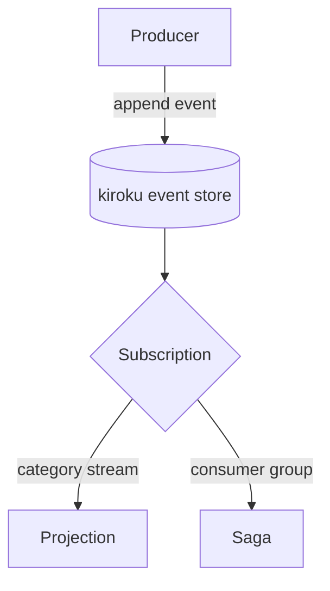
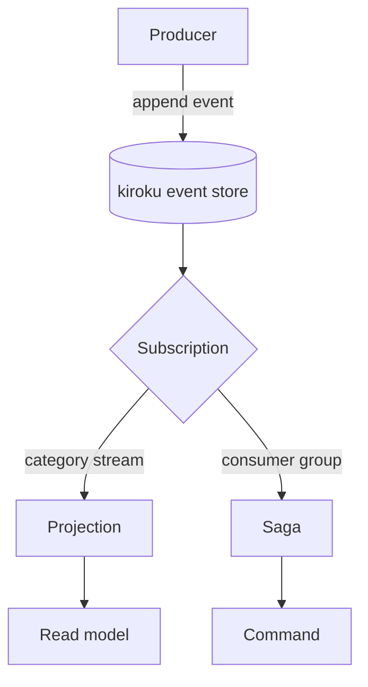
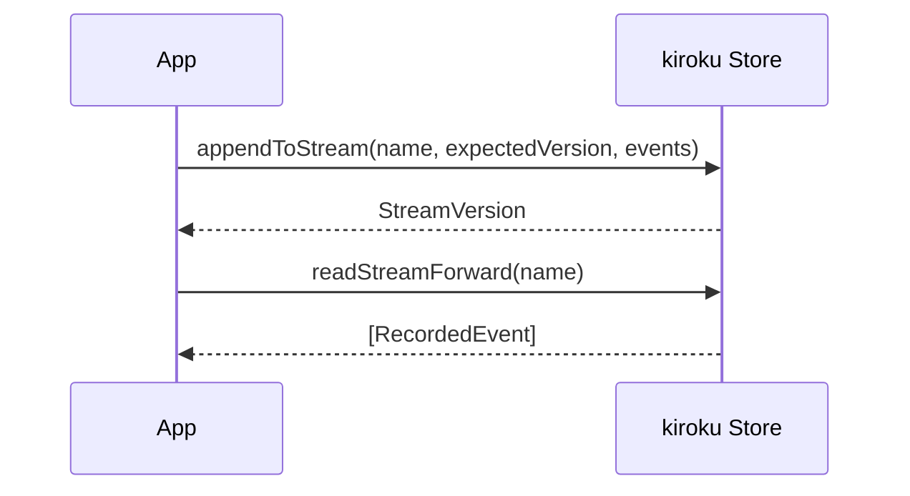

# Beautiful Mermaid diagrams with zoom and pan

This ExecPlan is a living document. The sections Progress, Surprises & Discoveries,
Decision Log, and Outcomes & Retrospective must be kept up to date as work proceeds.


## Purpose / Big Picture

This repository, `/Users/shinzui/Keikaku/bokuno/keiro-runtime-docs`, is a documentation
website built with **fumadocs** (a documentation framework that runs on **Next.js** — a
React-based web framework — and renders **MDX**, which is Markdown with embedded React
components). The documentation describes a family of four Haskell libraries, and those
docs lean heavily on architecture diagrams (event flows, stream/category relationships,
projection pipelines). Today, if an author writes a Mermaid diagram in a Markdown fence,
nothing renders it: the block shows up as raw text.

After this change, an author can write a fenced code block tagged `mermaid` in any `.mdx`
file and it will render as a polished, on-brand SVG diagram that the reader can
**zoom into, pan around, reset to fit, and open in a full-screen overlay**. "Mermaid" is a
text-based diagram language (you write `flowchart TD; A --> B` and it draws boxes and
arrows). "SVG" is Scalable Vector Graphics — a diagram format that stays crisp at any zoom.
"viewBox" is an attribute on an `<svg>` element of the form `viewBox="x y width height"`
that defines which rectangle of the drawing is visible; shrinking the width/height zooms in,
moving x/y pans. We implement zoom and pan purely by rewriting that one attribute, so there
is no extra dependency for the interaction layer.

The visual style is provided by **beautiful-mermaid**, an npm package the team already uses
in its other docs sites (keiki-docs and mina-ui). It exports a function `renderMermaidSVG`
that takes Mermaid source text plus a small theme object and returns a complete SVG string
with a warm, hand-tuned palette — much nicer than stock Mermaid.

Concretely, you can see it working when, after `pnpm dev`, you open a page containing this
exact block and the diagram appears with a control bar (`+`, `-`, `Fit`, `Expand`), responds
to the mouse wheel by zooming toward the cursor, drags to pan, and re-colors itself when you
toggle the site between light and dark mode:



The user-visible behaviors enabled by this plan are: (1) `mermaid` fences render as styled
diagrams instead of code text; (2) each diagram is interactive (wheel/keyboard/button zoom,
drag pan, fit, full-screen expand); (3) diagrams follow the active light/dark theme and
re-render when it changes; (4) a diagram with broken Mermaid syntax degrades to a readable
error block instead of crashing the page.


## Progress

Use a checklist to summarize granular steps. Every stopping point must be documented here,
even if it requires splitting a partially completed task into two ("done" vs. "remaining").
This section must always reflect the actual current state of the work.

- [ ] Milestone 0 — Verify prerequisites: Plan A scaffold present (`mdx-components.tsx`,
      `source.config.ts`, `app/global.css`, `package.json` with pnpm scripts) and `pnpm dev`
      serves a styled empty docs site.
- [ ] Milestone 1 — Add the `beautiful-mermaid` dependency and prove `renderMermaidSVG`
      produces an SVG (throwaway script), confirming the API shape before wiring it in.
- [ ] Milestone 2 — Create the rehype plugin `lib/rehype-mermaid.ts` that turns
      ` ```mermaid ` fences into `<Mermaid chart="..." />` MDX nodes; wire it into
      `source.config.ts`.
- [ ] Milestone 3 — Create the client component `components/mermaid.tsx` (`'use client'`):
      render the beautiful-mermaid SVG, apply light/dark theme, implement viewBox
      zoom/pan/fit + on-screen controls + full-screen expand + keyboard shortcuts.
- [ ] Milestone 4 — Register `Mermaid` in `mdx-components.tsx` (merge, do not replace),
      and add the diagram CSS to `app/global.css`.
- [ ] Milestone 5 — Add a sample diagram page and verify end-to-end in light and dark.


## Surprises & Discoveries

Document unexpected behaviors, bugs, optimizations, or insights discovered during
implementation. Provide concise evidence.

(None yet.)


## Decision Log

Record every decision made while working on the plan.

- Decision: Render the diagram in the browser (a client component) rather than on the
  server.
  Rationale: `beautiful-mermaid` (and the underlying `mermaid`) measure text to lay out
  nodes, which is most reliable in a real DOM. Client rendering also lets the same component
  re-render when the user flips light/dark without a server round-trip. We accept that the
  diagram appears a beat after the page (it shows a "Rendering diagram…" placeholder first).
  Date: 2026-05-30

- Decision: Implement zoom/pan by mutating the SVG `viewBox` attribute, with no pan/zoom
  library.
  Rationale: The team's existing implementations (keiki-docs vanilla JS, mina-ui React
  `MermaidViewer`) both do exactly this; it is dependency-free, accessible, and ports cleanly.
  Date: 2026-05-30

- Decision: Convert the ` ```mermaid ` fence into a `<Mermaid>` component via a tiny custom
  rehype plugin in `source.config.ts`, rather than overriding the `pre`/`code` MDX components.
  Rationale: A code fence normally reaches MDX as `<pre><code class="language-mermaid">`,
  which fumadocs' own code-block renderer (and Plan B's Shiki config) will try to syntax-
  highlight. Intercepting at the rehype (HTML-AST) stage cleanly removes the fence from the
  Shiki path and replaces it with a first-class component, avoiding any ordering conflict with
  Plan B.
  Date: 2026-05-30


## Outcomes & Retrospective

Summarize outcomes, gaps, and lessons learned at major milestones or at completion.
Compare the result against the original purpose.

(To be filled during and after implementation.)


## Context and Orientation

You are working in `/Users/shinzui/Keikaku/bokuno/keiro-runtime-docs`, a Next.js + fumadocs
documentation site. Everything in this plan assumes you run commands from that directory.
The Next.js "App Router" lives at the repository root (`app/`), shared helpers live in
`lib/`, and Markdown/MDX content lives under `content/docs/`. This layout is the standard
fumadocs layout.

Definitions you will need throughout:

- **fumadocs**: a documentation framework for Next.js that compiles `.mdx` files into pages.
  Its build-time configuration lives in `source.config.ts`; its runtime component registry
  lives in `mdx-components.tsx`.
- **MDX**: Markdown that may contain JSX/React components. A fenced code block written as
  ` ```mermaid ` is, by default, just a code block.
- **rehype plugin**: a function that transforms the HTML syntax tree (called a "HAST") of a
  document during compilation. fumadocs lets you add rehype plugins under
  `mdxOptions.rehypePlugins` in `source.config.ts`. We use one to swap `mermaid` code fences
  for our component. The tree nodes we touch are `unist`/`hast` nodes: an element node looks
  like `{ type: 'element', tagName: 'pre', properties: {...}, children: [...] }`.
- **client component**: a React component that runs in the browser. In Next.js you mark a
  file with the string `'use client'` on its first line. Only client components may use
  browser APIs and React hooks like `useEffect`/`useRef`. Our diagram is a client component
  because it measures the DOM and listens to mouse/keyboard events.
- **viewBox**: the `<svg viewBox="minX minY width height">` attribute. Reducing width/height
  zooms in; changing minX/minY pans. We never scale the SVG with CSS transforms — we only
  rewrite this attribute.
- **beautiful-mermaid**: an npm package exporting `renderMermaidSVG(source, theme)` which
  returns an SVG string for Mermaid diagram source `source`, styled by `theme`. The team
  uses version `^1.1.3` in both keiki-docs and mina-ui.

This plan has a HARD DEPENDENCY on Plan A, the scaffold plan, at
`docs/plans/1-scaffold-the-fumadocs-documentation-app.md`. Plan A creates the files this plan
extends. If that plan is not yet implemented in the working tree, stop and implement it
first; without it the files referenced below do not exist. The three files this plan shares
with sibling plans are:

- `mdx-components.tsx` — the MDX component registry. **Owner: Plan A. Extended by: this plan
  (Plan C, adds `Mermaid`) and Plan D
  (`docs/plans/4-documentation-information-architecture-and-authoring-system.md`, adds UI
  components). Merge, never replace.** The contract is described in detail in
  "Integration contract for `mdx-components.tsx`" below.
- `source.config.ts` — the fumadocs build config. **Owner: Plan A. Extended by: Plan B
  (`docs/plans/2-...`, adds Shiki/Haskell highlighting) and this plan (adds the mermaid
  rehype plugin).** Both additions live under the same `mdxOptions` object and must be
  merged, not overwritten.
- `app/global.css` — base + customization CSS. **Owner: Plan A. Extended by: Plan B
  (font/ligature CSS) and this plan (diagram CSS).** Append; do not remove sibling rules.

What Plan A leaves for you (the "seam"): Plan A's `mdx-components.tsx` exports a function
`getMDXComponents(components?: MDXComponents): MDXComponents` that spreads
`defaultMdxComponents` from `fumadocs-ui/mdx`, then any plan-specific components, then the
caller's `...components`. Plan A's `source.config.ts` exports `default defineConfig({
mdxOptions: { /* seam */ } })`. You insert into both seams below.


## Plan of Work

The work proceeds in five milestones. Each is independently verifiable. Throughout, you
edit or create exactly these files:

- create `components/mermaid.tsx` (the client component; new file owned by this plan)
- create `lib/rehype-mermaid.ts` (the fence→component rehype plugin; new file owned by this
  plan)
- edit `source.config.ts` (merge the rehype plugin into `mdxOptions`)
- edit `mdx-components.tsx` (merge `Mermaid` into the registry)
- edit `app/global.css` (append diagram CSS)
- edit `package.json` (add `beautiful-mermaid` dependency)
- create `content/docs/diagram-demo.mdx` and edit `content/docs/meta.json` (sample page for
  verification; you may delete the page afterward, but keeping it as living documentation is
  fine)


### Milestone 0 — Confirm prerequisites (Plan A is in place)

Scope: make sure the scaffold this plan extends exists, so later edits have something to
attach to. Nothing new is created. At the end you will have confirmed the seam files exist
and the dev server runs.

Run, from the repo root:

```bash
ls mdx-components.tsx source.config.ts app/global.css package.json
```

You must see all four. Then start the dev server and open the site:

```bash
pnpm install
pnpm dev
```

Acceptance: `pnpm dev` prints a local URL (typically `http://localhost:3000`) and visiting
`/docs` shows a styled, navigable (if empty) docs site. If `mdx-components.tsx` does not
exist, implement `docs/plans/1-scaffold-the-fumadocs-documentation-app.md` first and return
here.


### Milestone 1 — Add `beautiful-mermaid` and verify its API (prototyping)

Scope: add the one runtime dependency this feature needs and confirm, with a throwaway
script, that `renderMermaidSVG(source, theme)` returns an SVG string. This de-risks the rest
of the plan: if the installed version's API differs from what we expect, we learn it now.

The version to install matches the team's other sites exactly:

- `beautiful-mermaid`: `^1.1.3`

Install it from the repo root:

```bash
pnpm add beautiful-mermaid@^1.1.3
```

This adds the dependency to `package.json`. After install, `package.json`'s `dependencies`
must contain the entry (alongside Plan A's fumadocs entries):

```json
{
  "dependencies": {
    "beautiful-mermaid": "^1.1.3"
  }
}
```

Now prove the API. Create a temporary file `scripts/mermaid-probe.mjs`:

```javascript
import { renderMermaidSVG } from 'beautiful-mermaid';

const theme = {
  bg: '#ffffff',
  fg: '#1e242b',
  line: '#59616d',
  accent: '#1f6f72',
  muted: '#6b7280',
  surface: '#f4f6f8',
  border: '#b7c4ce',
  font: 'Inter',
  transparent: true,
  padding: 28,
  nodeSpacing: 28,
  layerSpacing: 46,
  thoroughness: 5,
};

const svg = await renderMermaidSVG('flowchart TD; A[Start] --> B[Done]', theme);
console.log(svg.slice(0, 120));
console.log('contains <svg:', svg.includes('<svg'));
console.log('contains viewBox:', svg.includes('viewBox'));
```

Run it:

```bash
node scripts/mermaid-probe.mjs
```

Expected output (the first line is the start of the SVG markup; the exact bytes vary):

```text
<svg xmlns="http://www.w3.org/2000/svg" ...
contains <svg: true
contains viewBox: true
```

Acceptance: the script prints an SVG string that contains both `<svg` and `viewBox`. The
presence of `viewBox` is what makes zoom/pan possible. If `renderMermaidSVG` is not a named
export, inspect `node_modules/beautiful-mermaid/package.json` (`main`/`module`/`exports`)
and its type declarations to find the correct export name, and adjust the import in this and
all later steps accordingly; record the finding in Surprises & Discoveries.

Note on async vs sync: in keiki-docs `renderMermaidSVG` is called synchronously; mina-ui
calls it after `await import('beautiful-mermaid')`. To be safe across versions, the probe and
the component below treat the result as possibly a Promise by `await`-ing it; `await` on a
plain string is harmless. Delete `scripts/mermaid-probe.mjs` once the check passes (it is not
part of the shipped site).


### Milestone 2 — Intercept the `mermaid` fence with a rehype plugin

Scope: write a small build-time transform so that a ` ```mermaid ` fence becomes a
`<Mermaid chart="...">` MDX node instead of a normal code block. At the end, the diagram
source reaches your component instead of fumadocs' code highlighter.

Background you need: when MDX compiles a fenced code block, it produces, in the HTML syntax
tree, an element shaped like:

```text
{ type: 'element', tagName: 'pre', children: [
  { type: 'element', tagName: 'code',
    properties: { className: ['language-mermaid'] },
    children: [ { type: 'text', value: 'flowchart TD; A --> B' } ] } ] }
```

Our plugin walks the tree, finds any `pre > code` whose class list includes
`language-mermaid`, reads the text content, and replaces the whole `pre` node with an element
whose `tagName` is `Mermaid` and whose `properties.chart` holds the diagram source. fumadocs/
MDX maps a capitalized element tag name (`Mermaid`) to the component of the same key in the
registry.

Create `lib/rehype-mermaid.ts`:

```typescript
import type { Root, Element, ElementContent } from 'hast';

/**
 * A rehype plugin: rewrites ```mermaid fenced code blocks into <Mermaid chart="...">
 * element nodes so they render with our interactive component instead of the default
 * (Shiki) code highlighter. Operates on the HAST (HTML abstract syntax tree).
 */
export function rehypeMermaid() {
  return (tree: Root) => {
    visit(tree);
  };

  function visit(node: Root | Element | ElementContent): void {
    if (!('children' in node) || !node.children) return;

    node.children = node.children.map((child) => {
      if (
        child.type === 'element' &&
        child.tagName === 'pre' &&
        isMermaidPre(child)
      ) {
        const code = child.children.find(
          (c): c is Element => c.type === 'element' && c.tagName === 'code',
        );
        const chart = code ? extractText(code) : '';
        const replacement: Element = {
          type: 'element',
          tagName: 'Mermaid',
          properties: { chart },
          children: [],
        };
        return replacement;
      }
      return child;
    });

    for (const child of node.children) {
      if (child.type === 'element') visit(child);
    }
  }

  function isMermaidPre(pre: Element): boolean {
    const code = pre.children.find(
      (c): c is Element => c.type === 'element' && c.tagName === 'code',
    );
    if (!code) return false;
    const className = code.properties?.className;
    const classes = Array.isArray(className)
      ? className.map(String)
      : typeof className === 'string'
        ? className.split(/\s+/)
        : [];
    return classes.includes('language-mermaid');
  }

  function extractText(node: Element): string {
    let out = '';
    for (const child of node.children) {
      if (child.type === 'text') out += child.value;
      else if (child.type === 'element') out += extractText(child);
    }
    // Trim a single trailing newline that fenced blocks usually carry.
    return out.replace(/\n$/, '');
  }
}

export default rehypeMermaid;
```

The package `hast` provides the node types and is already present transitively in any
fumadocs project (it ships with the MDX/rehype toolchain). If TypeScript cannot find the
types, add the dev dependency explicitly:

```bash
pnpm add -D @types/hast
```

Now wire the plugin into `source.config.ts`. This is the SHARED build-config file (Plan A is
the owner; Plan B also extends it for Shiki). You must MERGE — keep whatever `mdxOptions`
already contains and add `rehypePlugins`. Plan A's seam version of the file looks like this
(reproduced so you can recognize it):

```typescript
import { defineConfig, defineDocs } from 'fumadocs-mdx/config';
import { metaSchema, pageSchema } from 'fumadocs-core/source/schema';

export const docs = defineDocs({
  dir: 'content/docs',
  docs: { schema: pageSchema },
  meta: { schema: metaSchema },
});

export default defineConfig({
  mdxOptions: {
    // SEAM: Plan B adds rehypeCodeOptions here; Plan C adds rehypePlugins here.
  },
});
```

Edit it so the `mdxOptions` object includes the mermaid plugin. After your edit it must look
like this (if Plan B has already added `rehypeCodeOptions`, leave that key intact and only
add the `rehypePlugins` key — do not delete Plan B's work):

```typescript
import { defineConfig, defineDocs } from 'fumadocs-mdx/config';
import { metaSchema, pageSchema } from 'fumadocs-core/source/schema';
import { rehypeMermaid } from './lib/rehype-mermaid';

export const docs = defineDocs({
  dir: 'content/docs',
  docs: { schema: pageSchema },
  meta: { schema: metaSchema },
});

export default defineConfig({
  mdxOptions: {
    // Plan B (if present) keeps its rehypeCodeOptions key here, untouched:
    // rehypeCodeOptions: { themes: { light: 'github-light', dark: 'github-dark' }, langs: [...] },

    // Plan C: turn ```mermaid fences into <Mermaid> before any code highlighting runs.
    rehypePlugins: [rehypeMermaid],
  },
});
```

Ordering note: fumadocs runs its built-in code-highlighting rehype step (the one Plan B
configures via `rehypeCodeOptions`) as part of its default pipeline. Plugins listed in
`rehypePlugins` run in addition to that. Because our plugin replaces the `pre`/`code` node
entirely with a `Mermaid` element, the highlighter no longer sees a `language-mermaid` block
to process, so the two coexist regardless of relative order. If you observe the highlighter
still touching mermaid blocks, switch to the alternative form
`rehypePlugins: (v) => [rehypeMermaid, ...v]` to guarantee our plugin runs first; fumadocs
accepts either an array or a function that receives and returns the default plugin array.

Acceptance for this milestone is checked together with Milestone 3 (you need the component
to see anything render). After this edit, `pnpm dev` must still compile without errors (the
`Mermaid` element will warn as an unknown component until Milestone 4 registers it — that is
expected and harmless at this point). Run:

```bash
pnpm dev
```

and confirm the server starts without a build error referencing `rehype-mermaid`.


### Milestone 3 — The interactive `Mermaid` client component

Scope: build the component that takes the diagram source (the `chart` prop), renders it to an
SVG with `beautiful-mermaid` using a theme that matches the current light/dark mode, and
makes it interactive via the `viewBox`. At the end, a `<Mermaid chart="...">` node renders a
themed, zoomable, pannable, expandable diagram.

This is a direct port of mina-ui's `MermaidViewer` (the team's React reference) combined with
keiki-docs' full interaction model (toolbar `+ - Fit Expand`, wheel-zoom toward cursor,
pointer-drag pan, double-click fit, `+`/`-`/`0`/`Escape` keys, full-screen overlay). The zoom
math is the pure-helper version from mina-ui (`clampViewBox`, `zoomViewBoxAt`) so it is easy
to reason about and could be unit-tested later.

Two theme palettes are defined: a light one (mina-ui's values) and a dark one (net-new, since
the references only shipped a light diagram theme — see the Decision Log and the
Surprises section if you tune it). The component reads the active theme from fumadocs' theme
provider via the `next-themes` hook `useTheme` (fumadocs re-exports `next-themes`; importing
from `next-themes` directly is the documented approach and avoids coupling to fumadocs
internals). When the theme changes, the component re-renders the SVG with the matching
palette.

Create `components/mermaid.tsx`:

```tsx
'use client';

import { useEffect, useRef, useState, useCallback } from 'react';
import { useTheme } from 'next-themes';

/** A rectangle describing the visible region of an <svg>, i.e. its viewBox. */
type ViewBoxRect = { x: number; y: number; w: number; h: number };

/** beautiful-mermaid theme object. Keys match the team's keiki-docs / mina-ui usage. */
type MermaidTheme = {
  bg: string;
  fg: string;
  line: string;
  accent: string;
  muted: string;
  surface: string;
  border: string;
  font: string;
  transparent: boolean;
  padding: number;
  nodeSpacing: number;
  layerSpacing: number;
  thoroughness: number;
};

// Light palette: mina-ui's values (warm, high-contrast on white).
const LIGHT_THEME: MermaidTheme = {
  bg: '#ffffff',
  fg: '#1e242b',
  line: '#59616d',
  accent: '#1f6f72',
  muted: '#6b7280',
  surface: '#f4f6f8',
  border: '#b7c4ce',
  font: 'Inter',
  transparent: true,
  padding: 28,
  nodeSpacing: 28,
  layerSpacing: 46,
  thoroughness: 5,
};

// Dark palette: net-new (references shipped light only). Tuned for fumadocs' dark surface.
const DARK_THEME: MermaidTheme = {
  bg: '#0b0e14',
  fg: '#e6e9ef',
  line: '#8b95a5',
  accent: '#4fd1c5',
  muted: '#9aa4b2',
  surface: '#161b26',
  border: '#2b313d',
  font: 'Inter',
  transparent: true,
  padding: 28,
  nodeSpacing: 28,
  layerSpacing: 46,
  thoroughness: 5,
};

// --- pure viewBox helpers (ported from mina-ui) ---

export function centerOf(rect: ViewBoxRect): { x: number; y: number } {
  return { x: rect.x + rect.w / 2, y: rect.y + rect.h / 2 };
}

export function clampViewBox(rect: ViewBoxRect, home: ViewBoxRect): ViewBoxRect {
  const minW = home.w / 24; // most zoomed-in
  const maxW = home.w * 16; // most zoomed-out
  const width = Math.min(maxW, Math.max(minW, rect.w));
  const height = width * (home.h / home.w);
  if (width === rect.w && height === rect.h) return rect;
  const c = centerOf(rect);
  return { x: c.x - width / 2, y: c.y - height / 2, w: width, h: height };
}

export function zoomViewBoxAt(
  current: ViewBoxRect,
  home: ViewBoxRect,
  factor: number,
  point: { x: number; y: number } = centerOf(current),
): ViewBoxRect {
  const safeFactor = Number.isFinite(factor) && factor > 0 ? factor : 1;
  const nextW = current.w / safeFactor;
  const nextH = current.h / safeFactor;
  return clampViewBox(
    {
      x: point.x - ((point.x - current.x) / current.w) * nextW,
      y: point.y - ((point.y - current.y) / current.h) * nextH,
      w: nextW,
      h: nextH,
    },
    home,
  );
}

// Strip injected web-font @import rules from the SVG (beautiful-mermaid injects an
// Inter @import; we already load fonts ourselves and want no network fetch from the SVG).
function stripFontImports(svg: string): string {
  return svg.replace(/@import url\([^)]+\);?/g, '');
}

export function Mermaid({ chart }: { chart: string }) {
  const { resolvedTheme } = useTheme();
  const isDark = resolvedTheme === 'dark';

  const containerRef = useRef<HTMLDivElement>(null);
  const figureRef = useRef<HTMLElement>(null);
  const svgRef = useRef<SVGSVGElement | null>(null);
  const homeRef = useRef<ViewBoxRect | null>(null);
  const stateRef = useRef<ViewBoxRect | null>(null);
  const dragRef = useRef<{
    id: number;
    x: number;
    y: number;
    ox: number;
    oy: number;
  } | null>(null);

  const [svg, setSvg] = useState<string | null>(null);
  const [error, setError] = useState<string | null>(null);
  const [expanded, setExpanded] = useState(false);

  // Render the diagram whenever the source or the theme changes.
  useEffect(() => {
    let cancelled = false;
    setError(null);
    setSvg(null);
    (async () => {
      try {
        const mod = await import('beautiful-mermaid');
        const theme = isDark ? DARK_THEME : LIGHT_THEME;
        const rendered = await mod.renderMermaidSVG(chart, theme);
        if (!cancelled) setSvg(stripFontImports(rendered));
      } catch (e) {
        if (!cancelled) {
          setError(e instanceof Error ? e.message : String(e));
        }
      }
    })();
    return () => {
      cancelled = true;
    };
  }, [chart, isDark]);

  // After the SVG HTML is in the DOM, capture its viewBox and wire interactions.
  useEffect(() => {
    const frame = figureRef.current;
    if (!frame || !svg) return;
    const svgEl = frame.querySelector('svg');
    if (!svgEl || !svgEl.viewBox || !svgEl.viewBox.baseVal) return;

    svgRef.current = svgEl;
    const vb = svgEl.viewBox.baseVal;
    const home: ViewBoxRect = { x: vb.x, y: vb.y, w: vb.width, h: vb.height };
    homeRef.current = home;
    stateRef.current = { ...home };
    // Make the SVG fill its frame; interaction happens via viewBox, not CSS scale.
    svgEl.setAttribute('preserveAspectRatio', 'xMidYMid meet');
    svgEl.style.width = '100%';
    svgEl.style.height = '100%';
  }, [svg, expanded]);

  const apply = useCallback(() => {
    const svgEl = svgRef.current;
    const s = stateRef.current;
    if (!svgEl || !s) return;
    svgEl.setAttribute('viewBox', [s.x, s.y, s.w, s.h].join(' '));
  }, []);

  const pointFromEvent = useCallback(
    (clientX: number, clientY: number): { x: number; y: number } => {
      const svgEl = svgRef.current;
      const s = stateRef.current;
      if (!svgEl || !s) return { x: 0, y: 0 };
      const rect = svgEl.getBoundingClientRect();
      return {
        x: s.x + ((clientX - rect.left) / rect.width) * s.w,
        y: s.y + ((clientY - rect.top) / rect.height) * s.h,
      };
    },
    [],
  );

  const zoomAt = useCallback(
    (factor: number, point?: { x: number; y: number }) => {
      const home = homeRef.current;
      const s = stateRef.current;
      if (!home || !s) return;
      stateRef.current = zoomViewBoxAt(s, home, factor, point);
      apply();
    },
    [apply],
  );

  const fit = useCallback(() => {
    const home = homeRef.current;
    if (!home) return;
    stateRef.current = { ...home };
    apply();
  }, [apply]);

  // Wheel zoom (toward cursor), drag pan, double-click fit, keyboard shortcuts.
  useEffect(() => {
    const frame = figureRef.current;
    if (!frame || !svg) return;

    const onWheel = (e: WheelEvent) => {
      e.preventDefault();
      zoomAt(Math.exp(-e.deltaY * 0.0012), pointFromEvent(e.clientX, e.clientY));
    };
    const onPointerDown = (e: PointerEvent) => {
      if ((e.target as HTMLElement).closest('.diagram-toolbar')) return;
      const s = stateRef.current;
      if (!s) return;
      frame.setPointerCapture(e.pointerId);
      dragRef.current = { id: e.pointerId, x: e.clientX, y: e.clientY, ox: s.x, oy: s.y };
    };
    const onPointerMove = (e: PointerEvent) => {
      const drag = dragRef.current;
      const svgEl = svgRef.current;
      const s = stateRef.current;
      if (!drag || drag.id !== e.pointerId || !svgEl || !s) return;
      const rect = svgEl.getBoundingClientRect();
      stateRef.current = {
        ...s,
        x: drag.ox - ((e.clientX - drag.x) / rect.width) * s.w,
        y: drag.oy - ((e.clientY - drag.y) / rect.height) * s.h,
      };
      apply();
    };
    const endDrag = () => {
      dragRef.current = null;
    };
    const onDblClick = () => fit();
    const onKeyDown = (e: KeyboardEvent) => {
      if (e.key === '+' || e.key === '=') zoomAt(1.25);
      else if (e.key === '-' || e.key === '_') zoomAt(1 / 1.25);
      else if (e.key === '0') fit();
      else if (e.key === 'Escape') setExpanded(false);
    };

    frame.addEventListener('wheel', onWheel, { passive: false });
    frame.addEventListener('pointerdown', onPointerDown);
    frame.addEventListener('pointermove', onPointerMove);
    frame.addEventListener('pointerup', endDrag);
    frame.addEventListener('pointercancel', endDrag);
    frame.addEventListener('dblclick', onDblClick);
    frame.addEventListener('keydown', onKeyDown);

    return () => {
      frame.removeEventListener('wheel', onWheel);
      frame.removeEventListener('pointerdown', onPointerDown);
      frame.removeEventListener('pointermove', onPointerMove);
      frame.removeEventListener('pointerup', endDrag);
      frame.removeEventListener('pointercancel', endDrag);
      frame.removeEventListener('dblclick', onDblClick);
      frame.removeEventListener('keydown', onKeyDown);
    };
  }, [svg, zoomAt, fit, apply, pointFromEvent]);

  // Lock body scroll while the full-screen overlay is open.
  useEffect(() => {
    if (!expanded) return;
    const prev = document.body.style.overflow;
    document.body.style.overflow = 'hidden';
    return () => {
      document.body.style.overflow = prev;
    };
  }, [expanded]);

  if (error) {
    return (
      <pre className="diagram-error">
        <code>{`Mermaid render error: ${error}\n\n${chart}`}</code>
      </pre>
    );
  }

  return (
    <div ref={containerRef}>
      {expanded && (
        <div className="diagram-backdrop" onClick={() => setExpanded(false)} />
      )}
      <figure
        ref={figureRef}
        className={`diagram zoomable${expanded ? ' expanded' : ''}`}
        tabIndex={0}
        role="region"
        aria-label="Zoomable diagram. Wheel or pinch to zoom, drag to pan."
      >
        <div className="diagram-toolbar" aria-label="Diagram controls">
          <button type="button" title="Zoom in" onClick={() => zoomAt(1.35)}>
            +
          </button>
          <button type="button" title="Zoom out" onClick={() => zoomAt(1 / 1.35)}>
            −
          </button>
          <button type="button" title="Fit diagram" onClick={fit}>
            Fit
          </button>
          <button
            type="button"
            data-expand
            title={expanded ? 'Close expanded diagram' : 'Expand diagram'}
            onClick={() => setExpanded((v) => !v)}
          >
            {expanded ? 'Close' : 'Expand'}
          </button>
        </div>
        <div className="diagram-hint">Wheel zoom · drag pan · double-click fit</div>
        {svg ? (
          <div
            className="diagram-frame"
            ref={(node) => {
              if (node) node.innerHTML = svg;
            }}
          />
        ) : (
          <div className="diagram-loading">Rendering diagram…</div>
        )}
      </figure>
    </div>
  );
}

export default Mermaid;
```

Important implementation notes for the reader:

- The component imports `useTheme` from `next-themes`. fumadocs' `RootProvider` (set up by
  Plan A in `app/layout.tsx`) wraps the app in `next-themes`' provider, so this hook returns
  the live theme. `resolvedTheme` is the concrete `'light'`/`'dark'` value even when the user
  selected "system".
- `await import('beautiful-mermaid')` (a dynamic import) keeps the diagram renderer out of the
  initial page bundle; it loads only when a diagram is on the page.
- We re-run `renderMermaidSVG` on theme change (the effect depends on `isDark`), so flipping
  light/dark re-colors the diagram. This is the "sync dark/light theme + re-render on theme
  change" requirement.
- Re-injecting `svg` resets the `viewBox` to home, which is the desired behavior when the
  theme (and thus the freshly rendered SVG) changes.
- The error branch renders a readable `<pre class="diagram-error">` instead of throwing, so a
  malformed diagram never blanks the page.

Acceptance is verified at Milestone 5 (you still need to register the component and add CSS).
For now, ensure the file type-checks:

```bash
pnpm exec tsc --noEmit
```

It should report no errors in `components/mermaid.tsx` (errors about `Mermaid` being an
unknown JSX tag elsewhere are resolved in Milestone 4).


### Milestone 4 — Register the component and add the diagram CSS

Scope: make the `<Mermaid>` element produced by the rehype plugin resolve to your component,
and give the figure/toolbar/overlay their styles. At the end, a mermaid fence renders a
styled, interactive diagram.

First, the SHARED registry. This is the integration contract for `mdx-components.tsx`.

#### Integration contract for `mdx-components.tsx`

`mdx-components.tsx` exports one function:

```typescript
export function getMDXComponents(components?: MDXComponents): MDXComponents;
```

Every plan that adds components edits the body of this single function. The contract all
plans follow:

1. Always start from `...defaultMdxComponents` (from `fumadocs-ui/mdx`).
2. Add your plan's components by name. This plan adds exactly one key: `Mermaid`.
3. Keep the trailing `...components` spread last so per-page overrides still win.
4. Merge — never delete another plan's keys. Plan D will add its own UI components (Callout,
   Steps, Tabs, Cards, TypeTable, etc.) to the same object; your edit and theirs both survive
   because each only adds keys.

Plan A's seam version of the file (no extra components yet) is:

```tsx
import defaultMdxComponents from 'fumadocs-ui/mdx';
import type { MDXComponents } from 'mdx/types';

export function getMDXComponents(components?: MDXComponents): MDXComponents {
  return {
    ...defaultMdxComponents,
    // SEAM: Plan C adds Mermaid; Plan D adds UI components.
    ...components,
  };
}
```

Edit it to import and register `Mermaid`. After your edit (and assuming Plan D has not yet
added its components — if it has, leave those lines in place and only add the `Mermaid`
import and key):

```tsx
import defaultMdxComponents from 'fumadocs-ui/mdx';
import type { MDXComponents } from 'mdx/types';
import { Mermaid } from '@/components/mermaid';

export function getMDXComponents(components?: MDXComponents): MDXComponents {
  return {
    ...defaultMdxComponents,
    Mermaid,
    // Plan D's UI components (Callout, Steps, Tabs, Cards, TypeTable, …) also go here.
    ...components,
  };
}
```

The `@/` prefix is the path alias Plan A configures in `tsconfig.json` (`"@/*": ["./*"]`), so
`@/components/mermaid` resolves to `components/mermaid.tsx` at the repo root.

Second, append the diagram CSS to the SHARED `app/global.css`. Owner is Plan A; Plan B also
appends here (font/ligature CSS). Add your block at the end; do not remove other rules. This
CSS is adapted from keiki-docs' `.diagram*` styles, converted to use fumadocs' theme custom
properties (`--fd-*`) so colors track light/dark automatically:

```css
/* ---- Plan C: beautiful Mermaid diagrams (zoom/pan/expand) ---- */

.diagram {
  margin: 1rem 0;
  position: relative;
  height: min(76vh, 760px);
  min-height: 420px;
  overflow: hidden;
  padding: 0;
  border: 1px solid var(--fd-border, #e5e7eb);
  border-radius: 8px;
  background: var(--fd-card, transparent);
  touch-action: none;
  cursor: grab;
}

.diagram:active {
  cursor: grabbing;
}

.diagram .diagram-frame,
.diagram .diagram-frame svg {
  width: 100%;
  height: 100%;
  display: block;
}

.diagram.expanded {
  position: fixed;
  inset: 18px;
  z-index: 50;
  height: auto;
  min-height: 0;
  border-radius: 10px;
  background: var(--fd-background, #fff);
  box-shadow: 0 28px 90px rgba(0, 0, 0, 0.35);
}

.diagram-backdrop {
  position: fixed;
  inset: 0;
  z-index: 49;
  background: rgba(23, 22, 20, 0.52);
  backdrop-filter: blur(3px);
}

.diagram-toolbar {
  position: absolute;
  right: 12px;
  top: 12px;
  z-index: 2;
  display: flex;
  gap: 6px;
  padding: 6px;
  border: 1px solid var(--fd-border, #e5e7eb);
  border-radius: 8px;
  background: var(--fd-card, rgba(255, 255, 255, 0.9));
  backdrop-filter: blur(10px);
  box-shadow: 0 8px 24px rgba(43, 37, 28, 0.12);
}

.diagram-toolbar button {
  display: inline-grid;
  place-items: center;
  min-width: 34px;
  height: 32px;
  padding: 0 10px;
  border: 1px solid var(--fd-border, #e5e7eb);
  border-radius: 7px;
  background: var(--fd-secondary, transparent);
  color: var(--fd-foreground, inherit);
  font:
    700 14px Inter,
    system-ui,
    sans-serif;
  cursor: pointer;
}

.diagram-toolbar button:hover {
  background: var(--fd-accent, rgba(0, 0, 0, 0.06));
}

.diagram-hint {
  position: absolute;
  left: 12px;
  bottom: 10px;
  z-index: 2;
  padding: 4px 8px;
  border-radius: 7px;
  background: var(--fd-card, rgba(255, 255, 255, 0.88));
  color: var(--fd-muted-foreground, #6b7280);
  font-size: 0.78rem;
}

.diagram-loading {
  display: grid;
  place-items: center;
  width: 100%;
  height: 100%;
  color: var(--fd-muted-foreground, #6b7280);
  font-size: 0.9rem;
}

.diagram-error {
  white-space: pre-wrap;
  background: var(--fd-secondary, #f4f4f5);
  color: var(--fd-foreground, inherit);
  padding: 18px;
  border-radius: 8px;
}

body:has(.diagram.expanded) {
  overflow: hidden;
}
```

Acceptance: after this milestone, restart `pnpm dev`, open a page that contains a mermaid
fence (next milestone adds one), and the diagram appears with the control bar.


### Milestone 5 — Sample page and end-to-end verification

Scope: add a page with a real diagram, then verify every behavior in both themes. At the end
you have demonstrable, on-screen proof the feature works.

Create `content/docs/diagram-demo.mdx` (shown here inside a four-backtick fence so the
inner three-backtick `mermaid` fences display literally — in the actual `.mdx` file you write
ordinary three-backtick fences):

````mdx
---
title: Diagram demo
description: Verifies beautiful Mermaid diagrams with zoom and pan.
---

A flowchart of the kiroku write/read path:



A sequence diagram, to confirm non-flowchart diagrams render too:


````

Register the page in the content tree by adding it to `content/docs/meta.json`. Plan A seeds
this file; merge your entry into the existing `pages` array (do not drop existing entries):

```json
{
  "pages": ["index", "diagram-demo"]
}
```

Now run the full verification.

```bash
pnpm dev
```

Open `http://localhost:3000/docs/diagram-demo` and verify, in this order:

1. **Renders as a diagram, not code.** Both blocks show boxes/arrows (flowchart) and
   lifelines/messages (sequence), not raw `flowchart TD …` text. (Proves Milestones 2–4: the
   fence was intercepted, the component rendered the beautiful-mermaid SVG, and it is
   registered.)
2. **Interactive zoom.** Hover a diagram and scroll the mouse wheel up: it zooms toward the
   cursor. Click `+` and `−`: it zooms about the center. Press `0` (with the figure focused —
   click it first): it resets. (Proves the viewBox zoom.)
3. **Pan.** Drag inside a zoomed-in diagram: the visible region moves. (Proves pointer-drag
   pan.)
4. **Fit.** Double-click, or click `Fit`: the diagram returns to its full extent.
5. **Expand.** Click `Expand`: the diagram fills the screen over a dimmed backdrop, the page
   behind stops scrolling, and the button reads `Close`. Press `Escape` or click the backdrop
   or `Close`: it returns inline.
6. **Theme sync.** Toggle the site to dark mode (the theme switch in the fumadocs UI). Both
   diagrams re-render with the dark palette (dark surface, light text/lines). Toggle back to
   light: they re-render light. (Proves the dark/light sync + re-render requirement.)
7. **Error resilience (optional but recommended).** Temporarily change one diagram's first
   line to `flowchart ZZ` (invalid) and reload: that block shows a `diagram-error` box with
   the message and the source, and the rest of the page is unaffected. Revert the change.

Concrete acceptance, restated as a single check a human can confirm: on
`/docs/diagram-demo`, the first ` ```mermaid ` block displays an interactive flowchart that
zooms with the wheel, pans by dragging, fits on double-click, expands to full screen, and
recolors itself when you switch between light and dark mode — in both themes.

Also run the type/build gates to confirm nothing regressed:

```bash
pnpm exec tsc --noEmit
pnpm build
```

`tsc --noEmit` must report no errors. `pnpm build` (Next.js production build) must complete
and statically generate `/docs/diagram-demo`.


## Concrete Steps

All commands run from `/Users/shinzui/Keikaku/bokuno/keiro-runtime-docs`.

```bash
# 0. Prerequisites
ls mdx-components.tsx source.config.ts app/global.css package.json
pnpm install

# 1. Dependency + API probe
pnpm add beautiful-mermaid@^1.1.3
# create scripts/mermaid-probe.mjs (see Milestone 1), then:
node scripts/mermaid-probe.mjs            # expect: prints <svg ...; "contains viewBox: true"
rm scripts/mermaid-probe.mjs

# (only if tsc cannot find hast types)
pnpm add -D @types/hast

# 2. Create lib/rehype-mermaid.ts and edit source.config.ts (merge rehypePlugins)
# 3. Create components/mermaid.tsx
# 4. Edit mdx-components.tsx (add Mermaid) and append diagram CSS to app/global.css
# 5. Create content/docs/diagram-demo.mdx and update content/docs/meta.json

# Verify
pnpm exec tsc --noEmit                    # expect: no errors
pnpm dev                                  # open http://localhost:3000/docs/diagram-demo
pnpm build                                # expect: build completes, page generated
```

Expected `pnpm add` transcript (abridged):

```text
+ beautiful-mermaid 1.1.3
Done in ...s
```

Expected probe transcript:

```text
<svg xmlns="http://www.w3.org/2000/svg" ...
contains <svg: true
contains viewBox: true
```


## Validation and Acceptance

The feature is accepted when all of the following hold on
`http://localhost:3000/docs/diagram-demo`:

- A ` ```mermaid ` fence renders as a styled SVG diagram (flowchart and sequence both work),
  not as code text.
- The diagram is interactive: mouse-wheel zoom toward the cursor; `+`/`−`/`Fit` buttons;
  `+`/`-`/`0` keys when focused; drag-to-pan; double-click to fit.
- `Expand` opens a full-screen overlay with a dimmed backdrop; `Escape`/backdrop/`Close`
  dismiss it; the page behind does not scroll while open.
- Switching the site between light and dark mode re-renders both diagrams with the matching
  palette (the "concrete check": the same diagram is visibly light-on-white in light mode and
  light-on-dark in dark mode).
- A malformed diagram renders a `diagram-error` box rather than blanking the page.
- `pnpm exec tsc --noEmit` reports no type errors.
- `pnpm build` completes and statically generates the demo page.

These are user-observable behaviors, not internal attributes; each maps to a specific click
or keystroke described in Milestone 5.


## Idempotence and Recovery

Every step is safe to re-run. `pnpm add beautiful-mermaid@^1.1.3` is idempotent (re-running
leaves the same version). The edits to the three shared files (`source.config.ts`,
`mdx-components.tsx`, `app/global.css`) are additive and guarded: before adding the
`rehypePlugins` entry, the `Mermaid` import/key, or the CSS block, check whether it is
already present and skip if so, so re-applying the plan does not duplicate lines. The new
files (`components/mermaid.tsx`, `lib/rehype-mermaid.ts`,
`content/docs/diagram-demo.mdx`) can be overwritten wholesale.

Recovery if something breaks:

- Build error mentioning `rehype-mermaid` or `Mermaid`: confirm `lib/rehype-mermaid.ts`
  exists and is imported in `source.config.ts`, and that `Mermaid` is imported in
  `mdx-components.tsx`. fumadocs caches compiled MDX under `.source/`; delete it and rebuild
  if stale: `rm -rf .source && pnpm dev`.
- Diagram shows as code text: the rehype plugin did not match; confirm the class check in
  `isMermaidPre` (the fence must produce `class="language-mermaid"`), and clear `.source/`.
- Diagram renders but does not zoom/pan: confirm the SVG has a `viewBox` (Milestone 1 probe);
  if `beautiful-mermaid` ever emits an SVG without one, the interaction effects no-op by
  design — record this in Surprises & Discoveries and add a fallback that synthesizes a
  viewBox from `width`/`height`.
- Theme does not sync: confirm `app/layout.tsx` (Plan A) wraps the app in fumadocs'
  `RootProvider` so `next-themes` context exists; without it `useTheme` returns `undefined`
  and the component falls back to the light palette (still functional, just not theme-aware).

The new dependency and files are removable with no residue: `pnpm remove beautiful-mermaid`,
delete the two new source files, revert the three shared-file additions, and delete the demo
page + its `meta.json` entry.


## Interfaces and Dependencies

Libraries used and why:

- `beautiful-mermaid@^1.1.3` — provides `renderMermaidSVG(source, theme)`, returning a styled
  SVG string. Chosen because the team's other docs sites (keiki-docs, mina-ui) use this exact
  version and look, giving visual parity. Imported dynamically inside
  `components/mermaid.tsx`.
- `next-themes` — provides the `useTheme()` hook to read the live light/dark mode. It is a
  transitive dependency of `fumadocs-ui` (whose `RootProvider` configures it), so no separate
  install is required; importing from `next-themes` directly is supported.
- `hast` types (and optionally `@types/hast`) — node types for the rehype plugin. Present via
  the MDX/rehype toolchain that fumadocs pulls in.

Files, modules, and the signatures that must exist at the end of each milestone:

- `lib/rehype-mermaid.ts` (Milestone 2) must export
  `export function rehypeMermaid(): (tree: import('hast').Root) => void` (also exported as
  default). It rewrites `pre > code.language-mermaid` nodes into
  `{ type: 'element', tagName: 'Mermaid', properties: { chart: string }, children: [] }`.
- `source.config.ts` (Milestone 2) must, in its `defineConfig({ mdxOptions })`, include
  `rehypePlugins: [rehypeMermaid]` (merged alongside any Plan B `rehypeCodeOptions`).
- `components/mermaid.tsx` (Milestone 3) must export
  `export function Mermaid(props: { chart: string }): JSX.Element` (also default) plus the
  pure helpers `centerOf`, `clampViewBox`, and `zoomViewBoxAt` with the signatures shown in
  the component source. The component must render a themed SVG and support viewBox
  zoom/pan/fit, full-screen expand, and theme-synced re-render.
- `mdx-components.tsx` (Milestone 4) must keep the signature
  `export function getMDXComponents(components?: MDXComponents): MDXComponents` and include
  `Mermaid` among the returned components, after `...defaultMdxComponents` and before
  `...components`.
- `app/global.css` (Milestone 4) must contain the `.diagram*` / `.diagram-backdrop` /
  `.diagram-toolbar` / `.diagram-error` rules.

Integration points touched by this plan (described identically to the master brief so other
plans can reconcile):

- `source.config.ts` — fumadocs-mdx collection + rehype/Shiki. Owner Plan A; extended by Plan
  B (Shiki/Haskell, `rehypeCodeOptions`) and this plan (Mermaid, `rehypePlugins`). Merge,
  never replace.
- `mdx-components.tsx` — MDX component registry. Owner Plan A; extended by this plan (adds
  `Mermaid`) and Plan D (adds UI components). Merge, never replace.
- `app/global.css` — base + customization CSS. Owner Plan A; extended by Plan B (fonts) and
  this plan (diagrams). Append; never remove sibling rules.
