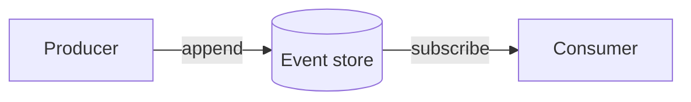
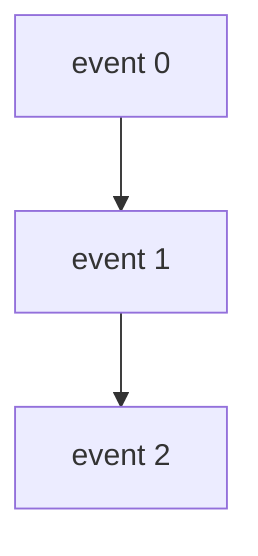

# Documentation information architecture and authoring system

This ExecPlan is a living document. The sections Progress, Surprises & Discoveries,
Decision Log, and Outcomes & Retrospective must be kept up to date as work proceeds.


## Purpose / Big Picture

This repository (`/Users/shinzui/Keikaku/bokuno/keiro-runtime-docs`) is becoming a
single documentation website built with **fumadocs** — a documentation framework
that runs on **Next.js** (a React web framework) and renders **MDX** files (Markdown
files that may also contain React components). The site documents the **keiro
runtime**, which is not one program but a *family* of four Haskell libraries:
**kiroku**, **keiro**, **keiki**, and **shibuya** (each is described in the Context
section below). The website itself is written in TypeScript/React; the *code samples
inside the docs* are Haskell.

Before this plan, the site can render but has no organized place to put documentation
and no rules for how to write it. **After this plan, the site has a complete, empty
"information architecture" (IA)** — a folder-and-navigation skeleton that arranges
every page into a predictable shape — **plus a set of copy-paste page templates and a
written style guide**, so any contributor can add a correct page without inventing
structure. "Information architecture" simply means the deliberate arrangement of
content into sections and a navigation menu so readers can find things; in fumadocs
this is expressed by the folder layout under `content/docs/` plus small `meta.json`
files that order the sidebar.

The organizing principle for the content is **Diátaxis** — a widely used documentation
framework that says every doc serves exactly one of four needs:

- **Tutorials** — learning-oriented, hold-your-hand lessons for a beginner.
- **How-To Guides** — task-oriented recipes that assume some knowledge ("how do I X?").
- **Reference** — information-oriented dry facts (APIs, types, configuration).
- **Explanation** — understanding-oriented essays about *why* and *how it works*.

We also add four extra page types the team wants: **Cookbook** (short focused
recipes), **Code Walkthrough** (an ordered tour that reads the real source code),
**FAQ** (frequently asked questions), and **Theory** (deeper conceptual/mathematical
essays, which live inside Explanation).

You can **see it working** by running the dev server and opening the docs: the left
sidebar shows the products (getting-started, kiroku, keiro, keiki, shibuya,
integrations), each product expands to show the Diátaxis sections, every section has a
landing page, and a contributor can copy a template file, drop it into the right
folder, add one line to a `meta.json`, and watch the new page appear in the sidebar
and build without errors.

Scope boundary: **only kiroku gets real written content**, and that content is written
in a separate plan (`docs/plans/5-kiroku-foundation-documentation-set.md`). This plan
*creates the empty kiroku folders and landing pages* but does not fill the tutorials,
how-tos, etc. The other three products (keiro, keiki, shibuya) get a landing page and
"coming soon" placeholders only.


## Progress

Use a checklist to summarize granular steps. Every stopping point must be documented here,
even if it requires splitting a partially completed task into two ("done" vs. "remaining").
This section must always reflect the actual current state of the work.

- [ ] Milestone 1 — Register shared MDX UI components in `mdx-components.tsx` (merge, do not replace) and confirm the site still builds.
- [ ] Milestone 2 — Create the root `content/docs/meta.json` and the top-level landing `content/docs/index.mdx`.
- [ ] Milestone 3 — Create `getting-started/` (landing + 3 pages + meta.json).
- [ ] Milestone 4 — Create the kiroku section skeleton: all Diátaxis + extra folders, each with an `index.mdx` and `meta.json`, plus `faq.mdx`.
- [ ] Milestone 5 — Create placeholder landings + skeletons for keiro, keiki, shibuya.
- [ ] Milestone 6 — Create `integrations/` (landing + 3 placeholder pages + meta.json).
- [ ] Milestone 7 — Create the templates library under `content/docs/_templates/` (one MDX per doc type) and exclude it from navigation.
- [ ] Milestone 8 — Write the authoring/style/contribution guide page under `getting-started/contributing.mdx`.
- [ ] Milestone 9 — Run the full verification (build + sidebar inspection) and record evidence.


## Surprises & Discoveries

Document unexpected behaviors, bugs, optimizations, or insights discovered during
implementation. Provide concise evidence.

(None yet.)


## Decision Log

Record every decision made while working on the plan.

- Decision: Use a **product-first** top level (`getting-started/`, `kiroku/`, `keiro/`,
  `keiki/`, `shibuya/`, `integrations/`) and repeat the Diátaxis sections *inside* each
  product, rather than a Diátaxis-first top level.
  Rationale: Readers arrive thinking about a product ("I'm using kiroku"), not about a
  documentation quadrant. The family report recommends this. It also keeps each
  product's docs self-contained and lets us ship kiroku fully while others stay empty.
  Date: 2026-05-30

- Decision: Standardize the task-oriented quadrant's display label as **"How-To
  Guides"** site-wide, even though the folder on disk is `how-to/`.
  Rationale: Some Diátaxis materials say "guides"; the family report calls for one
  consistent label to avoid confusing how-tos with tutorials. The folder stays short
  (`how-to`) for clean URLs; the sidebar label comes from the folder's `meta.json`.
  Date: 2026-05-30

- Decision: Prefer **fumadocs-ui built-in MDX components** (Callout, Steps/Step,
  Tabs/Tab, Cards/Card, Accordions/Accordion, TypeTable) over hand-written ones.
  Rationale: They are already styled, theme-aware (light/dark), accessible, and ship
  with fumadocs-ui — no extra dependency or maintenance. We only register them.
  Date: 2026-05-30

- Decision: Keep the copy-paste templates *inside* the content tree at
  `content/docs/_templates/` but exclude them from navigation.
  Rationale: Authors find them next to the content they are writing, and the build can
  still validate that the templates are themselves valid MDX. The leading underscore
  plus an explicit `pages` allow-list in each parent `meta.json` keeps them out of the
  sidebar.
  Date: 2026-05-30

- Decision: Carry the family naming conventions verbatim: product names are always
  **lowercase** (kiroku, keiro, keiki, shibuya) with the kanji + gloss on first mention
  per page; runnable worked examples are called **"jitsurei"** (実例, "worked example").
  Rationale: Matches every project README and keeps the family voice consistent.
  Date: 2026-05-30


## Outcomes & Retrospective

Summarize outcomes, gaps, and lessons learned at major milestones or at completion.
Compare the result against the original purpose.

(To be filled during and after implementation.)


## Context and Orientation

Read this section as if you know nothing about the repository. It repeats everything
you need so you can implement this plan from this file alone.

### What this repository is

`/Users/shinzui/Keikaku/bokuno/keiro-runtime-docs` is a Git repository. Work on the
`master` branch; do not create feature branches. A fumadocs documentation app is
scaffolded into it by a separate, already-checked-in plan:
`docs/plans/1-scaffold-the-fumadocs-documentation-app.md` (referred to below as **the
scaffold plan**). This current plan has a **hard dependency** on that scaffold plan: it
must be implemented first, because this plan edits files the scaffold plan creates and
adds content into the tree the scaffold plan establishes. This plan has **soft
dependencies** on two other plans: `docs/plans/2-pragmatapro-font-and-shiki-code-ligatures.md`
(PragmataPro font + Haskell-aware code highlighting) and
`docs/plans/3-beautiful-mermaid-diagrams-with-zoom-pan.md` (interactive Mermaid
diagrams). "Soft dependency" means this plan does not require them to function, but
the templates this plan produces *reference* their features (Haskell code blocks and
```mermaid fences), and those features only fully render once those plans are done.
If they are not yet done, code blocks and diagrams still render with fumadocs'
defaults — nothing breaks.

### The technology, in plain terms

- **fumadocs** — a documentation site generator. The pieces you will touch:
  - `content/docs/` — the folder where all documentation lives. Each `.mdx` file is one
    page. Subfolders become navigation groups.
  - `meta.json` — a small JSON file you place in a folder to control the sidebar: which
    pages appear, in what order, and what the group is called. Its main field is
    `pages`, an ordered array of file/folder names (without the `.mdx` extension).
  - `index.mdx` — by fumadocs convention, the landing page of a folder (the page shown
    when a reader clicks the folder/section itself).
  - **MDX** — Markdown plus the ability to use React components as if they were HTML
    tags (e.g. `<Callout>...</Callout>`). The set of components available inside MDX is
    declared in one file, `mdx-components.tsx`.
- **fumadocs-ui** — a companion package that ships ready-made, styled React components
  for docs (Callout, Steps, Tabs, Cards, Accordions, TypeTable). We import these and
  register them so MDX pages can use them.
- **frontmatter** — the block at the very top of an MDX file delimited by `---` lines.
  It carries metadata; fumadocs reads `title` and `description` from it.

### Key files this plan reads or edits (full repository-relative paths)

- `mdx-components.tsx` (repo root) — the MDX component registry. The scaffold plan
  creates it; this plan **extends** it (adds component registrations). It is *shared*:
  the scaffold plan owns it, `docs/plans/3-...` adds a `Mermaid` component to it, and
  this plan adds the fumadocs-ui UI components. **Always merge into the existing
  exported object; never overwrite it.**
- `content/docs/` (repo root) — the content tree. The scaffold plan seeds it with a
  single `index.mdx` and `meta.json`; this plan **replaces those with the full IA** and
  adds every folder, landing page, `meta.json`, and the templates library.
- `package.json` (repo root) — defines the commands you run. The scaffold plan creates
  it with at least `dev` (`next dev`), `build` (`next build`), and a type/MDX check.
  This plan does not change `package.json`.

### The four products (so you can write accurate landing copy)

- **kiroku** (記録, "record") — an append-only **PostgreSQL event store** written in
  Haskell. An "event store" is a database that keeps an immutable, ordered log of
  things that happened ("events") instead of overwriting current state; you rebuild
  state by replaying the log. kiroku is the **persistence foundation** the other
  libraries write through. It is the **first and only product to get full content
  now**. Source lives at `/Users/shinzui/Keikaku/bokuno/kiroku-project/kiroku`. It
  carries an "active development / APIs may change" maturity warning, so its landing
  page must show a stability banner.
- **keiro** (経路, "route/path") — an event-sourcing framework and workflow engine; the
  top of the stack that depends on the other three. Placeholder only for now.
- **keiki** (継起, "successive occurrence") — a pure, dependency-free mathematical core
  (a "symbolic-register transducer", i.e. a kind of state machine). Placeholder only.
  Its existing docs are an ordered code walkthrough, which is why keiki's skeleton
  emphasizes the `walkthrough/` and `explanation/` (theory) sections.
- **shibuya** — a supervised queue-processing framework (think: reliably consuming a
  message queue). Placeholder only. Its existing docs are auto-generated API reference,
  which is why shibuya's skeleton emphasizes `reference/`.

There is **no `keiro-runtime` package**; "keiro runtime" is an umbrella name for the
family. kiroku is "the foundation" in the *persistence* sense; keiki is "the
foundation" in the *pure-semantics* sense. The top-level landing page should state both
framings.

### Naming and voice conventions to carry into every page

- Product names are always **lowercase**: kiroku, keiro, keiki, shibuya. On the first
  mention of a product on any page, gloss it once: "kiroku (記録, an append-only
  PostgreSQL event store)".
- Use **"jitsurei"** (実例) for runnable worked examples / example collections.
- Voice is **problem-first**: open with the problem the reader has, then the mechanism.
  Em-dashes are the house punctuation style.
- The task-oriented Diátaxis quadrant is always labelled **"How-To Guides"** in the UI.


## Plan of Work

The work is a sequence of additive file creations plus one careful edit to a shared
file. Nothing here deletes user data or runs migrations, so every step is safe to
repeat. Below, first read the **Target tree** and **meta.json reference** (the
authoritative artifacts you are producing), then the **page templates**, then the
**shared components**, then the **milestones** that sequence the work.

### The complete target `content/docs/` tree

This is exactly what `content/docs/` must contain at the end of this plan. Folders end
with `/`. Every folder has an `index.mdx` (its landing page) and a `meta.json` (its
sidebar order) unless noted. Pages marked `[placeholder]` contain a short "coming soon"
body; pages under `kiroku/` are **empty section landings** that
`docs/plans/5-kiroku-foundation-documentation-set.md` will populate. The
`_templates/` folder holds copy-paste templates and is hidden from navigation.

```text
content/docs/
  index.mdx                      # Keiro Runtime family landing (both "foundation" framings)
  meta.json                      # root sidebar order (see meta.json reference)

  getting-started/
    index.mdx                    # what the keiro runtime is, how to read these docs
    the-keiro-family.mdx         # the four products + how they relate (dependency graph)
    choosing-a-library.mdx       # which library solves which problem
    installation.mdx             # prerequisites + how to get the libraries (placeholder-ish)
    contributing.mdx             # the AUTHORING & STYLE GUIDE (written in Milestone 8)
    meta.json

  kiroku/                        # FOUNDATION — full content later (Plan 5); structure now
    index.mdx                    # what kiroku is + maturity banner (real landing)
    tutorials/
      index.mdx                  # section landing (empty list now)
      meta.json
    how-to/
      index.mdx                  # section landing; label "How-To Guides"
      meta.json
    reference/
      index.mdx                  # section landing
      meta.json
    explanation/
      index.mdx                  # section landing (theory essays live here too)
      meta.json
    cookbook/
      index.mdx                  # section landing (short recipes)
      meta.json
    walkthrough/                 # ordered code walkthrough (numbered pages)
      index.mdx                  # section landing
      meta.json
    faq.mdx                      # frequently asked questions (single page)
    meta.json

  keiro/                         # PLACEHOLDER landing + same skeleton
    index.mdx
    tutorials/      (index.mdx + meta.json)
    how-to/         (index.mdx + meta.json)
    reference/      (index.mdx + meta.json)
    explanation/    (index.mdx + meta.json)
    cookbook/       (index.mdx + meta.json)
    walkthrough/    (index.mdx + meta.json)
    faq.mdx
    meta.json

  keiki/                         # PLACEHOLDER landing + skeleton (theory-heavy)
    index.mdx
    tutorials/      (index.mdx + meta.json)
    how-to/         (index.mdx + meta.json)
    reference/      (index.mdx + meta.json)
    explanation/    (index.mdx + meta.json)
    cookbook/       (index.mdx + meta.json)
    walkthrough/    (index.mdx + meta.json)
    faq.mdx
    meta.json

  shibuya/                       # PLACEHOLDER landing + skeleton (reference-heavy)
    index.mdx
    tutorials/      (index.mdx + meta.json)
    how-to/         (index.mdx + meta.json)
    reference/      (index.mdx + meta.json)
    explanation/    (index.mdx + meta.json)
    cookbook/       (index.mdx + meta.json)
    walkthrough/    (index.mdx + meta.json)
    faq.mdx
    meta.json

  integrations/                  # cross-package glue (placeholders now)
    index.mdx
    shibuya-kiroku-adapter.mdx   # the headline cross-package adapter
    keiro-with-kiroku.mdx        # persisting keiro through kiroku
    keiro-with-keiki.mdx         # pairing the durable runtime with the pure core
    meta.json

  _templates/                    # copy-paste page templates (HIDDEN from nav)
    tutorial.mdx
    how-to.mdx
    reference.mdx
    explanation.mdx
    faq.mdx
    code-walkthrough.mdx
    cookbook-recipe.mdx
    theory-explainer.mdx
    (no meta.json; excluded via root meta.json `pages` allow-list)
```

Why this shape: the top level is the products plus two cross-cutting sections
(`getting-started/` for onboarding, `integrations/` for family glue). Inside each
product the same seven sections repeat — the four Diátaxis quadrants
(`tutorials/`, `how-to/`, `reference/`, `explanation/`) plus `cookbook/` and
`walkthrough/`, plus a single `faq.mdx`. Theory explainers are not a separate folder;
they live inside `explanation/` because a theory essay *is* an explanation. This keeps
the sidebar shallow and predictable.

### meta.json reference (every nav file as a code block)

A `meta.json` controls one folder's slice of the sidebar. The two fields you use:

- `title` (optional) — the label shown for this group in the sidebar. If omitted,
  fumadocs derives a title from the folder name.
- `pages` (required for ordering) — an ordered array of entry names. An entry is either
  a page file name without `.mdx` (e.g. `"installation"`) or a subfolder name (e.g.
  `"tutorials"`). **Only names listed here appear in the sidebar**, and they appear in
  this order. The literal string `"..."` (three dots) means "then append any remaining
  pages not explicitly listed"; we avoid it here so the templates and `_templates/` can
  never leak into the sidebar.

Root — `content/docs/meta.json`. Note `_templates` is deliberately **absent** from
`pages`, which hides the whole templates folder from navigation:

```json
{
  "pages": [
    "index",
    "getting-started",
    "kiroku",
    "keiro",
    "keiki",
    "shibuya",
    "integrations"
  ]
}
```

`content/docs/getting-started/meta.json`:

```json
{
  "title": "Getting Started",
  "pages": [
    "index",
    "the-keiro-family",
    "choosing-a-library",
    "installation",
    "contributing"
  ]
}
```

`content/docs/kiroku/meta.json` (the same structure is used for `keiro/`, `keiki/`,
`shibuya/` — change only the `title`):

```json
{
  "title": "kiroku",
  "pages": [
    "index",
    "tutorials",
    "how-to",
    "reference",
    "explanation",
    "cookbook",
    "walkthrough",
    "faq"
  ]
}
```

`content/docs/keiro/meta.json`:

```json
{
  "title": "keiro",
  "pages": [
    "index",
    "tutorials",
    "how-to",
    "reference",
    "explanation",
    "cookbook",
    "walkthrough",
    "faq"
  ]
}
```

`content/docs/keiki/meta.json`:

```json
{
  "title": "keiki",
  "pages": [
    "index",
    "tutorials",
    "how-to",
    "reference",
    "explanation",
    "cookbook",
    "walkthrough",
    "faq"
  ]
}
```

`content/docs/shibuya/meta.json`:

```json
{
  "title": "shibuya",
  "pages": [
    "index",
    "tutorials",
    "how-to",
    "reference",
    "explanation",
    "cookbook",
    "walkthrough",
    "faq"
  ]
}
```

The per-section `meta.json` files. The crucial one is `how-to/meta.json`, whose
`title` is the agreed **"How-To Guides"** label. Each is placed inside the matching
section folder of **every** product (kiroku, keiro, keiki, shibuya). While the
sections are empty, list only `"index"`; authors add page names here as they create
pages.

`content/docs/<product>/tutorials/meta.json`:

```json
{
  "title": "Tutorials",
  "pages": ["index"]
}
```

`content/docs/<product>/how-to/meta.json`:

```json
{
  "title": "How-To Guides",
  "pages": ["index"]
}
```

`content/docs/<product>/reference/meta.json`:

```json
{
  "title": "Reference",
  "pages": ["index"]
}
```

`content/docs/<product>/explanation/meta.json`:

```json
{
  "title": "Explanation",
  "pages": ["index"]
}
```

`content/docs/<product>/cookbook/meta.json`:

```json
{
  "title": "Cookbook",
  "pages": ["index"]
}
```

`content/docs/<product>/walkthrough/meta.json`:

```json
{
  "title": "Code Walkthrough",
  "pages": ["index"]
}
```

`content/docs/integrations/meta.json`:

```json
{
  "title": "Integrations",
  "pages": [
    "index",
    "shibuya-kiroku-adapter",
    "keiro-with-kiroku",
    "keiro-with-keiki"
  ]
}
```

### Page templates (one tagged ```mdx fence per doc type)

These eight templates go into `content/docs/_templates/`. They are also the canonical
shape every author copies. Each begins with frontmatter (`title` and `description` are
read by fumadocs). The bracketed `[…]` parts are placeholders the author replaces. The
templates demonstrate the shared UI components and the conventions (problem-first
voice, "jitsurei" for examples, Haskell code blocks, ```mermaid fences). When the soft
dependencies (`docs/plans/2-...`, `docs/plans/3-...`) are done, the Haskell blocks get
PragmataPro ligatures and the ```mermaid fences become zoomable diagrams; until then
they render with fumadocs defaults.

Tutorial — `content/docs/_templates/tutorial.mdx`:

````mdx
---
title: "[Tutorial title — start with a verb, e.g. Build your first event stream]"
description: "[One sentence: what the reader will have built by the end.]"
---

import { Callout } from 'fumadocs-ui/components/callout';
import { Step, Steps } from 'fumadocs-ui/components/steps';

[Open with the outcome. In two or three sentences tell a beginner what they will
build and why it matters — the problem first, then the payoff. Use the second person
("you"). Promise a concrete, working result.]

<Callout type="info">
  This is a tutorial: a guided lesson. Follow every step in order. You do not need
  prior knowledge of [product] beyond [the one prerequisite]. By the end you will have
  [the concrete artifact].
</Callout>

## What you will build

[Describe the end state in one short paragraph. If a picture helps, include a diagram.]

## Before you begin

[List the exact prerequisites: tools installed, a running PostgreSQL, etc. Keep it
short; link to installation rather than re-explaining it.]

## Steps

<Steps>
<Step>

### [First action, phrased as an instruction]

[Tell the reader exactly what to do. Show the code they must write or run.]

```haskell
-- A minimal, copy-pasteable Haskell snippet.
-- Every snippet must reflect the real API.
main :: IO ()
main = putStrLn "replace with the real first step"
```

[Tell the reader what they should observe so they know it worked.]

</Step>
<Step>

### [Second action]

[Continue. Build strictly on the previous step. Never skip.]

</Step>
</Steps>

## What you built

[Recap the working result in two sentences, then point to the next tutorial or to a
relevant How-To Guide.]
````

How-To Guide — `content/docs/_templates/how-to.mdx`:

````mdx
---
title: "[How to <do the specific task>]"
description: "[One sentence stating the task this guide accomplishes.]"
---

import { Callout } from 'fumadocs-ui/components/callout';

[State the task and the assumption. A how-to guide is for someone who already knows the
basics and has a specific goal. One or two sentences, problem-first: "You need to X.
This guide shows the shortest reliable way."]

<Callout type="info">
  Assumes you already [have a configured store / completed the first tutorial / …].
  If not, start with [link to the relevant tutorial].
</Callout>

## Goal

[One sentence restating exactly what you will achieve.]

## Steps

1. [First imperative step.]

   ```haskell
   -- real, minimal snippet for this step
   ```

2. [Second imperative step.]

## Verify it worked

[Give the reader an observable check: an output line, a query result, a log message.]

## Related

- [Link to a sibling how-to or the reference page for the API used here.]
````

Reference — `content/docs/_templates/reference.mdx`:

````mdx
---
title: "[Name of the API / module / configuration being documented]"
description: "[One sentence naming what this page is a reference for.]"
---

import { TypeTable } from 'fumadocs-ui/components/type-table';
import { Callout } from 'fumadocs-ui/components/callout';

[One short paragraph stating, factually, what this reference covers. Reference pages are
dry and complete: no tutorials, no opinions, no "why". Just the facts the reader looks
up.]

## [Type or function name]

[The exact signature, copied from the source — never paraphrased.]

```haskell
appendToStream :: (Store :> es) => StreamName -> ExpectedVersion -> [EventData] -> Eff es AppendResult
```

[One or two sentences describing behavior, constraints, and failure modes.]

### Fields / parameters

<TypeTable
  type={{
    field: {
      description: 'What this field means.',
      type: 'TheHaskellType',
      default: 'Nothing',
    },
  }}
/>

<Callout type="warn">
  [Note any sharp edge: an exception thrown, a reserved value, an ordering requirement.]
</Callout>
````

Explanation — `content/docs/_templates/explanation.mdx`:

````mdx
---
title: "[Understanding <the concept> — phrase as a topic, not a task]"
description: "[One sentence naming the idea this page explains.]"
---

import { Callout } from 'fumadocs-ui/components/callout';

[Open with the question the reader is really asking — "why does X work this way?" or
"how should I think about Y?". Explanation pages build understanding; they do not give
step-by-step instructions and they do not list every API.]

## The idea

[Explain the concept in plain language. Define every term of art on first use.]

## How it fits together

[A diagram is often the clearest explanation. The ```mermaid fence below renders as an
interactive, zoomable diagram once the diagram support is in place.]



## Trade-offs

[Be honest about limits and alternatives. Explanation is where nuance lives.]
````

FAQ — `content/docs/_templates/faq.mdx`:

````mdx
---
title: "[Product] FAQ"
description: "Answers to frequently asked questions about [product]."
---

import { Accordion, Accordions } from 'fumadocs-ui/components/accordion';

[One sentence: "Short answers to the questions people ask most about [product]." Keep
each answer to a few sentences; link out for depth.]

<Accordions>
  <Accordion title="[A real question, in the words a user would type]">
    [A direct answer. Link to the tutorial/how-to/reference that goes deeper.]
  </Accordion>
  <Accordion title="[Another common question]">
    [A direct answer.]
  </Accordion>
</Accordions>
````

Code Walkthrough — `content/docs/_templates/code-walkthrough.mdx`:

````mdx
---
title: "[NN — Section title]"
description: "[One sentence: which part of the source this part of the tour covers.]"
---

import { Callout } from 'fumadocs-ui/components/callout';

[A code walkthrough is an ordered tour that reads the real source code to teach how the
library is built. Name pages with a two-digit numeric prefix so they sort
(`00-start-here.mdx`, `01-…`). This page is part [NN] of the tour.]

<Callout type="info">
  This is part of an ordered walkthrough. If you are new, start at
  [00 — Start here](./00-start-here).
</Callout>

## What this part covers

[Name the file(s) and the concept this part teaches.]

## The code

```haskell
-- An excerpt from the real source, with the path noted above the block.
-- src/Kiroku/Store/Append.hs
appendToStream :: (Store :> es) => StreamName -> ExpectedVersion -> [EventData] -> Eff es AppendResult
```

[Walk through the excerpt line by line in prose. Explain the *why*, not just the *what*.]

## Next

[Link to the next numbered part.]
````

Cookbook recipe — `content/docs/_templates/cookbook-recipe.mdx`:

````mdx
---
title: "[Recipe — <the outcome>, e.g. Idempotent append with a supplied event id]"
description: "[One sentence: the concrete result this recipe produces.]"
---

import { Callout } from 'fumadocs-ui/components/callout';

[A cookbook recipe is a short, self-contained, copy-paste solution to one common
problem. Shorter and more focused than a how-to. State the problem in one sentence.]

## Problem

[One sentence.]

## Solution

```haskell
-- The complete, minimal recipe. It should run as written (a jitsurei — a worked
-- example). Keep it to one screen if possible.
```

<Callout type="info">
  "jitsurei" (実例) is the family's word for a runnable worked example.
</Callout>

## How it works

[Two or three sentences explaining the key line(s). Link to reference for full detail.]
````

Theory explainer — `content/docs/_templates/theory-explainer.mdx`:

````mdx
---
title: "[Theory — <the formal idea>, e.g. Streams, categories, and the $all log]"
description: "[One sentence naming the formal concept developed here.]"
---

import { Callout } from 'fumadocs-ui/components/callout';

[A theory explainer is a deeper conceptual or mathematical essay. It lives in the
`explanation/` folder (theory IS explanation). Use it for the formal model behind a
library. Still define every symbol and term.]

<Callout type="info">
  This page goes deeper than the surrounding explanation pages. You can use the library
  fully without reading it; read it to understand the model precisely.
</Callout>

## The model

[Develop the formal idea. Introduce notation gently. A diagram often helps.]



## Why it matters in practice

[Connect the theory back to something the reader can do or rely on.]
````

### Shared MDX UI components (which to register, and how)

MDX pages can only use components that are registered in the single file
`mdx-components.tsx` at the repository root. fumadocs-ui ships a set of ready-made,
theme-aware components; we register the ones our templates use. Registering means
importing them and adding them to the object returned by `getMDXComponents`.

The components we register, what they are, and where each import comes from:

- **Callout** — a colored note box (info / warning / error). From
  `fumadocs-ui/components/callout`. Used by almost every template.
- **Steps / Step** — a vertical numbered stepper for tutorials. From
  `fumadocs-ui/components/steps`.
- **Tabs / Tab** — tabbed panels (e.g. show the same thing two ways). From
  `fumadocs-ui/components/tabs`.
- **Cards / Card** — a grid of link cards, good for landing pages. From
  `fumadocs-ui/components/card`.
- **Accordions / Accordion** — collapsible question/answer rows for FAQs. From
  `fumadocs-ui/components/accordion`.
- **TypeTable** — a table for documenting a type's fields/parameters. From
  `fumadocs-ui/components/type-table`.

These import paths are the fumadocs-ui convention (each component has its own
sub-module under `fumadocs-ui/components/`). If your installed fumadocs-ui version
exposes a different path, the build error will name the missing module; in that case
open `node_modules/fumadocs-ui/dist/components/` (or `package.json` of fumadocs-ui)
to find the exact sub-path and adjust the import. Do not invent paths.

**Critical integration rule:** `mdx-components.tsx` is shared. The scaffold plan
created it; `docs/plans/3-...` adds a `Mermaid` entry to it. You must **merge** — add
your imports and add your components into the existing returned object, preserving
`...defaultMdxComponents`, any `...components` spread, and any `Mermaid` already
present. Never replace the file wholesale. The end state should look like this (your
additions are the fumadocs-ui imports and the six component names in the returned
object; `Mermaid` may or may not already be present depending on whether
`docs/plans/3-...` has run):

```tsx
import defaultMdxComponents from 'fumadocs-ui/mdx';
import type { MDXComponents } from 'mdx/types';
import { Callout } from 'fumadocs-ui/components/callout';
import { Step, Steps } from 'fumadocs-ui/components/steps';
import { Tab, Tabs } from 'fumadocs-ui/components/tabs';
import { Card, Cards } from 'fumadocs-ui/components/card';
import { Accordion, Accordions } from 'fumadocs-ui/components/accordion';
import { TypeTable } from 'fumadocs-ui/components/type-table';

export function getMDXComponents(components?: MDXComponents): MDXComponents {
  return {
    ...defaultMdxComponents,
    Callout,
    Step,
    Steps,
    Tab,
    Tabs,
    Card,
    Cards,
    Accordion,
    Accordions,
    TypeTable,
    // Mermaid,  // present only after docs/plans/3-... has been implemented
    ...components,
  };
}
```

A usage example for each, for the style guide and for authors to copy:

```mdx
<Callout type="warn">kiroku is in active development; APIs may change.</Callout>

<Steps>
  <Step>### First do this</Step>
  <Step>### Then do that</Step>
</Steps>

<Tabs items={['hasql', 'raw SQL']}>
  <Tab value="hasql">The hasql way.</Tab>
  <Tab value="raw SQL">The raw SQL way.</Tab>
</Tabs>

<Cards>
  <Card title="Tutorials" href="/docs/kiroku/tutorials" />
  <Card title="How-To Guides" href="/docs/kiroku/how-to" />
</Cards>

<Accordions>
  <Accordion title="Does kiroku run my migrations?">No — migrate first.</Accordion>
</Accordions>

<TypeTable type={{ poolSize: { description: 'Connection pool size.', type: 'Int', default: '10' } }} />
```

Note: `Tabs` takes an `items` array and each `Tab` a matching `value`; `Cards`/`Card`
build a link grid; `Accordion` needs a `title`. These are the fumadocs-ui prop
conventions; if a prop name differs in your version the build will warn and you can
correct it against the installed component's types.

### Authoring, style, and contribution guide (content for `getting-started/contributing.mdx`)

Milestone 8 writes a real page (not a placeholder) that encodes the rules below. Put
this content into `content/docs/getting-started/contributing.mdx` using the explanation
template's frontmatter. The page must cover, in prose with short examples:

- **Voice and tense per Diátaxis type.** Tutorials: second person, present/imperative,
  encouraging ("you will build…", "now run…"). How-To Guides: imperative, terse,
  goal-first ("To do X, …"). Reference: neutral, factual, present tense, no second
  person, no narrative. Explanation: reflective, may use "we"/"you", discusses
  trade-offs and *why*. Cookbook: like how-to but shorter and self-contained.
  Walkthrough: narrative past/present, reads the source and explains intent. Theory:
  precise, defines all notation, lives in `explanation/`.
- **File naming.** Lowercase, hyphen-separated, `.mdx` (e.g. `appending-events.mdx`).
  Walkthrough pages take a two-digit numeric prefix to force order
  (`00-start-here.mdx`). A folder's landing page is always `index.mdx`.
- **Where each doc type lives.** Tutorials → `<product>/tutorials/`; how-tos →
  `<product>/how-to/`; reference → `<product>/reference/`; explanations and theory →
  `<product>/explanation/`; recipes → `<product>/cookbook/`; walkthrough →
  `<product>/walkthrough/`; FAQ → `<product>/faq.mdx`. Cross-product integration pages
  → `integrations/`.
- **How to add a navigation entry.** Open the `meta.json` in the folder where your page
  lives and add the page's file name (without `.mdx`) to the `pages` array, in the
  position you want it to appear. If you add a whole new subfolder, add the folder name
  to the *parent* folder's `meta.json` `pages` array too.
- **Code-block conventions.** Always tag the fence with a language. Haskell samples use
  ```haskell and must reflect the real API (no invented functions). Other tags in use:
  ```bash, ```sql, ```json, ```nix, ```text. (The PragmataPro font and Haskell-aware
  highlighting come from `docs/plans/2-...`; you do not configure them here — just use
  the tags.)
- **Diagram conventions.** Use a ```mermaid fence for diagrams; keep them small and
  labelled. (Interactive zoom/pan rendering comes from `docs/plans/3-...`.)
- **"How to add a new page" checklist** (put this as an explicit ordered list on the
  page): (1) pick the doc type and copy the matching template from
  `content/docs/_templates/`; (2) save it under the correct
  `<product>/<section>/` folder with a lowercase-hyphenated name; (3) fill the
  frontmatter `title` and `description`; (4) write the body following the voice for that
  type; (5) add the file name to that folder's `meta.json` `pages`; (6) run the build
  and confirm the page appears in the sidebar and compiles.
- **Naming conventions to repeat:** lowercase product names with a kanji+gloss on first
  mention; "jitsurei" for worked examples; "How-To Guides" as the task-quadrant label.

### Landing-page content guidance (so landings are not blank)

Every `index.mdx` must have real (if brief) content, never an empty body, or the page
looks broken. Guidance per landing:

- `content/docs/index.mdx` — name the family, state both "foundation" framings (kiroku =
  persistence foundation; keiki = pure-semantics foundation), and use `<Cards>` linking
  to each product and to getting-started. A small ```mermaid dependency diagram is
  appropriate (keiro → keiki, kiroku, shibuya).
- `getting-started/index.mdx` — explain what the keiro runtime is and how to read these
  docs (the Diátaxis sections). Link onward with `<Cards>`.
- `getting-started/the-keiro-family.mdx` — describe the four products and how they
  relate; include the dependency relationships.
- `kiroku/index.mdx` — a real landing: one paragraph on what kiroku is (記録,
  append-only PostgreSQL event store), a `<Callout type="warn">` maturity banner, and a
  `<Cards>` grid linking to its sections. (Plan 5 deepens everything beneath it.)
- `keiro/index.mdx`, `keiki/index.mdx`, `shibuya/index.mdx` — one paragraph describing
  the product (with kanji+gloss where applicable) and a `<Callout type="info">` saying
  documentation is in progress; a `<Cards>` grid to the (empty) sections is fine.
- Each `<product>/<section>/index.mdx` — one or two sentences saying what this section
  is for (using the Diátaxis definition), and a note that pages are coming. For kiroku
  these are the seams Plan 5 fills.
- `integrations/index.mdx` and its three pages — one paragraph each describing the
  integration; mark them `<Callout type="info">` "documentation in progress".

### Milestones

**Milestone 1 — Register the shared UI components.** Scope: the single edit to
`mdx-components.tsx`. At the end, the six fumadocs-ui component families are importable
inside any MDX page, the file still contains everything the scaffold and any
Mermaid work added, and the site builds. Commands: from the repo root,
`pnpm run build` (or `pnpm dev` and load a page). Acceptance: build succeeds; a quick
test page using `<Callout>` renders without an "unknown component" error.

**Milestone 2 — Root landing + nav.** Scope: replace the scaffold's seed
`content/docs/index.mdx` and `content/docs/meta.json` with the family landing page and
the root `meta.json` from the reference above. At the end the sidebar shows the seven
top-level entries in order. Acceptance: `pnpm dev`, open `/docs`, see the family
landing and the seven-item sidebar.

**Milestone 3 — getting-started.** Scope: create the `getting-started/` folder with its
five pages and `meta.json`. `contributing.mdx` can be a stub here (Milestone 8 fills
it). Acceptance: the Getting Started group appears with five ordered entries.

**Milestone 4 — kiroku skeleton.** Scope: create `kiroku/` with the real landing
(maturity banner) and all six section folders, each with an `index.mdx` and `meta.json`,
plus `faq.mdx` and `kiroku/meta.json`. Acceptance: kiroku expands in the sidebar to
seven sections in order; each section landing opens.

**Milestone 5 — keiro / keiki / shibuya skeletons.** Scope: replicate the kiroku
skeleton three times with placeholder landings and the per-product `meta.json` (only
the `title` differs). Acceptance: all three appear with the same seven-section shape.

**Milestone 6 — integrations.** Scope: create `integrations/` with its landing, three
placeholder pages, and `meta.json`. Acceptance: Integrations group shows four ordered
entries.

**Milestone 7 — templates library.** Scope: create `content/docs/_templates/` with the
eight templates. Because the root `meta.json` does not list `_templates`, the folder
must not appear in the sidebar. Acceptance: building succeeds (templates are valid MDX),
and `_templates` is absent from the sidebar.

**Milestone 8 — authoring/style guide.** Scope: write the real
`getting-started/contributing.mdx` from the guide content above, including the
"how to add a new page" checklist. Acceptance: the page renders with the checklist and
the per-type voice rules.

**Milestone 9 — full verification.** Scope: run the build and inspect the sidebar.
Acceptance: see the Validation section.


## Concrete Steps

All commands run from the repository root
`/Users/shinzui/Keikaku/bokuno/keiro-runtime-docs` unless stated. The package manager
is **pnpm** and Node is **22** (provided by the repo's Nix dev shell or your system).

1. Confirm the scaffold is present (this plan depends on it). Expect to see the files:

   ```bash
   ls mdx-components.tsx content/docs/index.mdx content/docs/meta.json package.json
   ```

   Expected: all four paths print with no "No such file" error. If any are missing,
   stop and implement `docs/plans/1-scaffold-the-fumadocs-documentation-app.md` first.

2. Install dependencies if you have not already, then confirm the dev server runs:

   ```bash
   pnpm install
   pnpm dev
   ```

   Expected transcript (abridged):

   ```text
   > next dev
   ▲ Next.js 16.x
   - Local: http://localhost:3000
   ✓ Ready
   ```

   Open `http://localhost:3000/docs` to see the current (scaffold) state, then stop the
   server with Ctrl-C before editing.

3. **Milestone 1.** Edit `mdx-components.tsx` to add the six fumadocs-ui imports and add
   their components into the object returned by `getMDXComponents`, preserving
   `...defaultMdxComponents`, `...components`, and any existing `Mermaid`. Use the
   end-state shown in the "Shared MDX UI components" subsection above as the target.

4. Verify Milestone 1 by building:

   ```bash
   pnpm run build
   ```

   Expected: the build completes with `✓ Compiled successfully` (or equivalent) and no
   "Cannot find module 'fumadocs-ui/components/…'" error. If you see such an error, the
   import sub-path differs in your fumadocs-ui version; find the correct path under the
   installed `fumadocs-ui` package and fix the import (do not guess).

5. **Milestone 2.** Overwrite `content/docs/meta.json` with the root meta.json from the
   reference, and overwrite `content/docs/index.mdx` with the family landing (follow the
   landing-page guidance; include a `<Cards>` grid and optionally a ```mermaid diagram).

6. **Milestone 3.** Create the folder and files:

   ```bash
   mkdir -p content/docs/getting-started
   ```

   Then create `content/docs/getting-started/meta.json` (from the reference) and the
   five pages `index.mdx`, `the-keiro-family.mdx`, `choosing-a-library.mdx`,
   `installation.mdx`, and a stub `contributing.mdx` (real content lands in Milestone 8).

7. **Milestone 4.** Create the kiroku skeleton:

   ```bash
   mkdir -p content/docs/kiroku/tutorials content/docs/kiroku/how-to \
     content/docs/kiroku/reference content/docs/kiroku/explanation \
     content/docs/kiroku/cookbook content/docs/kiroku/walkthrough
   ```

   Create `content/docs/kiroku/index.mdx` (real landing with maturity banner),
   `content/docs/kiroku/faq.mdx`, `content/docs/kiroku/meta.json`, and in each of the
   six section folders an `index.mdx` (one-sentence section description) and a
   `meta.json` (from the per-section reference; remember `how-to/meta.json` has
   `"title": "How-To Guides"`).

8. **Milestone 5.** Repeat the kiroku skeleton for keiro, keiki, shibuya. The fastest
   safe approach is to copy the kiroku skeleton folder-by-folder and then edit the
   landing copy and the per-product `meta.json` `title`:

   ```bash
   for p in keiro keiki shibuya; do
     mkdir -p content/docs/$p/tutorials content/docs/$p/how-to \
       content/docs/$p/reference content/docs/$p/explanation \
       content/docs/$p/cookbook content/docs/$p/walkthrough
   done
   ```

   Then create each product's `index.mdx` (placeholder landing), `faq.mdx`,
   `meta.json`, and the six section `index.mdx` + `meta.json` files. The section
   `meta.json` files are identical across products; the product `meta.json` differs only
   by `title`.

9. **Milestone 6.** Create integrations:

   ```bash
   mkdir -p content/docs/integrations
   ```

   Create `index.mdx`, `shibuya-kiroku-adapter.mdx`, `keiro-with-kiroku.mdx`,
   `keiro-with-keiki.mdx` (placeholders), and `meta.json` (from the reference).

10. **Milestone 7.** Create the templates:

    ```bash
    mkdir -p content/docs/_templates
    ```

    Create the eight `.mdx` files from the "Page templates" subsection. Do **not** add a
    `meta.json` here and do **not** list `_templates` in the root `meta.json` — that is
    what keeps it out of the sidebar.

11. **Milestone 8.** Replace `content/docs/getting-started/contributing.mdx` with the
    full authoring/style/contribution guide (from the guide content above), including
    the "how to add a new page" checklist as an explicit ordered list.

12. **Milestone 9.** Build and verify (see Validation):

    ```bash
    pnpm run build
    ```


## Validation and Acceptance

The plan succeeds when the empty IA renders correctly and every template builds.

1. **The site builds with the full tree.** From the repo root:

   ```bash
   pnpm run build
   ```

   Expected: a successful build with no MDX parse errors and no "unknown component"
   errors. A template that uses `<Steps>`, `<Callout>`, `<TypeTable>`, etc. compiling is
   the proof that Milestone 1's registration worked. If the build fails, the error names
   the offending file and component/import; fix that and re-run. The build is idempotent.

2. **The sidebar shows the correct grouping and order.** Start the dev server and open
   the docs:

   ```bash
   pnpm dev
   ```

   Then visit `http://localhost:3000/docs` and check:

   - The top-level sidebar lists, in this order: the home/index page, **Getting
     Started**, **kiroku**, **keiro**, **keiki**, **shibuya**, **Integrations**.
   - Expanding **kiroku** shows, in order: its landing, **Tutorials**, **How-To
     Guides**, **Reference**, **Explanation**, **Cookbook**, **Code Walkthrough**, and
     **FAQ**. The task-quadrant label reads exactly "How-To Guides" (not "How-To" and
     not "Guides").
   - keiro, keiki, and shibuya each expand to the same seven sections.
   - **`_templates` does NOT appear anywhere in the sidebar.** This proves the templates
     are validated by the build but hidden from readers.

3. **Each section landing opens.** Click each section's landing (e.g. open
   `/docs/kiroku/tutorials`) and confirm a page renders with its one-sentence
   description rather than a 404.

4. **Each template builds and renders.** Temporarily copy one template into a real
   section to prove it renders end-to-end, then remove the copy:

   ```bash
   cp content/docs/_templates/tutorial.mdx content/docs/kiroku/tutorials/sample.mdx
   ```

   Add `"sample"` to `content/docs/kiroku/tutorials/meta.json` `pages`, run `pnpm dev`,
   open `/docs/kiroku/tutorials/sample`, and confirm the `<Steps>` and `<Callout>`
   render. Then delete the copy and revert the `meta.json` line:

   ```bash
   rm content/docs/kiroku/tutorials/sample.mdx
   ```

   This is the behavioral proof that the templates are usable and the registration is
   complete. Record the observation in Progress and Outcomes.

5. **Type/MDX check (if the scaffold provides it).** If `package.json` defines a check
   script (the scaffold plan typically adds `types:check` =
   `fumadocs-mdx && next typegen && tsc --noEmit`), run it:

   ```bash
   pnpm run types:check
   ```

   Expected: no type errors. If the script name differs, inspect `package.json`
   `scripts` and run the equivalent.


## Idempotence and Recovery

Every step here is additive file creation or a single, well-bounded edit, so the plan is
safe to run repeatedly. Re-creating a folder that already exists with `mkdir -p` is a
no-op. Re-writing a `meta.json` or `index.mdx` simply overwrites it with the same
intended content. The only edit to a shared file is `mdx-components.tsx`; if you run it
twice, ensure you do not add duplicate import lines or duplicate component keys — if you
accidentally do, the build error names the duplicate and you remove the extra line. To
roll back any step, delete the files you created (or `git checkout -- <path>` to restore
a tracked file). Because nothing here touches application data, a database, or any
external service, there is no destructive operation to guard against. If the dev server
shows a stale tree after large changes, stop it and restart `pnpm dev`; if a generated
fumadocs index seems out of date, delete the generated `.source/` directory (it is
regenerated on the next build) and rebuild.


## Interfaces and Dependencies

This plan produces and depends on the following contracts. Reference sibling plans only
by path; do not assume their internal details beyond what is stated here.

- **`mdx-components.tsx`** (repo root) — the MDX component registry. *Contract:* it
  exports `getMDXComponents(components?: MDXComponents): MDXComponents` which returns an
  object spreading `...defaultMdxComponents` and `...components` and including the
  registered components. This file is **shared**: owned/created by
  `docs/plans/1-scaffold-the-fumadocs-documentation-app.md`; extended by
  `docs/plans/3-beautiful-mermaid-diagrams-with-zoom-pan.md` (which adds a `Mermaid`
  component for ```mermaid fences); extended by **this plan** (which adds the six
  fumadocs-ui component families). All extenders **merge** into the returned object and
  preserve each other's additions. At the end of this plan the returned object must
  include `Callout`, `Step`, `Steps`, `Tab`, `Tabs`, `Card`, `Cards`, `Accordion`,
  `Accordions`, and `TypeTable`, in addition to whatever the scaffold and Mermaid work
  contributed.

- **`content/docs/**` + `meta.json`** — the content tree and its navigation. *Contract:*
  this plan **structures** the tree (creates every folder, every landing `index.mdx`,
  every `meta.json`, the `faq.mdx` files, the `integrations/` pages, and the
  `_templates/` library). `docs/plans/5-kiroku-foundation-documentation-set.md`
  **populates** the kiroku branch: it adds real pages under `content/docs/kiroku/<section>/`
  and appends their names to the matching `meta.json` `pages` arrays. The `meta.json`
  schema is `{ "title"?: string, "pages": string[] }` where each entry is a page file
  name without `.mdx` or a subfolder name, listed in display order. Hiding a folder from
  navigation is achieved by **omitting** it from the parent `meta.json` `pages` (this is
  how `_templates/` stays hidden).

- **fumadocs-ui** (`fumadocs-ui/components/*`) — the source of the registered UI
  components: Callout, Steps/Step, Tabs/Tab, Cards/Card, Accordions/Accordion,
  TypeTable. We depend on it because it ships styled, theme-aware, accessible components,
  removing the need to build or maintain our own. Exact import sub-paths are listed in
  the "Shared MDX UI components" subsection; if a path differs in the installed version,
  resolve it against the installed package, not from memory.

- **pnpm + Node 22** — the toolchain (provided by the scaffold plan and the repo's Nix
  dev shell). Commands used here: `pnpm install`, `pnpm dev`, `pnpm run build`, and (if
  present) `pnpm run types:check`. This plan does not modify `package.json`.

- Hard dependency: `docs/plans/1-scaffold-the-fumadocs-documentation-app.md` (must be
  done first). Soft dependencies (features the templates reference but that are not
  required for this plan to build):
  `docs/plans/2-pragmatapro-font-and-shiki-code-ligatures.md` (Haskell code
  highlighting + PragmataPro ligatures) and
  `docs/plans/3-beautiful-mermaid-diagrams-with-zoom-pan.md` (zoomable Mermaid
  diagrams).


## Revision Note

2026-05-30 — Initial full authoring of this ExecPlan from the skeleton. Filled every
section with the concrete IA tree, all `meta.json` files, eight per-doc-type page
templates, the shared fumadocs-ui component registration contract, the authoring/style
guide content, milestones, concrete commands, and behavioral validation. The frontmatter
was preserved unchanged. Why: the master brief
(`docs/masterplans/1-keiro-runtime-docs-infrastructure-and-kiroku-foundation.md`)
requires Plan D to deliver a navigable empty IA plus copy-paste templates and a style
guide so that `docs/plans/5-...` can populate kiroku, and so any contributor can add a
correct page without inventing structure.
